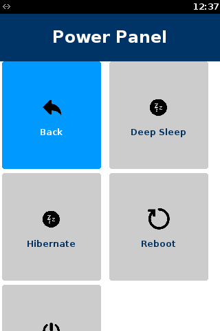

# Introduction <a href="#sec_syspm_introduction" id="sec_syspm_introduction"></a>

This document provides information about ADK power management describing its features, behavior and configuration.
The scope of the document is to describe power management for V/OS, V/OS2 and V/OS3.
Note that low power modes are supported on UX300, UX301 and battery-devices only.
Note that the ADK PM works in three modes:
Note that currently UX700A is the only device with Deep Sleep support on V/OS3 platform.

- AUTO: this mode automatically controls power mode states based on user inactivitiy.
- MANUAL via API: this mode allows applications to manually control the power modes and settings.
- MANUAL via IPC notifications: this mode is used on Carbon to remote control the Power Management on the Carbon Terminal from the Carbon Tablet that owns the battery.

# PM States and Transitions <a href="#sec_syspm_pm_states_and_transitions" id="sec_syspm_pm_states_and_transitions"></a>

## Power Management States <a href="#subsec_syspm_power_management_states" id="subsec_syspm_power_management_states"></a>

[Appendix: PCP](#sec_pcp): MAC Power Control Panel

The following table lists ADK power management states and related device characteristics.

**NOTE: Below tables Communication column - Ethernet is excluded because Ethernet cannot be active or powered on in low power modes.**

| State name | SOC state | Communication | Peripheral devices | Display |
|----|----|----|----|----|
| <p>Boot</p> | <p>Active</p> | <p>On</p> | <p>On</p> | <p>On</p> |
| <p>Active</p> | <p>Active</p> | <p>On</p> | <p>On</p> | <p>On</p> |
| <p>Standby</p> | <p>Active</p> | <p>On</p> | <p>On</p> | <p>On/Off</p> |
| <p>Sleep</p> | <p>Standby</p> | <p>On</p> | <p>On</p> | <p>On/Off</p> |
| <p>Deep sleep</p> | <p>Deep Sleep</p> | <p>On</p> | <p>Off</p> | <p>Off</p> |
| <p>Hibernate</p> | <p>Hibernate</p> | <p>Off</p> | <p>Off</p> | <p>Off</p> |
| <p>Reboot</p> | <p>Active</p> | <p>Off</p> | <p>Off</p> | <p>Off</p> |
| <p>Off</p> | <p>Off</p> | <p>Off</p> | <p>Off</p> | <p>Off</p> |

For UX devices :

| State name | SOC state | Communication | UX100 screen | Backlight |
|----|----|----|----|----|
| <p>Boot</p> | <p>Active</p> | <p>On</p> | <p>On</p> | <p>On</p> |
| <p>Active</p> | <p>Active</p> | <p>On</p> | <p>On</p> | <p>On</p> |
| <p>Standby</p> | <p>Active</p> | <p>On</p> | <p>On</p> | <p>On</p> |
| <p>Sleep</p> | <p>Standby</p> | <p>On</p> | <p>On</p> | <p>Off</p> |
| <p>Deep sleep</p> | <p>Deep Sleep</p> | <p>On</p> | <p>On</p> | <p>Off</p> |
| <p>Hibernate</p> | <p>Hibernate</p> | <p>Off</p> | <p>Off</p> | <p>Off</p> |
| <p>Reboot</p> | <p>Active</p> | <p>Off</p> | <p>Off</p> | <p>Off</p> |
| <p>Off</p> | <p>Off</p> | <p>Off</p> | <p>Off</p> | <p>Off</p> |

| SOC State | Description |
|----|----|
| <p>Active</p> | <p>- OPP100 and above: All features are available<br/>- OPP50 (MPU): reduced performance, most features are available</p> |
| <p>Standby</p> | <p>- DDR in self-refresh, Wakeup from WKUP domain or any GPIO, USB remote wakeup<br/>- Voltage: All power supplies are ON, VDD_MPU=0.95V, VDD_CORE=0.95V<br/>- Clocks: Main OSC ON, DPLLs are bypassed, 32K enabled<br/>- Power Domains: MPU and SGX are OFF, PER and WKUP are ON</p> |
| <p>Deep Sleep</p> | <p>- DDR in self-refresh, Wakeup from WKUP domain<br/>- Voltage: All power supplies are ON, VDD_MPU=0.95V, VDD_CORE=0.95V<br/>- Clocks: Main OSC OFF, DPLLs are bypassed, 32K enabled<br/>- Power Domains: MPU, SGX, PER are OFF, WKUP is ON</p> |
| <p>Hibernate</p> | <p>- DDR in self-refresh, Wakeup from Tamper RTC or EXT_WAKEUP1 pin<br/>- Voltage: All power supplies are OFF except Tamper 1.8V and 1.0V<br/>- Clocks: Only 32K to Tamper domain is enabled<br/>- Power Domains: All are OFF (MPU, SGX, WKUP, PER)</p> |

| SOC State | WiFi Chip state |
|----|----|
| <p>Active</p> | <p>Active mode --- All WLAN blocks in the BCM43455/BCM4343W are powered up and fully functional with active carrier sensing and frame transmission and receiving.<br/>All required regulators are enabled and put in the most efficient mode based on the load current.<br/>Clock speeds are dynamically adjusted by the PMU sequencer. If there is no WiFi activity the WiFi chip will enter Doze mode.<br/>See Deep Sleep row for detail of Doze mode.</p> |
| <p>Deep Sleep</p> | <p>Doze mode - The radio, analog domains, and most of the linear regulators are powered down.<br/>The rest of the BCM43455/BCM4343W remains powered up in an IDLE state.<br/>All main clocks (PLL, crystal oscillator or TCXO) are shut down to reduce active power to the minimum.<br/>The 32.768 kHz LPO clock is available only for the PMU sequencer.<br/>This condition is necessary to allow the PMU sequencer to wake-up the chip and transition to Active mode.<br/>In Doze mode, the primary power consumed is due to leakage current.</p> |
| <p>Hibernate</p> | <p>Power-down mode---The BCM43455/BCM4343W is effectively powered off by shutting down all internal regulators.<br/>The chip is brought out of this mode by external logic re-enabling the internal regulators.</p> |
| <p>Standby</p> | <p>Same as for Active state.</p> |

## Power Management State availability <a href="#subsec_syspm_power_management_state_availability" id="subsec_syspm_power_management_state_availability"></a>

  ----------------------------------------------------------------------------------------------------------------------------------------------------------------------
  State name                              V/OS (Ux)                                  V/OS2                                   
  --------------------------------------- ------------------------------------------ --------------------------------------- -------------------------------------------
  <p>Line powered</p>   <p>Battery powered</p>   <p>Line powered</p>   

  <p>Boot</p>           <p>On</p>                <p>On</p>             <p>On<br/></p>

  <p>Active</p>         <p>On</p>                <p>On</p>             <p>On<br/></p>

  <p>Standby</p>        <p>On</p>                <p>On</p>             <p>On<br/></p>

  <p>Sleep</p>          <p>On</p>                <p>On</p>             <p>On<br/></p>

  <p>Deep sleep</p>     <p>On</p>                <p>On</p>             <p>On<br/></p>

  <p>Hibernate</p>      <p>On</p>                <p>On</p>             <p>On<br/></p>

  <p>Reboot</p>         <p>On</p>                <p>On</p>             <p>On<br/></p>

  <p>Off</p>            <p>On</p>                <p>On</p>             <p>On<br/></p>
  ----------------------------------------------------------------------------------------------------------------------------------------------------------------------

## Wake up source <a href="#subsec_syspm_wake_up_source" id="subsec_syspm_wake_up_source"></a>

Wake-up can be triggered by different wake-up sources as per the below table. When device is waking up it will automatically transition to active state.
Some wakeup sources can be enabled and disabled in configuration file. Please see configuration section for more information.

[TABLE]

∗ V240m and V210m specific
∗∗ Ux, V240m and V210m specific
∗∗∗ Ux specific
∗∗∗∗ Capacity threshold used to wake up from sleep state is set to the high value (91%)

## Recognized user activity <a href="#subsec_syspm_recognized_user_activity" id="subsec_syspm_recognized_user_activity"></a>

ADK recognizes touch and keypad events as user activity. Also printing is considered user activity.
Any user activity will reset the timers used for automated state transition from Active to Standby or Sleep states.


Using card readers is not considered user activity, see also \"critical sections\" below.


## Manual Boot, Reboot, Hibernate, Shutdown <a href="#subsec_syspm_manual_boot_reboot_hibernate_shutdown" id="subsec_syspm_manual_boot_reboot_hibernate_shutdown"></a>

Some state transitions can be invoked using hardware keyboard.
Button should be held for described amount of seconds, which should result in transition to chosen state. On some devices green key needs to be pressed harder than regular press to initiate boot (Example E285). This is due to boot button being underneath the green key.

| Button | Power State | Delay | Action | Details |
|----|----|----|----|----|
| <p>Green Key</p> | <p>Battery Powered</p> | <p>2s</p> | <p>Boot</p> |  |
| <p>8s</p> | <p>Reboot</p> | <p>May differ for some devices (e.g. E280 15 seconds )</p> |  |  |
| <p>Line Powered</p> | <p>1s</p> | <p>Boot</p> |  |  |
| <p>8s</p> | <p>Reboot</p> |  |  |  |
| <p>Red Key</p> | <p>Battery Powered</p> | <p>6s</p> | <p>Hibernate</p> | <p>Only if enabled in PM configuration file (disabled by default)</p> |
| <p>6s</p> | <p>Power menu</p> | <p>MAC will show power menu, with available power options (enabled by default)</p> |  |  |
| <p>12s</p> | <p>Shutdown</p> |  |  |  |
| <p>Line Powered</p> | <p>6s</p> | <p>Power menu</p> | <p>MAC will show power menu, with available power options (enabled by default)</p> |  |
| <p>6s</p> | <p>Hibernate</p> | <p>Only if enabled in PM configuration file (disabled by default)</p> |  |  |
| <p>12s</p> | <p>shutdown</p> | <p>Is disabled on OS level on some devices (e.g. M400)</p> |  |  |

## Possible state transitions <a href="#subsec_syspm_possible_state_transitioning" id="subsec_syspm_possible_state_transitioning"></a>

The following diagram shows the possible state transitions.


## Automatic state transitioning <a href="#subsec_syspm_automatic_state_transitioning" id="subsec_syspm_automatic_state_transitioning"></a>

When configured in auto mode, the ADK PM will transition between states as per the below table.

| Transition ID | Current state | New state | Precondition | Description |
|----|----|----|----|----|
| <p>A1</p> | <p>Active</p> | <p>Standby</p> | <p>- No user activity for time defined in standby field</p> |  |
| <p>A2</p> | <p>Active</p> | <p>Sleep</p> | <p>- No user activity for time defined in sleep field<br/>- Standby is disabled</p> |  |
| <p>A3</p> | <p>Active</p> | <p>Deep Sleep</p> | <p>- No user activity for time defined in deep sleep field<br/>- Standby is disabled<br/>- Sleep is disabled</p> |  |
| <p>A4</p> | <p>Active</p> | <p>Hibernate</p> | <p>- No user activity for time defined in hibernate field<br/>- Standby is disabled<br/>- Sleep is disabled<br/>- Deep sleep is disabled</p> |  |
| <p>A5</p> | <p>Active</p> | <p>Reboot</p> | <p>- Unit is operational for 24hours (PCI requirement)</p> |  |
| <p>A6</p> | <p>Active</p> | <p>Off</p> | <p>- No user activity for time defined in off field<br/>- Standby is disabled<br/>- Sleep is disabled<br/>- Deep sleep is disabled<br/>- Hibernate is disabled</p> |  |
| <p>S1</p> | <p>Standby</p> | <p>Sleep</p> | <p>- No user activity for time defined in sleep field</p> |  |
| <p>S2</p> | <p>Standby</p> | <p>Deep Sleep</p> | <p>- No user activity for time defined in deep sleep field<br/>- Sleep is disabled</p> |  |
| <p>S3</p> | <p>Standby</p> | <p>Hibernate</p> | <p>- No user activity for time defined in hibernate field<br/>- Sleep is disabled<br/>- Deep sleep is disabled</p> |  |
| <p>S4</p> | <p>Standby</p> | <p>Reboot</p> | <p>- Unit is operational for 24hours (PCI requirement)</p> |  |
| <p>S5</p> | <p>Standby</p> | <p>Off</p> | <p>- No user activity for time defined in off field<br/>- Sleep is disabled<br/>- Deep sleep is disabled<br/>- Hibernate is disabled</p> |  |
| <p>S6</p> | <p>Standby</p> | <p>Active</p> | <p>- User activity (according to wakeup source table)</p> |  |
| <p>X1</p> | <p>Sleep</p> | <p>Deep Sleep</p> | <p>- No user activity for time defined in deep sleep field</p> |  |
| <p>X2</p> | <p>Sleep</p> | <p>Hibernate</p> | <p>- No user activity for time defined in hibernate field<br/>- Deep sleep is disabled</p> |  |
| <p>X3</p> | <p>Sleep</p> | <p>Off</p> | <p>- No user activity for time defined in off field<br/>- Deep sleep is disabled<br/>- Hibernate is disabled</p> |  |
| <p>X4</p> | <p>Sleep</p> | <p>Reboot</p> | <p>- Unit is operational for 24hours (PCI requirement)</p> |  |
| <p>X5</p> | <p>Sleep</p> | <p>Active</p> | <p>- User activity (according to wakeup source table)</p> |  |
| <p>D1</p> | <p>Deep Sleep</p> | <p>Hibernate</p> | <p>- No user activity for time defined in hibernate field</p> |  |
| <p>D2</p> | <p>Deep Sleep</p> | <p>Reboot</p> | <p>- Unit is operational for 24hours (PCI requirement)</p> |  |
| <p>D3</p> | <p>Deep Sleep</p> | <p>Off</p> | <p>- No user activity for time defined in off field<br/>- Hibernate is disabled</p> |  |
| <p>D4</p> | <p>Deep Sleep</p> | <p>Active</p> | <p>- User activity (according to wakeup source table)</p> |  |
| <p>H1</p> | <p>Hibernate</p> | <p>Reboot</p> | <p>- Unit is operational for 24hours (PCI requirement)</p> |  |
| <p>H2</p> | <p>Hibernate</p> | <p>Off</p> | <p>- No user activity for time defined in off field</p> |  |
| <p>H3</p> | <p>Hibernate</p> | <p>Active</p> | <p>- User activity (according to wakeup source table)</p> |  |
| <p>F1</p> | <p>Off</p> | <p>Boot</p> | <p>- User activity (according to wakeup source table)</p> |  |
| <p>R1</p> | <p>Reboot</p> | <p>Boot</p> |  |  |
| <p>B1</p> | <p>Boot</p> | <p>Active</p> | <p>- After time defined in boot field</p> |  |

## Manual state transition using API <a href="#subsec_syspm_manual_state_transition_using_api" id="subsec_syspm_manual_state_transition_using_api"></a>

Applications can control the state transition manually or overwrite the automated power management at any time using the below APIs.

``` cpp
// Enter active mode
// \return error code
VFI_SYS_PM_API vfisyspmError sys_Active();
// Enter standby mode
// \return error code
VFI_SYS_PM_API vfisyspmError sys_Standby();
// Enter sleep mode
// \return error code
VFI_SYS_PM_API vfisyspmError sys_Sleep();
// Enter deep sleep mode
// \return error code
VFI_SYS_PM_API vfisyspmError sys_DeepSleep();
// Enter hibernate mode
// \return error code
VFI_SYS_PM_API vfisyspmError sys_Hibernate();
// Shut down device
// \return error code
VFI_SYS_PM_API vfisyspmError sys_Shutdown();
// Reboot device
// \return error code
VFI_SYS_PM_API vfisyspmError sys_Reboot();
```

<a href="vfisyspm_8h.md">vfisyspm</a> API usage example:

``` cpp
// sdk
#include <string>
#include <stdio.h>
#include <time.h>
#include <sys/time.h>
#include <stdlib.h>
#include <unistd.h>
#include <string.h>
// adk
#include "html/gui.h"
#include "ipc/jsobject.h"
#include "ipc/notify.h"
#include "log/liblog2.h"
#include "sysinfo/vfisyspm.h"
// constants
enum
{
   STATE,
   ACTIVE,
   STANDBY,
   SLEEP,
   DEEP_SLEEP,
   HIBERNATE,
   SHUTDOWN,
   REBOOT,
   REBOOT_DOCK,
   SYSMODE,
   CRIT_ENTER,
   CRIT_EXIT,
   CRIT_STATE,
   SET_PCI_REBOOT_TIME,
   GET_PCI_REBOOT_TIME,
   CLEAR_PCI_REBOOT_TIME,
   TIMER,
   CAR_CHARGER,
   REBOOT_REASON,
   PCP,
   VER,
   VER_SVC,
   EXIT,
};
const vfigui::UIMenuEntry menu[]=
{
   {"Current state", STATE, 0},
   {"Standby", STANDBY, 0},
   {"Sleep", SLEEP, 0},
   {"Deep Sleep", DEEP_SLEEP, 0},
   {"Hibernate", HIBERNATE, 0},
   {"Shutdown", SHUTDOWN, 0},
   {"Reboot", REBOOT, 0},
   {"Reboot dock station", REBOOT_DOCK, 0},
   {"Critical section enter", CRIT_ENTER, 0},
   {"Critical section exit", CRIT_EXIT, 0},
   {"Critical section state", CRIT_STATE, 0},
   {"Car charger", CAR_CHARGER, 0},
   {"Enter sysmode", SYSMODE, 0},
   {"Get PCI reboot time", GET_PCI_REBOOT_TIME, 0},
   {"Set PCI reboot time", SET_PCI_REBOOT_TIME, 0},
   {"Clear PCI reboot time", CLEAR_PCI_REBOOT_TIME, 0},
   {"Timer in 90 sec", TIMER, 0},
   {"PM lib version", VER, 0},
   {"PM svc version", VER_SVC, 0},
   {"Get reboot reason", REBOOT_REASON, 0},
   {"Power control panel", PCP, 0},
   {"Exit", EXIT, 0},
};
// local functions
static void timer_cb( const vfiipc::JSObject & json ); // timer callback
static void convert(struct tm & t, vfisyspm::vfisyspm_DateTime & date);
static void notification_cb(vfisyspm::vfisyspmNotificationType type, vfisyspm::vfisyspmNotifications notification);
static int launch_pcp();
// variables
LibLogHandle lh = LOGAPI_INIT( "PMDEMO" );
int main()
{
   vfiipc::ipcSetAppID("PMDEMO");
   vfisyspm::vfisyspmError returnCode = vfisyspm::sys_Init();
   vfisyspm::sys_SetNotificationCB( notification_cb, vfisyspm::PM_NOTIFY_TYPE_ALL );
   vfigui::uiSetPropertyInt(vfigui::UI_PROP_CIRCULAR_MENU,1);
   bool loop = true;
   int s=0;
   while(loop)
   {
   s=uiMenu("mainmenu","ADK-PM demo",menu,sizeof(menu)/sizeof(menu[0]),s>=0?s:0);
   if(s==vfigui::UI_ERR_CONNECTION_LOST) break;
   switch(s)
   {
   case CAR_CHARGER:
   {
   returnCode = vfisyspm::sys_SetChargingMode(vfisyspm::PM_CHARGING_MODE_CAR_CHARGER);
   break;
   }
   case SYSMODE:
   {
   returnCode = vfisyspm::sys_StartSysmode();
   break;
   }
   case GET_PCI_REBOOT_TIME:
   {
   struct vfisyspm::vfisyspm_DateTime rebootTime;
   returnCode = vfisyspm::sys_GetPciRebootTime(&rebootTime);
   if(vfisyspm::SYS_PM_ERR_OK==returnCode)
   {
   vfigui::uiConfirm("confirm",
   vfigui::uiPrint( "PCI reboot time is set to:<br>%d:%d:%d",
   rebootTime.tm_hour,
   rebootTime.tm_min,
   rebootTime.tm_sec));
   }
   else
   {
   const std::string error = sys_StrError(returnCode);
   vfigui::uiConfirm("confirm","Error:<br>"+error);
   }
   break;
   }
   case SET_PCI_REBOOT_TIME:
   {
   time_t requested_time;
   time(&requested_time);
   requested_time += 60*7;
   struct vfisyspm::vfisyspm_DateTime rebootTime;
   struct tm t;
   localtime_r(&requested_time,&t);
   convert(t,rebootTime);
   returnCode = vfisyspm::sys_SetPciRebootTime(&rebootTime);
   const std::string error = sys_StrError(returnCode);
   vfigui::uiConfirm("confirm","PCI reboot time is set:<br>"+error);
   break;
   }
   case CLEAR_PCI_REBOOT_TIME:
   {
   returnCode = vfisyspm::sys_ClearPciRebootTime();
   const std::string error = sys_StrError(returnCode);
   vfigui::uiConfirm("confirm","PCI reboot time is set to 24 hours uptime:<br>"+error);
   break;
   }
   case ACTIVE:
   {
   returnCode = vfisyspm::sys_Active();
   const std::string error = sys_StrError(returnCode);
   vfigui::uiConfirm("confirm","Active:<br>"+error);
   break;
   }
   case STANDBY:
   {
   returnCode = vfisyspm::sys_Standby();
   const std::string error = sys_StrError(returnCode);
   vfigui::uiConfirm("confirm","Standby:<br>"+error);
   break;
   }
   case SLEEP:
   {
   returnCode = vfisyspm::sys_Sleep();
   const std::string error = sys_StrError(returnCode);
   vfigui::uiConfirm("confirm","Sleep:<br>"+error);
   break;
   }
   case DEEP_SLEEP:
   {
   const int flags = vfisyspm::PM_SUPPRESS_ALL | vfisyspm::PM_SYNC;
   returnCode = vfisyspm::sys_DeepSleep(flags);
   const std::string error = sys_StrError(returnCode);
   vfigui::uiConfirm("confirm","Deep sleep:<br>"+error);
   break;
   }
   case HIBERNATE:
   {
   returnCode = vfisyspm::sys_Hibernate();
   const std::string error = sys_StrError(returnCode);
   vfigui::uiConfirm("confirm","Hibernate:<br>"+error);
   break;
   }
   case SHUTDOWN:
   {
   returnCode = vfisyspm::sys_Shutdown();
   const std::string error = sys_StrError(returnCode);
   vfigui::uiConfirm("confirm","Shut Down:<br>"+error);
   break;
   }
   case REBOOT:
   {
   returnCode = vfisyspm::sys_Reboot();
   const std::string error = sys_StrError(returnCode);
   vfigui::uiConfirm("confirm","Reboot:<br>"+error);
   break;
   }
   case REBOOT_DOCK:
   {
   returnCode = vfisyspm::sys_RebootDock();
   const std::string error = sys_StrError(returnCode);
   vfigui::uiConfirm("confirm","Reboot dock station:<br>"+error);
   break;
   }
   case CRIT_STATE:
   {
   bool state = true;
   returnCode = vfisyspm::sys_CriticalSectionState( state );
   vfigui::uiConfirm("confirm", vfigui::uiPrint( "Critical Section State:<br>%d",state));
   break;
   }
   case CRIT_ENTER:
   {
   returnCode = vfisyspm::sys_CriticalSectionEnter();
   const std::string error = sys_StrError(returnCode);
   vfigui::uiConfirm("confirm","Critical Section Enter:<br>"+error);
   break;
   }
   case CRIT_EXIT:
   {
   returnCode = vfisyspm::sys_CriticalSectionExit();
   const std::string error = sys_StrError(returnCode);
   vfigui::uiConfirm("confirm","Critical Section Exit:<br>"+error);
   break;
   }
   case STATE:
   {
   vfisyspm::powermngtState state;
   returnCode = vfisyspm::sys_GetCurrentState( state );
   vfigui::uiConfirm("confirm", vfigui::uiPrint( "PM State:<br>%d",state));
   break;
   }
   case TIMER:
   {
   const std::string message("timer for 90 seconds");
   vfisyspm::timerHandle handle;
   returnCode = vfisyspm::SYS_PM_ERR_FAIL;
   time_t requested_time;
   time(&requested_time);
   requested_time += 90;
   returnCode = vfisyspm::sys_SetTimer( handle, requested_time, message, timer_cb );
   const std::string error = sys_StrError(returnCode);
   vfigui::uiConfirm("confirm","Timer is set 90 sec:<br>"+error);
   break;
   }
   case REBOOT_REASON:
   {
   std::string reason;
   returnCode = vfisyspm::sys_GetRebootReason(reason);
   vfigui::uiConfirm("confirm","Reboot reason:<br>"+reason);
   break;
   }
   case VER:
   {
   const std::string version = vfisyspm::sys_GetVersion();
   vfigui::uiConfirm("confirm","PM LIB ver:<br>"+version);
   returnCode = vfisyspm::SYS_PM_ERR_OK;
   break;
   }
   case VER_SVC:
   {
   const std::string version = vfisyspm::sys_GetSvcVersion();
   vfigui::uiConfirm("confirm","PM SVC ver:<br>"+version);
   returnCode = vfisyspm::SYS_PM_ERR_OK;
   break;
   }
   case PCP:
   {
   launch_pcp();
   break;
   }
   case EXIT:
   {
   loop=false;
   break;
   }
   default:
   {
   break;
   }
   }
   }
   vfisyspm::sys_Deinit();
   return returnCode;
}
static void convert(struct tm & t, vfisyspm::vfisyspm_DateTime & date)
{
   date.tm_sec = t.tm_sec;
   date.tm_min = t.tm_min;
   date.tm_hour = t.tm_hour;
   date.tm_mday = t.tm_mday;
   date.tm_mon = t.tm_mon;
   date.tm_year = t.tm_year;
   date.tm_wday = t.tm_wday;
   date.tm_yday = t.tm_yday;
   date.tm_isdst = t.tm_isdst;
}
static void timer_cb( const vfiipc::JSObject & json )
{
   LOGF_TRACE(lh,"Timer expired[%s]",json.dump().c_str());
   vfisyspm::sys_Standby();
}
static void notification_cb(vfisyspm::vfisyspmNotificationType type, vfisyspm::vfisyspmNotifications notification)
{
   LOGF_TRACE(lh,"callback notificaiton[%d] type[%d]",notification, type);
}
static int launch_pcp()
{
   const std::string trigger("_MacControlRequest");
   const std::string cmd_field("cmd");
   const std::string args_field("args");
   const std::string mac_id("_mac");
   const std::string cmd("launch_appid");
   const std::string appid_field("appid");
   const std::string appid("pcp");
   vfiipc::JSObject jsobj;
   jsobj(cmd_field)=cmd;
   jsobj(appid_field)=appid;
   jsobj(args_field)[0]="-l";
   jsobj(args_field)[1]="lv-LV.ctlg";
   return vfiipc::ipcNotify(mac_id,trigger,jsobj);
}
```

## Manual state transition using IPC notifications <a href="#subsec_syspm_manual_state_transition_using_ipc_notifications" id="subsec_syspm_manual_state_transition_using_ipc_notifications"></a>

Similar to API calls, application can request manual PM state change using IPC notifications. This is typcially being used when remotely controlling the power management functions via an external unit like Carbon tablet.

| Request notification id | Response notification id | Command | Command field | Result field | Resulting state |
|----|----|----|----|----|----|
| <p>EXT_SYS_POWER_MGMT_REQ</p> | <p>EXT_SYS_POWER_MGMT_RESP</p> | <p>active</p> | <p>cmd</p> | <p>result</p> | <p>active</p> |
| <p>EXT_SYS_POWER_MGMT_REQ</p> | <p>EXT_SYS_POWER_MGMT_RESP</p> | <p>standby</p> | <p>cmd</p> | <p>result</p> | <p>standby</p> |
| <p>EXT_SYS_POWER_MGMT_REQ</p> | <p>EXT_SYS_POWER_MGMT_RESP</p> | <p>sleep</p> | <p>cmd</p> | <p>result</p> | <p>sleep</p> |
| <p>EXT_SYS_POWER_MGMT_REQ</p> | <p>EXT_SYS_POWER_MGMT_RESP</p> | <p>deep_sleep</p> | <p>cmd</p> | <p>result</p> | <p>deep_sleep</p> |
| <p>EXT_SYS_POWER_MGMT_REQ</p> | <p>EXT_SYS_POWER_MGMT_RESP</p> | <p>hibernate</p> | <p>cmd</p> | <p>result</p> | <p>hibernate</p> |
| <p>EXT_SYS_POWER_MGMT_REQ</p> | <p>EXT_SYS_POWER_MGMT_RESP</p> | <p>shutdown</p> | <p>cmd</p> | <p>result</p> | <p>shutdown</p> |
| <p>EXT_SYS_POWER_MGMT_REQ</p> | <p>EXT_SYS_POWER_MGMT_RESP</p> | <p>reboot</p> | <p>cmd</p> | <p>result</p> | <p>reboot</p> |

Example to send an PM command via IPC notifications:

``` cpp
vfiipc::JSObject jsobj;
const std::string pm_control_trigger("EXT_SYS_POWER_MGMT_REQ");
const std::string receiver("1");
const std::string cmd_field("cmd");
const std::string cmd("standby");
jsobj(cmd_field)=cmd;
vfiipc::ipcNotify(receiver,pm_control_trigger,jsobj);
```

The corresponding response would be.

``` cpp
{"result":"OK"}
```

## How to cancel upcoming low power mode <a href="#subsec_syspm_cancel_sleep" id="subsec_syspm_cancel_sleep"></a>

There are two stages between <a href="namespacevfisyspm.md#a60947349d2da486a930e8847c017b236">sys_Sleep()</a> / <a href="namespacevfisyspm.md#acb4d7c188a1d12752c5215a44ced3263">sys_DeepSleep()</a> / <a href="namespacevfisyspm.md#afe74f69646f3357df026f70ac5d943ae">sys_Hibernate()</a> call and putting hardware to low power mode:

1.  [Power Management Notifications](#sec_syspm_power_management_notifications) stage. This is time when ADK-PM waits for vfisyspmCallback functions returns. It is enough to call <a href="namespacevfisyspm.md#a7bac542d589655ccc9fd16450ccb0ccb">sys_Active()</a> function in your callback function to cancel upcoming sleep state.
2.  OS suspending stage, when OS power management notifications are in progress (it is similar to ADK-PM notifications, but between OS components). This stage is limited by time: 5s. Normally it took 2s. It is possible to prevent OS suspending by calling <a href="namespacevfisyspm.md#a13541ab5c56e234226b5b9994fc78d90">sys_CancelSleep()</a> function.
    
    Due to ADK-PM architecture limitations, for the <a href="namespacevfisyspm.md#a13541ab5c56e234226b5b9994fc78d90">sys_CancelSleep()</a> function operation, <a href="namespacevfisyspm.md#a60947349d2da486a930e8847c017b236">sys_Sleep()</a> / <a href="namespacevfisyspm.md#acb4d7c188a1d12752c5215a44ced3263">sys_DeepSleep()</a> / <a href="namespacevfisyspm.md#afe74f69646f3357df026f70ac5d943ae">sys_Hibernate()</a> calls should be asyncronius, e.g. without PM_SYNC specified as parameter (each of mentioned functions has overloaded function with `int` `flags` parameter).
    

# Configuration <a href="#sec_syspm_configuration" id="sec_syspm_configuration"></a>

The ADK PM comes with default values, but there is an option to change settings using the PM configuration file.
Configuration file contains timeouts for automatic state transitions and other PM related configuration parameters.
Following rules apply:

- If any value is not mentioned in configuration file - default one will be used instead.
- If timeout is set to -1, that means that this transition is disabled and will not happen.
- There are two types of configuration file - model specific one and a default one.
  - First PM checks for model specific configuration file (model name is requested from OS).
  - If model specific configuration file is absent, default one is used.
  - Model name can be shortened, to use same file for multiple terminal variants.
  - If default configuration file is absent PM default values are used.

## Configuration file location <a href="#subsec_syspm_configuration_file_location" id="subsec_syspm_configuration_file_location"></a>


Please note, that spaces(\' \') and slashes(\'/\') in model name string should be replaced with underscore sign (\'\_\').


| OS | <a href="class_directory.md">Directory</a> | Default configuration file | Example of model specif configuration file (partial name) | Example of model specif configuration file (full name) |
|----|----|----|----|----|
| <p>V/OS</p> | <p>/etc/config/adk-pm/</p> | <p>/etc/config/adk-pm/default.ini</p> | <p>/etc/config/adk-pm/V400m.ini</p> | <p>/etc/config/adk-pm/V400m_4G\_+.ini</p> |

## Configuration file structure <a href="#subsec_syspm_configuration_file_structure" id="subsec_syspm_configuration_file_structure"></a>

| Section | Field | Default value | Units | Description |
|----|----|----|----|----|
| <p>powermngt_battery</p> | <p>auto</p> | <p>y</p> | <p>bool</p> | <p>Enables automatic state transition when unit is battery powered</p> |
| <p>powermngt_battery</p> | <p>boot</p> | <p>180</p> | <p>s</p> | <p>Timeout for transition from boot to active when unit is battery powered</p> |
| <p>powermngt_battery</p> | <p>standby</p> | <p>15</p> | <p>s</p> | <p>Timeout for transition to standby when unit is battery powered</p> |
| <p>powermngt_battery</p> | <p>sleep</p> | <p>-1</p> | <p>s</p> | <p>Timeout for transition to sleep when unit is battery powered</p> |
| <p>powermngt_battery</p> | <p>deep_sleep</p> | <p>10</p> | <p>s</p> | <p>Timeout for transition to deep sleep when unit is battery powered</p> |
| <p>powermngt_battery</p> | <p>hibernate</p> | <p>-1</p> | <p>s</p> | <p>Timeout for transition to hibernate when unit is battery powered</p> |
| <p>powermngt_battery</p> | <p>off</p> | <p>-1</p> | <p>s</p> | <p>Timeout for transition to off when unit is battery powered</p> |
| <p>powermngt_line_powered</p> | <p>auto</p> | <p>y</p> | <p>bool</p> | <p>Enables automatic state transition when unit is line powered</p> |
| <p>powermngt_line_powered</p> | <p>boot</p> | <p>180</p> | <p>s</p> | <p>Timeout for transition from boot to active when unit is line powered</p> |
| <p>powermngt_line_powered</p> | <p>standby</p> | <p>15</p> | <p>s</p> | <p>Timeout for transition to standby when unit is line powered</p> |
| <p>powermngt_line_powered</p> | <p>sleep</p> | <p>-1</p> | <p>s</p> | <p>Timeout for transition to sleep when unit is line powered</p> |
| <p>powermngt_line_powered</p> | <p>deep_sleep</p> | <p>10</p> | <p>s</p> | <p>Timeout for transition to deep sleep when unit is line powered</p> |
| <p>powermngt_line_powered</p> | <p>hibernate</p> | <p>-1</p> | <p>s</p> | <p>Timeout for transition to hibernate when unit is line powered</p> |
| <p>powermngt_line_powered</p> | <p>off</p> | <p>-1</p> | <p>s</p> | <p>Timeout for transition to off when unit is line powered</p> |
| <p>battery</p> | <p>shutdown_on_critical</p> | <p>n</p> | <p>bool</p> | <p>Enables automatic shutdown on critical battery level</p> |
| <p>battery</p> | <p>active_while_charging</p> | <p>y</p> | <p>bool</p> | <p>Enables automatic state transition while unit is charging</p> |
| <p>display</p> | <p>boot</p> | <p>50</p> | <p>%</p> | <p>This backlight level is used in boot state (Allowed values 1-100, 0 is prohibited due to limitation)<br/>**Notice** Ux device has 2 states only:**Backlight On**\[50 - 100\] **Backlight Off**\[0 - 49\]</p> |
| <p>display</p> | <p>active</p> | <p>50</p> | <p>%</p> | <p>This backlight level is used in active state (Allowed values 1-100, 0 is prohibited due to limitation)<br/>**Notice** Ux device has 2 states only:**Backlight On**\[50 - 100\] **Backlight Off**\[0 - 49\]</p> |
| <p>display</p> | <p>standby</p> | <p>1</p> | <p>%</p> | <p>This backlight level is used in standby state (Allowed values 1-100, 0 is prohibited due to limitation)<br/>**Notice** Ux device has 2 states only:**Backlight On**\[50 - 100\] **Backlight Off**\[0 - 49\]</p> |
| <p>display</p> | <p>sleep</p> | <p>0</p> | <p>%</p> | <p>This backlight level is used in sleep state<br/>**Notice** Ux device has 2 states only:**Backlight On**\[50 - 100\] **Backlight Off**\[0 - 49\]</p> |
| <p>display</p> | <p>off</p> | <p>0</p> | <p>%</p> | <p>This backlight level is used in off state<br/>**Notice** Ux device has 2 states only:**Backlight On**\[50 - 100\] **Backlight Off**\[0 - 49\]</p> |
| <p>display</p> | <p>sensor</p> | <p>n</p> | <p>bool</p> | <p>Enables light sensor (if available)</p> |
| <p>display</p> | <p>active_during_transition</p> | <p>n</p> | <p>bool</p> | <p>If enabled, display will not be turned off during PM state transitions</p> |
| <p>display</p> | <p>check_values</p> | <p>y</p> | <p>bool</p> | <p>If enabled, display backlight for Active and Standby states will be checked for allowed values (1-100).<br/>**Notice** The flag allows to set backlight to 0% for Active and Standby states.<br/>**GUI will ignore the first pressed key in this case.**</p> |
| <p>display</p> | <p>backlight_control</p> | <p>y</p> | <p>bool</p> | <p>If disabled, ADK-PM stops managing display backligh. The backlight will be set to level for Boot state on start.</p> |
| <p>display</p> | <p>wait_user_activity</p> | <p>n</p> | <p>bool</p> | <p>**VOS2 Only:** If enabled, display will stay turned off on wakeup from low power states. It will be turned on after user activity only</p> |
| <p>x_key</p> | <p>hibernate_delay</p> | <p>-1</p> | <p>s</p> | <p>Seconds to hold X key to transition to hibernate (\<1 to disable)</p> |
| <p>x_key</p> | <p>powerdown_delay</p> | <p>6</p> | <p>s</p> | <p>Seconds to hold X key to powerdown device (\<1 to disable)</p> |
| <p>x_key</p> | <p>reboot_delay</p> | <p>-1</p> | <p>s</p> | <p>Seconds to hold X key to reboot device (\<1 to disable)</p> |
| <p>x_key</p> | <p>pcp_delay</p> | <p>4</p> | <p>s</p> | <p>Seconds to hold X key to activate Power Control Panel (\<1 to disable)</p> |
| <p>x_key</p> | <p>event_delay</p> | <p>2</p> | <p>s</p> | <p>Seconds to hold X key to send a event that user is pressing X key (\<1 to disable)</p> |
| <p>o_key</p> | <p>reboot_delay</p> | <p>6</p> | <p>s</p> | <p>**VOS3 Only:** Seconds to hold O(green) key to reboot device (\<1 to disable)</p> |
| <p>power_button</p> | <p>power_pcp_delay</p> | <p>4</p> | <p>s</p> | <p>**VOS3 Only:** Seconds to hold Power button to activate Power Control Panel (should be \< 6)</p> |
| <p>wakeup_sources</p> | <p>wifi</p> | <p>n</p> | <p>bool</p> | <p>Enabled or disable wifi as wakeup source</p> |
| <p>wakeup_sources</p> | <p>bt</p> | <p>n</p> | <p>bool</p> | <p>Enabled or disable bluetooth as wakeup source</p> |
| <p>wakeup_sources</p> | <p>usb_host</p> | <p>n</p> | <p>bool</p> | <p>Enable or disable USB cable as a wakeup source</p> |
| <p>wakeup_sources</p> | <p>serial</p> | <p>n</p> | <p>bool</p> | <p>Enable or disable serial port as a wakeup source</p> |
| <p>wakeup_sources</p> | <p>card</p> | <p>y</p> | <p>bool</p> | <p>Enable or disable smart card reader as a wakeup source<br/>Ux, V240m and V210m specific<br/>For the V240m and V210m default value is \'n\'</p> |
| <p>wakeup_sources</p> | <p>mdb</p> | <p>n</p> | <p>bool</p> | <p>Enable or disable mdb as a wakeup source (Ux specific)</p> |
| <p>wakeup_sources</p> | <p>proximity</p> | <p>n</p> | <p>bool</p> | <p>Enable or disable proximity as a wakeup source (Ux specific)</p> |
| <p>wakeup_sources</p> | <p>fuel_gauge</p> | <p>y</p> | <p>bool</p> | <p>Enable or disable battery fuel-gauge controller as a wakeup source</p> |
| <p>wakeup_sources</p> | <p>touch_screen</p> | <p>n</p> | <p>bool</p> | <p>Enable or disable touch screen controller as a wakeup source (v240m and v210m specific)</p> |
| <p>pci_reboot</p> | <p>reboot</p> | <p>y</p> | <p>bool</p> | <p>Enable or disable PCI reboot warning</p> |
| <p>pci_reboot</p> | <p>pci_wakeup_to_alert</p> | <p>y</p> | <p>bool</p> | <p>Enable or disable terminal wakeup to active state to notify about PCI reboot</p> |
| <p>pci_reboot</p> | <p>alert_start</p> | <p>300</p> | <p>s</p> | <p>Timeout before first PCI reboot notification</p> |
| <p>pci_reboot</p> | <p>interval</p> | <p>30</p> | <p>s</p> | <p>Notification interval before PCI reboot</p> |
| <p>wake_up_pending_timeout</p> | <p>suspend</p> | <p>5</p> | <p>s</p> | <p>Abort transition to Sleep or Deep Sleep if wake up is pending</p> |
| <p>wake_up_pending_timeout</p> | <p>hibernate</p> | <p>20</p> | <p>s</p> | <p>Abort transition to Hibernate if wake up is pending</p> |
| <p>power_control_panel</p> | <p>sleep</p> | <p>y</p> | <p>bool</p> | <p>Show or hide Sleep button in the Power Control Panel</p> |
| <p>power_control_panel</p> | <p>deep_sleep</p> | <p>y</p> | <p>bool</p> | <p>Show or hide Deep Sleep button in the Power Control Panel</p> |
| <p>power_control_panel</p> | <p>hibernate</p> | <p>y</p> | <p>bool</p> | <p>Show or hide Hibernate button in the Power Control Panel</p> |
| <p>power_control_panel</p> | <p>reboot</p> | <p>y</p> | <p>bool</p> | <p>Show or hide Reboot button in the Power Control Panel</p> |
| <p>power_control_panel</p> | <p>off</p> | <p>y</p> | <p>bool</p> | <p>Show or hide Off button in the Power Control Panel</p> |
| <p>power_control_panel</p> | <p>car_charger</p> | <p>y</p> | <p>bool</p> | <p>Show or hide Car Charger button in the Power Control Panel (V240M/V400M specific)</p> |

## Configuration file example <a href="#subsec_syspm_configuration_file_example" id="subsec_syspm_configuration_file_example"></a>

``` cpp
[powermngt_battery]
auto=y
boot=60
standby=15
sleep=5
deep_sleep=120
hibernate=1800
off=-1
[powermngt_line_powered]
auto=y
boot=60
standby=15
sleep=5
deep_sleep=120
hibernate=1800
off=-1
[battery]
shutdown_on_critical=y
active_while_charging=y
[display]
boot=50
active=50
standby=1
sleep=0
off=0
active_during_transition=y
sensor=n
[x_key]
hibernate_delay = -1
powerdown_delay = 6
reboot_delay = -1
pcp_delay = 4
event_delay = 2
[o_key]
reboot_delay = -1
[power_button]
power_pcp_delay = -1
[wakeup_sources]
wifi=n
bt=n
usb_host=n
[pci_reboot]
reboot=n
pci_wakeup_to_alert=n
alert_start=300;
interval=30;
[power_control_panel]
sleep=y
deep_sleep=y
hibernate=y
reboot=y
off=y
car_charger=y
```

## Set/Get PM configuration using API <a href="#subsec_syspm_set_get_pm_configuration_using_api" id="subsec_syspm_set_get_pm_configuration_using_api"></a>

``` cpp
// Returns current PM configuration
// \param[out] json encoded PM configuration
// \return error code
VFI_SYS_PM_API vfisyspmError sys_GetConfig( vfiipc::JSObject & config );
// Sets passed configuration
// \param[in] json encoded PM configuration
// \return error code
// \note json structure is similar to ini configuration file structure
VFI_SYS_PM_API vfisyspmError sys_SetConfig( const vfiipc::JSObject & config );
```

Current PM configuration can be obtained using sys_GetConfig API or set using <a href="namespacevfisyspm.md#a0d11383cc1a0947dd99a8eae48692218">sys_SetConfig()</a> API.
Configuration is JSON encoded and have similar structure as configuration file.

``` cpp
{
   "battery": {
   "active_while_charging":false,
   "shutdown_on_critical":false
   },
   "display":{
   "active":40,
   "standby":1,
   "sleep":0
   },
   "powermngt_battery":{
   "auto":false,
   "boot":180,
   "deep_sleep":120,
   "hibernate":1800,
   "off":-1,
   "sleep":5,
   "standby":15
   },
   "powermngt_line_powered":{
   "auto":true,
   "boot":60,
   "deep_sleep":120,
   "hibernate":1800,
   "off":-1,
   "sleep":5,
   "standby":15},
   "x_key":{
   "hibernate_delay":-1},
   },
   "wakeup_sources":{
   "wifi":false,
   "bt":false,
   "usb_host":false,
   "serial":false,
   "card":true,
   "mdb":false,
   "proximity":false,
   "fuel_gauge":true
   },
   "pci_reboot":{
   "reboot":false,
   "pci_wakeup_to_alert":false,
   "alert_start":300,
   "interval":30
   }
}
```

Configuration set by API overrides default configuration file and will be active until next reboot or until <a href="namespacevfisyspm.md#a70b475852f505c319505a7b8d0a13193">sys_RefreshConfig()</a> API is invoked.
Json may have only part of parameters. In this case all missing values will not change.

# Critical sections <a href="#sec_syspm_critical_sections" id="sec_syspm_critical_sections"></a>

If application wants to suppress automatic PM state transition, it can request critical section.
By default in critical section only ACTIVE and STANDBY state is allowed.
This means, that after some time of inactivity terminal will dim display.

To suppress ACTIVE -\> STANDBY transition you can pass additional parameter during critical section request - <a href="namespacevfisyspm.md#ad9757c6641d1ed2c0a5d438d08ce9cc0a8d83189d664475c36ee3d24ad77d42c2">vfisyspm::PM_CRIT_SUPRESS_STANDBY</a>.
Multiple applications can request critical section simultaneously.
Critical section will be active until all application will exit critical section.
Application might request critical section multiple times. Critical section will be deactivated after exit api was invoked the same amount accordingly.

``` cpp
vfisyspmError returnCode = SYS_PM_ERR_OK;
returnCode = vfisyspm::sys_CriticalSectionEnter(vfisyspm::PM_CRIT_SUPRESS_STANDBY);
if(SYS_PM_ERR_OK==returnCode)
{
   LOGF_TRACE("Critical Section starts");
}
// some critical operations here
returnCode = vfisyspm::sys_CriticalSectionExit();
if(SYS_PM_ERR_OK==returnCode)
{
   LOGF_TRACE("Critical Section ended");
}
```

The list of applications currently holding critical section can be obtained using <a href="namespacevfisyspm.md#aad5db89fd567428a39c63cc68a3d62c8">sys_CriticalSectionList()</a> API.
Application list is JSON encoded.

``` cpp
{
   {
   "appid":"PMDEMO",
   "counter":3,
   "param":0,
   "pid":1608
   },
   {
   "appid":"vhq_sys",
   "counter":1,
   "param":0,
   "pid":13
   }
}
```


**Use cases for critical sections**
**Idle mode and payment transactions:**
In the idle mode of payment applications (outside the critical section), power saving modes will kick in to turn the system to low power modes.
Applications should enter the critical section when starting a transaction and exit the section when finishing the payment transaction. This will protect cardholder dialogs from going to sleep mode.

**Non-interruptible Background activities:**
For background activities like SW download, critical sections can be used to keep the CPU active even if no user activity is recognized.


# Timed Wakeup <a href="#sec_syspm_timed_wakeup" id="sec_syspm_timed_wakeup"></a>

Applications can set a wake-up time to programmatically wake-up from sleep, deep-sleep and hibernate modes at a specified point in time.
This is helpful for scheduled actions to be carried out even when entering sleep modes.

``` cpp
// Sets time to wake up from sleep
// \param[in] *wakeupTime wake up time from Sleep
// \return error code
VFI_SYS_PM_API vfisyspmError sys_SetWakeupTime(struct vfisyspm_DateTime * wakeupTime);
```

Applications can clear all wake-up times.

``` cpp
// Clears wake up time list
// \return error code
VFI_SYS_PM_API vfisyspmError sys_ClearWakeupTimes();
```

# Timers <a href="#sec_syspm_timers" id="sec_syspm_timers"></a>

If application needs to preform some actions specific time, timer API can be used. Before using timers application needs to set timer callback using <a href="namespacevfisyspm.md#af7e5cd36fc1da64f6d3bc6608150c40d">sys_SetTimerCallback()</a> function. You need to pass requested time and optional timer message. Api will return timer handle instead. This is unique timer identifier. It can be used to identify timer and to cancel it using <a href="namespacevfisyspm.md#a23b7b0a976a2d72581cba03f355fba6b">sys_CancelTimer()</a> API. When timer expires, it will invoke callback function with json payload. Json payload will include timer handle, passed message and expiration time. If unit is in any of power saving states, when timer expires, it will transition to active state before invoking timer callback.


Timers are stored per application.


``` cpp
// Callback will recieve json encoded timer information.
// Json will include: time, timer handle and passed message.
// example:
// {"handle":11,"message":"timer for 90 seconds","time":1510696636}
typedef void (*timerNotificationCallback)( const vfiipc::JSObject & json ); // timer callback
// Set timer for certain time
// \param[out] handle
// \param[in] time
// \param[in] msg
// \return error code
VFI_SYS_PM_API vfisyspmError sys_SetTimer( timerHandle & handle,
   const vfisyspm_DateTime & time,
   const std::string & msg = "" );
// Cancel set timer
// \param[in] handle
// \return error code
// \return error code
VFI_SYS_PM_API vfisyspmError sys_CancelTimer( const timerHandle & handle );
// Register notification callback.
// \param[in] cb notification callback to be invoked
// \return error code
// \note only one callback can be set per process
VFI_SYS_PM_API vfisyspmError sys_SetTimerCallback( timerNotificationCallback cb );
```

Timer json payload example:

``` cpp
{"handle":11,"message":"timer for 90 seconds","time":1510696636}
```

# Power Management Notifications <a href="#sec_syspm_power_management_notifications" id="sec_syspm_power_management_notifications"></a>

## Application Notifications <a href="#sec_syspm_application_notifications" id="sec_syspm_application_notifications"></a>

Applications can register for notifications on PM state transitions using the following API.

Notification handlers are registered using the <a href="namespacevfisyspm.md#a828c03869c165b8b79ebba5cccc27fa4">sys_Init()</a> call by passing the handler and a notification type mask as arguments.

Notification handlers are implemented as functions with a signature matching vfisyspmCallback and the type mask is obtained by bitwise OR\'ing variants of vfisyspmNotificationType.

``` cpp
static void
my_notification_handler(vfisyspmNotificationType t, vfisyspmNotifications n)
{
   /* ... do something radical ... */
   return;
}
```

Decide what types of notifications you want to handle:

``` cpp
vfisyspm::vfisyspmNotificationType my_notifications = vfisyspm::PM_NOTIFY_TYPE_DOCK_STATE;
```

The following notification types are available:

``` cpp
/* notification type mask */
enum vfisyspmNotificationType
{
   PM_NOTIFY_TYPE_NONE,
   PM_NOTIFY_TYPE_ALL,
   PM_NOTIFY_TYPE_POWER_MODE,
   PM_NOTIFY_TYPE_DOCK_STATE,
   PM_NOTIFY_TYPE_POWER_SOURCE,
   PM_NOTIFY_TYPE_WAKEUP_SOURCE,
   PM_NOTIFY_TYPE_CRITICAL_SECTION,
   PM_NOTIFY_TYPE_POWER_BUTTON,
};
```

<a href="namespacevfisyspm.md#a12f0755f1d6c6a1c2116fd1d626a36b2">vfisyspm::vfisyspmNotificationType</a> variants can be logically OR\'d to subscribe to more than one notification type stream.

``` cpp
vfisyspm::vfisyspmNotificationType my_notifications = (
   vfisyspm::PM_NOTIFY_TYPE_POWER_MODE | vfisyspm::PM_NOTIFY_TYPE_POWER_SOURCE
);
```

Register your notification handler for receiving messages:

``` cpp
err = sys_Init(my_notification_handler, my_notifications);
```

This will install your notification handler, which will be called every time a notification of the type in my_notifications is emitted.

A call to <a href="namespacevfisyspm.md#a828c03869c165b8b79ebba5cccc27fa4">sys_Init()</a> is not guaranteed to succeed and can fail for the following reasons (return codes):

``` fragment
Generic internal failure (SYS_PM_ERR_FAIL)
Timer thread init failure (SYS_PM_ERR_FAIL)
Function is not supported by the current platform (SYS_PM_ERR_UNSUPPORTED)
IPC initialization failure (SYS_PM_ERR_IPC)
```

Currently, only one notification handler can be installed at a time.

Having multiple distinct handlers processing particular notifications or types of them without reinstalling handlers can be achieved using a dispatcher to call handler functions for particular message types, like so:

``` cpp
static void
my_dock_state_change_handler(vfisyspmNotifications notification)
{
   /* ... draw flowers on the screen here ... */
   return;
}
static void
my_power_mode_change_handler(vfisyspmNotifications notification)
{
   if (notification == ...)
   {
   ...;
   }
   return;
}
static void
my_notification_sink(vfisyspmNotifications notification)
{
   /* ... do nothing ... */
   return;
}
static void
my_notification_dispatcher(vfisyspmNotificationType t, vfisyspmNotifications n)
{
   switch (t)
   {
   case vfisyspm::PM_NOTIFY_TYPE_DOCK_STATE:
   my_dock_state_change_handler(n);
   break;
   case vfisyspm::PM_NOTIFY_TYPE_POWER_MODE:
   my_power_mode_change_handler(n);
   break;
   case ...:
   ...;
   break;
   default:
   my_notification_sink(n);
   }
}
```

List of currently emitted notification messages on the various notification channels:

``` cpp
enum vfisyspmNotifications
{
   ENTER_ACTIVE = 0, /* Unit entered Active state. Type: PM_NOTIFY_TYPE_POWER_MODE */
   ENTER_STANDBY = 1, /* Unit entered Standby state. Type: PM_NOTIFY_TYPE_POWER_MODE */
   ENTER_SLEEP = 2, /* Unit entered Sleep state. Type: PM_NOTIFY_TYPE_POWER_MODE */
   ENTER_DOCKED = 3, /* Unit is docked. Type: PM_NOTIFY_TYPE_DOCK_STATE */
   ENTER_UNDOCKED = 4, /* Unit is undocked. Type: PM_NOTIFY_TYPE_DOCK_STATE */
   ENTER_BATTERY = 5, /* Unit runs on battery. Type: PM_NOTIFY_TYPE_POWER_SOURCE */
   ENTER_EXTERNAL_POWER = 6, /* Unit runs on external power source. Type: PM_NOTIFY_TYPE_POWER_SOURCE */
   ENTER_BATTERY_FULL = 7, /* Battery is fully charged. Type: PM_NOTIFY_TYPE_POWER_SOURCE */
   ENTER_BATTERY_LOW = 8, /* Battery is charge is low. Type: PM_NOTIFY_TYPE_POWER_SOURCE */
   ENTER_BATTERY_CRITICAL = 9, /* Battery is charge is critical. Type: PM_NOTIFY_TYPE_POWER_SOURCE */
   ENTER_HIBERNATE = 10, /* Unit entered Hibernate state. Type: PM_NOTIFY_TYPE_POWER_MODE */
   ENTER_REBOOT = 11, /* Unit will now reboot. Type: PM_NOTIFY_TYPE_POWER_MODE */
   ENTER_SHUTDOWN = 12, /* Unit will now shutdown. Type: PM_NOTIFY_TYPE_POWER_MODE */
   ENTER_DEEP_SLEEP = 13, /* Unit entered Deep Sleep state. Type: PM_NOTIFY_TYPE_POWER_MODE */
   BUTTON_X_PRESSED = 14, /* User is pressing X key. Type: PM_NOTIFY_TYPE_POWER_MODE */
   BUTTON_X_RELEASED = 15, /* User released X key. Type: PM_NOTIFY_TYPE_POWER_MODE */
   WAKEUP = 16, /* Unit is awaken from power saving state. Type: PM_NOTIFY_TYPE_POWER_MODE */
   PCI_REBOOT_WARNING = 17, /* Unit will reboot soon. Type: PM_NOTIFY_TYPE_POWER_MODE */
   WAKEUP_COMM = 18, /* Unit was awaken by common wakeup-source (WiFi, BT, GPRS sync, AC line). Type: PM_NOTIFY_TYPE_WAKEUP_SOURCE */
   WAKEUP_USB = 19, /* Unit was awaken by USB interface. Type: PM_NOTIFY_TYPE_WAKEUP_SOURCE */
   WAKEUP_CONSOLE = 20, /* Unit was awaken by serial interface. Type: PM_NOTIFY_TYPE_WAKEUP_SOURCE */
   WAKEUP_KEY_PRESS = 21, /* Unit was awaken by keyboard interface. Type: PM_NOTIFY_TYPE_WAKEUP_SOURCE */
   WAKEUP_TIMER = 22, /* Unit was awaken by HW timer. Type: PM_NOTIFY_TYPE_WAKEUP_SOURCE */
   WAKEUP_EXTERNAL = 23, /* Unit was awaken by external power cable. Type: PM_NOTIFY_TYPE_WAKEUP_SOURCE */
   CRITICAL_SECTION_ENABLED = 24, /* Unit entered critical section. Type: PM_NOTIFY_TYPE_CRITICAL_SECTION */
   CRITICAL_SECTION_DISABLED = 25, /* Unit exited critical section. Type: PM_NOTIFY_TYPE_CRITICAL_SECTION */
   ENTER_BATTERY_NORMAL = 26, /* Battery charge is normal. Type: PM_NOTIFY_TYPE_POWER_SOURCE */
   ENTER_SYSMODE = 27, /* Sysmode is starting. Type: PM_NOTIFY_TYPE_POWER_MODE */
   ABORT_PINPAD_ENABLE = 28, /* Abort due to secure keypad (PINPAD) enabled. Type: PM_NOTIFY_TYPE_POWER_MODE */
   ABORT_EARLY_WAKEUP = 29, /* Abort due to pending wakeup event. Type: PM_NOTIFY_TYPE_POWER_MODE */
   ABORT_HMAC_PROCESSING = 30, /* Abort due to HMAC computation in progress. Type: PM_NOTIFY_TYPE_POWER_MODE */
   ABORT_CRITICAL_SECTION = 31, /* Abort due to critical section ON. Type: PM_NOTIFY_TYPE_POWER_MODE */
   ABORT_SYSTEM_ERROR = 32, /* Abort due to sysem error. Type: PM_NOTIFY_TYPE_POWER_MODE */
   CHARGING_MODE_UNRESTRICTED = 33, /* Regular charging mode. Type: PM_NOTIFY_TYPE_POWER_SOURCE */
   CHARGING_MODE_CAR_CHARGER = 34, /* Car charger mode. Type: PM_NOTIFY_TYPE_POWER_SOURCE */
   BATTERY_FAULT = 35, /* Faulty battery detected. Type: PM_NOTIFY_TYPE_POWER_SOURCE */
   BATTERY_REMOVED = 36, /* Battery was removed from device. Type: PM_NOTIFY_TYPE_POWER_SOURCE */
   POWER_BUTTON_PRESSED = 37, /* User is pressing Power button. Type: PM_NOTIFY_TYPE_POWER_BUTTON */
   POWER_BUTTON_RELEASED = 38, /* User released Power button. Type: PM_NOTIFY_TYPE_POWER_BUTTON */
};
```


\[unsupported block\]


## Battery Level Notifications <a href="#sec_syspm_battery_level_notifications" id="sec_syspm_battery_level_notifications"></a>

Power Management sends different battery level notifications based on the below values.

| Notification | Battery capacity |
|----|----|
| <p>ENTER_BATTERY_CRITICAL</p> | <p>0 - 9</p> |
| <p>ENTER_BATTERY_LOW</p> | <p>10 - 24</p> |
| <p>ENTER_BATTERY_NORMAL</p> | <p>25 - 99</p> |
| <p>NO NOTIFICATION</p> | <p>100</p> |
| <p>ENTER_BATTERY_FULL</p> | <p>Charger stops charging</p> |

# Always on screen <a href="#sec_syspm_always_on_screen" id="sec_syspm_always_on_screen"></a>

Some devices (e.g. V210m) do support always on screen mode. This means, that unit will transition to sleep state, but screen backlight will remain enabled.


Always on screen supports only static picture. Animations are not supported.


To enable always on screen mode, user needs to install configuration file which will set backlight level for sleep mode.

Configuration file example:

``` cpp
[display]
active=50
standby=1
sleep=1
```


by default this mode is disabled


# Charging <a href="#sec_syspm_charging" id="sec_syspm_charging"></a>

Some units are able to charge only in Boot, Active and Standby state.
If the device transitions to any other state charging will stop.
While unit is charging, PM will not transition automatically to Sleep, Deep Sleep, Hibernate or Off, until unit is fully charged.
In case of manual transition to Sleep, Deep Sleep, Hibernate or Off unit will stop charging.
Automatic state transition during charging can be change using configuration file.
If `active_while_charging` is enabled, unit will stay in Active and Standby state, until battery is fully charged.

``` cpp
[battery]
active_while_charging=y
```

|  | Reboot | Boot | Active | Standby | Sleep | Deep Sleep | Hibernate | Off |
|----|----|----|----|----|----|----|----|----|
| <p>V400m</p> | <p>On</p> | <p>On</p> | <p>On</p> | <p>On</p> | <p>Off</p> | <p>Off</p> | <p>Off</p> | <p>Off</p> |
| <p>V240m</p> | <p>On</p> | <p>On</p> | <p>On</p> | <p>On</p> | <p>Off</p> | <p>Off</p> | <p>Off</p> | <p>Off</p> |
| <p>E285</p> | <p>On</p> | <p>On</p> | <p>On</p> | <p>On</p> | <p>Off</p> | <p>Off</p> | <p>Off</p> | <p>Off</p> |
| <p>V200t</p> | <p>On</p> | <p>On</p> | <p>On</p> | <p>On</p> | <p>On</p> | <p>On</p> | <p>On</p> | <p>Off</p> |
| <p>Ux</p> | <p>On</p> | <p>On</p> | <p>On</p> | <p>On</p> | <p>On</p> | <p>On</p> | <p>On</p> | <p>Off</p> |

Charging via USB will only be happening when USB is set to device mode.
Charging via USB is supported on e285 and e280 terminals, V400m/V240m cannot be charged via USB.

# PCI reboot time <a href="#sec_syspm_pci_reboot_time" id="sec_syspm_pci_reboot_time"></a>

According to PCI4, unit should reboot every 24 hours. It\'s not possible to disable PCI Reboot functionality.
If user wants to choose precise reboot time, it can be done using <a href="namespacevfisyspm.md#a27733055b3dffa5f12f8a7a2fdaf4755">sys_SetPciRebootTime()</a> API call.
New PCI reboot time will be activated after terminal reboot only.
If time is not set, then unit will reboot after 24 uptime.

``` cpp
// Sets time for 24 hour PCI reboot
// \param[in] wakeupTime reboot time
// \return error code
// \note only hour, minute and second fields will be used
VFI_SYS_PM_API vfisyspmError sys_SetPciRebootTime(struct vfisyspm_DateTime * rebootTime);
// Get time for 24 hour PCI reboot
// \param[out] wakeupTime reboot time
// \return error code
// \note only hour, minute and second fields are used
VFI_SYS_PM_API vfisyspmError sys_GetPciRebootTime(struct vfisyspm_DateTime * rebootTime);
```

Code example shows how to setup PCI reboot time. As a result reboot will happen at 21:15:10 every day.

``` cpp
struct vfisyspm::vfisyspm_DateTime rebootTime;
rebootTime.tm_hour= 21;
rebootTime.tm_min = 15;
rebootTime.tm_sec = 10;
vfisyspm::vfisyspmError returnCode = vfisyspm::sys_SetPciRebootTime(&rebootTime);
```

Code example shows how to catch PCI reboot notification in the application.

``` cpp
void notificationCallback( vfisyspm::vfisyspmNotificationType type, vfisyspm::vfisyspmNotifications notification )
{
   if( notification == vfisyspm::PCI_REBOOT_WARNING )
   {
   LOGF_TRACE( lh, "PCI reboot notification!" );
   }
}
int main()
{
  ...
  vfisyspm::sys_Init(notificationCallback,vfisyspm::PM_NOTIFY_TYPE_POWER_MODE);
  ...
  vfisyspm::sys_Deinit();
}
```

# Reboot docking station <a href="#sec_syspm_reboot_dock" id="sec_syspm_reboot_dock"></a>

Can be applied to v240m and v400m docked terminals. Required 30810700 or above terminal OS version.

``` cpp
VFI_SYS_PM_API vfisyspmError sys_RebootDock();
```

# Remove a faulty battery state <a href="#sec_syspm_reset_battery" id="sec_syspm_reset_battery"></a>

Applications need to check for faulty battery:
a) on boot - using property: SYS_PROP_BATTERY_STATUS_OK
b) during runtime, using ADK PM notification PM_NOTIFY_TYPE_POWER_SOURCE with reason BATTERY_FAULT
After that notify users about the faulty battery.
Applications need to confirm with the user that the faulty battery got replaced.
Only after confirmation the API <a href="namespacevfisyspm.md#a4d6492c4002bd0fe29ab6cb46860b3a6">sys_ResetBatteryFaultState()</a> can be called.
After calling <a href="namespacevfisyspm.md#a4d6492c4002bd0fe29ab6cb46860b3a6">sys_ResetBatteryFaultState()</a> the application needs to reboot the device to let the change take effect.
Applications are taking responsibility for the above handling to guarantee battery safety when bypassing or disabling the system user notifications for faulty batteries.

``` cpp
VFI_SYS_PM_API vfisyspmError sys_ResetBatteryFaultState();
```

# California Energy Commission (CEC) requirements <a href="#sec_syspm_cec_requirements" id="sec_syspm_cec_requirements"></a>

According to CEC requirements, if unit is line powered, but currently not charging, it should transition to sleep state to safe energy.
This is default PM behavior. If for some reason, this behavior is not acceptable, `auto` field in line powered section should be set to false.
In this case, PM will not be active if unit is line powered (and always stay in active state).

``` cpp
[powermngt_line_powered]
auto=n
```

If only some states should be disabled, it can be done by setting timeouts to -1.

``` cpp
[powermngt_line_powered]
auto=y
active_while_charging=y
boot=60
standby=-1
sleep=-1
deep_sleep=200
hibernate=800
off=-1
```

# Logging <a href="#sec_syspm_logging" id="sec_syspm_logging"></a>

ADK-PM uses ADK-LOG library for logging.
Two logging ids are used:

- \"PM\" - enables logs for ADK-PM daemon
- \"PMCL\" - enables logs for PM client library
  To enable logs, user should install configuration file with corresponding id or create new configuration file using LCP.

# Appendix: Power Control Panel <a href="#sec_pcp" id="sec_pcp"></a>



Power Control Panel can be used to interact with ADK-PM daemon. Power panel can be launched using <a href="namespacevfimac.md#a085b2f637d5f82e4ee2812baf24eba46">vfimac::sysShowPowerControlPanel</a> API or using <a href="namespacevfimac.md#a77748eeae43d8b50145564d0022ad886">vfimac::sysLaunchAppid</a> with appid pcp. Power panel icons can be enabled/disabled using PCP configuration file.

Configuration example:

``` cpp
[power_control_panel]
sleep=y # show sleep icon
deep_sleep=y # show deep sleep icon
hibernate=n # hide hibernate icon
reboot=n # hide reboot icon
off=n # hide off icon
car_charger=n # hide car charger icon
```
