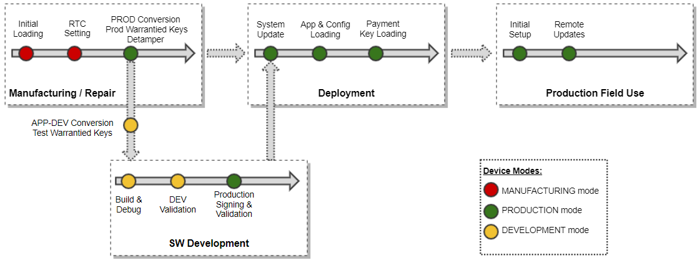

# System Lifecycle, Modes and Device States 

## Lifecycle overview 

## Production and Application Development Modes 

Verifone provides system users with following device modes:

- PRODUCTION mode
- APPLICATION DEVELOPMENT mode

Production mode is meant for operational usage of the device. In this mode all security provisions are fully enabled.

Application development (APP-DEV) mode is a special mode to support developers during application development and testing. Refer to the <a href="pg_device_mode_conversion.md">Device Mode conversion</a> chapter to read details about this mode.


Conversion to APP-DEV mode is provided by Verifone and converted devices can be ordered separately.


A device can be moved out from the field using the CrtReset tool that removes authentication certificates, keys and other customer data from the device. Refer to the <a href="pg_system_tools.md">System Tools</a> to read more details about this tool.

## System Warrantied Keys 

The system comes preloaded with a set of warrantied keys as per the following table:

| Warrantied Key | Details | Key Type |
|----|----|----|
| 
VRK Key: Verifone Remote Key Loading Key
 | 
VRK key is used for encrypt/decrypt of the VRK Payload for RSA and for key agreement of encryption/decryption key of the VRK payload for ECC.
 | 
ECC-521
 |
| 
Authentication Key (Authex/ AuthN)
 | 
Authenticate the device against external service (e.g. VHQ, custom TMS)
 | 
RSA-2048, ECC-521
 |
| 
Pairing Key
 | 
Authenticate a connected Verifone Device and establish trust for key exchange between Verifone Devices
 | 
RSA-2048, ECC-521
 |
| 
System Signer
 | 
Reserved for Verifone private use
 | 
ECC-521
 |
