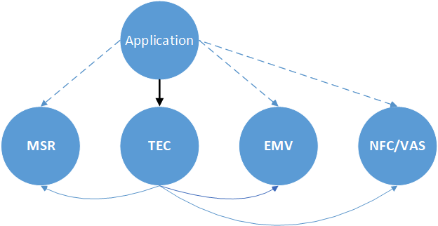
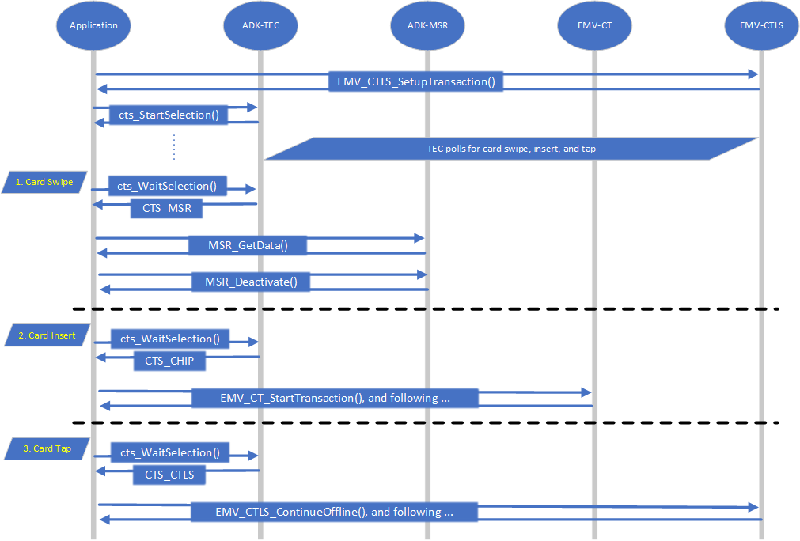
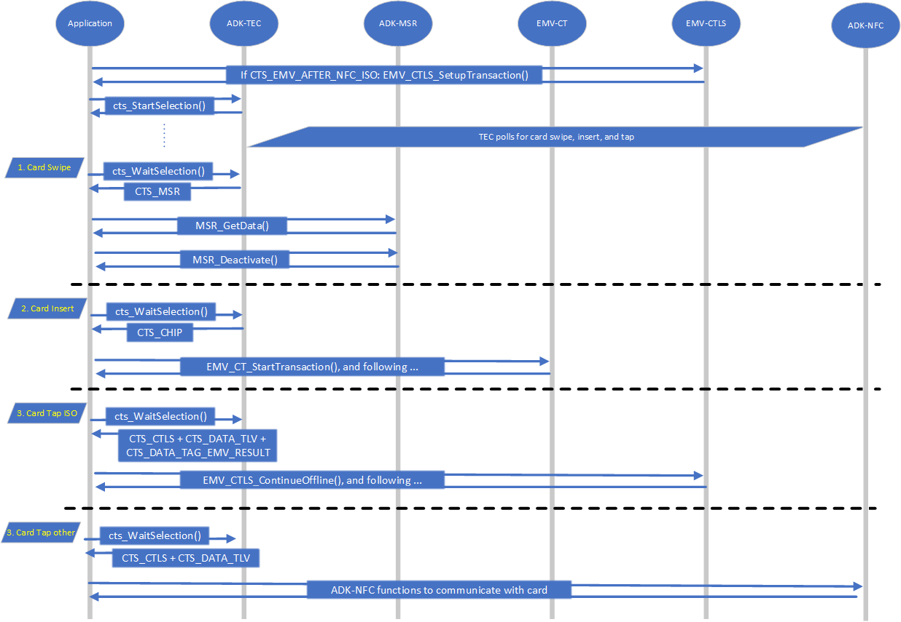
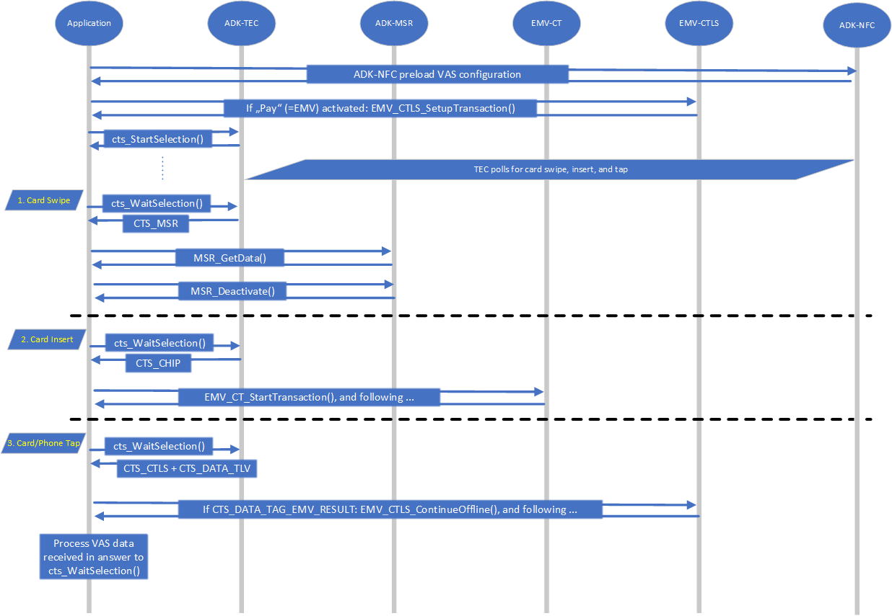
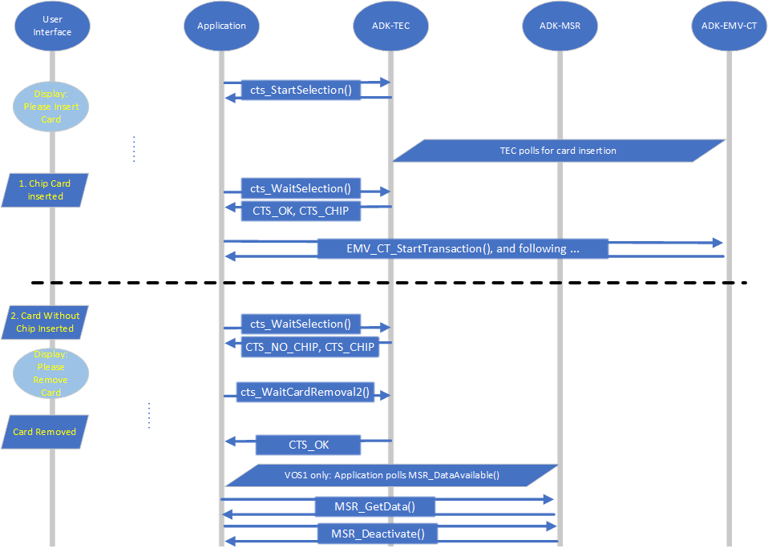
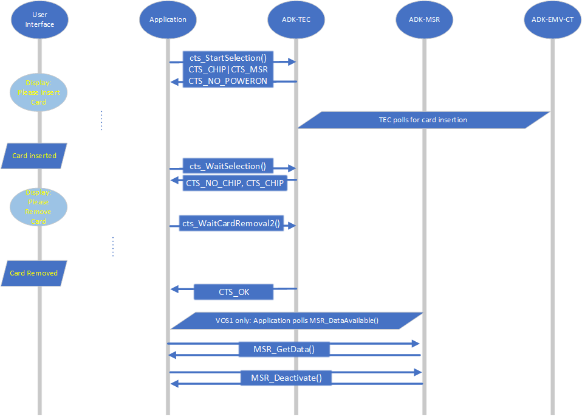

# Preface <a href="#sec_tec_preface" id="sec_tec_preface"></a>

This document is for programmers and developers who want to understand and use the ADK-TEC.

## Audience <a href="#subsec_tec_audience" id="subsec_tec_audience"></a>

This guide provides all the information required for application developers to integrate and utilize the functionality of the ADK-TEC.

## Organization <a href="#subsec_tec_organization" id="subsec_tec_organization"></a>

This guide is organized as follows:

[Introduction](#sec_tec_introduction): Provides a summary of ADK-TEC.

[Use Cases](#sec_tec_use_cases): Presents typical flows.

[Getting Started](#sec_tec_getting_started): Presents an introduction in ADK-TEC usage.

[Programming](#sec_tec_programming): Supplies ADK-TEC programming information.

[System Setup and Requirements](#sec_tec_system_setup_and_requirements): Supplies information about required dependencies.

[PP1000](#sec_tec_pp1000): Supplies information about pairing and PIN transfer with PP1000.

[Troubleshooting](#sec_tec_troubleshooting): Gives solutions for possible issues in ADK-TEC.

[Appendix](#sec_tec_appendix): Links to related documents.

# Introduction <a href="#sec_tec_introduction" id="sec_tec_introduction"></a>

ADK-TEC provides **technology selection** functionality. Supported technologies are

- Magstripe cards
- EMV contact chip cards
- EMV contactless cards and mobile phones
- Contactless NFC cards (Mifare, Felicy, ISO, \...)
- Contactless Value Added Service (VAS) solutions

To make use of ADK-TEC you need the following components:

- <a href="tec_8h.md">tec.h</a>
- libtec.so

Additionally you need

- ADK-MSR, see <a href="./pg_msr_programmers_guide.md">ADK-MSR Programmers Guide</a>
- ADK-EMV, see
  - <a href="./pg_emv_contact_users_guide.md">ADK-EMV Contact Programmers Guide</a>
  - <a href="./pg_emv_contactless_users_guide.md">ADK-EMV Contactless Programmers Guide</a>
- ADK-NFC, see <a href="./pg_nfc_users_guide.md">ADK-NFC Programmers Guide</a>

## Flow Overview <a href="#sec_tec_intro_flow_overview" id="sec_tec_intro_flow_overview"></a>

On **terminal startup** the application needs to setup the components (see below picture, dashed lines):

| Package name | Description |
|----|----|
| <p>`tec-doc-x.x.x-xx.zip`</p> | <p>Documentation</p> |

| ADK-MSR | ADK-EMV Contact | ADK-EMV Contactless | ADK-NFC | ADK-TEC (black line) |
|----|----|----|----|----|
| <p><a href="msr_8h.md#ac3c6f568aa57690a8b369936fc362c2a">MSR_SetOptions()</a> if desired</p> | <p><a href="group___f_u_n_c___i_n_i_t.md#ga514e39585c5a6b79632ac317593ff592">EMV_CT_Init_Framework()</a></p> | <p><a href="group___f_u_n_c___i_n_i_t.md#ga63240773908b46180eeec866ef33f93f">EMV_CTLS_Init_Framework()</a></p> | <p><a href="sdi__nfc_8h.md#a7a9419cd6aa7aa9185fb249ce761ae0f">NFC_Client_Init()</a></p> | <p><a href="tec_8h.md#aa237be1f0249503d0b959d3800f1ee34">cts_SetOptions()</a> if desired</p> |
|  | <p><a href="group___f_u_n_c___c_o_n_f.md#ga351c2deba9865081c314d818463f20c9">EMV_CT_SetTermData()</a></p> | <p><a href="group___f_u_n_c___c_o_n_f.md#gac5ce9781bba083028538f9e77c2d58f3">EMV_CTLS_SetTermData()</a></p> | <p><a href="titusstubs_8cpp.md#ad0a349a0904d698fea9fffa004cb3eb3">NFC_Terminal_Config()</a></p> |  |
|  | <p><a href="group___f_u_n_c___c_o_n_f.md#ga73ca1735defbb65a1aae2ead1de70233">EMV_CT_SetAppliData()</a></p> | <p><a href="group___f_u_n_c___c_o_n_f.md#gadc7f2eba5fd3e941d0ddb65a936a0776">EMV_CTLS_SetAppliDataSchemeSpecific()</a></p> | <p><a href="titusstubs_8cpp.md#a8816583d91da702a6c7e2143ed68f7d9">NFC_VAS_UpdateConfig()</a></p> |  |
|  | <p><a href="group___f_u_n_c___c_o_n_f.md#gade5b2bbc6ab46c4b7d9efa991b696ad2">EMV_CT_StoreCAPKey()</a></p> | <p><a href="group___f_u_n_c___c_o_n_f.md#ga3e03f6dd283e873cbcd6b8e4bb78f09a">EMV_CTLS_StoreCAPKey()</a></p> |  |  |



**Transaction flow**:

- Application prepares components (dashed lines):
  - ADK-EMV Contactless
    - if not <a href="group___t_e_c___s_t_a_r_t___o_p_t_i_o_n_s.md#gaeff0a0e1b335597ea1ec0781f15edb08">CTS_PURE_CARD_DETECTION</a>: <a href="group___f_u_n_c___f_l_o_w.md#ga1a86c76dcf8fec6e97ead6cf8f2717ff">EMV_CTLS_SetupTransaction()</a>
  - ADK-NFC if VAS desired: <a href="titusstubs_8cpp.md#a8ee28a30cc5757bdd4d9ac413fe7ef17">NFC_VAS_PreLoad()</a>
- Application starts card detection
  - invoke <a href="tec_8h.md#ac6699fe32fc23e90713eb617e9ff25e7">cts_StartSelection()</a> (black line)
  - ADK-TEC starts a thread to poll the involved components (solid blue lines)
- User swipes, inserts, or taps a card (or mobile phone)
  - ADK-TEC gets notification about this event (solid blue lines)
- ADK-TEC signals card detection to the application (black line)
- Application completes the transaction (dashed lines)
  - if a magstripe card was swiped:
    - use ADK-MSR functions to fetch the read data
  - if a card was inserted:
    - use ADK-EMV Contact to make the transaction
  - if a card (or mobile phone) was tapped:
    - if CTLS EMV is signaled:
      - transaction was already done
      - use ADK-EMV Contactless to fetch the results
    - if CTLS NFC or VAS is signaled:
      - use ADK-NFC to realize the desired APDUs
      - if desired (and possible): do EMV transaction by means of ADK-EMV Contactless

## Android <a href="#sec_tec_intro_android" id="sec_tec_intro_android"></a>

In Android the ADK-TEC is hidden inside SDI. So application has to use the \"Card Detection (23-01)\" from <a href="./pg_sdi_users_guide.md">ADK-SDI Programmers Guide</a>.

## VOS3 <a href="#sec_tec_intro_vos3" id="sec_tec_intro_vos3"></a>

In VOS3 ADK-TEC is accessible through SDI. The ADK-TEC-interface is rebuild in <a href="./pg_sdiclient_users_guide.md">ADK-SDI-Client Programmers Guide</a>.

## Two-Piece Solution <a href="#sec_msr_intro_2piece" id="sec_msr_intro_2piece"></a>

Former Two-Piece Solution with Client/Server architecture for MSR, TEC, \... is not supported anymore.
SDI EPP has to be used instead (see <a href="./pg_sdi_users_guide.md">ADK-SDI Programmers Guide</a>).

# Use Cases <a href="#sec_tec_use_cases" id="sec_tec_use_cases"></a>

## Magstripe and EMV Contact, on Contactless EMV and transparent ISO APDU <a href="#subsec_tec_emv_msr_ct_ctls" id="subsec_tec_emv_msr_ct_ctls"></a>

**Requirement:**
All three technologies shall be detected: Magstripe Card Swipe, Contact Chipcard Insertion, Contactless Card (or Mobile Phone) Tap.
On *Contactless interface an EMV payment* shall be done.

**Flow** (see below diagram):
If not <a href="group___t_e_c___s_t_a_r_t___o_p_t_i_o_n_s.md#gaeff0a0e1b335597ea1ec0781f15edb08">CTS_PURE_CARD_DETECTION</a>: Before EVERY start the application has to set up EMV Contactless (call <a href="group___f_u_n_c___f_l_o_w.md#ga1a86c76dcf8fec6e97ead6cf8f2717ff">EMV_CTLS_SetupTransaction()</a>).

To start technology selection the application calls <a href="tec_8h.md#ac6699fe32fc23e90713eb617e9ff25e7">cts_StartSelection()</a> with <a href="group___t_e_c___t_e_c_h_n_o_l_o_g_i_e_s.md#gadbc63cc59da76fff7974cd5631f56662">CTS_CHIP</a>, <a href="group___t_e_c___t_e_c_h_n_o_l_o_g_i_e_s.md#gaece6355aecbe1744ed15e5b41e0e6c15">CTS_MSR</a>, and <a href="group___t_e_c___t_e_c_h_n_o_l_o_g_i_e_s.md#ga56e64c2a97c61e8cb043de2852986a3a">CTS_CTLS</a>.
TEC component will start a thread to poll for swipe, insert or tap.

Once a card (or mobile phone) is detected the application gets the result by means of <a href="tec_8h.md#aee5b104d8ad6e85feddb685379cdbf0c">cts_WaitSelection()</a>.
Parameter `usedTechnology` informs which technology is used:

1.  <a href="group___t_e_c___t_e_c_h_n_o_l_o_g_i_e_s.md#gaece6355aecbe1744ed15e5b41e0e6c15">CTS_MSR</a>: A magnetic card was swiped.
    Application has to read the magstripe data (with help of <a href="./pg_msr_programmers_guide.md">ADK-MSR Programmers Guide</a>) and process transaction.
2.  <a href="group___t_e_c___t_e_c_h_n_o_l_o_g_i_e_s.md#gadbc63cc59da76fff7974cd5631f56662">CTS_CHIP</a>: A contact chip card was inserted.
    Chip may already be activated (depending on <a href="group___t_e_c___s_t_a_r_t___o_p_t_i_o_n_s.md#ga1073825ee49c63471bef39392d6df7e6">CTS_NO_POWERON</a>).
    Application has to execute the chip transaction by means of <a href="./pg_emv_contact_users_guide.md">ADK-EMV Contact Programmers Guide</a>.
3.  <a href="group___t_e_c___t_e_c_h_n_o_l_o_g_i_e_s.md#ga56e64c2a97c61e8cb043de2852986a3a">CTS_CTLS</a>: A contactless card or mobile phone was tapped (see <a href="./pg_emv_contactless_users_guide.md">ADK-EMV Contactless Programmers Guide</a>).
    - if <a href="group___t_e_c___s_t_a_r_t___o_p_t_i_o_n_s.md#gaeff0a0e1b335597ea1ec0781f15edb08">CTS_PURE_CARD_DETECTION</a>:
      Chip card was activated.
      Application can communicate with chip by means of EMV transparent commands (<a href="group___f_u_n_c___i_c_c.md#gafbcdb0278723b9629eb7c12532119e2d">EMV_CTLS_SmartISO()</a> and others).
      And may do a EMV transaction starting with <a href="group___f_u_n_c___f_l_o_w.md#ga1a86c76dcf8fec6e97ead6cf8f2717ff">EMV_CTLS_SetupTransaction()</a>.
    - else:
      The complete EMV transaction was already done.
      The application has to fetch the results with <a href="group___f_u_n_c___f_l_o_w.md#gaf23f6f87fe90619810470fad7d11f321">EMV_CTLS_ContinueOffline()</a>.



## Magstripe and EMV Contact, on Contactless NFC <a href="#subsec_tec_msr_ct_iso" id="subsec_tec_msr_ct_iso"></a>

**Requirement:**
All three technologies shall be detected: Magstripe Card Swipe, Contact Chipcard Insertion, Contactless Card (or Mobile Phone) Tap.
On *Contactless interface several card types* shall be handled: MiFare, Felica, EMV, and others.

**Flow** (see below diagram):
To start technology selection the application calls <a href="tec_8h.md#ac6699fe32fc23e90713eb617e9ff25e7">cts_StartSelection()</a> with <a href="group___t_e_c___t_e_c_h_n_o_l_o_g_i_e_s.md#gadbc63cc59da76fff7974cd5631f56662">CTS_CHIP</a>, <a href="group___t_e_c___t_e_c_h_n_o_l_o_g_i_e_s.md#gaece6355aecbe1744ed15e5b41e0e6c15">CTS_MSR</a>, and <a href="group___t_e_c___t_e_c_h_n_o_l_o_g_i_e_s.md#ga56e64c2a97c61e8cb043de2852986a3a">CTS_CTLS</a>.
Additionally <a href="group___t_e_c___s_t_a_r_t___o_p_t_i_o_n_s.md#gaafe9099680a56edd52a1258a797efa07">CTS_NFC_ENABLE</a> and options\[12..15\] (NFC technologies) have to be set.
TEC component will start a thread to poll for swipe, insert or tap.

Once a card (or mobile phone) is detected the application gets the result by means of <a href="tec_8h.md#aee5b104d8ad6e85feddb685379cdbf0c">cts_WaitSelection()</a>.
Parameter `usedTechnology` informs which technology is used:

- <a href="group___t_e_c___t_e_c_h_n_o_l_o_g_i_e_s.md#gaece6355aecbe1744ed15e5b41e0e6c15">CTS_MSR</a>: A magnetic card was swiped.
  Application has to read the magstripe data (with help of <a href="./pg_msr_programmers_guide.md">ADK-MSR Programmers Guide</a>) and process transaction.
- <a href="group___t_e_c___t_e_c_h_n_o_l_o_g_i_e_s.md#gadbc63cc59da76fff7974cd5631f56662">CTS_CHIP</a>: A contact chip card was inserted.
  Chip may already be activated (depending on <a href="group___t_e_c___s_t_a_r_t___o_p_t_i_o_n_s.md#ga1073825ee49c63471bef39392d6df7e6">CTS_NO_POWERON</a>).
  Application has to execute the chip transaction by means of <a href="./pg_emv_contact_users_guide.md">ADK-EMV Contact Programmers Guide</a>.
- <a href="group___t_e_c___t_e_c_h_n_o_l_o_g_i_e_s.md#ga56e64c2a97c61e8cb043de2852986a3a">CTS_CTLS</a> + <a href="tec__common_8h.md#a56386219739d173835a83194608fedea">CTS_DATA_TLV</a>: A contactless card or mobile phone was tapped.
  Parameter `dataBuffer` contains NFC related data in TLV format, see <a href="group___t_e_c___d_a_t_a___t_a_g_s.md">TEC result data tags</a>.
  Application shall use <a href="./pg_nfc_users_guide.md">ADK-NFC Programmers Guide</a> to realize the desired functionality, e.g.:
  - Felica
  - Mifare
  - APDU exchange

**Automatically perform an EMV Contacless transaction:**
The application may set <a href="group___t_e_c___s_t_a_r_t___o_p_t_i_o_n_s.md#ga16d617787fe23f80aae81a4c3bc944bf">CTS_EMV_AFTER_NFC_ISO</a>.
In that case it also needs to call <a href="group___f_u_n_c___f_l_o_w.md#ga1a86c76dcf8fec6e97ead6cf8f2717ff">EMV_CTLS_SetupTransaction()</a> before <a href="tec_8h.md#ac6699fe32fc23e90713eb617e9ff25e7">cts_StartSelection()</a>.
ADK-TEC will perform an EMV contactless transaction if an ISO14443 card is tapped.
If another card is used the application will get the above mentioned NFC results.



## Magstripe and EMV Contact, on Contactless EMV and VAS (Value Added Services, Wallets) <a href="#subsec_tec_msr_ct_nfc" id="subsec_tec_msr_ct_nfc"></a>

**Requirement:**
All three technologies shall be detected: Magstripe Card Swipe, Contact Chipcard Insertion, Contactless Card (or Mobile Phone) Tap.
On Contactless interface it\'s needed to handle *Value Added Services (VAS) Wallets* and EMV payments.

**Flow** (see below diagram):
Application has to prepare ADK-NFC by means of <a href="titusstubs_8cpp.md#a8ee28a30cc5757bdd4d9ac413fe7ef17">NFC_VAS_PreLoad()</a> (see <a href="./pg_nfc_users_guide.md">ADK-NFC Programmers Guide</a>).
If the used VAS config includes \"Pay\" (= EMV) than <a href="group___f_u_n_c___f_l_o_w.md#ga1a86c76dcf8fec6e97ead6cf8f2717ff">EMV_CTLS_SetupTransaction()</a> is needed.

To start technology selection the application calls <a href="tec_8h.md#ac6699fe32fc23e90713eb617e9ff25e7">cts_StartSelection()</a> with <a href="group___t_e_c___t_e_c_h_n_o_l_o_g_i_e_s.md#gadbc63cc59da76fff7974cd5631f56662">CTS_CHIP</a>, <a href="group___t_e_c___t_e_c_h_n_o_l_o_g_i_e_s.md#gaece6355aecbe1744ed15e5b41e0e6c15">CTS_MSR</a>, and <a href="group___t_e_c___t_e_c_h_n_o_l_o_g_i_e_s.md#ga56e64c2a97c61e8cb043de2852986a3a">CTS_CTLS</a>.
Additionally <a href="group___t_e_c___s_t_a_r_t___o_p_t_i_o_n_s.md#ga4678a7752f0337b236971dcd370edf93">CTS_VAS_ENABLE</a> has to be set.
TEC component will start a thread to poll for swipe, insert or tap.

Once a card (or mobile phone) is detected the application gets the result by means of <a href="tec_8h.md#aee5b104d8ad6e85feddb685379cdbf0c">cts_WaitSelection()</a>.
Parameter `usedTechnology` informs which technology is used:

- <a href="group___t_e_c___t_e_c_h_n_o_l_o_g_i_e_s.md#gaece6355aecbe1744ed15e5b41e0e6c15">CTS_MSR</a>: A magnetic card was swiped.
  Application has to read the magstripe data (with help of <a href="./pg_msr_programmers_guide.md">ADK-MSR Programmers Guide</a>) and process transaction.
- <a href="group___t_e_c___t_e_c_h_n_o_l_o_g_i_e_s.md#gadbc63cc59da76fff7974cd5631f56662">CTS_CHIP</a>: A contact chip card was inserted.
  Chip may already be activated (depending on <a href="group___t_e_c___s_t_a_r_t___o_p_t_i_o_n_s.md#ga1073825ee49c63471bef39392d6df7e6">CTS_NO_POWERON</a>).
  Application has to execute the chip transaction by means of <a href="./pg_emv_contact_users_guide.md">ADK-EMV Contact Programmers Guide</a>.
- <a href="group___t_e_c___t_e_c_h_n_o_l_o_g_i_e_s.md#ga56e64c2a97c61e8cb043de2852986a3a">CTS_CTLS</a> + <a href="tec__common_8h.md#a56386219739d173835a83194608fedea">CTS_DATA_TLV</a>: A contactless card or mobile phone was tapped.
  Parameter `dataBuffer` contains VAS related data in TLV format, see <a href="group___t_e_c___d_a_t_a___t_a_g_s.md">TEC result data tags</a>.
  If result data contains <a href="group___t_e_c___d_a_t_a___t_a_g_s.md#ga6de766623c7d58220a766c7bb6722c6f">CTS_DATA_TAG_EMV_RESULT</a> the TEC processed a complete EMV transaction.
  Application has to use ADK-EMV to collect the results.
  Afterwards it can process the VAS data as needed.



# Getting Started <a href="#sec_tec_getting_started" id="sec_tec_getting_started"></a>

The following two examples show how to use technology selection (ADK-TEC):

## Sample1: Application using ADK-TEC without callback <a href="#sec_tec_sample1" id="sec_tec_sample1"></a>

``` cpp
#include "tec/tec.h"
#include "msr/msr.h"
#include "EMV_CT_Interface.h"
#include "EMV_CTLS_Interface.h"
....
a) MSR, CT, CTLS EMV only
// initialize:
EMV_CT_InitFramework(...);
EMV_CTLS_InitFramework(...);
// setup transaction
EMV_CTLS_SetupTransaction(...);
// start technology selection without callback:
if (cts_StartSelection(CTS_CHIP|CTS_CTLS|CTS_MSR, 10, NULL, NULL, NULL, 0) == CTS_OK)
b) MSR, CT, CTLS EMV + WALLET (Remark: NFC ADK supports EITHER VAS processing OR PassTrough processing, mutual exclusive)
unsigned char options[2] = {0};
// initialize:
EMV_CT_InitFramework(...);
EMV_CTLS_InitFramework(...);
NFC_Client_Init(...);
NFC_Terminal_Config(...);
NFC_VAS_UpdateConfig(...);
cts_SetOptions(...); // to set VAS appID
// setup transaction:
EMV_CTLS_SetupTransaction(...);
NFC_VAS_PreLoad(...);
options[1] = CTS_VAS_ENABLE;
// start technology selection without callback:
if (cts_StartSelection(CTS_CHIP|CTS_CTLS|CTS_MSR, 10, NULL, NULL, options, 2) == CTS_OK)
c) MSR, CT, CTLS EMV + NFC Pass Through (Remark: NFC ADK supports EITHER VAS processing OR PassTrough processing, mutual exclusive)
unsigned char options[16] = {0};
// initialize:
EMV_CT_InitFramework(...);
EMV_CTLS_InitFramework(...);
NFC_Client_Init(...);
// setup transaction:
EMV_CTLS_SetupTransaction(...);
options[1] = CTS_NFC_ENABLE;
options[1] |= CTS_EMV_AFTER_NFC_ISO; // optional
options[15] = 0x0F; // select card types
// start technology selection without callback:
if (cts_StartSelection(CTS_CHIP|CTS_CTLS|CTS_MSR, 10, NULL, NULL, options, 16) == CTS_OK)
{
  unsigned char technology;
  unsigned char tlv_response = false;
  unsigned char data[100];
  unsigned short data_len = sizeof(data);
  int ret;
  
  // wait for result:
  while ((ret = cts_WaitSelection(&technology, data, data_len, 100)) == CTS_IN_PROGRESS)
  {
   // if abort request arrived (from GUI, ECR, ...) stop technology selection:
   if (aborted) cts_StopSelection();
  }
  switch (ret)
  {
   case CTS_OK: // technology detected
  
   if(technology & CTS_DATA_TLV)
   {
   // clear TLV response flag
   technology &= ~CTS_DATA_TLV;
   tlv_response = true;
   }
  
   switch (technology)
   {
   case CTS_MSR:
   MSR_GetData(...);
   MSR_Deactivate(...);
   break;
   case CTS_CHIP:
   EMV_CT_ContinueOffline(...);
   EMV_CT_ContinueOnline(...);
   // wait for removal of chip card
   cts_WaitCardRemoval2(10);
   break;
   case CTS_CTLS:
   if (tlv_response)
   {
   // Evaluate the response tags for NFC Pass Through, NFC VAS processing, and EMV processing if configured in b) or c) above. 
   }
   else
   {
   EMV_CTLS_ContinueOffline(...);
   EMV_CTLS_ContinueOnline(...);
   }
   break;
   }
   break;
   case CTS_TIMEOUT: // no technology detected
   break;
   case CTS_STOPPED: // technology selection aborted
   break;
   default: // error (see cts_WaitSelection() for details about all possible return values)
   break;
  }
}
else
{
  EMV_CTLS_Break();
}
....
```

## Sample2: Application using ADK-TEC with callback <a href="#sec_tec_sample2" id="sec_tec_sample2"></a>

``` cpp
#include <pthread.h>
#include "tec/tec.h"
#include "msr/msr.h"
#include "EMV_CT_Interface.h"
#include "EMV_CTLS_Interface.h"
....
static pthread_mutex_t mutex = PTHREAD_MUTEX_INITIALIZER;
static pthread_cond_t condition = PTHREAD_COND_INITIALIZER;
static unsigned char technology;
static unsigned char data[100];
static unsigned short data_len = sizeof(data);
static int ret;
static void tecselCallback(void *data)
{
  pthread_mutex_lock(&mutex);
  ret = cts_WaitSelection(&technology, data, data_len, 0)
  pthread_cond_signal(&condition);
  pthread_mutex_unlock(&mutex);
}
....
a) MSR, CT, CTLS EMV only
// initialize:
EMV_CT_InitFramework(...);
EMV_CTLS_InitFramework(...);
// setup transaction
EMV_CTLS_SetupTransaction(...);
// start technology selection with callback:
if (cts_StartSelection(CTS_CHIP|CTS_CTLS|CTS_MSR, 10, &tecselCallback, NULL, NULL, 0) == CTS_OK)
b) MSR, CT, CTLS EMV + WALLET (Remark: NFC ADK supports EITHER VAS processing OR PassTrough processing, mutual exclusive)
unsigned char options[2] = {0};
// initialize:
EMV_CT_InitFramework(...);
EMV_CTLS_InitFramework(...);
NFC_Client_Init(...);
NFC_Terminal_Config(...);
NFC_VAS_UpdateConfig(...);
cts_SetOptions(...); // to set VAS appID
// setup transaction:
EMV_CTLS_SetupTransaction(...);
NFC_VAS_PreLoad(...);
options[1] = CTS_VAS_ENABLE;
// start technology selection with callback:
if (cts_StartSelection(CTS_CHIP|CTS_CTLS|CTS_MSR, 10, &tecselCallback, NULL, options, 2) == CTS_OK)
c) MSR, CT, CTLS EMV + NFC Pass Through (Remark: NFC ADK supports EITHER VAS processing OR PassTrough processing, mutual exclusive)
unsigned char options[16] = {0};
// initialize:
EMV_CT_InitFramework(...);
EMV_CTLS_InitFramework(...);
NFC_Client_Init(...);
// setup transaction:
EMV_CTLS_SetupTransaction(...);
options[1] = CTS_NFC_ENABLE;
options[1] |= CTS_EMV_AFTER_NFC_ISO; // optional
options[15] = 0x0F; // select card types
  
// start technology selection with callback:
if (cts_StartSelection(CTS_CHIP|CTS_CTLS|CTS_MSR, 10, &tecselCallback, NULL, options, 16) == CTS_OK)
{
  unsigned char tlv_response = false;
  
  pthread_mutex_lock(&mutex);
  // wait for callback:
  pthread_cond_wait(&condition, &mutex);
  pthread_mutex_unlock(&mutex);
  switch (ret)
  {
   case CTS_OK: // technology detected
  
   if(technology & CTS_DATA_TLV)
   {
   // clear TLV response flag
   technology &= ~CTS_DATA_TLV;
   tlv_response = true;
   }
  
   switch (technology)
   {
   case CTS_MSR:
   MSR_GetData(...);
   MSR_Deactivate(...);
   break;
   case CTS_CHIP:
   EMV_CT_ContinueOffline(...);
   EMV_CT_ContinueOnline(...);
   // wait for removal of chip card
   cts_WaitCardRemoval2(10);
   break;
   case CTS_CTLS:
   if (tlv_response)
   {
   // Evaluate the response tags for NFC Pass Through, NFC VAS processing, and EMV processing if configured in b) or c) above. 
   }
   else
   {
   EMV_CTLS_ContinueOffline(...);
   EMV_CTLS_ContinueOnline(...);
   }
   break;
   }
   break;
   case CTS_TIMEOUT: // no technology detected
   break;
   case CTS_STOPPED: // technology selection aborted
   break;
   default: // error (see cts_WaitSelection() for details about all possible return values)
   break;
  }
}
else
{
  EMV_CTLS_Break();
}
....
```

Link your application with libtec.so and load the shared library libtec.so on your device. If you don\'t want to periodically call <a href="tec_8h.md#aee5b104d8ad6e85feddb685379cdbf0c">cts_WaitSelection()</a> you can supply a callback function to <a href="tec_8h.md#ac6699fe32fc23e90713eb617e9ff25e7">cts_StartSelection()</a>. This callback function is called exactly once after the technology selection has finished (due to detected technology, timeout, or error). After this callback function has been called (or even withing the callback function) you can obtain the result by <a href="tec_8h.md#aee5b104d8ad6e85feddb685379cdbf0c">cts_WaitSelection()</a> setting its timeout to 0. A callback function is supported for card removal detection as well (see <a href="tec_8h.md#a8db288b6803c1fba534d94a99f1b646b">cts_WaitCardRemoval()</a>).

# Programming <a href="#sec_tec_programming" id="sec_tec_programming"></a>

## Programming and API Principles <a href="#subsec_tec_programming_and_api_principles" id="subsec_tec_programming_and_api_principles"></a>

The API consists of the following functions:

| <a href="tec_8h.md">tec.h</a> |
|----|
|  |
| <p><a href="tec__common_8h.md#a68272ed65703130d4858d9c28c21f9b9">cts_Version()</a></p> |
| <p><a href="tec__common_8h.md#a90770d44c55c14fa472396c74fec6052">cts_SetTraceCallback()</a></p> |
| <p><a href="tec_8h.md#aa237be1f0249503d0b959d3800f1ee34">cts_SetOptions()</a></p> |
| <p><a href="tec_8h.md#ac6699fe32fc23e90713eb617e9ff25e7">cts_StartSelection()</a></p> |
| <p><a href="tec_8h.md#acaf2d75d1b584ae97ff9ee4da47cee38">cts_StopSelection()</a></p> |
| <p><a href="tec_8h.md#aee5b104d8ad6e85feddb685379cdbf0c">cts_WaitSelection()</a></p> |
| <p><a href="tec_8h.md#a8569782d27f43e5d88cef3575a5d12c6">cts_RemoveTechnologies()</a></p> |
| <p><a href="tec_8h.md#aa60922ab5b40a033ac85a36e8022cafa">cts_AddTechnologies()</a></p> |
| <p><a href="tec_8h.md#a8db288b6803c1fba534d94a99f1b646b">cts_WaitCardRemoval()</a></p> |
| <p><a href="tec_8h.md#a92ab7780df1f8150c6d8a9b3ab3163bf">cts_WaitCardRemoval2()</a></p> |
|  |
|  |
| <p><a href="tec_2export_2tec_2ped_8h.md#aa093da583e918cfb6dd8e152c39af3bc">ped_SetSendRcvCb()</a></p> |
| <p><a href="tec_2export_2tec_2ped_8h.md#a124ea72634b37bdf5d09ce5e0869ca55">ped_Pairing()</a></p> |
| <p><a href="tec_2export_2tec_2ped_8h.md#ab4792fd3cacefd42f8f7bf365e779484">ped_MovePin()</a></p> |
| <p><a href="tec_8h.md#ada083dc0f484d99ab24df79ed5f145c9">cts_SetNotificationCallback()</a></p> |

### Some notes regarding the different technologies <a href="#subsubsec_tec_technology_notes" id="subsubsec_tec_technology_notes"></a>

In general only one of <a href="group___t_e_c___t_e_c_h_n_o_l_o_g_i_e_s.md#gaece6355aecbe1744ed15e5b41e0e6c15">CTS_MSR</a>, <a href="group___t_e_c___t_e_c_h_n_o_l_o_g_i_e_s.md#gadbc63cc59da76fff7974cd5631f56662">CTS_CHIP</a>, <a href="group___t_e_c___t_e_c_h_n_o_l_o_g_i_e_s.md#ga56e64c2a97c61e8cb043de2852986a3a">CTS_CTLS</a> is detected but in special cases (see [Detecting MSR and CTLS simultaneously](#subsubsec_tec_msr_after_ctls) and [Special behavior on hybrid readers (UX30x)](#subsubsec_tec_special_ux_handling)) two technologies can be detected at once.

- <a href="group___t_e_c___t_e_c_h_n_o_l_o_g_i_e_s.md#gaece6355aecbe1744ed15e5b41e0e6c15">CTS_MSR</a>: If you want to use the magnetic card reader, you do not need to call <a href="msr_8h.md#a1e92fd29720fecbf50da24a30c7b512f">MSR_Activate()</a> before starting technology selection. ADK-TEC will do this for you. After technology selection finishes and the detected technology is not <a href="group___t_e_c___t_e_c_h_n_o_l_o_g_i_e_s.md#gaece6355aecbe1744ed15e5b41e0e6c15">CTS_MSR</a>, <a href="msr_8h.md#aac28b2c3771f8221fc26a35f0fd6d0f8">MSR_Deactivate()</a> is internally called as well. So you do not need to do this either. Only if the detected technology is <a href="group___t_e_c___t_e_c_h_n_o_l_o_g_i_e_s.md#gaece6355aecbe1744ed15e5b41e0e6c15">CTS_MSR</a>, ADK-MSR is still activated to allow the application to fetch the magnetic card data with <a href="msr_8h.md#ad00fdde838f486d43be689650ab58d43">MSR_GetData()</a>. After this you shall call <a href="msr_8h.md#aac28b2c3771f8221fc26a35f0fd6d0f8">MSR_Deactivate()</a>. If using an UX device <a href="msr_8h.md#aac28b2c3771f8221fc26a35f0fd6d0f8">MSR_Deactivate()</a> shall be called as well if technology selection detects <a href="group___t_e_c___t_e_c_h_n_o_l_o_g_i_e_s.md#gadbc63cc59da76fff7974cd5631f56662">CTS_CHIP</a> or returns <a href="group___t_e_c___r_e_t_u_r_n___c_o_d_e_s.md#ga058dc7a7d6d6562dac8171ca86f5b5c0">CTS_NO_CHIP</a> (see [Special behavior on hybrid readers (UX30x)](#subsubsec_tec_special_ux_handling)).
- <a href="group___t_e_c___t_e_c_h_n_o_l_o_g_i_e_s.md#gadbc63cc59da76fff7974cd5631f56662">CTS_CHIP</a>: If you want to use the chip card reader, you should first call EMV_CT_InitFramework() to enable the contact part of ADK-EMV. After technology selection detects a chip card the card is already powered up (except if you set option <a href="group___t_e_c___s_t_a_r_t___o_p_t_i_o_n_s.md#ga1073825ee49c63471bef39392d6df7e6">CTS_NO_POWERON</a>) and the application can call <a href="group___f_u_n_c___f_l_o_w.md#ga8be6df6babc587a19f63f284b2a6f006">EMV_CT_ContinueOffline()</a>.
- <a href="group___t_e_c___t_e_c_h_n_o_l_o_g_i_e_s.md#ga56e64c2a97c61e8cb043de2852986a3a">CTS_CTLS</a>: (EMV only, see below for NFC)
  - Card detection only (option <a href="group___t_e_c___s_t_a_r_t___o_p_t_i_o_n_s.md#gaeff0a0e1b335597ea1ec0781f15edb08">CTS_PURE_CARD_DETECTION</a>)
    ADK-TEC activates the card by means of <a href="group___f_u_n_c___i_c_c.md#gae2c93f30f24ceb94c930a7cae2b36116">EMV_CTLS_SmartReset()</a>.
    So calling application can continue to work with the card by <a href="group___f_u_n_c___i_c_c.md#gafbcdb0278723b9629eb7c12532119e2d">EMV_CTLS_SmartISO()</a>.
    And finally it shall call <a href="group___f_u_n_c___i_c_c.md#gadd0716253a50b2791ac4e2a1627d1e8d">EMV_CTLS_SmartPowerOff()</a> to switch off the RF field.
    In case an EMV transaction is desired the <a href="group___f_u_n_c___i_c_c.md#gadd0716253a50b2791ac4e2a1627d1e8d">EMV_CTLS_SmartPowerOff()</a> has to be called.
    And then <a href="group___f_u_n_c___f_l_o_w.md#ga1a86c76dcf8fec6e97ead6cf8f2717ff">EMV_CTLS_SetupTransaction()</a> and <a href="group___f_u_n_c___f_l_o_w.md#gaf23f6f87fe90619810470fad7d11f321">EMV_CTLS_ContinueOffline()</a>.
  - EMV transaction
    First call EMV_CTLS_InitFramework() and prior to each technology selection you have to call <a href="group___f_u_n_c___f_l_o_w.md#ga1a86c76dcf8fec6e97ead6cf8f2717ff">EMV_CTLS_SetupTransaction()</a>.
    ADK-TEC will internally call <a href="group___f_u_n_c___f_l_o_w.md#gaf23f6f87fe90619810470fad7d11f321">EMV_CTLS_ContinueOffline()</a> to detect the card and perform the transaction.
    If a contactless card is detected, the application can call <a href="group___f_u_n_c___f_l_o_w.md#gaf23f6f87fe90619810470fad7d11f321">EMV_CTLS_ContinueOffline()</a> again to obtain the transaction results.
    If no contactless card is detected, ADK-TEC internally calls <a href="group___f_u_n_c___f_l_o_w.md#ga2b4820be53959b56fb7f672bd54f4e63">EMV_CTLS_Break()</a>.
    One additional remark regarding <a href="group___f_u_n_c___f_l_o_w.md#ga1a86c76dcf8fec6e97ead6cf8f2717ff">EMV_CTLS_SetupTransaction()</a>: If ADK-TEC is used, you must not set parameter ServerPollTimeout because in this case ADK-TEC takes care of polling.

### Processing NFC with ADK-TEC <a href="#subsubsec_tec_nfc_notes" id="subsubsec_tec_nfc_notes"></a>

This is the general routine used in ADK-TEC for detecting and processing CTLS cards (pseudocode), it should help you to understand how ADK-TEC behaves depending on the various CTLS options.

``` cpp
[0] if both CTS_NFC_ENABLE and CTS_VAS_ENABLE are set:
   exit
   end
[1] if CTS_NFC_ENABLE is set:
   call NFC_PT_Polling()
   if ISO A/B card found and CTS_EMV_AFTER_NFC_ISO is set:
   goto [3]
   end
   exit
   end
[2] if CTS_VAS_ENABLE is set:
   call NFC_VAS_Activate()
   if VAS_DO_PAY is returned:
   goto [3]
   end
   exit
   end
[3] if CTS_PURE_CARD_DETECTION is set:
   call EMV_CTLS_SmartReset()
   else
   call EMV_CTLS_ContinueOffline()
   end
```

If it is possible that <a href="group___f_u_n_c___f_l_o_w.md#gaf23f6f87fe90619810470fad7d11f321">EMV_CTLS_ContinueOffline()</a> is called by ADK-TEC, application has to call <a href="group___f_u_n_c___f_l_o_w.md#ga1a86c76dcf8fec6e97ead6cf8f2717ff">EMV_CTLS_SetupTransaction()</a> before starting technology selection. If ADK-TEC detects a card with <a href="titusstubs_8cpp.md#aa1e541259f194621834060bf770b717b">NFC_PT_Polling()</a> and no subsequent EMV transaction is started, ADK-TEC keeps the RF field on to allow the application to communicate with this card. In this case the application has to call <a href="titusstubs_8cpp.md#a65c5ac372de4d71a8154f61b820abaf0">NFC_PT_FieldOff()</a> and <a href="titusstubs_8cpp.md#a00d4921f4a21667ae4cddb317ffc04a5">NFC_PT_Close()</a> afterwards. Furthermore the first CTLS LED is left on by ADK-TEC in this case. The application generally wants it to shine while communicating with the card or even wants to switch on further LEDs. So as soon as the application has finished the transaction, it needs to switch off the LEDs or restart idle blinking.

### Detecting MSR and CTLS simultaneously <a href="#subsubsec_tec_msr_after_ctls" id="subsubsec_tec_msr_after_ctls"></a>

After <a href="group___t_e_c___t_e_c_h_n_o_l_o_g_i_e_s.md#ga56e64c2a97c61e8cb043de2852986a3a">CTS_CTLS</a> has been detected technology selection can wait a certain amount of time for <a href="group___t_e_c___t_e_c_h_n_o_l_o_g_i_e_s.md#gaece6355aecbe1744ed15e5b41e0e6c15">CTS_MSR</a> before returning the result to the application. If a magnetic card is swiped within this period of time technology selection will return <a href="group___t_e_c___t_e_c_h_n_o_l_o_g_i_e_s.md#ga56e64c2a97c61e8cb043de2852986a3a">CTS_CTLS</a>\|<a href="group___t_e_c___t_e_c_h_n_o_l_o_g_i_e_s.md#gaece6355aecbe1744ed15e5b41e0e6c15">CTS_MSR</a> as technology. The timeout can be configured by the options parameter of <a href="tec_8h.md#ac6699fe32fc23e90713eb617e9ff25e7">cts_StartSelection()</a>.

### Special behavior on hybrid readers (UX30x) <a href="#subsubsec_tec_special_ux_handling" id="subsubsec_tec_special_ux_handling"></a>

Hybrid readers have a single slot for handling magstripe and contact chip.
ADK-TEC provides special functionality to help the application in making the decision which technology to choose.

[**ADK-MSR Configuration**]{.underline}

When using an UX30x device it is strongly recommended to activate the MSR UX enhancements (see <a href="./pg_msr_programmers_guide.md">ADK-MSR Programmers Guide</a>):

``` cpp
unsigned char options[] = { MSR_UX_ENHANCEMENTS };
MSR_SetOptions(options, sizeof(options));
```

This has to be done only once, before the first call of <a href="tec_8h.md#ac6699fe32fc23e90713eb617e9ff25e7">cts_StartSelection()</a>. These enhancements will prevent MSR from reading the magnetic card on insertion.

If the MSR UX enhancements are not activated, the following remarks are valid as well. Additionally it is possible that technology selection detects both <a href="group___t_e_c___t_e_c_h_n_o_l_o_g_i_e_s.md#gaece6355aecbe1744ed15e5b41e0e6c15">CTS_MSR</a> and <a href="group___t_e_c___t_e_c_h_n_o_l_o_g_i_e_s.md#gadbc63cc59da76fff7974cd5631f56662">CTS_CHIP</a> in parallel.

[**Use Case: Technologies Contact Chip and Magstripe are supported**]{.underline}

<a href="tec_8h.md#ac6699fe32fc23e90713eb617e9ff25e7">cts_StartSelection()</a> is called with requesting technology <a href="group___t_e_c___t_e_c_h_n_o_l_o_g_i_e_s.md#gadbc63cc59da76fff7974cd5631f56662">CTS_CHIP</a> (and <a href="group___t_e_c___t_e_c_h_n_o_l_o_g_i_e_s.md#gaece6355aecbe1744ed15e5b41e0e6c15">CTS_MSR</a>).
<a href="group___t_e_c___t_e_c_h_n_o_l_o_g_i_e_s.md#ga56e64c2a97c61e8cb043de2852986a3a">CTS_CTLS</a> may or may not be activated.



[**Use Case: Technology Magstripe supported but Contact Chip NOT**]{.underline}

<a href="tec_8h.md#ac6699fe32fc23e90713eb617e9ff25e7">cts_StartSelection()</a> is called with requesting technology <a href="group___t_e_c___t_e_c_h_n_o_l_o_g_i_e_s.md#gadbc63cc59da76fff7974cd5631f56662">CTS_CHIP</a> (and <a href="group___t_e_c___t_e_c_h_n_o_l_o_g_i_e_s.md#gaece6355aecbe1744ed15e5b41e0e6c15">CTS_MSR</a>).
<a href="group___t_e_c___t_e_c_h_n_o_l_o_g_i_e_s.md#gadbc63cc59da76fff7974cd5631f56662">CTS_CHIP</a> is necessary to be able to detect the card insertion.
<a href="group___t_e_c___s_t_a_r_t___o_p_t_i_o_n_s.md#ga1073825ee49c63471bef39392d6df7e6">CTS_NO_POWERON</a> shall be set to avoid activation of chip card.
<a href="group___t_e_c___t_e_c_h_n_o_l_o_g_i_e_s.md#ga56e64c2a97c61e8cb043de2852986a3a">CTS_CTLS</a> may or may not be activated.



[**ADK-TEC legacy timeout handling**]{.underline}

Above shown diagrams are recommended handling.
For downward compatibility the following functionality is still supported.

- **Let ADK-TEC wait for MSR data read on card removal**
  This scenario assumes that technologies <a href="group___t_e_c___t_e_c_h_n_o_l_o_g_i_e_s.md#gadbc63cc59da76fff7974cd5631f56662">CTS_CHIP</a> and <a href="group___t_e_c___t_e_c_h_n_o_l_o_g_i_e_s.md#gaece6355aecbe1744ed15e5b41e0e6c15">CTS_MSR</a> are supported.
  The application may set a timeout to <a href="tec_8h.md#ac6699fe32fc23e90713eb617e9ff25e7">cts_StartSelection()</a> (options\[8..9\]).
  Technology selection waits for this amount of time for MSR data from card removal.
  This functionality is not possible when using <a href="group___t_e_c___s_t_a_r_t___o_p_t_i_o_n_s.md#ga1073825ee49c63471bef39392d6df7e6">CTS_NO_POWERON</a> (so not for SDI and vos3)
  - If a **chip card** is inserted it goes the same way as usual:
    <a href="tec_8h.md#aee5b104d8ad6e85feddb685379cdbf0c">cts_WaitSelection()</a> returns <a href="group___t_e_c___r_e_t_u_r_n___c_o_d_e_s.md#ga1952f713ce2bbfa1d8b54142ca52ecc4">CTS_OK</a> and usedTechnology <a href="group___t_e_c___t_e_c_h_n_o_l_o_g_i_e_s.md#gadbc63cc59da76fff7974cd5631f56662">CTS_CHIP</a>
    The application shall use <a href="group___f_u_n_c___f_l_o_w.md#gac13472c2a4aea6475fe7bb52627e97eb">EMV_CT_StartTransaction()</a> etc. to process an EMV contact transaction.
  - If a **card without chip** is inserted
    ADK-TEC waits for the above mentioned timeout for card removal (and reading magstripe data)
    - If there is MSR data
      <a href="tec_8h.md#aee5b104d8ad6e85feddb685379cdbf0c">cts_WaitSelection()</a> returns <a href="group___t_e_c___r_e_t_u_r_n___c_o_d_e_s.md#ga1952f713ce2bbfa1d8b54142ca52ecc4">CTS_OK</a> and usedTechnology <a href="group___t_e_c___t_e_c_h_n_o_l_o_g_i_e_s.md#gaece6355aecbe1744ed15e5b41e0e6c15">CTS_MSR</a>
      Application shall
      - call <a href="msr_8h.md#ad00fdde838f486d43be689650ab58d43">MSR_GetData()</a> to obtain the MSR data
      - call <a href="msr_8h.md#aac28b2c3771f8221fc26a35f0fd6d0f8">MSR_Deactivate()</a>
    - if not
      <a href="tec_8h.md#aee5b104d8ad6e85feddb685379cdbf0c">cts_WaitSelection()</a> returns <a href="group___t_e_c___r_e_t_u_r_n___c_o_d_e_s.md#ga058dc7a7d6d6562dac8171ca86f5b5c0">CTS_NO_CHIP</a> and usedTechnology 0.
      In that case application
      - may
        - check if card is still inserted, if yes:
        - ask the cardholder to remove the card
        - wait for MSR data by polling <a href="msr_8h.md#a8096fa193f035eb4b80673260d720477">MSR_DataAvailable()</a>
        - call <a href="msr_8h.md#ad00fdde838f486d43be689650ab58d43">MSR_GetData()</a> to obtain the MSR data
      - must (in any case)
        - call <a href="msr_8h.md#aac28b2c3771f8221fc26a35f0fd6d0f8">MSR_Deactivate()</a>
- **Let ADK-TEC notify on card insertion**
  Detect card insertion, inform application about this event and wait for MSR data read on card removal.
  <a href="tec_8h.md#ac6699fe32fc23e90713eb617e9ff25e7">cts_StartSelection()</a> is called WITHOUT requesting technology <a href="group___t_e_c___t_e_c_h_n_o_l_o_g_i_e_s.md#gadbc63cc59da76fff7974cd5631f56662">CTS_CHIP</a>
  <a href="group___t_e_c___t_e_c_h_n_o_l_o_g_i_e_s.md#ga56e64c2a97c61e8cb043de2852986a3a">CTS_CTLS</a> may or may not be activated.

  - **Card insertion notification callback**
    <a href="tec_8h.md#ada083dc0f484d99ab24df79ed5f145c9">cts_SetNotificationCallback()</a> can be used to register the callback <a href="group___t_e_c___n_o_t_i_f_i_c_a_t_i_o_n___c_b_k___t_y_p_e.md#ga131e9251b6b4f9c9c7a187c07f12820a">CTS_NOTIFICATION_CBK_TYPE_UX_CARD_INSERTED</a>
    That\'s invoked in case a card is inserted.
    This functionality may be used to realize a cardholder display \"please remove card\".
    It\'s only available in case one of the below mentioned timeouts is set.
  - **Card Insertion Timeout**
    The application may set a **timeout** to <a href="tec_8h.md#ac6699fe32fc23e90713eb617e9ff25e7">cts_StartSelection()</a> (options\[8..9\]).
    After card insertion the ADK-TEC waits for this amount of time for MSR data (from card removal).
    - If there is MSR data
      <a href="tec_8h.md#aee5b104d8ad6e85feddb685379cdbf0c">cts_WaitSelection()</a> returns <a href="group___t_e_c___r_e_t_u_r_n___c_o_d_e_s.md#ga1952f713ce2bbfa1d8b54142ca52ecc4">CTS_OK</a> and usedTechnology <a href="group___t_e_c___t_e_c_h_n_o_l_o_g_i_e_s.md#gaece6355aecbe1744ed15e5b41e0e6c15">CTS_MSR</a>
      Application shall
      - call <a href="msr_8h.md#ad00fdde838f486d43be689650ab58d43">MSR_GetData()</a> to obtain the MSR data
      - call <a href="msr_8h.md#aac28b2c3771f8221fc26a35f0fd6d0f8">MSR_Deactivate()</a>
    - if not
      <a href="tec_8h.md#aee5b104d8ad6e85feddb685379cdbf0c">cts_WaitSelection()</a> returns <a href="group___t_e_c___r_e_t_u_r_n___c_o_d_e_s.md#ga058dc7a7d6d6562dac8171ca86f5b5c0">CTS_NO_CHIP</a> and usedTechnology 0.
      In that case application
      - may
        - check if card is still inserted, if yes:
        - ask the cardholder to remove the card
        - wait for MSR data by polling <a href="msr_8h.md#a8096fa193f035eb4b80673260d720477">MSR_DataAvailable()</a>
        - call <a href="msr_8h.md#ad00fdde838f486d43be689650ab58d43">MSR_GetData()</a> to obtain the MSR data
      - must (in any case)
        - call <a href="msr_8h.md#aac28b2c3771f8221fc26a35f0fd6d0f8">MSR_Deactivate()</a>
  - **Card Removal Timeout**
    Avoid long delay after card removal in case used card does not have a magstripe.
    - By means of <a href="tec_8h.md#aa237be1f0249503d0b959d3800f1ee34">cts_SetOptions()</a> the <a href="group___t_e_c___o_p_t_i_o_n___t_a_g_s.md#gac87bf22ae5667cc2b22f86aad8218ce5">CTS_OPTION_TAG_UX_MSR_TIMEOUT</a> can be set.
    - It\'s only effective in case the above mentioned timeout (<a href="tec_8h.md#ac6699fe32fc23e90713eb617e9ff25e7">cts_StartSelection()</a> options\[8..9\]) is deactivated.
    - Timeout is started after card removal.
    - If MSR data is read (before timeout expiry)
      <a href="tec_8h.md#aee5b104d8ad6e85feddb685379cdbf0c">cts_WaitSelection()</a> returns <a href="group___t_e_c___r_e_t_u_r_n___c_o_d_e_s.md#ga1952f713ce2bbfa1d8b54142ca52ecc4">CTS_OK</a> and usedTechnology <a href="group___t_e_c___t_e_c_h_n_o_l_o_g_i_e_s.md#gaece6355aecbe1744ed15e5b41e0e6c15">CTS_MSR</a>
      Application shall
      - call <a href="msr_8h.md#ad00fdde838f486d43be689650ab58d43">MSR_GetData()</a> to obtain the MSR data
      - call <a href="msr_8h.md#aac28b2c3771f8221fc26a35f0fd6d0f8">MSR_Deactivate()</a>
    - If not (timeout expiration)
      <a href="tec_8h.md#aee5b104d8ad6e85feddb685379cdbf0c">cts_WaitSelection()</a> returns <a href="group___t_e_c___r_e_t_u_r_n___c_o_d_e_s.md#gadf0a2a2d0df56c222253a27bfeefdbb7">CTS_UX_MSRDATA_NOT_AVAILABLE_TIMEOUT</a> and usedTechnology 0
      In that case application
      - may
        - check if card is still inserted, if yes:
        - ask the cardholder to remove the card
        - wait for MSR data by polling <a href="msr_8h.md#a8096fa193f035eb4b80673260d720477">MSR_DataAvailable()</a>
        - call <a href="msr_8h.md#ad00fdde838f486d43be689650ab58d43">MSR_GetData()</a> to obtain the MSR data
      - must (in any case)
        - call <a href="msr_8h.md#aac28b2c3771f8221fc26a35f0fd6d0f8">MSR_Deactivate()</a>

# System Setup and Requirements <a href="#sec_tec_system_setup_and_requirements" id="sec_tec_system_setup_and_requirements"></a>

## Compiler and Linker Settings <a href="#subsec_tec_compiler_and_linker_settings" id="subsec_tec_compiler_and_linker_settings"></a>

include <a href="tec_8h.md">tec.h</a> and link libtec.so
libtec defines it\'s dependencies to other libs in needed section (you can show that by `"objdump -p libtec | grep NEEDED"`)

## Hardware <a href="#subsec_tec_hardware" id="subsec_tec_hardware"></a>

ADK-TEC is hardware platform agnostic and supports installation on V/OS and VOS2 terminals.

## Software <a href="#subsec_tec_software" id="subsec_tec_software"></a>

ADK-TEC is designed to be platform agnostic and will be supported on V/OS and VOS2 terminal operating systems.

## Deliverables and Deployment <a href="#subsec_tec_deliverables_and_deployment" id="subsec_tec_deliverables_and_deployment"></a>

Packages delivered (x - version number digit):

| Package name | Description |
|----|----|
| <p>`tec-doc-x.x.x-xx.zip`</p> | <p>Documentation</p> |
| <p>`tec-vos-dev-x.x.x-xx.zip`</p> | <p>VOS **development** package, to be installed in PC build environment</p> |
| <p>`tec-vos2-dev-x.x.x-xx.zip`</p> | <p>VOS2 **development** package, to be installed in PC build environment</p> |

# PP1000 <a href="#sec_tec_pp1000" id="sec_tec_pp1000"></a>

## Pairing and PIN transfer with PP1000 <a href="#subsec_tec_pairing_and_pin_transfer" id="subsec_tec_pairing_and_pin_transfer"></a>

ADK-TEC is capable of performing pairing a countertop device (CTP) with a PP1000 device and transferring the PIN entered at the PP1000 into the vault of the countertop device. On the PP1000 you only need to install the current AQUILA version, no ADK-TEC component is running on the PP1000. The application running on the CTP needs to include the header file ped.h which is provided by ADK-TEC. Within this file the three functions <a href="tec_2export_2tec_2ped_8h.md#aa093da583e918cfb6dd8e152c39af3bc">ped_SetSendRcvCb()</a>, <a href="tec_2export_2tec_2ped_8h.md#a124ea72634b37bdf5d09ce5e0869ca55">ped_Pairing()</a>, and <a href="tec_2export_2tec_2ped_8h.md#ab4792fd3cacefd42f8f7bf365e779484">ped_MovePin()</a> are declared. If you call one of these functions you have to additionally install the library libPP1000.so on the CTP. This library is shipped together with ADK-TEC. <a href="tec_2export_2tec_2ped_8h.md#a124ea72634b37bdf5d09ce5e0869ca55">ped_Pairing()</a> pairs the two devices. The actual pairing is only to be done once. However, if one of the devices is paired with a third device in between, the devices must be repaired. <a href="tec_2export_2tec_2ped_8h.md#a124ea72634b37bdf5d09ce5e0869ca55">ped_Pairing()</a> first checks if the two devices are successfully paired and performs the pairing only if this is necessary.

If the pairing is successful, a PIN can be transferred from PP1000 to CTP. The function <a href="tec_2export_2tec_2ped_8h.md#ab4792fd3cacefd42f8f7bf365e779484">ped_MovePin()</a> does not collect the PIN on the PP1000, so the PIN entry must be triggered by the application. It can directly send the commands to the PP1000 or use the function pp1000_acceptPin() which is provided by libPP1000. After the PIN has been entered, the PIN can be transferred into the vault of the CTP by calling <a href="tec_2export_2tec_2ped_8h.md#ab4792fd3cacefd42f8f7bf365e779484">ped_MovePin()</a>. If this is successfully done, the application can proceed as usual, e.g. call <a href="group___f_u_n_c___f_l_o_w.md#ga895cb054c344d011e9e3c6acc4aadafe">EMV_CT_Send_PIN_Offline()</a> if this is an offline PIN.

The communication between PP1000 and CTP has to be handled on application level. Both ADK-TEC and PP1000 lib are platform independent and do not have communication built in. The application has to call either <a href="tec_2export_2tec_2ped_8h.md#aa093da583e918cfb6dd8e152c39af3bc">ped_SetSendRcvCb()</a> (provided by ADK-TEC) or pp1000_registerComs() (provided by PP1000 lib) to set functions that send and receive data to/from the PP1000. So the application can freely decide which communication method it wants to use, e.g. you may use ADK-COM or directly call OS functions.

# Troubleshooting <a href="#sec_tec_troubleshooting" id="sec_tec_troubleshooting"></a>

## Frequently Asked Questions <a href="#subsec_tec_frequently_asked_questions" id="subsec_tec_frequently_asked_questions"></a>

Q: cts_WaitSelection-\>timeout_msec: What is the purpose of this timeout if compare with cts_StartSelection-\>timeout_sec? Provide use cases.

A: cts_StartSelection-\>timeout_sec is the timeout for the whole technology selection process, e.g. 30 seconds might be reasonable value. cts_WaitSelection-\>timeout_msec is the timeout for the <a href="tec_8h.md#aee5b104d8ad6e85feddb685379cdbf0c">cts_WaitSelection()</a> function. It blocks and returns only if the timeout expires (in this case CTS_IN_PROGRESS is returned) or a result is available (something != CTS_IN_PROGRESS is returned). The timeout value to use here depends on your application design. If you have set a callback function to <a href="tec_8h.md#ac6699fe32fc23e90713eb617e9ff25e7">cts_StartSelection()</a>, this callback is invoked as soon as a result is available. So you have to call <a href="tec_8h.md#aee5b104d8ad6e85feddb685379cdbf0c">cts_WaitSelection()</a> exactly once after the callback is invoked, set timeout=0 (waiting makes no sense because you know that a result is available) If you do not want to use callback function you can call <a href="tec_8h.md#aee5b104d8ad6e85feddb685379cdbf0c">cts_WaitSelection()</a> with different timeout values. If you have set timeout in <a href="tec_8h.md#ac6699fe32fc23e90713eb617e9ff25e7">cts_StartSelection()</a> to 30 seconds, the easiest thing to do is set cts_WaitSelection-\>timeout_msec to 35000 ms (maybe even longer if you set options\[8..9\] because this may prolongate the technology selection). Then you have to call <a href="tec_8h.md#aee5b104d8ad6e85feddb685379cdbf0c">cts_WaitSelection()</a> only once, it blocks and returns as soon as a result is available. This works of course only if cts_StartSelection-\>timeout_sec does not exceed \~60 seconds. If you set cts_WaitSelection-\>timeout_msec to smaller values you have to call the function in a loop until a result (something != CTS_IN_PROGRESS) is returned. This makes sense if you want to do other things in the same thread while waiting for result of technology selection, e.g. you may want to call <a href="tec_8h.md#acaf2d75d1b584ae97ff9ee4da47cee38">cts_StopSelection()</a> if abort request arrived from GUI or ECR. So in this case the timeout depends on the frequency with that you want to do the other things, e.g. a timeout of 0 is possible but will lead to high system load wheras a timeout of 100ms seems reasonable.

Q: Some time ago, upon reviewing our test logs, you pointed out that we should not call the API <a href="msr_8h.md#a1e92fd29720fecbf50da24a30c7b512f">MSR_Activate()</a> if next we start the selection with the API <a href="tec_8h.md#ac6699fe32fc23e90713eb617e9ff25e7">cts_StartSelection()</a> because the latter activates the reader by itself. And what about the scenario when we want to establish the MSR callback and then use the selection? Here, <a href="msr_8h.md#a1e92fd29720fecbf50da24a30c7b512f">MSR_Activate()</a> is the only way to establish such a callback. Is this a legal use case to use simultaneously the MSR callback and the selection which, in turn, may have its own callback?

A: No, this is not a legal use case. You should not establish the MSR callback if you use technology selection. This is confusing and not necessary anyway. If MSR data is available, technology selection will finish, so you get the information from TEC, no need to set MSR callback. If you even call <a href="msr_8h.md#ad00fdde838f486d43be689650ab58d43">MSR_GetData()</a> upon receiving MSR callback, TEC would most likely not be able to detect that MSR data is available and continue waiting for technology (TEC calls <a href="msr_8h.md#a8096fa193f035eb4b80673260d720477">MSR_DataAvailable()</a> and as soon as <a href="msr_8h.md#ad00fdde838f486d43be689650ab58d43">MSR_GetData()</a> is called, the former will return \'no data available\'). So please do not do anything like this.

## Logging <a href="#subsec_tec_logging" id="subsec_tec_logging"></a>

You have two options to enable logging, choose one of them (if you think this is helpful, you could actually use both at once):

- Register a trace callback function with <a href="tec__common_8h.md#a90770d44c55c14fa472396c74fec6052">cts_SetTraceCallback()</a>.
- Use ADK-LOG: Configure logging channel \"TEC\" by means of log control panel.

# Appendix <a href="#sec_tec_appendix" id="sec_tec_appendix"></a>

Appendix is empty.
