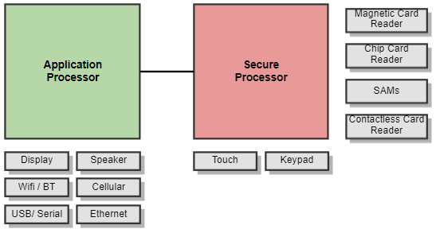
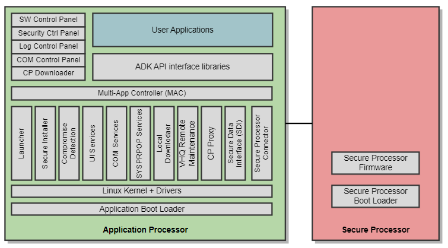
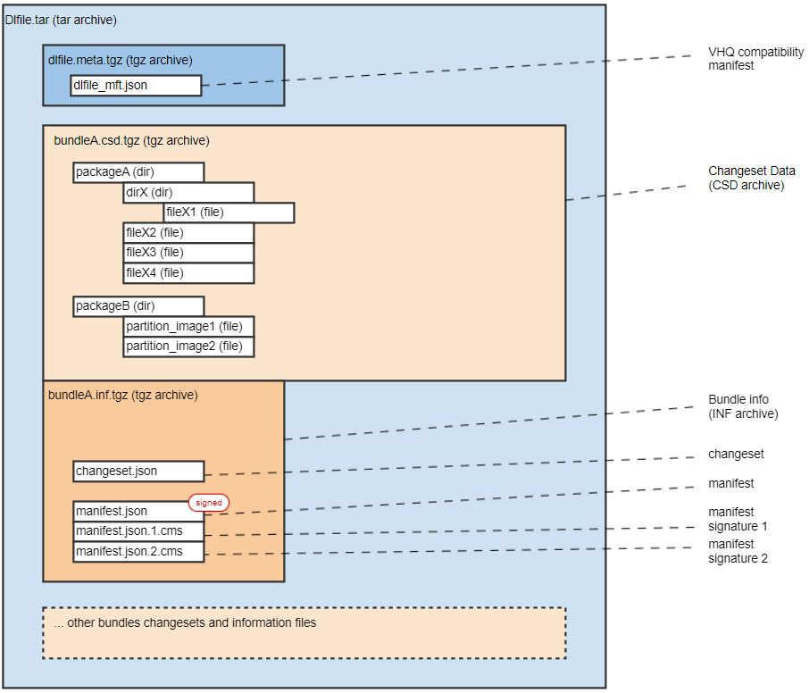

# Introduction 

Verifone Operating System 3 (VOS3) is next generation operating system for Verifone Inc Point-of-sales terminal products.

Like VOS2 on Engage product range, the Operating System is based on Embedded Linux and provides support for Verifone Application Development Kit (ADK). To a large extend the provided APIs are compatibility with earlier Engage product range to enable migration and execution of existing applications on the new VOS3 based platforms.

# Hardware and Supported Devices 

VOS3 is the operating system for the application processor in the system. The application processor drives the display and touch, speaker and communication interfaces such as Wifi, Bluetooth, Cellular modem as well as cabled connections via Ethernet, USB and Serial.

A secure processor is connected with an internal interconnect and handles the touch and physical keypad for secured inputs as well as the card readers for magnetic, contact chip, contactless chip cards and secure access modules (SAM).

VOS3 support is currently provided for following Verifone products:

- P630 pinpad
- M425/M450 multi-lane pinpads
- Ux700AIO and Ux700-ML unattended all-in-one and multi-lane products

VOS3 support for additional upcoming products is planned.

# SW Stack Overview 

The following chart provides an overview on SW components running secure and application processor of the system.

# Secure Processor 

## Secure Processor Boot Loader 

The Secure Processor boot loader support loading and authentication of secure processor firmware.

## Secure Processor Firmware 

The secure processor firmware implements secure functions of the system including:

- system tamper detection and tamper response
- key management supporting secure Verifone VRK key loading
- extended key management functions for master / session key handling
- encryption functions including symmetric 3DES, AES and asymmetric RSA, ECC algorithms
- PIN entry and Sensitive data entry on physical keypad and touch-only devices
- ISO PIN block generation and encryption
- Magstripe Card reading
- ICC Contact Chip Card and Secure Access Module (SAM) reading and L1 processing
- RFID Contactless Chip Card reading and L1 processing
- Secure PIN Transfer from connected companion Verifone Pinpad devices

Some additional functions are provided by the Secure processor, such as:

- non-PIN prompt physical keypad support
- Build-in printer support

# Application Processor 

## Application Boot Loader 

The secure boot mechanism in the application processor runs at system startup and ensures the authenticity and integrity of all firmware and applications. The secure boot in the application processor does not depend on the secure processor. Depending on the underlying HW platform different boot loader concepts are in use.

## Linux Kernel 

The Linux Kernel provides the basic runtime platform for all system services and applications. Applications can use the provided system APIs for typical operations like file input/output, memory management, multi-threading, etc. Although different revisions of the Linux kernel might used on different VOS3 products, the provided Linux APIs are considered stable and typically compatible between different revisions.

Beside this the Linux Operating system provides basic security mechanisms that help to segregate and protect different application resources including files and run process memory. Also some lower-level devices are restricted in access for applications so that applications can use them through provided system services to resource arbitration and integrity when operating with multiple applications on the system.

## Radio Firmware 

Separate firmware is required for Wifi, Bluetooth and cellular networks chips that might be part of the product.

## System Services 

Verifone provides additional system services on top of the Linux Operating System. Typically these services are running in the background and provide services through API libraries to user applications. System Services include:

- **Secure Installation Service (INS)**: verification, authentication and installation of system and application download package.
- **Compromise Detection Daemon (CDD)**: checks system integrity, logs the tamper condition and controls the 24-hour automatic reboot process
- **Communication Daemon (COM)**: communication network setup and control for Cellular, Wifi, Ethernet, Bluetooth, USB and Serial based communication channels
- **Secure Data Interface Service (SDI)**: access to the secure processor functions including card reading and EMVCo card processing, PIN entry, encryption functions, encryption of card holder data
- **System Property Service (SYSPROP)**: global system properties
- **User Interface Services (UI)**: HTML based UI rendering, video playback, printer receipt handling, audio support
- **System Downloader (DL)**: local system downloader
- **Remote Maintenance Agent (VHQ)**: remote system downloader connecting to Verifone VHQ terminal management system
- **Secure Processor Connector**: connection to the secure processor
- **CP Proxy**: Connection proxy for Verifone CP platform applications

## System Applications and Control Panels 

Verifone Platform provides several system applications and control Panels:

- **<a href="pg_mac_users_guide.md#sec_mac_desktop">Multi-Application Desktop (MAC)</a>**: application launcher and desktop/switcher, UI resource handler, system status bar and access to control panels
- **<a href="pg_mac_users_guide.md#sec_mac_mcp">MAC Control Panel</a>**: the application that provides a set of control panels for device administration, configuration, diagnostics:
  - **Communication Control Panel (CCP)**: communication network configuration and setup
  - **SW Control Panel (SWCP)**: local download and installation of SW packages from USB driver or connected host PC
  - **Security Control Panel (SCP)**: initial key loading, local customer key loading, security status and version display
  - **Logging Control Panel (LCP)**: system log-level and output configuration
  - **Power Control Panel**: putting device to sleep, reboot or turn off
  - **Diagnostics Control Panel**: contains system diagnostics tools such as Card read diagnostics, Display diagnostics
  - **System Settings and Date/Time settings panels**: to set display, audio, date, time, timezone etc.
- **CP Downloader**: local download application for Verifone CP platform applications, e.g. alternate payment methods (APM)


the full list of MAC Control Panels is described in the <a href="pg_mac_users_guide.md#sec_mac_mcp">MAC Control Panel</a> chapter.


## Verifone ADK Programming APIs 

The Verifone Application Development Kit (ADK) programming APIs is a set of libraries and header files that extend the basic Linux operating system APIs with specific functions implemented in the secure processor firmware or the system services explained above. The APIs are provided to application programmers as part of the system development kit together with development tools.

Refer to the <a href="pg_all_components.md">ADK Components</a> for detailed description of ADK.

## User Applications 

User applications implement customer front-end and payment schemes on the POS terminal. They make use of the provided platform services and APIs through the Linux APIs or the Verifone ADK programming interfaces. Typically applications are sand-boxed with separate users and home directories to allow for multiple application installation and concurrent execution.

# System Protection 

## Domain Separation 

The dual-processor system architecture enforces the physical and logical separation of secure processor functions and assets (PIN, plaintext keys) that require the highest level of protection. In addition, the operating system running on the application processor is configured to implement privilege separation, so that the security impact of the entire application processor system is minimized if any single component is compromised.

## Secure Boot and System Verification 

All images up to and including the application boot loader image are verified as part of secure boot using cryptographic authentication. The Linux kernel image and initramfs are verified as part of secure boot. User space software, including applications, is verified by the Verifier module using cryptographic authentication. The Compromise Detection Daemon verifies that the device is not tampered and triggers a 24-hour reset at an user programmable time. Reset is also triggered when a tamper is detected when the device is operation. Files and other resources are protected for application separation using a system based on Linux discretionary-access-control (DAC) and capabilities.

## Tamper State 

When a physical tamper is detected or a logical security alert is found, the device gets into a tamper state.

In tamper state the device will boot into the \"Tamper state\" indicate banner, and then provides access to the MAC desktop where the user can access the Security Panel and tamper log that provides details on the specific tamper condition. Upon tamper the internal system key gets deleted and all installed warrantied and customer keys are getting invalidated. Also some security functions will be blocked from further usage.

The tamper condition can only be erased by connecting the device to a trusted Key loading device and reloading the warrantied keys to the system.

# System Lifecycle, Modes and Device States 

Verifone provides system users with following device modes:

- PRODUCTION mode
- APPLICATION DEVELOPMENT mode

Production mode is meant for operational usage of the device. In this mode all security provisions are fully enabled.

Refer to the <a href="pg_system_lifecycle.md">System Lifecycle</a> for more details.

# System Startup Process 

System startup goes through multiple layers including boot loader, system verification before the system launcher starts up the system services and the multi-application controller (MAC).

User applications get started by the system launcher checking authenticity and permissions on behalf of the MAC manifest and the provided application manifest.

If no signing sponsor is found, the system will automatically enable the system downloader.

Once started the MAC desktop can be used for getting access to system control panels.

# File System Partitions 

## A/B Update Concept 

The \"A/B update\" enables seamless updates and relies on having two images during update:

- image A: Active image
- image B: Installation image

Note that images may share a single file system partition for efficiency reasons.

The installation procedure comprises following steps:

- The active image (partition A) is running and installation is done by modifying the Installation image (partition B).
- When the installation is finished, the boot loader is told to switch the boot partition from A to B thus the \"Installation image\" to become the \"Active image\".
- On next reboot, active image is on partition B.
- On next installation, partition A is used for installation of new image.

## System Partitions and File System Layout 

The system flash memory is partitioned into according to the following table:

| Partitions | Contents | Access | Notes |
|----|----|----|----|
| 
aboot, abootbak
 | 
- Boot Loader
 | 
Read-only
 |  |
| 
kernelfs_a, kernelfs_b
 | 
- Linux Kernel and Startup System
 | 
Read-only
 |  |
| 
rootfs
 | 
- System Libraries and System Applications /n - System resources: fonts, images (Not executable) /n - User Application binaries /n - User Application resources: fonts, images (non-executable)
 | 
Read-only
 |  |
| 
sysdata
 | 
- System configuration A/B /n - System Runtime Data /n - System Logs
 | 
Read/Write
 | 
- managed by system
 |
| 
appdata
 | 
- Application configuration A/B /n - Application Logs /n - Application runtime data /n - Download Area
 | 
Read/Write
 |  |
| 
persist
 | 
- Warrantied Keys /n - Keystore /n - Certstore
 | 
Read/Write
 | 
- managed by system /n - not deleted during updates
 |
| 
devinfo
 | 
- Device info /n - Device mode token
 | 
Read-only
 | 
- manged by system
 |

# Application Users and Home Directories 

## Application and System Users 

Similar to VOS1/VOS2, application are running under predefined users named usr\<X\> where \<X\> is 1 to 16 typically. Applications will be executed under these user privileges and use home directories assigned to these users. Application Users will be automatically created upon installation of user signed packages. Besides this the system has pre-defined users for system and root.

| User | Notes |
|----|----|
| 
usr\<X\> (1-16)
 | 
MAC user applications / libraries and RO resources
 |
| 
sys\_\<\>
 | 
System daemons, libraries and applications
 |
| 
root
 | 
root user for system
 |

## User Home Directories 

Each user gets assigned a home directory with the following structure:

| <a href="class_directory.md">Directory</a> | Type | Partition | Location | Notes | A/B support |
|----|----|----|----|----|----|
| 
\~/(home)
 | 
dir
 | 
rootfs
 | 
/home/usr\<X\>
 | 
user home folder
 | 
Y
 |
| 
\~/versioned_data
 | 
symlink
 | 
appdata
 | 
/mnt/appdata/versioned/usr\<X\>
 | 
storage for versioned application data
 | 
Y
 |
| 
\~/flash
 | 
symlink
 | 
appdata
 | 
/mnt/appdata/data/usr\<X\>
 | 
storage for application persistent data
 | 
N
 |
| 
\~/logs
 | 
symlink
 | 
appdata
 | 
/mnt/appdata/logs/usr\<X\>
 | 
application logs
 | 
N
 |

## Application Permissions and Capabilities 

By default applications have limited set of permissions for accessing certain system resources.

A predefined set of Linux capabilities is assigned to application users covering the typical use cases for applications.

Other system resources can be accessed through provided system services.

# Packages and Installation 

VOS3 supports authenticated firmware and application updates. Update artifacts are special package files named DLfiles (tar archives), which contain compressed bundles along with the necessary options and meta-information to perform the installation on the system and digital signatures for authentication. The update mechanism is highly flexible and operates at file level, allowing the efficient distribution of patches or partial system updates.

VOS3 introduces a new package format. Packages are getting signed using the <a href="pg_package_signing.md#subsec_package_signing_fsp">Verifone File Signing Portal</a>.

## Download Files 

Update artifacts (DL-Files) are special package files packaged as tar archives, which contain compressed bundles along necessary options and meta-information to perform the installation on to the system. Bundles contain a digital signature included as a detached CMS file that is used to verify their authenticity. Download files are the container for any VOS3 software update.

These files are actually being downloaded and processed by the system installer.

A download file (DL-File) may contain:

- System software binaries, configuration, resource and data files
- Application software binaries, configuration, resource and data files
- Secure Processor Firmware
- Radio Module Firmware
- VRK Key Loading Packages
- etc.

The DL-File is structured internally as per the following chart:

A secure processor is connected with an internal interconnect and handles the touch and physical keypad for secured inputs as well as the card readers for magnetic, contact chip, contactless chip cards and secure access modules (SAM).

The outer **DL-File** is a TAR archive (not compressed) in order to access its content randomly in-place. As a result, to keep minimal size, all internal files are compressed (except signatures). The order of archives (changeset data and bundle info) within a dlfile is not relevant to the installation. However for ease of manipulation / display, it is recommended to use alphabetic ordering sequence within the dlfile archive.

Multiple **bundles** can be packaged within a DL-File. Each bundle withing the DL-File will consist of:

- ChangeSet Data - compressed TGZ archive
- Bundle Information - compressed TGZ archive

The **ChangeSet Data** archive is sub-structured by packages as grouping mechanism and contains:

- the actual folders and files to be installed

The **Bundle Information** archive contains:

- Changeset JSON file
- Manifest JSON file
- Manifest Signatures in CMS format

**Changeset JSON Files** contains changeset instructions for using the changeset data archive content against the **source** content existing on the device to change it to the **destination** contents. This file is not signed.

**Manifest JSON Files** describe the bundle changeset data and contains digests / hashes for authentication of each and every file in the change set. Two signatures are applied to authenticate the content of the manifest file.


The **<a href="packman_users_guide.md">packman</a>** tool is provided to largely simplify and automate creation of VOS3 DL files, manifests and contained contents.


## Differential Download Files 

Differential download files can be built **without resigning** from two release versions performing a diff between the two.

The DL-File will only contain the differentials and the target manifest and its signatures.

Once downloaded to the system, the system will apply the patches and authenticate and check the resulting binaries based on the provided target manifest and its signatures.

## User Package Types 

Users need to package the applications according to VOS3 installation rules and choose a proper VOS3 package type, one of:

- **user_ro**: read-only application executable, libraries and data
- **font_ro**: read-only user fonts (in addition to system provided fonts)
- **versioned_data**: private application configuration and assets
- **share_users_versioned_data**: shared data between usr\<X\>
- **data**: application runtime data
- **unsigned_data**: unsigned application runtime data
- **user_hook**: user application plugin to modify RW user data or versioned data


Additional VOS3 system package types are provided for system usage only.


## Downloads 

Updates can be installed manually through USB/SD or netloader tool from a connected host PC, or distributed remotely using the terminal management system (e.g., Verifone VHQ) using TLS as security protocol.

## Secure Installer 

VOS3 supports authenticated firmware and application updates. Update artifacts are special package files named DLfiles (tar archives), which contain compressed bundles along with the necessary options and meta-information to perform the installation on the system and digital signatures for authentication. The update mechanism is highly flexible and operates at file level, allowing the efficient distribution of patches or partial system updates.

The update mechanism is handled by the privileged **Installer** component, which is responsible for the following:

- Installing system updates and application software and other files in the read-only file-system (RootFS)
- Installing updates of low-level FW (boot.img including Linux kernel, DTB, and initramfs), application boot loader, radio FW, secure processor updates, etc
- Installation APIs for applications.

The installation mechanism implemented in the current firmware version is non-A/B, which means that there is a single active image that it is overwritten during the installation process. This mechanism will evolve in the future to a fully A/B redundant system, where updates will be performed on the inactive image and the active image will only be changed until the successful booting of the updated image.

## Authentication 

Authenticity checks are performed at the bundle level. The digital signature is applied to the \"manifest.json\" file, which is verified by the Installer so that installation will be performed only if the verification is successful. The manifest file contains the hashes of all items within the bundle, so the verification process includes the check of all these hashes as well, and the installation will fail if any of these checks is not successful. This process is the same one as that carried out by the Verifier on every boot.

The signature is provided in a detached CMS file. Actually, the signing system creates two signatures: manifest.json.1.cms and manifest.json.2.cms. The first is an ECDSA signature (ECDSA P-521) and the second one is a PKCS #1 v1.5 RSA signature. The Installer and Verifier only verify the first one (ECDSA) on the current firmware release.

## Anti-rollback Protection 

The installer includes a rollback protection mechanism that works at the bundle level , for system bundles only, that can be used to prevent downgrades when vulnerability patches have been applied. The anti-rollback protection is based on the use of security counters for the system bundles that require the rollback protection.

## Signing 

All executable files must be signed through the Verifone Signing Portal. The signing portals provide user management, auditability, and dual control for sensitive functions including user management and approver tasks for signing files. Customers shall follow and enrollment process to get the access to the signing portal. Every customer has assigned an unique identifier, the sponsor identifier, and one or a set of signing products that optionally allow separation between their applications.

## Signing Sponsor 

It is important to note that the devices are locked to a specific sponsor on the first software update operation using their sponsor-specific signed code. Therefore, the device will not accept software updates from software signed using different sponsors.

VOS3 supports the same same owner/sponsor concept as on earlier systems. A VOS3 device is owned by a single application sponsor used for signing.

The sponsor signing certificate gets loaded onto a fresh device and locks the device to the given sponsor designated by the certificate. The 8-digit sponsor ID is taken from the serial number of the loaded sponsor signing certificate and stored in the system. Any further installation will check if the signing certificate in the signed application package matches the installed sponsor ID in the device.

Resetting he sponsor ID is only possible with a special sponsor removal package signed with the currently installed sponsor certificate.


The more detailed information about the VOS3 packaging and signing is described in the chapter pg_vos3_packaging_and_signing \"VOS3 Packaging and Signing\".


# Security Functions 

The following table summarizes the PCI-POI relevant security functions:

| Security Function | Support |
|----|----|
| 
PIN Support
 | 
- Online PIN blocks: /n - ISO 9564 Format 0. /n - ISO 9564 Format 1. /n - ISO 9564 Format 3. /n - ISO 9564 Format 4 (AES only). /n - AS 2805 6.2 (based on ISO Format 1, but with a second encryption using a value derived from card data) /n - Offline PIN blocks: /n - ISO 9564 Format 2. /n - The Entered PIN length must be between (and including) 4 to 12 digits.
 |
| 
Key Management - Online PIN Encryption
 | 
- TDEA - DUKPT /n - TDEA - MK/SK /n - AES - DUKPT /n - AES - MK/SK /n - Other acquirer-specific schemes via Verifone Customizable Cryptographic Interface (VCCI) scripting
 |
| 
Offline PIN
 | 
- Plaintext offline Pin for EMV Contact /n - Enciphered offline Pin for EMV CT and CTLS
 |
| 
Key Management - Account Data Encryption
 | 
- TDEA - DUKPT /n - TDEA - MK/SK (3TDEA only) /n - AES - DUKPT /n - AES - MK/SK /n - Format-Preserving Encryption FF2.1
 |
| 
Key Loading
 | 
- Remote loading of keys using Verishield Remote Key Loading protocol (VRK)
 |
| 
Key Types
 | 
- TDEA: 112, 168 /n - AES: 128, 192, 256 /n - RSA-2048
 |
| 
PIN Entry Technology
 | 
- Physical (Hard) Keys: P630 /n - Touch: UX700, V640m, V660p
 |
| 
Prompt Control
 | 
- Acquirer-controlled
 |
| 
SRED
 | 
- ADE /n - VSP/VCL
 |
| 
Other Functions Provided
 | 
- OP (application processor side) /n - Secure Pairing for PIN transfer
 |

## Key Storage 

In general VOS3 is not limited on number of supported keys. Keys are stored in a database and are encrypted with the internal key of the secure processor.

Keys are identified by a unique name across all loaded keys including pre-loaded warrantied keys. The key name is provided as an attribute in the VRK key payload.

The key database gets invalidated upon tamper.

## Key Loading 

VOS3 supports (remote) key loading using Verifone Remote Key (VRK) Loading method.

## Customizations 

The VOS3 system allows for extensions through system provided plug-ins for custom key derivation.

Verifone supports this development together with application writers.

# Connectivity Functions 

[TABLE]

# Card Reading Functions 

[TABLE]

## Support for P2PE 

Unlike VOS1/VOS2, SDI server is no longer an optional component on VOS3, but will always run and manage the interface to the secure processor of the system.

SDI component on VOS3 supports protection of card holder data and is enabled by default. This brings along support for P2PE card holder protection.

Applications need to be aware that **Payment/sensitive data is not provided in clear per default**.

Users can **leverage SDI P2PE certification** if you don\'t use any VOS2 compatibility mode (e.g. libsdiclient with loaded vos3-cards plugin). As soon as you bypass SDI, i.e. loading the vos3-cards plugin or configure general white listing, you can not make use of the SDI P2PE certification.

To support this, the existing ADK client APIs libraries that expose functionality provided by SDI server will now connect to SDI but provide the same level of API known to ADK users on VOS1 and VOS2 as much as possible.

The SDI server will be running as system level process similar to Android deployments and act as gateway to the secure processor functions. SDI will continue to encapsulate card holder data by default.

## Customization 

The VOS3 system allows for extensions through system provided plug-ins for custom card schemes that need processing inside SDI component with access to clear-text card data.

Verifone supports this development together with application writers.

# User Interface Functions 

[TABLE]

# Multi-Application Control (MAC) Functions 

[TABLE]

Refer to the <a href="pg_mac_users_guide.md">ADK-MAC Programmers Guide</a> for the detailed MAC description.
