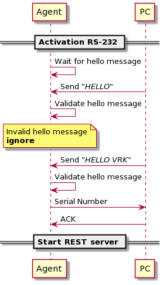
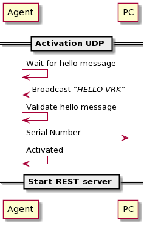
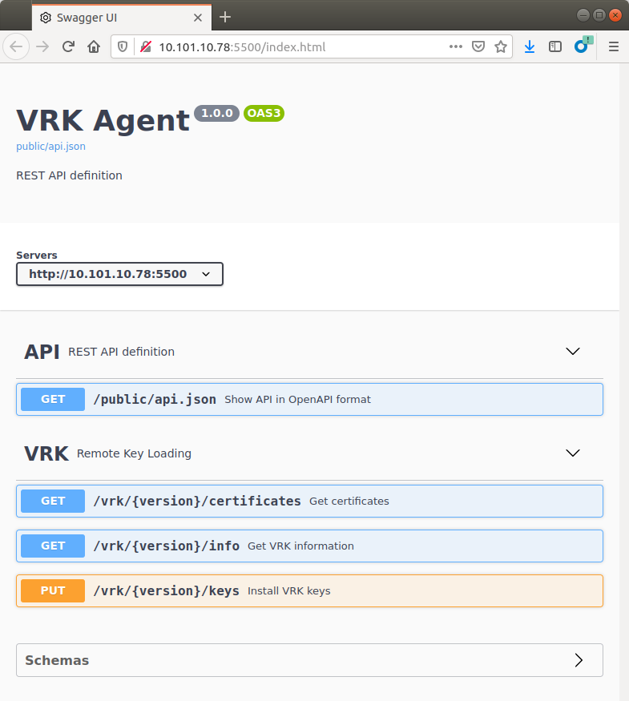
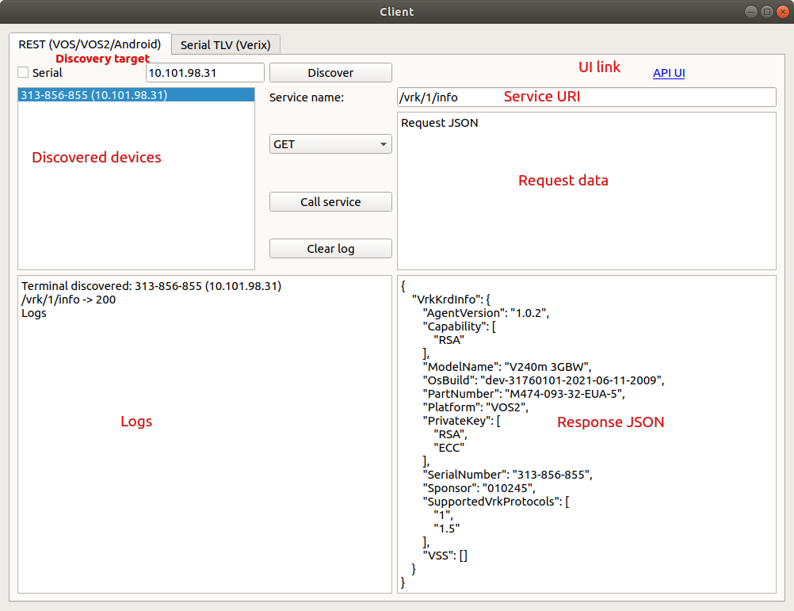
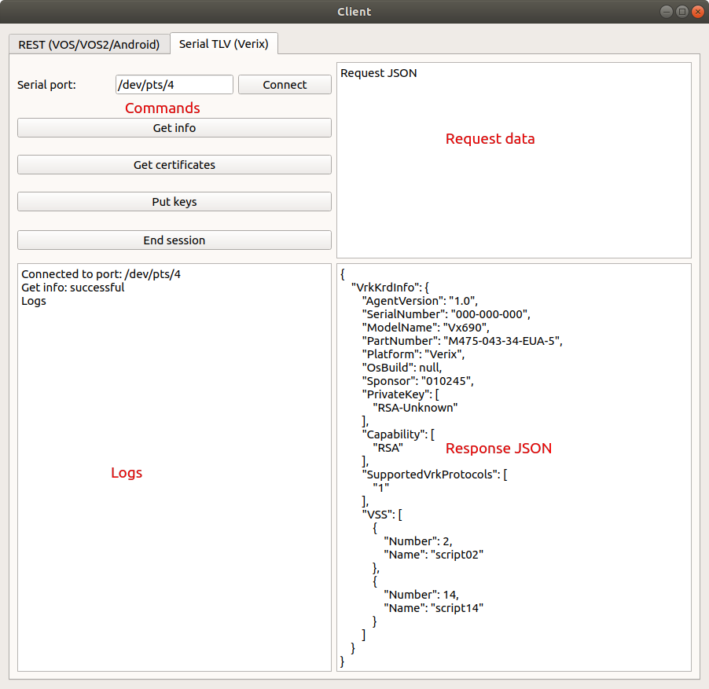
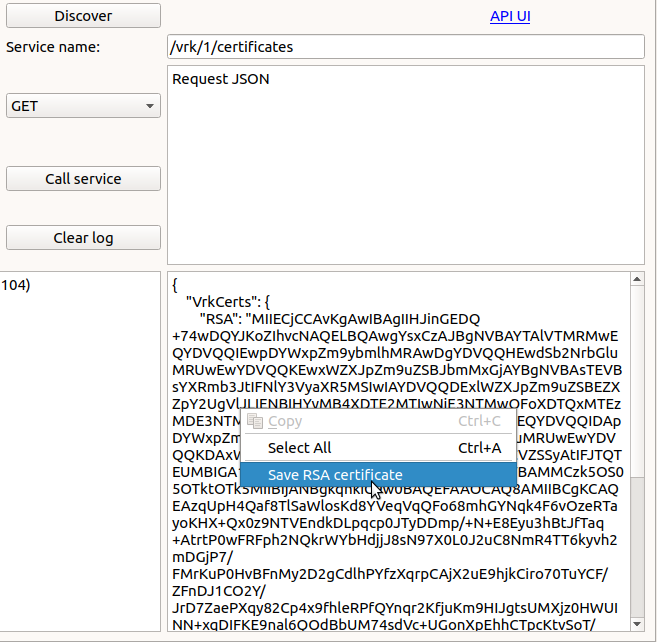
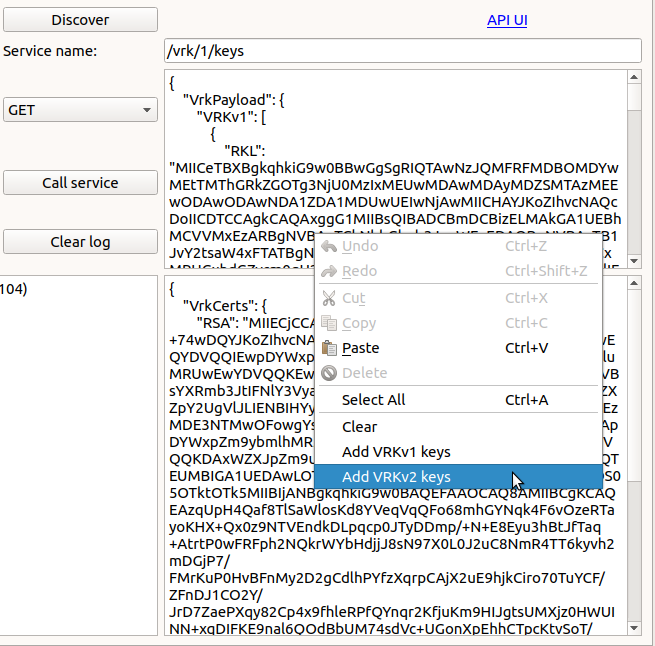
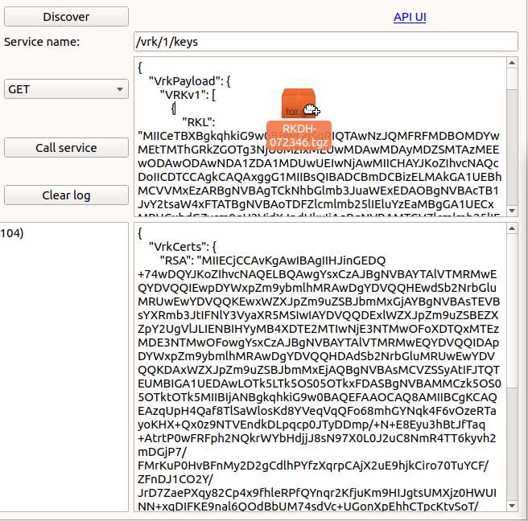

# Preface 

This guide provides information on the usage of the VRK agent and its components.

## Audience 

This document is intended for users who want to use VRK agent and programmers who want to integrate it into their solution.

## Organization 

This guide is organized as follows:

[Introduction](#sec_vrk_introduction). Provides an overview of the VRK agent design and functionality.

[Setup](#sec_vrk_setup). Provides an overview of VRK agent components and configuration parameters.

[Services](#sec_vrk_services). Provides a detailed information on VRK agent services and how to get up to date service list.

[Client Application](#sec_vrk_client). Provides a user guide for client application.

[Troubleshooting](#sec_vrk_troubleshooting). Provides guidance for possible VRK agent issues.

[Glossary](#sec_vrk_appendix). Acronym Definitions.

# Introduction 

VRK agent is a terminal application which provides key injection services to the clients. Terminal services are provided as REST-ful API over HTTP protocol. Also there is a support for serial communication as a fallback solution.

## Design 

VRK agent provides REST services. Each VRK agent service is bound to specific URI (service path), where it resides. VRK agent provides service model definition API (compatible with Swagger), which allows service developer to define service inbound/outbound data models. So, request and response validity is checked at the common (VRK agent) application level. Thus, everything service has to provide is:

- Service entry name
- Service entry path (URI)
- Service entry request type (GET/POST/PUT/DELETE)
- Service entry request model definition
- Service entry response model definition
- Service handler (service function itself)
- *(optional)* examples and descriptions

VRK agent is running under `usr1` user.

## Workflow 

VRK agent workflow consist of following steps:

- [Activation](#subsubsec_vrk_workflow_activation)
- [Service usage](#subsubsec_vrk_workflow_usage)

### Activation 

When VRK agent is started, it does not expose itself to the outer world until it is activated. Until that moment, REST server is not started and services are not available for users. To activate VRK agent, client should send an activation message to the one of the communication channels VRK agent is listening to. Generally, VRK agent is waiting for activation on one of configured serial ports, and on configured UDP port ([Configuration](#subsec_vrk_svc_setup_configuration)).

When VRK agent is activated using serial port, it waits for activation message defined in *activation_phrase* configuration parameter (\"HELLO VRK\" by default). If correct message is received, VRK agent will send device serial number followed by EOT byte (/x04) as an indication of a successful activation: *\"123-456-789/x04\"*. After that VRK agent is waiting for acknowledgement byte (/x06) from the peer to finalize activation procedure.

Similar procedure is used for UDP socket activation.

After VRK agent is activated, it is starting HTTP server on configured TCP *port* (5500 by default).

### Service usage 

When VRK agent is activated, it is responding to service REST calls. VRK agent may return an error in following situations:

- client calls service which doesn\'t exist (not registered)
- request or response validation fails
- service handler reports an error.

## Communication 

VRK agent provides its services over *Ethernet* and *Serial*.
For *Ethernet*, VRK agent is hosting REST server on TCP *port*, which is configured in parameter file (by default: 5500).
For *Serial*, VRK agent is using SLIP protocol to wrap HTTP stream.
The communication channel is determined on VRK agent activation phase: if VRK agent is activated using serial, it will start serial server, and if it is activated using UDP, it will start REST server on configured TCP port.


Ethernet interface is considered as primary, since it is more stable than serial. Serial, on it\'s turn, is considered as a fallback interface.


## Service call 

VRK agent is using REST (HTTP) interface for communication.
Each service call has request and response. In most cases request and response data is in JSON format.

### Request 

Service request may pass data in multiple ways:

- **HTTP headers** HTTP headers are passed as key-value pairs to the handler, so services are allowed to use them.
  
  Mandatory headers are *Content-Type* and *Content-Length*.
  
- **URL variables** If service wants to pass some string variable, it may be passed in URL path:
  <a href="http://192.168.1.100:5500/path/to/service/value1/value2">http://192.168.1.100:5500/path/to/service/value1/value2</a>
  Where \"http://192.168.1.100:5500\" is base URL, \"/path/to/service\" stands for service registered location, \"value1\" and \"value2\" are string variables passed to service.
- **Query variables** URL may also have query parameters:
  <a href="http://192.168.1.100:5500/path/to/service?key1=value1&key2=value2">http://192.168.1.100:5500/path/to/service?key1=value1&key2=value2</a>
  Where key1 and key2 are passed to the service handler.
- **Request body** Service request body should be valid JSON. Also, JSON object should conform with defined service request model, otherwise, service call will not pass validation step and will not reach service handler. For JSON requests, *Content-Type* header must be set to *\"application/json\"*.
  If service expects binary stream (file) in request, it should set *Content-Type* header to *\"application/octet-stream\"*.

### Response 

Service response must conform with service response model, otherwise error message will be sent back to the caller. *Content-Type* header should be set accordingly.

# Setup 

## Install 

VRK agent load bundle consist of following V/OS, V/OS2, V/OS3 packages:

1.  **dl.vrkagent-\<version\>.tgz** VRK agent application and its resources
2.  **dl.vrkagent-rem-\<version\>.tgz** VRK agent removal package

For Android, package is an APK file. Everything that is needed, is shipped inside the installable APK package.

## Configuration 

VRK agent configuration is stored in **vrkagent.ini** configuration file (in resource package of the install bundle), which has following configuration parameters:

- **title** application API title (*default: \"VRK Agent\"*)
- **log_level** logging verbosity (*default: \"error\"*)
- **port** TCP/UDP port for REST server and activation (*default: 5500*)
- **backlog** REST server listener queue size (*default: 5*)
- **serial** Comma-separated list of serial ports to listen (*default: /dev/ttyAMA1*)
- **activation_phrase** Character sequence used for agent activation (*default: HELLO VRK*)

# Services 

To give user an up-to-date documentation, VRK agent is capable to save all its currently registered services in OpenApi (Swagger) schema format. The service API can be retrieved by calling **/public/api.json** service. The output is OpenApi (Swagger) service definition file in JSON format.

## UI 

When VRK agent is activated using Ethernet, it will host a Swagger UI on *<a href="http://terminal_IP:TCP_port">http://terminal_IP:TCP_port</a>*.

Swagger UI is very handy to use as an up-to-date documentation page, where developer can check all the service details, field definitions etc. So, there is no need to keep up to date documentation if it may be generated on demand.

## Service registry 

Service registry is a common tree-like (similar to file system tree) structure, which is shared between all VRK agent services. Services are loaded in non-prioritized order. If service path, is already used by some service, the conflicting one will not be added to the service registry.

## Service list 

VRK agent services are organized in groups (tags). To get the complete list of services, please refer to [UI](#sec_vrk_services_ui) (or **/public/api.json** service definition file). This is the common place to get up-to-date service documentation.

# Client Application 

To test VRK agent services, users and developers may use **Client** application, which is written in Python3. It helps to debug services without external infrastructure.
Client application is shipped in **vrkagent-tools** package. To start client application just unzip the archive and type `python3 client.py` in the console, or make client.py executable, and run it by double-clicking on client.py.

## Client requirements 

- **Python 3**
  - `sudo apt-get install python3-pip`
- **Python QT5**
  - `sudo apt-get install python3-pyqt5`
  - `sudo apt-get install pyqt5-dev-tools`
- **Python serial**
  - `pip3 install pyserial`

## Client usage (VOS, VOS2, VOS3 and Android) 

For VOS, VOS2, VOS3 and Android platforms the **REST** tab is used.


On VOS3 key/payload injection is done via VOS3-installer and is based on uvrk. During installation process VOS3 device reboots and VRK agent can\'t provide correct REST API response. This is due to current VOS3 architecture design.


### Terminal discovery 

The first thing that needs to be done when opening client application, is adding terminals. To do this, user must start terminal discovery.
The simplest way is to press \"Discover\" button, and client will broadcast discovery message to the connected ethernet network. But that could be not that efficient, especially if other people are working with VRK agent in same subnet. So, it is better to specify discovery target address. In that case, discovery message will be sent to specified address only.


Discovery target may contain serial port name (ex.: /dev/ttyUSB0) if \"Serial\" checkbox is set. In this case, discovery will be performed using serial port. Also, that serial port will be used for further service calls.
Of course, **UI page will not be accessible when using serial communication.**


Once terminal is discovered, user may check available services by clicking \"API UI\" link.

### Call service 

To call service:

1.  fill service path in \"Service name\" field;
2.  choose request method (GET/POST/PUT/DELETE);
3.  fill request JSON field by valid object, that is matching called service request model.

Once all required data is filled, press *\"Call service\"* button and check service call response.

## Client usage (Verix) 

For Verix platform client application has **Serial TLV** tab, which provides Verix platform-specific functions.

Verix agent does not support Ethernet communication. It uses its own protocol over serial communication channel. For Verix, first thing user should do is filling the serial port name and pressing **Connect** button. After port is open, Verix agent is waiting for commands in the following order:

1.  **Get info** - get terminal VER-related information
2.  **Get certificates** - get VRK certificates
3.  **Put keys** - install keys (device may restart during that process)
4.  **End session** - removes VRK agent from device


There is a timeout for each injection stage on Verix. If timeout is reached, Verix VRK agent ends the session and removes itself from the device.


## Context menus 

To improve user experience, the following featureas were added to client application:

1.  For **Get certificates** response, there is a context menu (righht click) in a response field, which allows to save RSA/ECC certificate into a local file.
    
2.  Request field has **Add VRKv1 keys** and **Add VRKv2 keys** context buttons to add keys from local archive file (service name must be /vrk/\<version\>/keys).
    
3.  Also, Drag-drop of key files is supported.
    

# Troubleshooting 

- Terminal is discovered only once.
  - If terminal was discovered, VRK agent is starting REST server. So, if client is restarted, terminal address is lost. In this case VRK agent needs to be restarted (terminal restart will do the trick).
- After few minutes of inactivity, service call times out.
  - Due to low-level communication optimization it goes to inactive state when idle (on V/OS and V/OS2). Thus, service call may take longer than usual. If service times out, try to call it once again.

# Glossary 

| Acronym | Definition |
|----|----|
| 
VRK
 | 
Verifone Remote Keys injection
 |
| 
HTTP
 | 
Hyper Text Transfer Protocol
 |
| 
URI
 | 
Uniform Resource Identifier
 |
| 
URL
 | 
Uniform Resource Locator
 |
| 
UDP
 | 
User Datagram Protocol
 |
| 
REST
 | 
Representational State Transfer
 |
