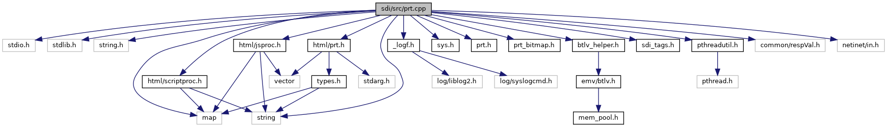

[Functions](#func-members)

`#include <stdio.h>`
`#include <stdlib.h>`
`#include <string.h>`
`#include <map>`
`#include <string>`
`#include "`<a href="__logf_8h_source.md">_logf.h</a>`"`
`#include "`<a href="sys_8h_source.md">sys.h</a>`"`
`#include "`<a href="sdi_2src_2prt_8h_source.md">prt.h</a>`"`
`#include "`<a href="prt__bitmap_8h_source.md">prt_bitmap.h</a>`"`
`#include "`<a href="scriptproc_8h_source.md">html/scriptproc.h</a>`"`
`#include "`<a href="jsproc_8h_source.md">html/jsproc.h</a>`"`
`#include "`<a href="guiprt_2src_2html_2prt_8h_source.md">html/prt.h</a>`"`
`#include "`<a href="btlv__helper_8h_source.md">btlv_helper.h</a>`"`
`#include "`<a href="src_2sdi__tags_8h_source.md">sdi_tags.h</a>`"`
`#include "`<a href="pthreadutil_8h_source.md">pthreadutil.h</a>`"`
`#include "common/respVal.h"`
`#include <netinet/in.h>`

Include dependency graph for prt.cpp:

|  |  |
|----|----|
| Functions |  |
| void  | [PRT_setProperty](#a904f53b3ce4a0dadc1ef14c001508ae3) (unsigned short msgBufSize, unsigned char \*msg, unsigned short msgSize, unsigned short rspBufSize, unsigned char \*rsp, unsigned short \*rspSize) |
| void  | [PRT_getProperty](#ae7dc6e84f128c0990b7261b4576c4e7e) (unsigned short msgBufSize, unsigned char \*msg, unsigned short msgSize, unsigned short rspBufSize, unsigned char \*rsp, unsigned short \*rspSize) |
| void  | [handlePrt](#aa9066d7ba9036f5ae176ad99b7f24c49) (unsigned short msgBufSize, unsigned char \*msg, unsigned long msgSize, unsigned short rspBufSize, unsigned char \*rsp, unsigned short \*rspSize) |

## FunctionDocumentation {#function-documentation}

## handlePrt() 

void handlePrt

Dispatch function to handle different printer commands

**Parameters**

\[in\] **msgBufSize** size of the input message buffer \[in\] **msg** pointer to the input message buffer \[in\] **msgSize** size of the input message \[in\] **rspBufSize** maximum size of the response buffer \[in,out\] **rsp** pointer to the response buffer \[in,out\] **rspSize** pointer to the response message size


<a href="sdi_2src_2prt_8h.md#aa9066d7ba9036f5ae176ad99b7f24c49">handlePrt()</a> is always executed, even if invoked by a side command. Therefore, this function has no return value, see also <a href="main_8cpp.md#a4892e1b795462119ef4d6fa87c860b90">process_side_command()</a>.


## PRT_getProperty() 

void PRT_getProperty

Get Printer Property

**Parameters**

\[in\] **msgBufSize** size of the input message buffer \[in\] **msg** pointer to the input message buffer \[in\] **msgSize** size of the input message \[in\] **rspBufSize** maximum size of the response buffer \[in,out\] **rsp** pointer to the response buffer \[in,out\] **rspSize** pointer to the response message size

## PRT_setProperty() 

void PRT_setProperty

Set Printer Property

**Parameters**

\[in\] **msgBufSize** size of the input message buffer \[in\] **msg** pointer to the input message buffer \[in\] **msgSize** size of the input message \[in\] **rspBufSize** maximum size of the response buffer \[in,out\] **rsp** pointer to the response buffer \[in,out\] **rspSize** pointer to the response message size
