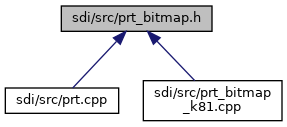

[Functions](#func-members)

This graph shows which files directly or indirectly include this file:

<a href="prt__bitmap_8h_source.md">Go to the source code of this file.</a>

|  |  |
|----|----|
| Functions |  |
| int  | [print_bitmap](#a13743df79aa9cb84acc14fa71a1e8557) (int width, int height, const void \*data) |

## FunctionDocumentation {#function-documentation}

## print_bitmap() 

int print_bitmap

