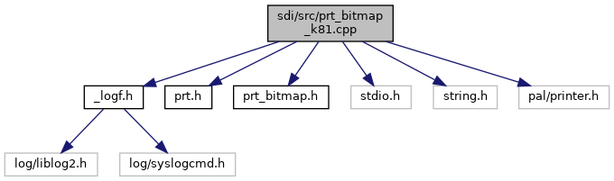

[Enumerations](#enum-members) \| [Functions](#func-members)

`#include "`<a href="__logf_8h_source.md">_logf.h</a>`"`
`#include "`<a href="sdi_2src_2prt_8h_source.md">prt.h</a>`"`
`#include "`<a href="prt__bitmap_8h_source.md">prt_bitmap.h</a>`"`
`#include <stdio.h>`
`#include <string.h>`
`#include "pal/printer.h"`

Include dependency graph for prt_bitmap_k81.cpp:

|  |  |
|----|----|
| Enumerations |  |
| enum   | { [BLOCK_HEIGHT](#ab04a0655cd1e3bcac5e8f48c18df1a57ab5a7e599d7747bab6f97e9f15aa3b729) = 512 } |
| enum   | { [PRINTER_WIDTH](#a385c44f6fb256e5716a2302a5b940388aa24ed1c134538684bb1d59a06f7bde38) = 384, [PRINTER_BYTES_PER_ROW](#a385c44f6fb256e5716a2302a5b940388ac9eb66aa9aba19fda4a028305e3e999b) = (PRINTER_WIDTH + 7) / 8 } |

|  |  |
|----|----|
| Functions |  |
| int  | [print_getStatus](#ac31cf0c86df552cedad0dba2f840d45d) (void) |
| int  | [print_bitmap](#ad23c179a90a8246f38ba424afaf63336) (int width, int height, const void \*vdata) |

## EnumerationType Documentation {#enumeration-type-documentation}

## anonymousenum  {#anonymous-enum}

anonymous enum

| Enumerator             |     |
|------------------------|-----|
| PRINTER_WIDTH          |     |
| PRINTER_BYTES_PER_ROW  |     |

## anonymousenum  {#anonymous-enum-1}

anonymous enum

| Enumerator    |     |
|---------------|-----|
| BLOCK_HEIGHT  |     |

## FunctionDocumentation {#function-documentation}

## print_bitmap() 

int print_bitmap

## print_getStatus() 

int print_getStatus

