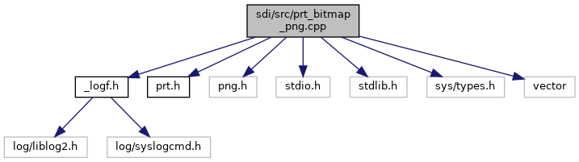

[Macros](#define-members) \| [Enumerations](#enum-members) \| [Functions](#func-members)

`#include "`<a href="__logf_8h_source.md">_logf.h</a>`"`
`#include "`<a href="sdi_2src_2prt_8h_source.md">prt.h</a>`"`
`#include <png.h>`
`#include <stdio.h>`
`#include <stdlib.h>`
`#include <sys/types.h>`
`#include <vector>`

Include dependency graph for prt_bitmap_png.cpp:

|          |                                                              |
|----------|--------------------------------------------------------------|
| Macros   |                                                              |
| #define  | [chmod](#a7811f3e3e3c11885beab366afda6ddfd)(a, b)            |
| #define  | [FILENAME](#a8de29f7c8bbf1a81cc6e71ac602032d3)   \"out.png\" |

|  |  |
|----|----|
| Enumerations |  |
| enum   | [PrintResult](#a7350482c4308f419111c9dd6edb941c0) {   [PRT_OK](#a7350482c4308f419111c9dd6edb941c0af2ad9f75739b523e78df0375ad38a546) = 0, [PRT_BUSY](#a7350482c4308f419111c9dd6edb941c0a8de6b77dc9ed09b215c1999c7e2ba06b) = -1, [PRT_PAPERJAM](#a7350482c4308f419111c9dd6edb941c0a97c7d651a078ac337e76812e2c065ee8) = -2, [PRT_HEADOPEN](#a7350482c4308f419111c9dd6edb941c0ad9c03d6e1ea575ed6f996d945d83a945) = -3,   [PRT_PAPEREND](#a7350482c4308f419111c9dd6edb941c0a800ccbd12989598a0bfd6aa12141776c) = -4, [PRT_OVERHEAT](#a7350482c4308f419111c9dd6edb941c0a429988d9a2c4de64c091c963c53de39f) = -5, [PRT_OVERVOLTAGE](#a7350482c4308f419111c9dd6edb941c0a41e79c4dbe0869fdf53de2ac223a6c55) = -6, [PRT_UNDERVOLTAGE](#a7350482c4308f419111c9dd6edb941c0a4b5ae5a3826908d62ba457037a20f78d) = -7,   [PRT_FAIL](#a7350482c4308f419111c9dd6edb941c0ae4bf0cf9fc2178e4bab2ee0ddfbb1cbc) = -8, [PRT_NO_PRINTER](#a7350482c4308f419111c9dd6edb941c0a7e51c5aeff1f987d71f6fe16119f026a) = -10, <a href="prt__bitmap__vos_8cpp.md#a7350482c4308f419111c9dd6edb941c0af2ad9f75739b523e78df0375ad38a546">PRT_OK</a> = 0, <a href="prt__bitmap__vos_8cpp.md#a7350482c4308f419111c9dd6edb941c0a8de6b77dc9ed09b215c1999c7e2ba06b">PRT_BUSY</a> = -1,   <a href="prt__bitmap__vos_8cpp.md#a7350482c4308f419111c9dd6edb941c0a97c7d651a078ac337e76812e2c065ee8">PRT_PAPERJAM</a> = -2, <a href="prt__bitmap__vos_8cpp.md#a7350482c4308f419111c9dd6edb941c0ad9c03d6e1ea575ed6f996d945d83a945">PRT_HEADOPEN</a> = -3, <a href="prt__bitmap__vos_8cpp.md#a7350482c4308f419111c9dd6edb941c0a800ccbd12989598a0bfd6aa12141776c">PRT_PAPEREND</a> = -4, <a href="prt__bitmap__vos_8cpp.md#a7350482c4308f419111c9dd6edb941c0a429988d9a2c4de64c091c963c53de39f">PRT_OVERHEAT</a> = -5,   <a href="prt__bitmap__vos_8cpp.md#a7350482c4308f419111c9dd6edb941c0a41e79c4dbe0869fdf53de2ac223a6c55">PRT_OVERVOLTAGE</a> = -6, <a href="prt__bitmap__vos_8cpp.md#a7350482c4308f419111c9dd6edb941c0a4b5ae5a3826908d62ba457037a20f78d">PRT_UNDERVOLTAGE</a> = -7, <a href="prt__bitmap__vos_8cpp.md#a7350482c4308f419111c9dd6edb941c0ae4bf0cf9fc2178e4bab2ee0ddfbb1cbc">PRT_FAIL</a> = -8, <a href="prt__bitmap__vos_8cpp.md#a7350482c4308f419111c9dd6edb941c0a7e51c5aeff1f987d71f6fe16119f026a">PRT_NO_PRINTER</a> = -10 } |

|  |  |
|----|----|
| Functions |  |
| int  | [print_bitmap](#ad23c179a90a8246f38ba424afaf63336) (int width, int height, const void \*vdata) |

## MacroDefinition Documentation {#macro-definition-documentation}

## chmod 

#define chmod

## FILENAME 

#define FILENAME   \"out.png\"

## EnumerationType Documentation {#enumeration-type-documentation}

## PrintResult 

enum [PrintResult](#a7350482c4308f419111c9dd6edb941c0)

| Enumerator |  |
|----|----|
| PRT_OK  | 
no error
 |
| PRT_BUSY  | 
Printing in progress
 |
| PRT_PAPERJAM  | 
Paper jam
 |
| PRT_HEADOPEN  | 
Head open
 |
| PRT_PAPEREND  | 
Paper end
 |
| PRT_OVERHEAT  | 
Head too hot
 |
| PRT_OVERVOLTAGE  | 
Head over voltage
 |
| PRT_UNDERVOLTAGE  | 
Head under voltage
 |
| PRT_FAIL  | 
function failed (generic error)
 |
| PRT_NO_PRINTER  | 
no printer available
 |
| PRT_OK  | 
no error
 |
| PRT_BUSY  | 
Printing in progress
 |
| PRT_PAPERJAM  | 
Paper jam
 |
| PRT_HEADOPEN  | 
Head open
 |
| PRT_PAPEREND  | 
Paper end
 |
| PRT_OVERHEAT  | 
Head too hot
 |
| PRT_OVERVOLTAGE  | 
Head over voltage
 |
| PRT_UNDERVOLTAGE  | 
Head under voltage
 |
| PRT_FAIL  | 
function failed (generic error)
 |
| PRT_NO_PRINTER  | 
no printer available
 |

## FunctionDocumentation {#function-documentation}

## print_bitmap() 

int print_bitmap

