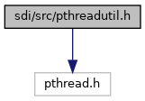
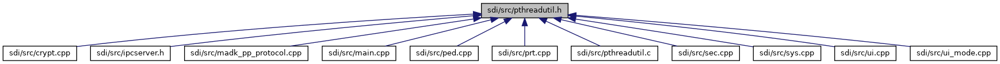

[Functions](#func-members)

`#include <pthread.h>`

Include dependency graph for pthreadutil.h:

This graph shows which files directly or indirectly include this file:

<a href="pthreadutil_8h_source.md">Go to the source code of this file.</a>

|  |  |
|----|----|
| Functions |  |
| int  | [pthread_create_detached](#a883e5b0e61c35298edeb0ad3bb133bd3) (pthread_t \*thread, void \*(\*start_routine)(void \*), void \*arg) |

## FunctionDocumentation {#function-documentation}

## pthread_create_detached() 

int pthread_create_detached

