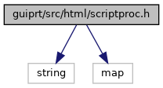
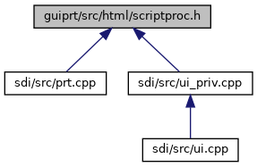

[Namespaces](#namespaces) \| [Macros](#define-members) \| [Typedefs](#typedef-members) \| [Functions](#func-members)

`#include <string>`
`#include <map>`

Include dependency graph for scriptproc.h:

This graph shows which files directly or indirectly include this file:

<a href="scriptproc_8h_source.md">Go to the source code of this file.</a>

|            |                                                    |
|------------|----------------------------------------------------|
| Namespaces |                                                    |
|            | <a href="namespacevfihtml.md">vfihtml</a> |

|          |                                               |
|----------|-----------------------------------------------|
| Macros   |                                               |
| #define  | [DllSpec](#ad7c2e1cb200073ed64c64285a5f37231) |

|  |  |
|----|----|
| Typedefs |  |
| typedef bool(\*  | <a href="namespacevfihtml.md#a3cbd3cd62b8b160ff8fd641acf6858e2">ScriptProcessor</a>) (void \*data, const std::string &script, std::map\< std::string, std::string \> &<a href="_web_service_wrappers_8c.md#a6e248376c0290338633d8137822eb209">value</a>, std::string &out, std::string &err, std::string &exitcode) |
| typedef bool(\*  | <a href="namespacevfihtml.md#ab0bf156adfcbf468dc8caedf9fc0c747">ScriptProcessorExt</a>) (void \*data, const std::string &script, std::map\< std::string, std::string \> &<a href="_web_service_wrappers_8c.md#a6e248376c0290338633d8137822eb209">value</a>, std::string &out, std::string &err, std::string &exitcode, ExtContext \*context) |

|  |  |
|----|----|
| Functions |  |
| <a href="sound_8h.md#ad7c2e1cb200073ed64c64285a5f37231">DllSpec</a> void  | <a href="namespacevfihtml.md#a67c7add0a3e05b7854d310b3678b9f41">htmlSetScriptProcessor</a> (const char \*name, ScriptProcessor proc, void \*data) |
| <a href="sound_8h.md#ad7c2e1cb200073ed64c64285a5f37231">DllSpec</a> void  | <a href="namespacevfihtml.md#a3635a881d0a3f4ac7e347a6990bc9021">htmlSetScriptProcessor</a> (const char \*name, ScriptProcessorExt proc, void \*data=0) |

## MacroDefinition Documentation {#macro-definition-documentation}

## DllSpec 

#define DllSpec

