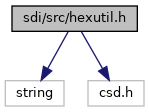
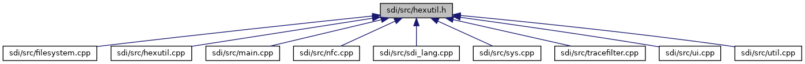

[Namespaces](#namespaces) \| [Functions](#func-members)

`#include <string>`
`#include "csd.h"`

Include dependency graph for hexutil.h:

This graph shows which files directly or indirectly include this file:

<a href="sdi_2src_2hexutil_8h_source.md">Go to the source code of this file.</a>

|            |                                            |
|------------|--------------------------------------------|
| Namespaces |                                            |
|            | <a href="namespacesdi.md">sdi</a> |

|  |  |
|----|----|
| Functions |  |
| int  | <a href="namespacesdi.md#aa7fda2cc5788cacfc2e267534b6391cd">hextobin</a> (unsigned char \*dst, const unsigned char \*src, int srclen) |
| int  | <a href="namespacesdi.md#a62d4f9a462bed89ebf473e377b7a24ad">hextobin</a> (csd::csd_data &dst, const unsigned char \*src, int srclen) |
| void  | <a href="namespacesdi.md#adb43cc15cc5e467d2a32db177abd95ac">bintohex</a> (unsigned char \*dst, const unsigned char \*src, int srclen) |
| void  | <a href="namespacesdi.md#a451fd8059d3954678d5ad223175cb078">bintohexstring</a> (char \*dst, const unsigned char \*src, int srclen) |
| void  | <a href="namespacesdi.md#a5e63c92e42e60c105bf33ec9734ccc6f">bintohexstring</a> (std::string &dst, const unsigned char \*src, int srclen) |
| void  | <a href="namespacesdi.md#a36bdbba7b034d5eca9058f51ae40bfd1">bintohexstring</a> (csd::csd_string &dst, const unsigned char \*src, int srclen) |
| void  | <a href="namespacesdi.md#a8da4aa04db98292e03fb0c769642ac4e">bintotrack2</a> (unsigned char \*dst, const unsigned char \*src, int srclen) |
| void  | <a href="namespacesdi.md#a8836d3db59a0107a55d45c6726967973">bintotrack2string</a> (csd::csd_string &dst, const unsigned char \*src, int srclen) |
| int  | <a href="namespacesdi.md#ad7b26a90792d2c2e5486941ed7b4dd7c">track2tobin</a> (unsigned char \*dst, const unsigned char \*src, int srclen) |
| int  | <a href="namespacesdi.md#ae42d999b07e327fe3aea4bfe156cef0a">track2tobin</a> (csd::csd_data &dst, const unsigned char \*src, int srclen) |
