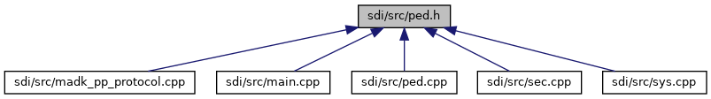

[Macros](#define-members) \| [Functions](#func-members)

This graph shows which files directly or indirectly include this file:

<a href="sdi_2src_2ped_8h_source.md">Go to the source code of this file.</a>

|  |  |
|----|----|
| Macros |  |
| #define  | [CLA_PED](#aa03c0db7c55eb8224cb835994abb63a8)   0x22 |
|   | Class for PED commands. [More\...](#aa03c0db7c55eb8224cb835994abb63a8)  |
| #define  | [INS_PED_ENABLE](#a9b71c79dc791154fa99efeea834f422a)   0x00 |
|   | Enable or Disable PED. [More\...](#a9b71c79dc791154fa99efeea834f422a)  |
| #define  | [INS_PED_GET_PIN](#a1bf5012e2bf73c386f1f1d5f00785e26)   0x01 |
|   | Request PIN from user. [More\...](#a1bf5012e2bf73c386f1f1d5f00785e26)  |
| #define  | [INS_SET_PIN_TIMEOUT](#a9c621b8bdbccfbd6befc23e34ef092e6)   0x02 |
|   | Configure timeout for PIN entry. [More\...](#a9c621b8bdbccfbd6befc23e34ef092e6)  |
| #define  | [INS_PED_START_PIN](#a2890ca3e6881559d9c626f6d7bb43fb0)   0x03 |
|   | Start PIN entry (polling interface) [More\...](#a2890ca3e6881559d9c626f6d7bb43fb0)  |
| #define  | [INS_PED_POLL_PIN](#ad3090b4a2e335c9fc78d6830e1d1f709)   0x04 |
|   | Poll PIN entry status (polling interface) [More\...](#ad3090b4a2e335c9fc78d6830e1d1f709)  |
| #define  | [INS_PED_STOP_PIN](#a84be289ebb7f0e7e1b153ea9642a47c0)   0x05 |
|   | Stop PIN entry (polling interface) [More\...](#a84be289ebb7f0e7e1b153ea9642a47c0)  |
| #define  | [INS_SET_PIN_INPUT_PARAM](#aee0d4385ec8cb7c04b26fc75879146c1)   0x06 |
|   | Configure PIN input parameter. [More\...](#aee0d4385ec8cb7c04b26fc75879146c1)  |

|  |  |
|----|----|
| Functions |  |
| bool  | [handlePedCmd](#a576b866745c7f8c53122bbb8b23bfed8) (unsigned short msgBufSize, unsigned char \*msg, unsigned short msgSize, unsigned short rspBufSize, unsigned char \*rsp, unsigned short \*rspSize) |
| bool  | [pedSetExtButton](#aa0c8c216f26262d3bb93de55d10086e4) (void) |
| void  | [pedReset](#a2cdc4bd6bf4da35073f47249ee9357c2) (void \*handle) |

## MacroDefinition Documentation {#macro-definition-documentation}

## CLA_PED 

#define CLA_PED   0x22

Class for PED commands.

## INS_PED_ENABLE 

#define INS_PED_ENABLE   0x00

Enable or Disable PED.

## INS_PED_GET_PIN 

#define INS_PED_GET_PIN   0x01

Request PIN from user.

## INS_PED_POLL_PIN 

#define INS_PED_POLL_PIN   0x04

Poll PIN entry status (polling interface)

## INS_PED_START_PIN 

#define INS_PED_START_PIN   0x03

Start PIN entry (polling interface)

## INS_PED_STOP_PIN 

#define INS_PED_STOP_PIN   0x05

Stop PIN entry (polling interface)

## INS_SET_PIN_INPUT_PARAM 

#define INS_SET_PIN_INPUT_PARAM   0x06

Configure PIN input parameter.

## INS_SET_PIN_TIMEOUT 

#define INS_SET_PIN_TIMEOUT   0x02

Configure timeout for PIN entry.

## FunctionDocumentation {#function-documentation}

## handlePedCmd() 

bool handlePedCmd

Dispatch function to handle different PED commands

**Parameters**

\[in\] **msgBufSize** size of the input message buffer \[in\] **msg** pointer to the input message buffer \[in\] **msgSize** size of the input message \[in\] **rspBufSize** maximum size of the response buffer \[in,out\] **rsp** pointer to the response buffer \[in,out\] **rspSize** pointer to the response message size

### Returns

true if command was executed and rsp contains a response, false in case invocation is not allowed by a side command.

## pedReset() 

void pedReset

Function invoked by a thread at connection termination to abort the PIN entry. SDI server supports multiple connections, which can use the PED interface. With activation of the PED interface with command 22-03 (Start PIN entry) on one connection, the interface is locked for other connections. If a connection terminates, which optains the PED lock, the interface would be unaccessable for other connections. Therfore, this function will abort the PIN entry and unlock the PED interface, if the connection disturbes so that it can be used by other connection again. Please note that this function works for a PIN Entry started by 22-03 (Start PIN entry). A PIN entry started with 22-01 (Get PIN) is not considered, but the PED lock is released after the user hast finished the PIN entry.

**Parameters**

\[in\] **handle** handle of the terminating connection

## pedSetExtButton() 

bool pedSetExtButton

Inform the VAULT about the Confirm button was pressed if PIN polling is active and Navigator Mode 2 is set

### Returns

true if PIN polling is active and Navigator Mode 2 set, else false
