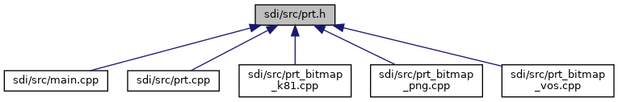

[Macros](#define-members) \| [Functions](#func-members)

This graph shows which files directly or indirectly include this file:

<a href="sdi_2src_2prt_8h_source.md">Go to the source code of this file.</a>

|  |  |
|----|----|
| Macros |  |
| #define  | [CLA_PRT](#a0988cf1c2b9639c4d3a5f95801814fac)   0x25 |
|   | Class for PRT commands. [More\...](#a0988cf1c2b9639c4d3a5f95801814fac)  |
| #define  | [INS_PRT_SET_PROPERTY](#af5938d17e2b26fc9fcaba16fb9ef95c7)   0x00 |
|   | prtSetProperty command [More\...](#af5938d17e2b26fc9fcaba16fb9ef95c7)  |
| #define  | [INS_PRT_GET_PROPERTY](#a471aa813d45d44527c570233554d2937)   0x01 |
|   | prtGetProperty command [More\...](#a471aa813d45d44527c570233554d2937)  |
| #define  | [INS_PRT_HTML](#a6bb76f72cb93f6356cbfc75728ca8d22)   0x02 |
|   | prtHTML command [More\...](#a6bb76f72cb93f6356cbfc75728ca8d22)  |
| #define  | [INS_PRT_BITMAP](#aba8c8536bf160f5c2cec53e7709e9fb8)   0x04 |

|  |  |
|----|----|
| Functions |  |
| void  | [handlePrt](#aa9066d7ba9036f5ae176ad99b7f24c49) (unsigned short msgBufSize, unsigned char \*msg, unsigned long msgSize, unsigned short rspBufSize, unsigned char \*rsp, unsigned short \*rspSize) |
| int  | [print_getStatus](#a47bd7ed2e6b0486a15adcfd3d1b58457) (int \*valueInt) |

## MacroDefinition Documentation {#macro-definition-documentation}

## CLA_PRT 

#define CLA_PRT   0x25

Class for PRT commands.

## INS_PRT_BITMAP 

#define INS_PRT_BITMAP   0x04

## INS_PRT_GET_PROPERTY 

#define INS_PRT_GET_PROPERTY   0x01

prtGetProperty command

## INS_PRT_HTML 

#define INS_PRT_HTML   0x02

prtHTML command

## INS_PRT_SET_PROPERTY 

#define INS_PRT_SET_PROPERTY   0x00

prtSetProperty command

## FunctionDocumentation {#function-documentation}

## handlePrt() 

void handlePrt

Dispatch function to handle different printer commands

**Parameters**

\[in\] **msgBufSize** size of the input message buffer \[in\] **msg** pointer to the input message buffer \[in\] **msgSize** size of the input message \[in\] **rspBufSize** maximum size of the response buffer \[in,out\] **rsp** pointer to the response buffer \[in,out\] **rspSize** pointer to the response message size


[handlePrt()](#aa9066d7ba9036f5ae176ad99b7f24c49) is always executed, even if invoked by a side command. Therefore, this function has no return value, see also <a href="main_8cpp.md#a4892e1b795462119ef4d6fa87c860b90">process_side_command()</a>.


## print_getStatus() 

int print_getStatus

