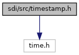
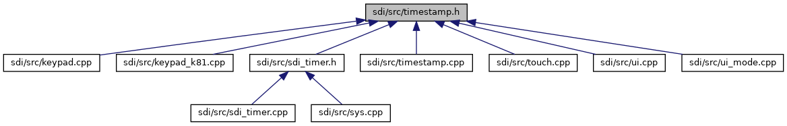

[Data Structures](#nested-classes) \| [Namespaces](#namespaces) \| [Functions](#func-members)

`#include <time.h>`

Include dependency graph for timestamp.h:

This graph shows which files directly or indirectly include this file:

<a href="sdi_2src_2timestamp_8h_source.md">Go to the source code of this file.</a>

|  |  |
|----|----|
| Data Structures |  |
| class   | <a href="classsdi_1_1_time_stamp.md">TimeStamp</a> |
| class   | <a href="classsdi_1_1_time_stamp.md#classsdi_1_1_time_stamp_1_1_unit___m_s">TimeStamp::Unit_MS</a> |
| class   | <a href="classsdi_1_1_time_stamp.md#classsdi_1_1_time_stamp_1_1_unit___s">TimeStamp::Unit_S</a> |

|            |                                            |
|------------|--------------------------------------------|
| Namespaces |                                            |
|            | <a href="namespacesdi.md">sdi</a> |

|  |  |
|----|----|
| Functions |  |
| TimeStamp  | <a href="namespacesdi.md#afc5ba7603df562e3057600548a77ae19">operator+</a> (const TimeStamp &a, const TimeStamp &b) |
| TimeStamp  | <a href="namespacesdi.md#adf8b527bef1f0f4e433ad88ccae5677c">operator-</a> (const TimeStamp &a, const TimeStamp &b) |
| bool  | <a href="namespacesdi.md#afde4ee00bda9f6a2e47be84d747b0aa6">operator==</a> (const TimeStamp &a, const TimeStamp &b) |
| bool  | <a href="namespacesdi.md#a72b696981a0d47c3988c5d8a3b21771d">operator!=</a> (const TimeStamp &a, const TimeStamp &b) |
| bool  | <a href="namespacesdi.md#a1826855f2717a1989f0acc9667add7f2">operator<</a> (const TimeStamp &a, const TimeStamp &b) |
| bool  | <a href="namespacesdi.md#ade8cda000c21abf3bba19952338f1ccc">operator<=</a> (const TimeStamp &a, const TimeStamp &b) |
| bool  | <a href="namespacesdi.md#adbca0ff6b3aab2718e627c9d0936792d">operator></a> (const TimeStamp &a, const TimeStamp &b) |
| bool  | <a href="namespacesdi.md#a1596310f42ff001cd38ed5cdc9c574ff">operator>=</a> (const TimeStamp &a, const TimeStamp &b) |
| TimeStamp  | <a href="namespacesdi.md#aa4cf2ca6912803ebf18f6a1ef14d6750">operator*</a> (int t, TimeStamp::Unit_MS) |
| TimeStamp  | <a href="namespacesdi.md#af58670d8fac6034c267d0445a833cd21">operator*</a> (int t, TimeStamp::Unit_S) |

## DetailedDescription {#detailed-description}

time utilities

------------------------------------------------------------------------

## DataStructure Documentation {#data-structure-documentation}

## sdi::TimeStamp::Unit_MS 

class sdi::TimeStamp::Unit_MS

helper class for unit conversion

## sdi::TimeStamp::Unit_S 

class sdi::TimeStamp::Unit_S

helper class for unit conversion
