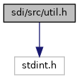
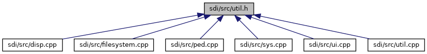

[Data Structures](#nested-classes) \| [Functions](#func-members) \| [Variables](#var-members)

`#include <stdint.h>`

Include dependency graph for util.h:



This graph shows which files directly or indirectly include this file:



<a href="sdi_2src_2util_8h_source.md">Go to the source code of this file.</a>

|                 |                                        |
|-----------------|----------------------------------------|
| Data Structures |                                        |
| struct          | [CurrMapTable](#struct_curr_map_table) |

|  |  |
|----|----|
| Functions |  |
| int  | [verifyDate](#ab29fd00cd12931bf70c259be8569ed35) (const char \*date, const char \*format) |
| const char \*  | [getCurrencyName](#af8e537859d3bd237614e1f416351cdbe) (unsigned short currency) |
| short  | [getCurrencyExponent](#a747e0b130dd6c037d12411a173843e0d) (unsigned short currency) |
| int  | [bcdValid](#a5d38a0b4222458e86fffe40d3101ff4a) (const unsigned char \*a, unsigned size) |

|  |  |
|----|----|
| Variables |  |
| const struct [CurrMapTable](#struct_curr_map_table)  | [currSymbolTable](#a8f999ab66c56e840877112a9dd5be0f4) \[\] |
| const struct [CurrMapTable](#struct_curr_map_table)  | [currAbbreviationTable](#adbaa4cf701141d68e1276c73ed955aa3) \[\] |

------------------------------------------------------------------------

## DataStructure Documentation {#data-structure-documentation}

## CurrMapTable <a href="#struct_curr_map_table" id="struct_curr_map_table"></a>

<p>struct CurrMapTable</p>

| Data Fields    |          |     |
|----------------|----------|-----|
| unsigned short | code     |     |
| short          | exponent |     |
| const char \*  | name     |     |

## FunctionDocumentation {#function-documentation}

## bcdValid() <a href="#a5d38a0b4222458e86fffe40d3101ff4a" id="a5d38a0b4222458e86fffe40d3101ff4a"></a>

<p>int bcdValid</p>

check if data is a valid BCD number

**Parameters**

\[in\] **a** pointer to data \[in\] **size** size of the buffer data points to

### Returns

1 if it is a valid BCD number, 0 else

## getCurrencyExponent() <a href="#a747e0b130dd6c037d12411a173843e0d" id="a747e0b130dd6c037d12411a173843e0d"></a>

<p>short getCurrencyExponent</p>

returns the currency exponent for the corresponding currency code. If the currency code is unknown or not supported, -1 returned.

**Parameters**

\[in\] **currency** currency code

### Returns

currency exponent or -1, if code is unknown

## getCurrencyName() <a href="#af8e537859d3bd237614e1f416351cdbe" id="af8e537859d3bd237614e1f416351cdbe"></a>

<p>const char\* getCurrencyName</p>

returns the currency name for the corresponding currency code. If the currency code is unknown or not supported, an empty string is returned.

**Parameters**

\[in\] **currency** currency code

### Returns

currency name as C-string or an empty string, if code is unknown

## verifyDate() <a href="#ab29fd00cd12931bf70c259be8569ed35" id="ab29fd00cd12931bf70c259be8569ed35"></a>

<p>int verifyDate</p>

Verify date

**Parameters**

\[in\] **date** Pointer to date buffer \[in\] **format** Pointer to format buffer

### Returns

1 if date is valid, else 0



Two-digit year values are interpreted as 2000\...2099 Four-digit year values must be at least 1776 (the date of the global introduction of the Gregorian calendar)


## VariableDocumentation {#variable-documentation}

## currAbbreviationTable <a href="#adbaa4cf701141d68e1276c73ed955aa3" id="adbaa4cf701141d68e1276c73ed955aa3"></a>

<p>const struct [CurrMapTable](#struct_curr_map_table) currAbbreviationTable\[\]</p>

## currSymbolTable <a href="#a8f999ab66c56e840877112a9dd5be0f4" id="a8f999ab66c56e840877112a9dd5be0f4"></a>

<p>const struct [CurrMapTable](#struct_curr_map_table) currSymbolTable\[\]</p>

**Initial value:**

``` cpp
=
{
  
  {0x0376, "\xE2\x82\xAA", 2},
  {0x0388, "JM$", 2},
  {0x0826, "\xC2\xA3", 2},
  {0x0840, "\x24", 2},
  {0x0978, "\xE2\x82\xAC", 2}
}
```
