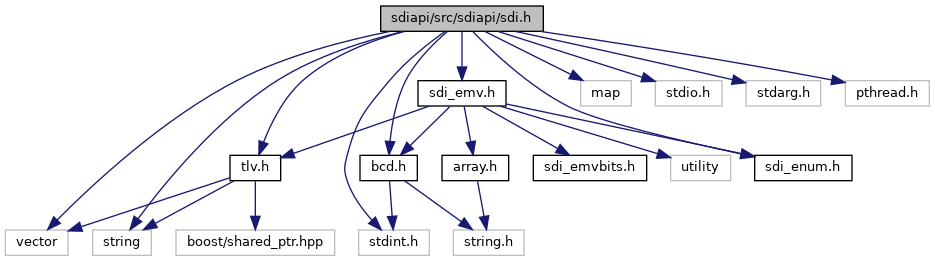

[Data Structures](#nested-classes) \| [Namespaces](#namespaces) \| [Macros](#define-members)

`#include <vector>`
`#include <map>`
`#include <string>`
`#include <stdio.h>`
`#include <stdarg.h>`
`#include <pthread.h>`
`#include <stdint.h>`
`#include "`<a href="tlv_8h_source.md">tlv.h</a>`"`
`#include "`<a href="bcd_8h_source.md">bcd.h</a>`"`
`#include "`<a href="sdiapi_2src_2sdiapi_2sdi__emv_8h_source.md">sdi_emv.h</a>`"`
`#include "`<a href="sdi__enum_8h_source.md">sdi_enum.h</a>`"`

Include dependency graph for sdi.h:

<a href="sdi_8h_source.md">Go to the source code of this file.</a>

|  |  |
|----|----|
| Data Structures |  |
| class   | <a href="classvfisdi_1_1_s_d_i_client.md">SDIClient</a> |
| struct   | <a href="classvfisdi_1_1_s_d_i_client.md#structvfisdi_1_1_s_d_i_client_1_1_touch_button">SDIClient::TouchButton</a> |
| struct   | <a href="classvfisdi_1_1_s_d_i_client.md#structvfisdi_1_1_s_d_i_client_1_1_c_a_p_key_info">SDIClient::CAPKeyInfo</a> |
| struct   | <a href="group__sdisystem.md#structvfisdi_1_1_s_d_i_client_1_1_component_version">SDIClient::ComponentVersion</a> |
| struct   | <a href="group__sdicrd.md#structvfisdi_1_1_s_d_i_client_1_1_t_e_c_options">SDIClient::TECOptions</a> |
| struct   | <a href="group__sdicrd.md#structvfisdi_1_1_s_d_i_client_1_1_plugin_result">SDIClient::PluginResult</a> |
| struct   | <a href="group__sdidata.md#structvfisdi_1_1_s_d_i_client_1_1_place_holder">SDIClient::PlaceHolder</a> |
| struct   | <a href="group__sdidata.md#structvfisdi_1_1_s_d_i_client_1_1_matching">SDIClient::Matching</a> |
| struct   | <a href="group__sdiemvct.md#structvfisdi_1_1_s_d_i_client_1_1_c_t_candidate_data">SDIClient::CTCandidateData</a> |
| struct   | <a href="group__sdiemvct.md#structvfisdi_1_1_s_d_i_client_1_1_c_t_candidate">SDIClient::CTCandidate</a> |
| struct   | <a href="group__sdiemvct.md#structvfisdi_1_1_s_d_i_client_1_1_additional_card_tag">SDIClient::AdditionalCardTag</a> |
| struct   | <a href="group__sdiemvctls.md#structvfisdi_1_1_s_d_i_client_1_1_c_t_l_s_candidate_data">SDIClient::CTLSCandidateData</a> |
| struct   | <a href="group__sdinfc.md#structvfisdi_1_1_s_d_i_client_1_1_n_f_c_card_count">SDIClient::NFCCardCount</a> |
| struct   | <a href="group__sdinfc.md#structvfisdi_1_1_s_d_i_client_1_1_n_f_c_card">SDIClient::NFCCard</a> |
| struct   | <a href="group__sdinfc.md#structvfisdi_1_1_s_d_i_client_1_1_n_f_c_card_ext">SDIClient::NFCCardExt</a> |

|            |                                                  |
|------------|--------------------------------------------------|
| Namespaces |                                                  |
|            | <a href="namespacevfiipc.md">vfiipc</a> |
|            | <a href="namespacevfisdi.md">vfisdi</a> |

|          |                                               |
|----------|-----------------------------------------------|
| Macros   |                                               |
| #define  | [DllSpec](#ad7c2e1cb200073ed64c64285a5f37231) |

------------------------------------------------------------------------

## DataStructure Documentation {#data-structure-documentation}

## vfisdi::SDIClient::TouchButton 

struct vfisdi::SDIClient::TouchButton

Touch coordinates for buttons on screen

| Data Fields |     |                                       |
|-------------|-----|---------------------------------------|
| char        | c   | 
ASCII code
   |
| int         | h   | 
height
       |
| int         | w   | 
width
        |
| int         | x   | 
x-coordinate
 |
| int         | y   | 
y-coordinate
 |

## vfisdi::SDIClient::CAPKeyInfo 

struct vfisdi::SDIClient::CAPKeyInfo

CAP key information

Collaboration diagram for SDIClient::CAPKeyInfo:

\[<a href="graph_legend.md">legend</a>\]

| Data Fields |  |  |
|----|----|----|
| unsigned char | index | 
key index
 |
| unsigned char | keyLength | 
key length
 |
| <a href="structvfisdi_1_1_array.md">Array</a>\< 5 \> | rid | 
key register identifier
 |

## MacroDefinition Documentation {#macro-definition-documentation}

## DllSpec 

#define DllSpec

