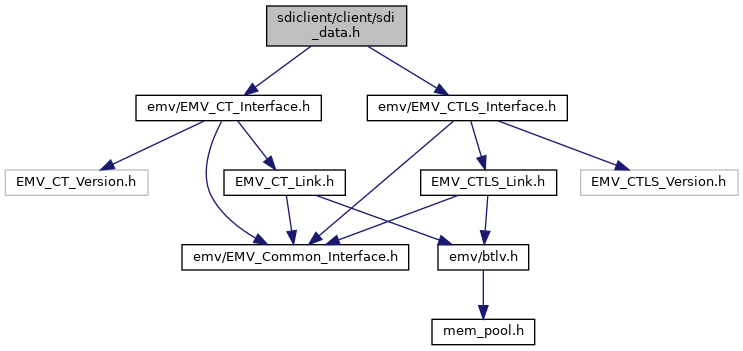

[Macros](#define-members) \| [Functions](#func-members)

`#include "`<a href="_e_m_v___c_t___interface_8h_source.md">emv/EMV_CT_Interface.h</a>`"`
`#include "`<a href="_e_m_v___c_t_l_s___interface_8h_source.md">emv/EMV_CTLS_Interface.h</a>`"`

Include dependency graph for sdi_data.h:

<a href="sdi__data_8h_source.md">Go to the source code of this file.</a>

|  |  |
|----|----|
| Macros |  |
| #define  | [CLA_DATA](#a3dabd433b8b080a6d5ce3ca9de2258f2)   0x29 |
|   | Class for Data Handling. [More\...](#a3dabd433b8b080a6d5ce3ca9de2258f2)  |
| #define  | [INS_FETCH_TAGS](#a256a3bbbf589f289835aefd7754014ab)   0x02 |
|   | Fetch Tags. [More\...](#a256a3bbbf589f289835aefd7754014ab)  |
| #define  | <a href="group___f_e_t_c_h___t_a_g_s___o_p_t_i_o_n_s.md#ga4d0d4200051eace7b386b0b60576a7f8">SENSITIVE_TAG_OMIT</a>   0 |
|   | (b1 & b2): Default handling of sensitive tags by [SDI_fetchTxnTags()](#aa0964da27a7a19aaae21a423f330af83 "Fetch one or several tags at the end of the transaction, excluding sensitive cardholder data."): Sensitive tags are not returned in the response. <a href="group___f_e_t_c_h___t_a_g_s___o_p_t_i_o_n_s.md#ga4d0d4200051eace7b386b0b60576a7f8">More...</a>  |
| #define  | <a href="group___f_e_t_c_h___t_a_g_s___o_p_t_i_o_n_s.md#ga6f8e5b493d848f1d3c55031be9d729b8">SENSITIVE_TAG_TRUNCATE</a>   0x01 |
|   | b1: Sensitive tags are returned with zero length. Note: b1 and b2 are mutually exclusive <a href="group___f_e_t_c_h___t_a_g_s___o_p_t_i_o_n_s.md#ga6f8e5b493d848f1d3c55031be9d729b8">More...</a>  |
| #define  | <a href="group___f_e_t_c_h___t_a_g_s___o_p_t_i_o_n_s.md#ga02da4a00c6611051f852cba64f25696e">SENSITIVE_TAG_REPLACE</a>   0x02 |
|   | b2: Sensitive tags are returned with data replaced by 0xFF bytes and original length <a href="group___f_e_t_c_h___t_a_g_s___o_p_t_i_o_n_s.md#ga02da4a00c6611051f852cba64f25696e">More...</a>  |
| #define  | <a href="group___f_e_t_c_h___t_a_g_s___o_p_t_i_o_n_s.md#ga7b8ac5b03afa9de30ceb1700d2d696a3">FETCHTAGS_EXPIRY_DATE_IN_CLEAR</a>   0x04 |
|   | b3: Get expiry date (tag 5F24) in clear text if VCL encryption is enabled <a href="group___f_e_t_c_h___t_a_g_s___o_p_t_i_o_n_s.md#ga7b8ac5b03afa9de30ceb1700d2d696a3">More...</a>  |
| #define  | <a href="group___f_e_t_c_h___t_a_g_s___o_p_t_i_o_n_s.md#gab484f75a638e56fe47d83bc9259c67fb">FETCHTAGS_GET_DATA</a>   0x08 |
|   | b4: Use EMV_ADK_FETCHTAGS_GET_DATA option (for CT only) <a href="group___f_e_t_c_h___t_a_g_s___o_p_t_i_o_n_s.md#gab484f75a638e56fe47d83bc9259c67fb">More...</a>  |

|  |  |
|----|----|
| Functions |  |
| <a href="group___a_d_k___r_e_t___c_o_d_e.md#gaa5ed8ecc7a31f36a8927e6e258187810">EMV_ADK_INFO</a>  | [SDI_fetchTxnTags](#aa0964da27a7a19aaae21a423f330af83) (unsigned char options, unsigned long \*requestedTags, unsigned short noOfRequestedTags, unsigned char \*tlvBuffer, unsigned short bufferLength, unsigned short \*tlvDataLength) |
|   | Fetch one or several tags at the end of the transaction, excluding sensitive cardholder data. [More\...](#aa0964da27a7a19aaae21a423f330af83)  |

## MacroDefinition Documentation {#macro-definition-documentation}

## CLA_DATA 

#define CLA_DATA   0x29

Class for Data Handling.

## INS_FETCH_TAGS 

#define INS_FETCH_TAGS   0x02

Fetch Tags.

## FunctionDocumentation {#function-documentation}

## SDI_fetchTxnTags() 

<a href="group___a_d_k___r_e_t___c_o_d_e.md#gaa5ed8ecc7a31f36a8927e6e258187810">EMV_ADK_INFO</a> SDI_fetchTxnTags

Fetch one or several tags at the end of the transaction, excluding sensitive cardholder data.

One common function for all technologies: CT, CTLS, MSR and manual entry. Sensitive tags are excluded from the returned data in the way defined by the parameter `mode`. The SDI Server has a predefined set of sensitive tags. Additionally, the user can configure additional sensitive tags using the Software and Configuration Upload command set 20-14, 20-15 and 20-16 as described in the SDI Server documentation. The user can also configure a white list using the same Software and Configuration Upload commands. If a card is in the configured white list, all data is returned in clear text, including also sensitive tags.

### Author

GSS R&D Germany

**Parameters**

\[in\] **options** \... fetch tags options, see Options for fetching TLV data \[in\] **requestedTags** \... requested tags \[in\] **noOfRequestedTags** \... number of requested tags \[in,out\] **tlvBuffer** \... buffer for TLV output, allocated by calling application \[in\] **bufferLength** \... number of bytes allocated for tlvBuffer \[out\] **tlvDataLength** \... number of bytes written to tlvBuffer

### Returns

EMV_ADK_OK, EMV_ADK_PARAM, EMV_ADK_TLV_BUILD_ERR, EMV_ADK_INTERNAL
