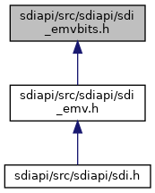

[Namespaces](#namespaces) \| [Enumerations](#enum-members)

This graph shows which files directly or indirectly include this file:

<a href="sdi__emvbits_8h_source.md">Go to the source code of this file.</a>

|            |                                                  |
|------------|--------------------------------------------------|
| Namespaces |                                                  |
|            | <a href="namespacevfisdi.md">vfisdi</a> |

|  |  |
|----|----|
| Enumerations |  |
| enum   | <a href="namespacevfisdi.md#a0410f3919a081084ec7990094952a466">EMVAppFlowCapabilityBits</a> {   <a href="namespacevfisdi.md#a0410f3919a081084ec7990094952a466a8e1c89f8a057ded4244d2100839dcb6d">EMV_CT_FORCE_RISK_MANAGEMENT</a> =0, <a href="namespacevfisdi.md#a0410f3919a081084ec7990094952a466a6400ace0df09f88efd28a6461805b6e4">EMV_CT_BLACKLIST</a> =1, <a href="namespacevfisdi.md#a0410f3919a081084ec7990094952a466ae9b89a0fb7c32edffdfa0e0ddf7885ef">EMV_CT_TRANSACTION_LOG</a> =2, <a href="namespacevfisdi.md#a0410f3919a081084ec7990094952a466a8d2279f98a3c6ccda25240e0b59a3661">EMV_CT_PIN_BYPASS</a> =3,   <a href="namespacevfisdi.md#a0410f3919a081084ec7990094952a466a223b5fb0f1087f3b90d22fa34a2d48c6">EMV_CT_FORCE_ONLINE</a> =4, <a href="namespacevfisdi.md#a0410f3919a081084ec7990094952a466aa1a530f195fb6a6ed3ae94e95856ddc6">EMV_CT_FORCE_ACCEPTANCE</a> =5, <a href="namespacevfisdi.md#a0410f3919a081084ec7990094952a466a08901eec10fc95aa4cc7d8a7f5672ed5">EMV_CT_CASH_SUPPORT</a> =8, <a href="namespacevfisdi.md#a0410f3919a081084ec7990094952a466a72a7b77194b471d0a32c4d7bb56cbd72">EMV_CT_CASHBACK_SUPPORT</a> =9,   <a href="namespacevfisdi.md#a0410f3919a081084ec7990094952a466aa33af9a4bc8d4c7c3168a40eed4acec0">EMV_CT_CHECK_INCONS_TRACK2_PAN</a> =10, <a href="namespacevfisdi.md#a0410f3919a081084ec7990094952a466a99370076b5fe24f65bfb1d7cf5bb9e4e">EMV_CT_CONF_AMOUNT_PIN</a> =11, <a href="namespacevfisdi.md#a0410f3919a081084ec7990094952a466a3210a4a47d2587d897c27b210013e58e">EMV_CT_DOMESTIC_CHECK</a> =12, <a href="namespacevfisdi.md#a0410f3919a081084ec7990094952a466a1a7d2b1fe6ce802c3770620d52cc45d6">EMV_CT_TRANSACTION_TYPE_17_FOR_CASH</a> =13,   <a href="namespacevfisdi.md#a0410f3919a081084ec7990094952a466a360fe04c0568dd2ebd511d11d4645b25">EMV_CT_CHECK_INCONS_TRACK2_NO_EXP</a> =14, <a href="namespacevfisdi.md#a0410f3919a081084ec7990094952a466a59e4e8e162d836af0628728a213d2b44">EMV_CT_TRANSACTION_TYPE_30_FOR_PREAUTH</a> = 15, <a href="namespacevfisdi.md#a0410f3919a081084ec7990094952a466af391e263e8e4828e63b3eb5837acf787">EMV_CT_REFERRAL_AFTER_TXN</a> =16, <a href="namespacevfisdi.md#a0410f3919a081084ec7990094952a466ab1db4631eb3929ef789e12320675a2bb">EMV_CT_DCC_CHECK</a> =17,   <a href="namespacevfisdi.md#a0410f3919a081084ec7990094952a466aac283a0cff0bdda257610f29e68b487e">EMV_CT_REFUND_CONFIRM_AMOUNT</a> =18, <a href="namespacevfisdi.md#a0410f3919a081084ec7990094952a466a8e9d5dc8213f2e2c5b077fefcc7f680f">EMV_CT_USE_CFG_APPL_NAME</a> =19, <a href="namespacevfisdi.md#a0410f3919a081084ec7990094952a466a55f698b35ca340f76ab0217f99c97499">EMV_CT_FALLBACK_ON_INCONS_TRACK2</a> =20, <a href="namespacevfisdi.md#a0410f3919a081084ec7990094952a466a39a465cc02401135b4ecc472aa57d3e9">EMV_CT_AMOUNT_CONFIRM_ON_SIGNATURE</a> =21,   <a href="namespacevfisdi.md#a0410f3919a081084ec7990094952a466a7576d28ee578d854bc68d830bb69c718">EMV_CT_SDA_SELECTED_TVR_ON</a> =22, <a href="namespacevfisdi.md#a0410f3919a081084ec7990094952a466a8f37f10608869c23ee25fc05d9684d0e">EMV_CT_CASHBACK_OFFLINE_SUPPORT</a> =23, <a href="namespacevfisdi.md#a0410f3919a081084ec7990094952a466ae39ef7252ed3cdf5a4b22ce06bcfc9f1">EMV_CT_REFUND_PROCESSING_RESTRICTIONS</a> =24, <a href="namespacevfisdi.md#a0410f3919a081084ec7990094952a466a5e44451a8ed449e3525f0c1d24a395a5">EMV_CT_REFUND_NO_GENERATE_AC</a> =25,   <a href="namespacevfisdi.md#a0410f3919a081084ec7990094952a466a6108615893840e608b8696d4d0fbaceb">EMV_CT_REFUND_FLOW_INTERAC</a> =26, <a href="namespacevfisdi.md#a0410f3919a081084ec7990094952a466aa43195e08c399a8fe1e543d8e2b30ee4">EMV_CT_REFUND_NO_ZERO_AMOUNT</a> =27, <a href="namespacevfisdi.md#a0410f3919a081084ec7990094952a466a8f100ed6aac98b28117884dab5c6a4af">EMV_CT_DPAS_DATA_STORAGE_SUPPORT</a> =28, <a href="namespacevfisdi.md#a0410f3919a081084ec7990094952a466aabceff30479938aa2980adcec56d307f">EMV_CT_DPAS_EXTENDED_LOGGING_SUPPORT</a> =29,   <a href="namespacevfisdi.md#a0410f3919a081084ec7990094952a466aade8d668139ae88f51ebe596a6d55725">EMV_CT_DPAS_CDCVM_SUPPORT</a> =30, <a href="namespacevfisdi.md#a0410f3919a081084ec7990094952a466acd513668dd01406b95044183161cec02">EMV_CT_APP_FLOW_VISA_QUASI_CASH</a> =31, <a href="namespacevfisdi.md#a0410f3919a081084ec7990094952a466a71ceeeb3835601c3b8c3722878314b9a">EMV_CT_APP_FLOW_CASHBACK_TRANS_TYPE_00</a> =32, <a href="namespacevfisdi.md#a0410f3919a081084ec7990094952a466afa8cc62edeadf9ef566554323d44fca7">EMV_CTLS_DOM_NO_FINAL_SELECT</a> =0,   <a href="namespacevfisdi.md#a0410f3919a081084ec7990094952a466a2746fee7854e945de301bfb153413888">EMV_CTLS_LOA_ENABLE</a> =1, <a href="namespacevfisdi.md#a0410f3919a081084ec7990094952a466a10cc8f9c62582169f6d270d3e08134e2">EMV_CTLS_CASH_SUPPORT</a> =2, <a href="namespacevfisdi.md#a0410f3919a081084ec7990094952a466acee3be03a47c13104f56db3ab8d9694c">EMV_CTLS_CASHBACK_SUPPORT</a> =3, <a href="namespacevfisdi.md#a0410f3919a081084ec7990094952a466a3f454ac4b135ee48e921e8362206cf25">EMV_CTLS_OMIT_NOT_ALLOWED_SELECTION</a> =4,   <a href="namespacevfisdi.md#a0410f3919a081084ec7990094952a466aeb0121f9afa9b8e7a61cba4bf284fb4a">EMV_CTLS_FORCE_ENTRY_POINT</a> =5, <a href="namespacevfisdi.md#a0410f3919a081084ec7990094952a466a0774ced9edcbaf8fb320a4fb30c3dc62">EMV_CTLS_FORCE_KERNEL_USAGE</a> =6, <a href="namespacevfisdi.md#a0410f3919a081084ec7990094952a466a1a4cbb6e20a887871614faab3c8b7053">EMV_CTLS_LIST_OF_AIDS_IF_PPSE_MISSING_ONLY</a> =7, <a href="namespacevfisdi.md#a0410f3919a081084ec7990094952a466a2fb9e0a204f947ab44b3d36b0bd2a667">EMV_CTLS_LIST_OF_AIDS_IF_PPSE_FAILED_ONLY</a> =8,   <a href="namespacevfisdi.md#a0410f3919a081084ec7990094952a466a366a9537d63119d864f07b583df7fbd7">EMV_CTLS_CARD_READ_TXN_ZERO_AMOUNT</a> =9, <a href="namespacevfisdi.md#a0410f3919a081084ec7990094952a466ad9abaaed8d73a999a6b4f6ce433fa56d">EMV_CTLS_SKIP_CARDSELECTION_APPS</a> =10, <a href="namespacevfisdi.md#a0410f3919a081084ec7990094952a466a3b684d44a3904bd11cd94e91e907d92d">EMV_CTLS_SKIP_TXN_LIMIT_CHECK</a> =11, <a href="namespacevfisdi.md#a0410f3919a081084ec7990094952a466a6dacc1039ba5d9615db226a71d73335d">EMV_CTLS_FORCE_ONLINE</a> =12,   <a href="namespacevfisdi.md#a0410f3919a081084ec7990094952a466a156b5c04e1fc381bb8f8b875b3e3fc17">EMV_CTLS_WAIT_CARD_REMOVAL_END</a> =13, <a href="namespacevfisdi.md#a0410f3919a081084ec7990094952a466ac9086661861cc2f5c13ae535b10484e5">EMV_CTLS_START_REMOVAL_DETECTION</a> =14, <a href="namespacevfisdi.md#a0410f3919a081084ec7990094952a466abe0dd8db6327d03a66003ccdab536252">EMV_CTLS_EP_EXTENDED_SELECTION</a> =15, <a href="namespacevfisdi.md#a0410f3919a081084ec7990094952a466ac650933f52a13260c3faba94bf1a6baa">EMV_CTLS_MULTIPLE_AID_KERNEL_ID</a> =16,   <a href="namespacevfisdi.md#a0410f3919a081084ec7990094952a466a588e15d40fa2fe9044f3253d23f37441">EMV_CTLS_ENABLE_OFFLINE_CASHBACK</a> =17, <a href="namespacevfisdi.md#a0410f3919a081084ec7990094952a466a28a2c8ef3bc6888c2cfb91a84a388fc4">EMV_CTLS_RESET_TXN_TYPE</a> =18, <a href="namespacevfisdi.md#a0410f3919a081084ec7990094952a466a54734620081fe269caff84f2dc3ddd60">EMV_CTLS_CFG_APPL_NAME</a> =19, <a href="namespacevfisdi.md#a0410f3919a081084ec7990094952a466a3b2492ef105dd417bed15aa06db07798">EMV_CTLS_CARD_READ_SKIP_TXN_LIMIT_CHECK</a> =20 } |
| enum   | <a href="namespacevfisdi.md#a27b0f2c0fbec196efc4df7eb1479ca6f">EMVKernelAppFlowCapabilityBits</a> {   <a href="namespacevfisdi.md#a27b0f2c0fbec196efc4df7eb1479ca6fa5ea7d362e5447d4e7cdbd2bed3f046fc">EMV_CTLS_READ_BALANCE_BEFORE_GAC_MK</a> =0, <a href="namespacevfisdi.md#a27b0f2c0fbec196efc4df7eb1479ca6fa5fa94b51b523aab022e90dcdab7ba729">EMV_CTLS_READ_BALANCE_AFTER_GAC_MK</a> =1, <a href="namespacevfisdi.md#a27b0f2c0fbec196efc4df7eb1479ca6fa1672875f73585d1dd3f85b88dadd3c10">EMV_CTLS_ENABLE_DATA_EXCHANGE_MK</a> =2, <a href="namespacevfisdi.md#a27b0f2c0fbec196efc4df7eb1479ca6fafd233908b5e510b63d9332ea40638345">EMV_CTLS_TRANSACTION_TYPE_17_FOR_CASH_MK</a> =3,   <a href="namespacevfisdi.md#a27b0f2c0fbec196efc4df7eb1479ca6faa35e5a7149e11901b4c7347febfff424">EMV_CTLS_CARD_READ_ACTION_ANALYSIS_MK</a> =4, <a href="namespacevfisdi.md#a27b0f2c0fbec196efc4df7eb1479ca6fa79333ddb5721eb78392e42e9d011de0b">EMV_CTLS_STATUS_CHECK_ENABLE_VK</a> =0, <a href="namespacevfisdi.md#a27b0f2c0fbec196efc4df7eb1479ca6fa3bfacdb85d95ad8a3a65faba9ba7f986">EMV_CTLS_ZERO_CHECK_ENABLE_SKIP_VK</a> =1, <a href="namespacevfisdi.md#a27b0f2c0fbec196efc4df7eb1479ca6fa6d23d72e43fd126153e416d1156d9929">EMV_CTLS_ZERO_CHECK_ENABLE_ONLINE_VK</a> =2,   <a href="namespacevfisdi.md#a27b0f2c0fbec196efc4df7eb1479ca6fa14048afe252b9915d920de89c1b2fc82">EMV_CTLS_CHECK_INCONS_TRACK2_PAN_VK</a> =3, <a href="namespacevfisdi.md#a27b0f2c0fbec196efc4df7eb1479ca6faaa9d836498172b7faa44e28ba2f6c8ee">EMV_CTLS_CASHBACK_NOT_FORCED_CVM_VK</a> =4, <a href="namespacevfisdi.md#a27b0f2c0fbec196efc4df7eb1479ca6fa517670c29576279e50fa173324df27bc">EMV_CTLS_ALERT_TONE_ON_DECLINE_VK</a> =6, <a href="namespacevfisdi.md#a27b0f2c0fbec196efc4df7eb1479ca6fa72de36cb8069619f9e5cd1a8bb8cb778">EMV_CTLS_GET_DATA_9F68_VK</a> =7,   <a href="namespacevfisdi.md#a27b0f2c0fbec196efc4df7eb1479ca6facaccd97e6d677e0426cfb829c6747fa6">EMV_CTLS_ENABLE_TAGS_AT_GPO_VK</a> =8, <a href="namespacevfisdi.md#a27b0f2c0fbec196efc4df7eb1479ca6fa7ba485d9def943fad6b290e094aa2cac">EMV_CTLS_ZERO_CHECK_DISABLE_VK</a> =9, <a href="namespacevfisdi.md#a27b0f2c0fbec196efc4df7eb1479ca6facc84cb4ecd55b2cfe593fdb1ea24601c">EMV_CTLS_ODO_SUPPORT_VK</a> =11, <a href="namespacevfisdi.md#a27b0f2c0fbec196efc4df7eb1479ca6fa0caaa39b23e99329cc4134f7ee61fcac">EMV_CTLS_ODO_SDA_VK</a> =12,   <a href="namespacevfisdi.md#a27b0f2c0fbec196efc4df7eb1479ca6fab0dcfd4562177319b1e7cb428f9d0d05">EMV_CTLS_ODO_DDA_VK</a> =13, <a href="namespacevfisdi.md#a27b0f2c0fbec196efc4df7eb1479ca6fa9686fab1c78a54d3ba7a10971b2d5e0f">EMV_CTLS_ODO_SDA_ERR_ONLINE_VK</a> =14, <a href="namespacevfisdi.md#a27b0f2c0fbec196efc4df7eb1479ca6fa6b2c801f30301b4dfb7f951bc8501315">EMV_CTLS_ODO_DDA_ERR_ONLINE_VK</a> =15, <a href="namespacevfisdi.md#a27b0f2c0fbec196efc4df7eb1479ca6fa89edcb0e984b93112100fd4e6067b986">EMV_CTLS_OMIT_AUC_INT_CASH_VK</a> =16,   <a href="namespacevfisdi.md#a27b0f2c0fbec196efc4df7eb1479ca6faa2f0f58b5c8e25c29e8a18b50a7c43f4">EMV_CTLS_OMIT_AUC_INT_CASHBACK_VK</a> =17, <a href="namespacevfisdi.md#a27b0f2c0fbec196efc4df7eb1479ca6fa27c9f084f2f6c8b7cf63d0844f2dfafd">EMV_CTLS_OMIT_AUC_DOM_CASH_VK</a> =18, <a href="namespacevfisdi.md#a27b0f2c0fbec196efc4df7eb1479ca6fafed5b7cb42df58dd9958942f152eb1b1">EMV_CTLS_OMIT_AUC_DOM_CASHBACK_VK</a> =19, <a href="namespacevfisdi.md#a27b0f2c0fbec196efc4df7eb1479ca6fa5ee104473c63c0a2e1de4cac70ab91ec">EMV_CTLS_ZERO_CASHBACK_AMOUNT_VK</a> =20,   <a href="namespacevfisdi.md#a27b0f2c0fbec196efc4df7eb1479ca6faaccecd436030b1ce837f3c51e74e25d4">EMV_CTLS_CASHBACK_TRANS_TYPE_VK9_VK</a> =21, <a href="namespacevfisdi.md#a27b0f2c0fbec196efc4df7eb1479ca6fa54421777e9c4c1dcf69461f5e54e0f81">EMV_CTLS_QUASI_CASH_VK</a> =22, <a href="namespacevfisdi.md#a27b0f2c0fbec196efc4df7eb1479ca6fa0f3a0716c5a11f788ec66d687c6c9547">EMV_CTLS_DO_NOT_CFG_9F21_TIME_VK</a> =23, <a href="namespacevfisdi.md#a27b0f2c0fbec196efc4df7eb1479ca6fa1f8e2aa784001750f49342d7a2234349">EMV_CTLS_CARDREAD_GENAC1_ARQC_AK</a> =0,   <a href="namespacevfisdi.md#a27b0f2c0fbec196efc4df7eb1479ca6fa9c65137348d3b0e8cbf6b0a0844753c2">EMV_CTLS_TRANSACTION_TYPE_30_FOR_PREAUTH_AK</a> =1, <a href="namespacevfisdi.md#a27b0f2c0fbec196efc4df7eb1479ca6faedd6f27c8431dce952423ce780c493c3">EMV_CTLS_STATUS_CHECK_ENABLE_AK</a> =2, <a href="namespacevfisdi.md#a27b0f2c0fbec196efc4df7eb1479ca6fa9d9ac91877a5f11f82f60ac5afad19ff">EMV_CTLS_ZERO_CHECK_ENABLE_ONLINE_AK</a> =3, <a href="namespacevfisdi.md#a27b0f2c0fbec196efc4df7eb1479ca6fa73b857d89fd3288220f6039de00258be">EMV_CTLS_DISABLE_9F6E_KERNEL_VERSION_AK</a> =4,   <a href="namespacevfisdi.md#a27b0f2c0fbec196efc4df7eb1479ca6facb918d278a29ee7751726290016870c6">EMV_CTLS_MULTIPLE_RANDOM_NUMBERS_JK</a> =0, <a href="namespacevfisdi.md#a27b0f2c0fbec196efc4df7eb1479ca6fada99c1d819d2a96d1d5f26ee9e7659b8">EMV_CTLS_CASHBACK_NOT_FORCED_CVM_DK</a> =0, <a href="namespacevfisdi.md#a27b0f2c0fbec196efc4df7eb1479ca6fac0132e4fbf63cb3f33e3914b27239f46">EMV_CTLS_DATA_STORAGE_DK</a> =1, <a href="namespacevfisdi.md#a27b0f2c0fbec196efc4df7eb1479ca6fafb199ed74dae0422495c96b99ed8b61b">EMV_CTLS_EXTENDED_LOGGGING_DK</a> =2,   <a href="namespacevfisdi.md#a27b0f2c0fbec196efc4df7eb1479ca6faea9036e635003db232b8585236cada13">EMV_CTLS_TORN_TXN_RECOVERY_DK</a> =3, <a href="namespacevfisdi.md#a27b0f2c0fbec196efc4df7eb1479ca6fa19081402cef94ee7618eae47ff5b45d0">EMV_CTLS_DEFERRED_AUTHORISATION_DK</a> =4, <a href="namespacevfisdi.md#a27b0f2c0fbec196efc4df7eb1479ca6fa007984b26b3bb1463637fe7f479c40f5">EMV_CTLS_STATUS_CHECK_ENABLE_DK</a> =5, <a href="namespacevfisdi.md#a27b0f2c0fbec196efc4df7eb1479ca6fa25c61c673486cdc9c7093c4f626ab7ea">EMV_CTLS_ZERO_CHECK_ENABLE_SKIP_DK</a> =6,   <a href="namespacevfisdi.md#a27b0f2c0fbec196efc4df7eb1479ca6fa10ec68d53b98b5ccfcd944ae8484f95c">EMV_CTLS_ZERO_CHECK_ENABLE_ONLINE_DK</a> =7, <a href="namespacevfisdi.md#a27b0f2c0fbec196efc4df7eb1479ca6fafe1359d7ec5ab4aae69516475190cda0">EMV_CTLS_REQUEST_CDA_WITH_ARQC_IK</a> =0, <a href="namespacevfisdi.md#a27b0f2c0fbec196efc4df7eb1479ca6fabf75eebd68cc4fcc391c86d8f80f9e59">EMV_CTLS_REFUND_FLOW_INTERAC_IK</a> =1, <a href="namespacevfisdi.md#a27b0f2c0fbec196efc4df7eb1479ca6fa7cd5808154701c71d0abad4fa760fa72">EMV_CTLS_READ_CARD_REFUND_EK</a> =0,   <a href="namespacevfisdi.md#a27b0f2c0fbec196efc4df7eb1479ca6fac24cf34ddc0183d1f2f2cb6676f63174">EMV_CTLS_CHECK_INCONS_TRACK2_PAN_PK</a> =0, <a href="namespacevfisdi.md#a27b0f2c0fbec196efc4df7eb1479ca6fa19ff47b3aaad2c31aa2a81f152a647e1">EMV_CTLS_CASHBACK_NOT_FORCED_CVM_PK</a> =1, <a href="namespacevfisdi.md#a27b0f2c0fbec196efc4df7eb1479ca6fa87459fcf6173cdcef4e01cef892eeabb">EMV_CTLS_STATUS_CHECK_ENABLE_CK</a> =0, <a href="namespacevfisdi.md#a27b0f2c0fbec196efc4df7eb1479ca6fa2e7f15efe7087db3e86bd1f856f57311">EMV_CTLS_ZERO_CHECK_ENABLE_SKIP_CK</a> =1,   <a href="namespacevfisdi.md#a27b0f2c0fbec196efc4df7eb1479ca6fabe174e683ce9ae8163d4140da28f5f69">EMV_CTLS_ZERO_CHECK_ENABLE_ONLINE_CK</a> =2, <a href="namespacevfisdi.md#a27b0f2c0fbec196efc4df7eb1479ca6fab43f4602c415e564b92805c9bdb6730b">EMV_CTLS_CHECK_INCONS_TRACK2_PAN_CK</a> =3, <a href="namespacevfisdi.md#a27b0f2c0fbec196efc4df7eb1479ca6faed0a3529f03ab9ab6d9c0aa6109f60ae">EMV_CTLS_CASHBACK_NOT_FORCED_CVM_CK</a> =4, <a href="namespacevfisdi.md#a27b0f2c0fbec196efc4df7eb1479ca6fa57d149ce77bb819ec7bcf230e357c906">EMV_CTLS_ENABLE_FDDA_VERSION_CK</a> =5,   <a href="namespacevfisdi.md#a27b0f2c0fbec196efc4df7eb1479ca6fa9371965936ac2669d4dc47d7f595fba0">EMV_CTLS_DISABLE_PIN_BELOW_CVM_CK</a> =6, <a href="namespacevfisdi.md#a27b0f2c0fbec196efc4df7eb1479ca6fa4535178143568568b9ef139d24bd4629">EMV_CTLS_SUPPORT_APPLI_AUTHENTICATE_GK</a> =0, <a href="namespacevfisdi.md#a27b0f2c0fbec196efc4df7eb1479ca6fa853215df4aba1ead1e34aabf7d7893d0">EMV_CTLS_SUPPORT_GETDATA_GK</a> =1, <a href="namespacevfisdi.md#a27b0f2c0fbec196efc4df7eb1479ca6fab1bbcebebd4184632176195848735766">EMV_CTLS_SUPPORT_PUTDATA_GK</a> =2,   <a href="namespacevfisdi.md#a27b0f2c0fbec196efc4df7eb1479ca6fac336ed65313594a27447f1ffb616b5b4">EMV_CTLS_AMOUNT_MULTIPLY_100_GK</a> =3, <a href="namespacevfisdi.md#a27b0f2c0fbec196efc4df7eb1479ca6fa5450a5b5a6be8d0d024db16313af519b">EMV_CTLS_SERVICE_FEATURE_ENABLE_RK</a> =0, <a href="namespacevfisdi.md#a27b0f2c0fbec196efc4df7eb1479ca6faa6c7d75d73bafb97d4a02f874f0273e5">EMV_CTLS_TORN_TRANSACTION_INDICATOR_RK</a> =1, <a href="namespacevfisdi.md#a27b0f2c0fbec196efc4df7eb1479ca6fa235812f79d7294e8c6c15f8f7a32e687">EMV_CTLS_READ_RECORD_SFI1_QDDA_RK</a> =2,   <a href="namespacevfisdi.md#a27b0f2c0fbec196efc4df7eb1479ca6fa3b99e1b1783c7eed3d403544990cd14f">EMV_CTLS_MULTIPLE_RANDOM_NUMBERS_RK</a> =3, <a href="namespacevfisdi.md#a27b0f2c0fbec196efc4df7eb1479ca6faf4c1c187e4a0e7992a65df8c335835d6">EMV_CTLS_ONLINE_PIN_SUPPORTED_RK</a> =4, <a href="namespacevfisdi.md#a27b0f2c0fbec196efc4df7eb1479ca6fa133e443008ecbe446b7ffdb6c6242efe">EMV_CTLS_SIGNATURE_SUPPORTED_RK</a> =5, <a href="namespacevfisdi.md#a27b0f2c0fbec196efc4df7eb1479ca6fa94ff4084a821ef90dc59473d6cc9b084">EMV_CTLS_ON_DEVICE_CVM_SUPPORTED_RK</a> =6,   <a href="namespacevfisdi.md#a27b0f2c0fbec196efc4df7eb1479ca6faf7fe3c6c51f83c010b270cc06f5d012c">EMV_CTLS_CVM_REQUIRED_RK</a> =7, <a href="namespacevfisdi.md#a27b0f2c0fbec196efc4df7eb1479ca6fa4e91d13a382f403fd395cc77bcf16c4e">EMV_CTLS_ISSUER_UPDATE_SUPPORTED_RK</a> =8, <a href="namespacevfisdi.md#a27b0f2c0fbec196efc4df7eb1479ca6fa1c915863e15d3cd6a5c0c423433d6dbf">EMV_CTLS_STATUS_CHECK_ENABLE_WK</a> =0, <a href="namespacevfisdi.md#a27b0f2c0fbec196efc4df7eb1479ca6fa79b34cc9ce74d69dec4b2f1e82f791f2">EMV_CTLS_ZERO_CHECK_ENABLE_SKIP_WK</a> =1,   <a href="namespacevfisdi.md#a27b0f2c0fbec196efc4df7eb1479ca6fa07266e6c354ab9a679dd43fe5dacd4fe">EMV_CTLS_ZERO_CHECK_ENABLE_ONLINE_WK</a> =2, <a href="namespacevfisdi.md#a27b0f2c0fbec196efc4df7eb1479ca6fa31cd55157cb1ae4addf7c6ec5ef9c38d">EMV_CTLS_NO_CDCVM_WK</a> =3, <a href="namespacevfisdi.md#a27b0f2c0fbec196efc4df7eb1479ca6fa6f2469dda657e58e3f908f9911b6109a">EMV_CTLS_EXPLICIT_SELECT_DOM</a> =0 } |
| enum   | <a href="namespacevfisdi.md#a850bee3381678f76351799920293d8c8">EMVFlowOptionBits</a> {   <a href="namespacevfisdi.md#a850bee3381678f76351799920293d8c8a0dbfe3051fcf1d0a4e2c1831988c06f6">EMV_CTLS_VISA_WAVE</a> =0, <a href="namespacevfisdi.md#a850bee3381678f76351799920293d8c8a08ce860dc40ae0dc343ed6ea0fc404ad">EMV_CTLS_OR_NONEMV_MARKET</a> =1, <a href="namespacevfisdi.md#a850bee3381678f76351799920293d8c8a31a2e29261e140b30aa6def90b9dc2f5">EMV_CTLS_UI_SCHEME_DEFAULT</a> =2, <a href="namespacevfisdi.md#a850bee3381678f76351799920293d8c8ac7cd3edd470f3a228be7f7c9c4fbd46a">EMV_CTLS_AL_USE_TID</a> =3,   <a href="namespacevfisdi.md#a850bee3381678f76351799920293d8c8a974475b83e6ac7920e30f8b35667fbd4">EMV_CTLS_LED_NON_VISA_EUROPE</a> =4, <a href="namespacevfisdi.md#a850bee3381678f76351799920293d8c8a5eb97b36e898141df5290c3144e1932d">EMV_CTLS_LED_EP_OPTION_2</a> =5, <a href="namespacevfisdi.md#a850bee3381678f76351799920293d8c8a7ee73e6b37cb6f1fab6f07c058ab7578">EMV_CTLS_LED_INTERAC</a> =6, <a href="namespacevfisdi.md#a850bee3381678f76351799920293d8c8a7fc503a5fa1efee95abee8f69b414414">EMV_CTLS_FORWARD_VFI_FAIL</a> =7,   <a href="namespacevfisdi.md#a850bee3381678f76351799920293d8c8ab267979f080d57c10e81a02f74f052b8">EMV_CTLS_DISABLE_DISCOVER_ZIP_CHECK</a> =8 } |
| enum   | <a href="namespacevfisdi.md#a96fc75da8a06e6e7e0d476eb3490cf54">EMVChecksumOptionBits</a> {   <a href="namespacevfisdi.md#a96fc75da8a06e6e7e0d476eb3490cf54a5d5b7b1d9d681aafcd7e69cd1ec1caa2">EMV_CT_CHECKSUM_INCLUDE_VERSION</a> =0, <a href="namespacevfisdi.md#a96fc75da8a06e6e7e0d476eb3490cf54a6c7fed8d22fa959facc18dd389879b26">EMV_CT_CHECKSUM_TRANSACTION_LOG</a> =1, <a href="namespacevfisdi.md#a96fc75da8a06e6e7e0d476eb3490cf54ab8c21c4ac8972b47c711ad1a2c84d1af">EMV_CT_CHECKSUM_EXCEPTION_FILE</a> =2, <a href="namespacevfisdi.md#a96fc75da8a06e6e7e0d476eb3490cf54abce141d762910d6fd6f7f03e3edbd36b">EMV_CT_CHECKSUM_FORCE_ONLINE</a> =3,   <a href="namespacevfisdi.md#a96fc75da8a06e6e7e0d476eb3490cf54a301702e7087bb4bf95bcea165954f5d2">EMV_CT_CHECKSUM_FORCE_ACCEPTANCE</a> =4, <a href="namespacevfisdi.md#a96fc75da8a06e6e7e0d476eb3490cf54aa37d30bf190da694672cfc78dd00a541">EMV_CT_CHECKSUM_SUPPORT_ONL_DATA_CAPTURE</a> =5, <a href="namespacevfisdi.md#a96fc75da8a06e6e7e0d476eb3490cf54a1199aabf64c6083ffd401b22057bd9a2">EMV_CT_CHECKSUM_SUPPORT_PSE</a> =6, <a href="namespacevfisdi.md#a96fc75da8a06e6e7e0d476eb3490cf54a01a2a721843c59337bf5b663172d54d1">EMV_CT_CHECKSUM_ACCOUNT_TYPE</a> =7,   <a href="namespacevfisdi.md#a96fc75da8a06e6e7e0d476eb3490cf54aa5b0ae39e13fe118f742621804bf3fe9">EMV_CT_CHECKSUM_SUPPORT_ADVICES</a> =8, <a href="namespacevfisdi.md#a96fc75da8a06e6e7e0d476eb3490cf54a8945a7ea9d223697d5a3926338bc918e">EMV_CT_CHECKSUM_SUPPORT_CARDHOLDER_CONF</a> =9, <a href="namespacevfisdi.md#a96fc75da8a06e6e7e0d476eb3490cf54a2f90864668cf8184dca078f5868ae502">EMV_CT_CHECKSUM_PIN_BYPASS</a> =10, <a href="namespacevfisdi.md#a96fc75da8a06e6e7e0d476eb3490cf54afb516993182bd1163931e2ea0b694673">EMV_CT_CHECKSUM_SUPPORT_DEFAULT_TDOL</a> =11,   <a href="namespacevfisdi.md#a96fc75da8a06e6e7e0d476eb3490cf54aecef084df09de776ad66f3895edb52ca">EMV_CT_CHECKSUM_SUPPORT_BATCH_DATA_CAPTURE</a> =12, <a href="namespacevfisdi.md#a96fc75da8a06e6e7e0d476eb3490cf54a3f4d62e5e61972c7277a9b08d429da1f">EMV_CT_CHECKSUM_SUPPORT_VOICE_REF_ISS</a> =13, <a href="namespacevfisdi.md#a96fc75da8a06e6e7e0d476eb3490cf54a5390e8cc29810c24fb7bfd16790f59c2">EMV_CT_CHECKSUM_SUPPORT_VOICE_REF_CARD</a> =14, <a href="namespacevfisdi.md#a96fc75da8a06e6e7e0d476eb3490cf54a6795c6e5cd687f5e29ec856401bbc8ca">EMV_CT_CHECKSUM_MULTILANG_SUPPORT</a> =15,   <a href="namespacevfisdi.md#a96fc75da8a06e6e7e0d476eb3490cf54a1a3773cc5efcdbb6957639cd5262a1c8">EMV_CT_CHECKSUM_PIN_BYPASS_ONCE</a> =16 } |
| enum   | <a href="namespacevfisdi.md#a97404ed81bf6af62c4f31faf474b6f2e">EMVTransactionOptionBits</a> {   <a href="namespacevfisdi.md#a97404ed81bf6af62c4f31faf474b6f2ea0be767c442276d71c83e94860fbcb042">EMV_CT_SELOP_CBCK_APPLI_SEL</a> =0, <a href="namespacevfisdi.md#a97404ed81bf6af62c4f31faf474b6f2eaa78138c4fda4a0537ff3a363f7aefb47">EMV_CT_SELOP_RESERV_ALLOW_B_ON_A</a> =1, <a href="namespacevfisdi.md#a97404ed81bf6af62c4f31faf474b6f2eada1f15626cb26c1ff87a4cdd8fd6cc0e">EMV_CT_SELOP_CBCK_DOMESTIC_APPS</a> =2, <a href="namespacevfisdi.md#a97404ed81bf6af62c4f31faf474b6f2eabfd393294beb53fb8c32b14c7adb4bf4">EMV_CT_SELOP_ADDALL</a> =3,   <a href="namespacevfisdi.md#a97404ed81bf6af62c4f31faf474b6f2ea8159120f438425235be56ee707ed2472">EMV_CT_SELOP_ADDBLO</a> =4, <a href="namespacevfisdi.md#a97404ed81bf6af62c4f31faf474b6f2eafe3875baa7359c2e24552a8399dda6aa">EMV_CT_NO_LONGEST_AID_MATCH</a> =5, <a href="namespacevfisdi.md#a97404ed81bf6af62c4f31faf474b6f2ea7436929a7506ca738fc9f304263e7bdd">EMV_CT_ALLOW_BLOCKED</a> =6, <a href="namespacevfisdi.md#a97404ed81bf6af62c4f31faf474b6f2ea7014b40e6bb9bbc54c1a1a60270b3594">EMV_CT_SELOP_REMOVEALL_BUT_EXCLUDED</a> =7,   <a href="namespacevfisdi.md#a97404ed81bf6af62c4f31faf474b6f2ea1b652fc60815687e02315834b13bc984">EMV_CT_TXNOP_PIN_BYPASS_NO_SUBSEQUENT</a> =8, <a href="namespacevfisdi.md#a97404ed81bf6af62c4f31faf474b6f2ea818b157d022f19331b0273028c2c7bb5">EMV_CT_TXNOP_MULTIPLE_RANDOM_NUMBERS</a> =9, <a href="namespacevfisdi.md#a97404ed81bf6af62c4f31faf474b6f2ea04280c3a55319b0631755d31c8d0f621">EMV_CT_TXNOP_DCC_CALLBACK</a> =10, <a href="namespacevfisdi.md#a97404ed81bf6af62c4f31faf474b6f2ea9bcc137c6e20b3019c5cf87582720a9c">EMV_CT_TXNOP_DCC_CALLBACK_ALWAYS</a> =11,   <a href="namespacevfisdi.md#a97404ed81bf6af62c4f31faf474b6f2eacf686de778278a4d33f1832e031f40fb">EMV_CT_TXNOP_NO_FALLBACK_AFTER_CVM</a> =12, <a href="namespacevfisdi.md#a97404ed81bf6af62c4f31faf474b6f2eaaae5c1e6621adc00b73221354eb70514">EMV_CT_TXNOP_AMOUNT_CONF</a> =13, <a href="namespacevfisdi.md#a97404ed81bf6af62c4f31faf474b6f2ea8bcc16c9f940184f86f1324dff8c4fe7">EMV_CT_TXNOP_ENFORCE_PIN</a> =14, <a href="namespacevfisdi.md#a97404ed81bf6af62c4f31faf474b6f2ea87f262dc555135eeed45f1a2d42fb8af">EMV_CT_TXNOP_FALLBACK_GOODSERVICE</a> =15,   <a href="namespacevfisdi.md#a97404ed81bf6af62c4f31faf474b6f2ea1200a5db47a14142d6ad5fc4ae3d6f8e">EMV_CT_TXNOP_MERCHINFO_CALLBACK</a> =16, <a href="namespacevfisdi.md#a97404ed81bf6af62c4f31faf474b6f2eac3afc64f242e90061faa4c7363ca562f">EMV_CT_TXNOP_RND_CALLBACK</a> =17, <a href="namespacevfisdi.md#a97404ed81bf6af62c4f31faf474b6f2ea504beee6d9c43c1e94b833545cf4882f">EMV_CT_TXNOP_HOTLST_LOG_CALLBACK</a> =18, <a href="namespacevfisdi.md#a97404ed81bf6af62c4f31faf474b6f2ea8a48ff59dd229293fd505481cbfb24be">EMV_CT_TXNOP_LOCAL_CHCK_CALLBACK</a> =19,   <a href="namespacevfisdi.md#a97404ed81bf6af62c4f31faf474b6f2ea9a39caef35f9ed2e2a37a51e54ddc0e0">EMV_CT_TXNOP_CARDHINFO_CALLBACK</a> =20, <a href="namespacevfisdi.md#a97404ed81bf6af62c4f31faf474b6f2ea179031a1f6f4878bfd7c3cb8da6a3e6c">EMV_CT_TXNOP_EARLY_PIN_ENTRY</a> =21, <a href="namespacevfisdi.md#a97404ed81bf6af62c4f31faf474b6f2ea5e67d87c065441c54a765110e2ff885c">EMV_CT_TXNOP_DELAYED_EARLY_PIN</a> =22, <a href="namespacevfisdi.md#a97404ed81bf6af62c4f31faf474b6f2ea8c255b8d67815b9cc6bf08ca9b1fe858">EMV_CT_TXNOP_KERNEL_PARSE_UNKNOWN_TLV</a> =23,   <a href="namespacevfisdi.md#a97404ed81bf6af62c4f31faf474b6f2eaf46880460058d24cc77fad326d984108">EMV_CT_SELOP_NO_UTF8</a> =24, <a href="namespacevfisdi.md#a97404ed81bf6af62c4f31faf474b6f2ea2caeb08cf8f2d18265ba3ff8d527f6f0">EMV_CT_TRXOP_NO_UTF8</a> =24, <a href="namespacevfisdi.md#a97404ed81bf6af62c4f31faf474b6f2ea2cece03cd9d7297e9ccc1be5ab98ec58">EMV_CT_TXNOP_TIP_AMOUNT_ZERO</a> =25, <a href="namespacevfisdi.md#a97404ed81bf6af62c4f31faf474b6f2ea2bb95b565be682a26e648aee4caf3334">EMV_CT_TRXOP_NO_CHECK_BB_PADDING</a> =26,   <a href="namespacevfisdi.md#a97404ed81bf6af62c4f31faf474b6f2ea302497cbb696318735380ea7d7ff7522">EMV_CT_TRXOP_NO_CHECK_DDLEN</a> =27, <a href="namespacevfisdi.md#a97404ed81bf6af62c4f31faf474b6f2ea6b33f16e926a13ce2ba5d117064ef93e">EMV_CT_ONL_OPTS_LAST_PIN_TRY</a> =32, <a href="namespacevfisdi.md#a97404ed81bf6af62c4f31faf474b6f2ea908fed4aa6fcec915108f14f52ca1612">EMV_CT_TXNOP_PERFORM_ISS_ACQ_CVM</a> =33, <a href="namespacevfisdi.md#a97404ed81bf6af62c4f31faf474b6f2eaa5eb1a79619005864d232edb15cebaed">EMV_CT_TRXOP_WRITE_DS_OFFLINE_TXN</a> =35,   <a href="namespacevfisdi.md#a97404ed81bf6af62c4f31faf474b6f2eafb67ac3f23ebb7c69f3155103b3c31fa">EMV_CT_TXNOP_FORCE_TACIAC_DEFAULT</a> =36, <a href="namespacevfisdi.md#a97404ed81bf6af62c4f31faf474b6f2ea3dbc92a3a1d6114715dd285e5e4510e5">EMV_CT_SELOP_WEEK_PRIORITY_APPS</a> =37, <a href="namespacevfisdi.md#a97404ed81bf6af62c4f31faf474b6f2ea800adb2f44ef7eaba2bc52a3de18487b">EMV_CT_CUST_APPLI_SELECTION_PERFORMED</a> =38, <a href="namespacevfisdi.md#a97404ed81bf6af62c4f31faf474b6f2ea2e1db12dbb85b6111cd2232629907ec9">EMV_CT_SELOP_DETECT_EMPTY_LIST</a> =39,   <a href="namespacevfisdi.md#a97404ed81bf6af62c4f31faf474b6f2eac7c86457d185cd35ffb70e60ab45f2e6">EMV_CTLS_TXNOP_SUPPRESS_ERRMSGBEEP</a> =0, <a href="namespacevfisdi.md#a97404ed81bf6af62c4f31faf474b6f2eae6c6749a54fcac4763306a220d2f99d9">EMV_CTLS_TXNOP_REPEAT_L1</a> =1, <a href="namespacevfisdi.md#a97404ed81bf6af62c4f31faf474b6f2ea09ea17317469db497e45c27e20a4cae3">EMV_CTLS_TXNOP_NO_DOMESTIC_KERNEL</a> =2, <a href="namespacevfisdi.md#a97404ed81bf6af62c4f31faf474b6f2ea5ef5eb4f1d1e041a66c30ba7f16298cc">EMV_CTLS_TXNOP_NO_GLOBAL</a> =3,   <a href="namespacevfisdi.md#a97404ed81bf6af62c4f31faf474b6f2ea81240c62933b09750fe6a1578cec2f1a">EMV_CTLS_TXNOP_PP_TORNTXN_RESET</a> =4, <a href="namespacevfisdi.md#a97404ed81bf6af62c4f31faf474b6f2ead70711eeb1c40ba996ff0073fb470a29">EMV_CTLS_TXNOP_AK_DELAYED_AUTH</a> =5, <a href="namespacevfisdi.md#a97404ed81bf6af62c4f31faf474b6f2ea77fe3761acc9aadad3537d7ed8b2461a">EMV_CTLS_TXNOP_REMOVEALL_BUT_EXCLUDED</a> =7, <a href="namespacevfisdi.md#a97404ed81bf6af62c4f31faf474b6f2ea9ada5a44ca6d6999e4881a71d16f01dd">EMV_CTLS_TXNOP_CANDLIST_CALLBACK</a> =8,   <a href="namespacevfisdi.md#a97404ed81bf6af62c4f31faf474b6f2ea0dd67e3856d8568c371a071cad09755b">EMV_CTLS_TXNOP_APPSELECTED_CALLBACK</a> =9, <a href="namespacevfisdi.md#a97404ed81bf6af62c4f31faf474b6f2ea3cc51bb95ae2be33469e993fa086aadf">EMV_CTLS_TXNOP_NO_BUL12</a> =10, <a href="namespacevfisdi.md#a97404ed81bf6af62c4f31faf474b6f2ead73f6bbf592ae22d10d6e19040f7569f">EMV_CTLS_TXNOP_NO_LONGEST_AID_MATCH</a> =12, <a href="namespacevfisdi.md#a97404ed81bf6af62c4f31faf474b6f2ea23778f2146b3cc16bd924fcd365e26e9">EMV_CTLS_TXNOP_SPURIOUS_CARD_DETECT</a> =13,   <a href="namespacevfisdi.md#a97404ed81bf6af62c4f31faf474b6f2eadad5f61f823925eac8a2a4bcbd764651">EMV_CTLS_TXNOP_NO_PAN_RETRIEVE_DEF</a> =14, <a href="namespacevfisdi.md#a97404ed81bf6af62c4f31faf474b6f2eaac84a750996aca10736fa8ddd015ca87">EMV_CTLS_TXNOP_RND_CALLBACK</a> =15, <a href="namespacevfisdi.md#a97404ed81bf6af62c4f31faf474b6f2ea3bde038fc57b6563d3b8a7cc96166681">EMV_CTLS_TXNOP_OMIT_CHECKSUM_CHECK</a> =16, <a href="namespacevfisdi.md#a97404ed81bf6af62c4f31faf474b6f2ea394946973fb5755ce4d52f89e5d0c5cf">EMV_CTLS_TXNOP_STOP_ON_CHKSUM_DIFF</a> =17,   <a href="namespacevfisdi.md#a97404ed81bf6af62c4f31faf474b6f2ea525af36f5edc711a70e18c33cf71fde6">EMV_CTLS_TXNOP_NO_AMOUNT_PRECHECK</a> =19, <a href="namespacevfisdi.md#a97404ed81bf6af62c4f31faf474b6f2eae0a819410f33828b3d10f89d7e400e05">EMV_CTLS_TXNOP_L1_ERROR_CALLBACK</a> =20, <a href="namespacevfisdi.md#a97404ed81bf6af62c4f31faf474b6f2ea3a480c84ac50d914ca11cc14a4ef426b">EMV_CTLS_TXNOP_SETUP_WAIT_FOR_ERROR</a> =21, <a href="namespacevfisdi.md#a97404ed81bf6af62c4f31faf474b6f2ea688f81d117bfed9a674154dbc59441e2">EMV_CTLS_TXNOP_WEEK_PRIORITY_APPS</a> =22,   <a href="namespacevfisdi.md#a97404ed81bf6af62c4f31faf474b6f2eab681eed82e823f9d715d3358f686e1ae">EMV_CTLS_TXNOP_PRELOAD_TRANSACTION</a> =23, <a href="namespacevfisdi.md#a97404ed81bf6af62c4f31faf474b6f2eacde4a7cb0090ae9a6bd204238f31c6c5">EMV_CTLS_TXNOP_KEEP_MULTIPLE_KERNEL</a> =24, <a href="namespacevfisdi.md#a97404ed81bf6af62c4f31faf474b6f2ea8a2850106f043ac00c773d519626d0d4">EMV_CTLS_TXNOP_TIP_AMOUNT_ZERO</a> =25, <a href="namespacevfisdi.md#a97404ed81bf6af62c4f31faf474b6f2eaad837b6a2863cf8283761a164f4cdba8">EMV_CTLS_TXNOP_SILENT_ON_EMPTY_LIST</a> =26,   <a href="namespacevfisdi.md#a97404ed81bf6af62c4f31faf474b6f2ea4c04cc8816fd88f5cfa5a7bf119aeb44">EMV_CTLS_TXNOP_CVM_REQUIRED</a> =27, <a href="namespacevfisdi.md#a97404ed81bf6af62c4f31faf474b6f2ea99cd1169ea378df7bf41269594b15012">EMV_CTLS_TXNOP_LONG_TAP_TIMER</a> =28 } |
| enum   | <a href="namespacevfisdi.md#af236ded36f194e16ce3e62b178a2e531">EMVTransactionStepBits</a> {   <a href="namespacevfisdi.md#af236ded36f194e16ce3e62b178a2e531addf79484f943f65c7b6b30db93300dfe">EMV_CT_RETURN_CANDIDATE_LIST</a> =0, <a href="namespacevfisdi.md#af236ded36f194e16ce3e62b178a2e531ac8b456b7d15bd507323ca6a20b86be38">EMV_CT_RETURN_AFTER_GPO</a> =1, <a href="namespacevfisdi.md#af236ded36f194e16ce3e62b178a2e531a748296fa5cf7a2a914caef66421f83ae">EMV_CT_RETURN_AFTER_READ_RECORD</a> =2, <a href="namespacevfisdi.md#af236ded36f194e16ce3e62b178a2e531ae5879a69dc2264ec6c092ed39a43df02">EMV_CT_RETURN_AFTER_DATA_AUTH</a> =3,   <a href="namespacevfisdi.md#af236ded36f194e16ce3e62b178a2e531afa44a02a4eb6ce497238c17ce11aa501">EMV_CT_RETURN_FOR_CVM_PROCESS</a> =4, <a href="namespacevfisdi.md#af236ded36f194e16ce3e62b178a2e531ad6f87a4d2d88b0f0653c21fecaaa0954">EMV_CT_RETURN_FOR_CVM_FINISH</a> =5, <a href="namespacevfisdi.md#af236ded36f194e16ce3e62b178a2e531add75408ca028069120ff7c63ab13fa9b">EMV_CT_RETURN_AFTER_RISK_MANGEMENT</a> =7, <a href="namespacevfisdi.md#af236ded36f194e16ce3e62b178a2e531a19a8ee206346f9c2196abd9fa5910b44">EMV_CT_RETURN_CAND_LIST_PREPROC</a> =8,   <a href="namespacevfisdi.md#af236ded36f194e16ce3e62b178a2e531a821715bff5cb68fbdff9652c17112732">EMV_CT_RETURN_CAND_LIST_SKIP</a> =9, <a href="namespacevfisdi.md#af236ded36f194e16ce3e62b178a2e531a2bc0bb525a752985838548ed90a7a092">EMV_CT_MS_ADD_TO_HOTLIST</a> =16, <a href="namespacevfisdi.md#af236ded36f194e16ce3e62b178a2e531acd2a0e29f9d9d5e7b4559a1ec3a9f8c5">EMV_CT_MS_DECLINE_AAC</a> =17, <a href="namespacevfisdi.md#af236ded36f194e16ce3e62b178a2e531a85338c22005d7d698d7e734f5c4910e4">EMV_CT_MS_ABORT_TXN</a> =18,   <a href="namespacevfisdi.md#af236ded36f194e16ce3e62b178a2e531a3826bbcc9e5df801e046a9f7f1439257">EMV_CT_MS_PIN_BYPASS</a> =19, <a href="namespacevfisdi.md#af236ded36f194e16ce3e62b178a2e531a89026847492d9c019d1affc3cedc7a53">EMV_CT_MS_CUST_CVM_OK</a> =20, <a href="namespacevfisdi.md#af236ded36f194e16ce3e62b178a2e531a7bc6d70cae2139cc5e56f96ffecb03e3">EMV_CT_MS_PINPAD_NOTPRESENT</a> =21, <a href="namespacevfisdi.md#af236ded36f194e16ce3e62b178a2e531ae8f95f6a6c84a18f5e77af12333d3a92">EMV_CT_MS_PINICC_STOP</a> =22,   <a href="namespacevfisdi.md#af236ded36f194e16ce3e62b178a2e531a839fd6b925cedbfd27ce3d9536e8358f">EMV_CT_MS_RETURN_CALLBACKS</a> =23 } |
| enum   | <a href="namespacevfisdi.md#a56382f02ae4b6d9b13d58b89db9dfabe">EMVDomesticOptionBits</a> { <a href="namespacevfisdi.md#a56382f02ae4b6d9b13d58b89db9dfabeaaa1cced23c4a93bbbba00e48ae02436a">EMV_DOM_AUSTRIAN_NGV</a> =0, <a href="namespacevfisdi.md#a56382f02ae4b6d9b13d58b89db9dfabea99566374253bbde9d8fec189cd17e79c">EMV_DOM_TXN_INTERCEPT</a> =1, <a href="namespacevfisdi.md#a56382f02ae4b6d9b13d58b89db9dfabeadf04ae3f2ce33a3298715528c01a71be">EMV_DOM_ABORT_NO_TEXT</a> =2, <a href="namespacevfisdi.md#a56382f02ae4b6d9b13d58b89db9dfabea15d7d73f778433e6a29a2564170175a2">EMV_DOM_TIP_OFF</a> =3 } |
