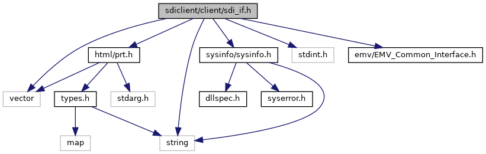

[Data Structures](#nested-classes) \| [Namespaces](#namespaces) \| [Macros](#define-members) \| [Enumerations](#enum-members) \| [Functions](#func-members)

`#include <vector>`
`#include <string>`
`#include <stdint.h>`
`#include <`<a href="_e_m_v___common___interface_8h_source.md">emv/EMV_Common_Interface.h</a>`>`
`#include <`<a href="sysinfo_8h_source.md">sysinfo/sysinfo.h</a>`>`
`#include <`<a href="guiprt_2src_2html_2prt_8h_source.md">html/prt.h</a>`>`

Include dependency graph for sdi_if.h:

<a href="sdi__if_8h_source.md">Go to the source code of this file.</a>

|  |  |
|----|----|
| Data Structures |  |
| struct   | <a href="structlibsdi_1_1_matching_record.md">MatchingRecord</a> |
| class   | <a href="classlibsdi_1_1_sdi_base.md">SdiBase</a> |
| struct   | <a href="classlibsdi_1_1_sdi_base.md#structlibsdi_1_1_sdi_base_1_1_plugin_result">SdiBase::PluginResult</a> |
| class   | <a href="classlibsdi_1_1_sdi_cmd.md">SdiCmd</a> |
|   | Composition for TLV based SDI commands. <a href="classlibsdi_1_1_sdi_cmd.md#details">More...</a>  |
| class   | <a href="classlibsdi_1_1_s_d_i.md">SDI</a> |
| class   | <a href="classlibsdi_1_1_card_detection.md">CardDetection</a> |
|   | Interface for SDI Card Detection Interface, command class 23. <a href="classlibsdi_1_1_card_detection.md#details">More...</a>  |
| class   | <a href="classlibsdi_1_1_p_e_d.md">PED</a> |
| class   | <a href="classlibsdi_1_1_sdi_crypt.md">SdiCrypt</a> |
| struct   | <a href="classlibsdi_1_1_sdi_crypt.md#structlibsdi_1_1_sdi_crypt_1_1_placeholder">SdiCrypt::Placeholder</a> |
| class   | <a href="classlibsdi_1_1_manual_entry.md">ManualEntry</a> |
|   | Interface for SDI command <a href="pg_sdi_users_guide.md#subsubsec_sdi_msr_card_data_entry">MSR Card Data Entry</a> (21-02) <a href="classlibsdi_1_1_manual_entry.md#details">More...</a>  |
| class   | <a href="classlibsdi_1_1_dialog.md">Dialog</a> |

|            |                                                  |
|------------|--------------------------------------------------|
| Namespaces |                                                  |
|            | <a href="namespacelibsdi.md">libsdi</a> |

|  |  |
|----|----|
| Macros |  |
| #define  | [MSR_CLIENT_ERROR_OFFSET](#ac2e95943ecbf1195dec686ece2a1f6b9)   100 |
|   | if a client error happens, msr functions will return (enum SDICLIENT_ERROR - MSR_CLIENT_ERROR_OFFSET) [More\...](#ac2e95943ecbf1195dec686ece2a1f6b9)  |
| #define  | [VALIDATION_CHECK_OPTION_RETURN_ALL_MATCHING_RANGES](#ac084e11acd102c6ed35f7e61189e34d0)   0x01 |

|  |  |
|----|----|
| Enumerations |  |
| enum   | <a href="namespacelibsdi.md#a0af9b7a9de719071122f396865ecebc9">SDI_SW12</a> {   <a href="namespacelibsdi.md#a0af9b7a9de719071122f396865ecebc9a6618acb8d68a00a36aa6aee2b0233e06">SDI_SW12_NONE</a> = 0, <a href="namespacelibsdi.md#a0af9b7a9de719071122f396865ecebc9ae57ec322bacc511a361f808f98f564f3">SDI_SW12_SUCCESS</a> = 0x9000, <a href="namespacelibsdi.md#a0af9b7a9de719071122f396865ecebc9a1beeefc2a6d62a7d0d8057caa66d0ed2">SDI_SW12_TAG_ERROR</a> = 0x6200, <a href="namespacelibsdi.md#a0af9b7a9de719071122f396865ecebc9a1d4321526bd3f9cdc8ca2e9dfbbff6e7">SDI_SW12_TAG_LENGTH_ERROR</a> = 0x6300,   <a href="namespacelibsdi.md#a0af9b7a9de719071122f396865ecebc9af2a5eae6fa460ebfe095ce27b2fd1b87">SDI_SW12_EXEC_ERROR</a> = 0x6400, <a href="namespacelibsdi.md#a0af9b7a9de719071122f396865ecebc9ab03418a12598a6c3e8688c1fd9d79260">SDI_SW12_CANCELED_BY_USER</a> = 0x6405, <a href="namespacelibsdi.md#a0af9b7a9de719071122f396865ecebc9a971fb106a8637b298c5824359aa2061c">SDI_SW12_BUSY</a> = 0x640A, <a href="namespacelibsdi.md#a0af9b7a9de719071122f396865ecebc9a4577fb4a16020814123d3c1fa619d8fd">SDI_SW12_TIMEOUT_PIN_ENTRY</a> = 0x640C,   <a href="namespacelibsdi.md#a0af9b7a9de719071122f396865ecebc9ab8a2a0db5f2f52ee3dd1066a8c04192e">SDI_SW12_TIMEOUT_NO_MSR_DATA</a> = 0x64F6, <a href="namespacelibsdi.md#a0af9b7a9de719071122f396865ecebc9ac806247c865c9bdbb21518f96f619dd0">SDI_SW12_TIMEOUT_CARD_REMOVAL</a> = 0x64F7, <a href="namespacelibsdi.md#a0af9b7a9de719071122f396865ecebc9a5598ca858d64cfb20049ed0d0f4fb910">SDI_SW12_INTERCHAR_PIN_ENTRY</a> = 0x64F8, <a href="namespacelibsdi.md#a0af9b7a9de719071122f396865ecebc9af1291ca386d0f4700445ca995b1863ba">SDI_SW12_COMMAND_NOT_ALLOWED</a> = 0x64F9,   <a href="namespacelibsdi.md#a0af9b7a9de719071122f396865ecebc9a75c4fcd5dcf04c1e0f8f1c9e85e30cec">SDI_SW12_MAIN_CONNECTION_USED</a> = 0x64FA, <a href="namespacelibsdi.md#a0af9b7a9de719071122f396865ecebc9a5a6fb112bf92f4f1239f11c3f714e029">SDI_SW12_INVALID_FILE_CONTENT</a> = 0x64FB, <a href="namespacelibsdi.md#a0af9b7a9de719071122f396865ecebc9abd8c845fec4d2d093eaecff6218f3103">SDI_SW12_FILE_ACCESS_ERROR</a> = 0x64FC, <a href="namespacelibsdi.md#a0af9b7a9de719071122f396865ecebc9a039afb9d4121e94f28511039018c2034">SDI_SW12_LOGIC_ERROR</a> = 0x64FD,   <a href="namespacelibsdi.md#a0af9b7a9de719071122f396865ecebc9a47864240cdffd5d09a3e02ec0d1e70e9">SDI_SW12_SDI_PARAMETER_ERROR</a> = 0x64FE, <a href="namespacelibsdi.md#a0af9b7a9de719071122f396865ecebc9a3abd526d6fd92ac70842b7e43b2313d6">SDI_SW12_LUHN_CHECK_FAILED</a> = 0x64FF, <a href="namespacelibsdi.md#a0af9b7a9de719071122f396865ecebc9afdd1028b32db6ae5abaa47bb3e7560bc">SDI_SW12_EXECUTION_ABORTED</a> = 0x6500, <a href="namespacelibsdi.md#a0af9b7a9de719071122f396865ecebc9a476c3b73e5ff6945ae5a33a27d13d882">SDI_SW12_EXECUTION_TIMEOUT</a> = 0x6600,   <a href="namespacelibsdi.md#a0af9b7a9de719071122f396865ecebc9a0a771976fb50c1b4986efcdd6f34439d">SDI_SW12_MESSAGE_LENGTH_ERROR</a> = 0x6700, <a href="namespacelibsdi.md#a0af9b7a9de719071122f396865ecebc9ac86a5a2c8d2be7d739309bc4b1eb99bc">SDI_SW12_NO_SDI_PLUGIN_AVAILABLE</a> = 0x6800, <a href="namespacelibsdi.md#a0af9b7a9de719071122f396865ecebc9a85faafe48c5a77b74e64371e00f92552">SDI_SW12_UNKNOWN_PLUGIN_ID</a> = 0x6801, <a href="namespacelibsdi.md#a0af9b7a9de719071122f396865ecebc9a154334af8973844fb6186fe237c59c0e">SDI_SW12_UNKNOWN_PLUGING_ID</a> = 0x6801,   <a href="namespacelibsdi.md#a0af9b7a9de719071122f396865ecebc9a6e4e2bf915baeb54c9529294c44b298b">SDI_SW12_INVALID_PLUGIN_RESPONSE</a> = 0x6802, <a href="namespacelibsdi.md#a0af9b7a9de719071122f396865ecebc9a847a49db2ffbf8d1e68b502f582c3dc8">SDI_SW12_EPP_CONNECTION_ERROR</a> = 0x6900, <a href="namespacelibsdi.md#a0af9b7a9de719071122f396865ecebc9a4732718054169c5df10d763f2407cfde">SDI_SW12_UNKNOWN_INS_BYTE</a> = 0x6D00, <a href="namespacelibsdi.md#a0af9b7a9de719071122f396865ecebc9adaafeb9592a43e1b1e1df473878c12e5">SDI_SW12_UNKNOWN_CLA_BYTE</a> = 0x6E00,   <a href="namespacelibsdi.md#a0af9b7a9de719071122f396865ecebc9a2054c4029c27967fc15fc72840efb3c6">SDI_SW12_CMAC_ERROR</a> = 0x6FB0, <a href="namespacelibsdi.md#a0af9b7a9de719071122f396865ecebc9a33c0dc3478cfdc69bc7057961b7109c4">SDI_SW12_CMAC_LENGTH_ERROR</a> = 0x6FB1, <a href="namespacelibsdi.md#a0af9b7a9de719071122f396865ecebc9a01284258ad4e6bff0c61b8702cfb6b56">SDI_SW12_CMAC_MISSING_ERROR</a> = 0x6FB2, <a href="namespacelibsdi.md#a0af9b7a9de719071122f396865ecebc9ad51eaabf82a502ff3ed1cb6c295b8a93">SDI_SW12_ENCRYPTION_ERROR</a> = 0x6FB4,   <a href="namespacelibsdi.md#a0af9b7a9de719071122f396865ecebc9a6e37ee309f409940589fd6c016f35046">SDI_SW12_ENCRYPTION_LENGTH_ERROR</a> = 0x6FB5, <a href="namespacelibsdi.md#a0af9b7a9de719071122f396865ecebc9a6a735e602db3e17a88ae4b0c841bd984">SDI_SW12_ENCRYPTION_MISSING_ERROR</a> = 0x6FB6, <a href="namespacelibsdi.md#a0af9b7a9de719071122f396865ecebc9a55f5fd8eaaf801277b52d842cdf43c44">SDI_SW12_DECRYPTION_ERROR</a> = 0x6FB8, <a href="namespacelibsdi.md#a0af9b7a9de719071122f396865ecebc9a47b9270d9134938f2a233c31bb40d526">SDI_SW12_DECRYPTION_LENGTH_ERROR</a> = 0x6FB9,   <a href="namespacelibsdi.md#a0af9b7a9de719071122f396865ecebc9abf2dd4e4ec4cd3b8f742d09d095ba4d0">SDI_SW12_DECRYPTION_MISSING_ERROR</a> = 0x6FBA, <a href="namespacelibsdi.md#a0af9b7a9de719071122f396865ecebc9aed62853d0c7dd9ab3f8c5760ab64d522">SDI_SW12_EXCESSIVE_PIN_REQUESTS</a> = 0x6FC0, <a href="namespacelibsdi.md#a0af9b7a9de719071122f396865ecebc9a8304873fe61c4d04535d3c1e64b45d1f">SDI_SW12_LOW_BATTERY</a> = 0x6FD0, <a href="namespacelibsdi.md#a0af9b7a9de719071122f396865ecebc9a4889dd18dd1ad0b7344a5d37430bbf78">SDI_SW12_NO_DUKPT_KEYS_LOADED</a> = 0x6FE0,   <a href="namespacelibsdi.md#a0af9b7a9de719071122f396865ecebc9ad9a685bc18c7c8de640ef247e3eee810">SDI_SW12_UNIT_TAMPERED</a> = 0x6FF0, <a href="namespacelibsdi.md#a0af9b7a9de719071122f396865ecebc9ae14e896883c5b5d090245170eb232691">SDI_SW12_RECOVERY_MODE</a> = 0x6FF1, <a href="namespacelibsdi.md#a0af9b7a9de719071122f396865ecebc9adc7785d93b0e59939d5800eeb042a1cb">SDI_SW12_PIN_BYPASSED</a> = 0x9070, <a href="namespacelibsdi.md#a0af9b7a9de719071122f396865ecebc9aa2f57a6386608f977bd13aa7ce1bbc19">SDI_SW12_NO_MACTCH_FOR_CARD_VALIDATION</a> = 0x9071,   <a href="namespacelibsdi.md#a0af9b7a9de719071122f396865ecebc9a7b74452f38eedd39b8a20504ec4f793f">SDI_SW12_SMART_CARD_REMOVED</a> = 0x9401, <a href="namespacelibsdi.md#a0af9b7a9de719071122f396865ecebc9a77445278995fc417f5b2ed7dda4d123f">SDI_SW12_SMART_CARD_ERROR_TRM</a> = 0x9402, <a href="namespacelibsdi.md#a0af9b7a9de719071122f396865ecebc9a87db929ea762f69bdb6ae19d3e2d52b1">SDI_SW12_SMART_CARD_ERROR</a> = 0x9403, <a href="namespacelibsdi.md#a0af9b7a9de719071122f396865ecebc9a586613b1225fbf678b38cee3cf3a7142">SDI_SW12_TWO_CARDS</a> = 0x9404,   <a href="namespacelibsdi.md#a0af9b7a9de719071122f396865ecebc9a092b667be70ac2f9b18163a2f79d120d">SDI_SW12_SMART_CARD_ERR_INIT</a> = 0x9405, <a href="namespacelibsdi.md#a0af9b7a9de719071122f396865ecebc9aa7dbab4cb10df7f71b21f8ef192b9911">SDI_SW12_SMART_CARD_ERR_PARAM</a> = 0x9406, <a href="namespacelibsdi.md#a0af9b7a9de719071122f396865ecebc9aa5cb29a2e25abece508d529c26f9343b">SDI_SW12_EMV_TLV_ERROR</a> = 0x94F3, <a href="namespacelibsdi.md#a0af9b7a9de719071122f396865ecebc9a1bed2506d1ed0457dd51b36e10b879d4">SDI_SW12_ERROR</a> = 0x6400,   <a href="namespacelibsdi.md#a0af9b7a9de719071122f396865ecebc9a9c607d5185c40929820c1c9292d9b51d">SDI_SW12_TIMEOUT</a> = 0x6600, <a href="namespacelibsdi.md#a0af9b7a9de719071122f396865ecebc9a322aa24cbcdd0da17e7d06c6e69197fe">SDI_SW12_NOT_ALLOWED</a> = 0x64FD, <a href="namespacelibsdi.md#a0af9b7a9de719071122f396865ecebc9a153d725d0d6961fca9c22c30d276b8ce">SDI_SW12_PARAMETER_ERROR</a> = 0x90E6 } |
| enum   | <a href="namespacelibsdi.md#a88afe55c2211351a88265153f28797e4">SDICLIENT_ERROR</a> {   <a href="namespacelibsdi.md#a88afe55c2211351a88265153f28797e4a9cadc1bff1d76bb047113cc578078e77">SDICLIENT_ERROR_NONE</a> = 0, <a href="namespacelibsdi.md#a88afe55c2211351a88265153f28797e4aab3b6e7486f51ef410adba644a849a3d">SDICLIENT_ERROR_COMMUNICATION</a> = -1, <a href="namespacelibsdi.md#a88afe55c2211351a88265153f28797e4ab43c112b5f9c1dc09079c3f465da64cf">SDICLIENT_ERROR_CONCURRENT_USE</a> = -2, <a href="namespacelibsdi.md#a88afe55c2211351a88265153f28797e4ac57157366b2f1737fa91428a8eea9abc">SDICLIENT_ERROR_CONNECT</a> = -3,   <a href="namespacelibsdi.md#a88afe55c2211351a88265153f28797e4ad420eeba936f0d2edd106d669eed837a">SDICLIENT_ERROR_OVERFLOW</a> = -4, <a href="namespacelibsdi.md#a88afe55c2211351a88265153f28797e4ad3cf0ecfe1512f2806d2515efdcbf194">SDICLIENT_ERROR_PARAM</a> = -5, <a href="namespacelibsdi.md#a88afe55c2211351a88265153f28797e4ab129b3613fd2cf21c2d573d4499ec5db">SDICLIENT_ERROR_OTHER</a> = -6, <a href="namespacelibsdi.md#a88afe55c2211351a88265153f28797e4ae2341948a78a19f5a780d2f5b3acc750">SDICLIENT_ERROR_NO_RECEIVE</a> = -7,   <a href="namespacelibsdi.md#a88afe55c2211351a88265153f28797e4aa664cf103d2d1be3392f0947649ff331">SDICLIENT_ERROR_NOT_SUPPORTED</a> = -10, <a href="namespacelibsdi.md#a88afe55c2211351a88265153f28797e4a6b95428c9c6cd460b20eae3c5c5516d5">SDICLIENT_ERROR_NOT_ALLOWED</a> = -11 } |
| enum   | <a href="namespacelibsdi.md#af55973ce01a27acae146f17b4a0366fa">SYSUploadType</a> {   <a href="namespacelibsdi.md#af55973ce01a27acae146f17b4a0366faa45f06815e16da88212b9ee5ed2f3ddc8">SYS_UPLOAD_SOFTWARE_UPDATE</a>, <a href="namespacelibsdi.md#af55973ce01a27acae146f17b4a0366faaec0451d262a6044c91a3858f96195f91">SYS_UPLOAD_CONFIG_WHITELIST</a>, <a href="namespacelibsdi.md#af55973ce01a27acae146f17b4a0366faab044559af2f7e7efdb8840a21de1c7e3">SYS_UPLOAD_CONFIG_SENSITIVE_TAGS</a>, <a href="namespacelibsdi.md#af55973ce01a27acae146f17b4a0366faab3e669cc243295e940eba812f8346805">SYS_UPLOAD_CONFIG_CARD_RANGES</a>,   <a href="namespacelibsdi.md#af55973ce01a27acae146f17b4a0366faab12973d84013b26e9f9f89a2f4c7e509">SYS_UPLOAD_INSTALL_CP_PACKAGE</a> = 11, <a href="namespacelibsdi.md#af55973ce01a27acae146f17b4a0366faa1d6e6991b8a3f8c12b9caa76c3c04057">SYS_UPLOAD_EMV_CONFIGURATION</a> } |

|  |  |
|----|----|
| Functions |  |
| enum SDICLIENT_ERROR  | <a href="namespacelibsdi.md#a22b6870acf257e81edc02ef0942b98ed">getNfcClientError</a> () |
| enum SDI_SW12  | <a href="namespacelibsdi.md#a3b0818635e2caaab3b2f98370fb37d16">getNfcSW12</a> () |

------------------------------------------------------------------------

## DataStructure Documentation {#data-structure-documentation}

## libsdi::SdiBase::PluginResult 

struct libsdi::SdiBase::PluginResult

| Data Fields |  |  |
|----|----|----|
| int32_t | pluginId | 
return value of a plugin\'s `moduleID` function also used as INS byte of SDI 26-xx command to invoke a plugin, 0 if not available
 |
| int32_t | responseCode | 
plugin\'s `processTrigger` function return value, <a href="namespacelibsdi.md#a0af9b7a9de719071122f396865ecebc9a6618acb8d68a00a36aa6aee2b0233e06">SDI_SW12_NONE</a> if not available
 |
| vector\< unsigned char \> | responseData | plugin response data |

## libsdi::SdiCrypt::Placeholder 

struct libsdi::SdiCrypt::Placeholder

Data descriptor for <a href="classlibsdi_1_1_sdi_crypt.md#a04dbff235d0bc2ee3965deb24c067bcb">getEncData()</a>, <a href="classlibsdi_1_1_sdi_crypt.md#aa3cbfa1f404ec3a00bf639440ca7d5ce">getEncMsgData()</a> and <a href="classlibsdi_1_1_sdi_crypt.md#a0471fc11895a6a5cfe1c9cc927cde309">getMsgSignature()</a>

| Data Fields |  |  |
|----|----|----|
| vector\< unsigned char \> | applicationData | data that can be referenced in <a href="classlibsdi_1_1_sdi_crypt.md#ac879ba12d37171427ee000d9fa1fb6f5">Placeholder::tagList</a> (DFA120) |
| vector\< unsigned char \> | dataOptions | data formatting options (DFA121) - see SDI programmers guide, getEncData (29-00) |
| vector\< unsigned char \> | tagList | DOL format with length 0 for variable lengths (DF8F30) |

## MacroDefinition Documentation {#macro-definition-documentation}

## MSR_CLIENT_ERROR_OFFSET 

#define MSR_CLIENT_ERROR_OFFSET   100

if a client error happens, msr functions will return (enum SDICLIENT_ERROR - MSR_CLIENT_ERROR_OFFSET)

## VALIDATION_CHECK_OPTION_RETURN_ALL_MATCHING_RANGES 

#define VALIDATION_CHECK_OPTION_RETURN_ALL_MATCHING_RANGES   0x01

