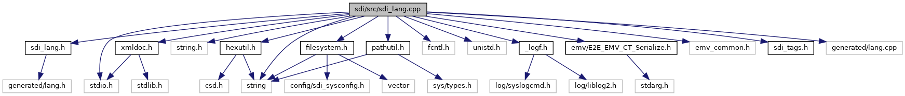

[Namespaces](#namespaces) \| [Macros](#define-members) \| [Functions](#func-members)

`#include "`<a href="sdi__lang_8h_source.md">sdi_lang.h</a>`"`
`#include <stdio.h>`
`#include <string.h>`
`#include <string>`
`#include <fcntl.h>`
`#include <unistd.h>`
`#include "`<a href="__logf_8h_source.md">_logf.h</a>`"`
`#include "`<a href="sdi_2src_2hexutil_8h_source.md">hexutil.h</a>`"`
`#include "`<a href="xmldoc_8h_source.md">xmldoc.h</a>`"`
`#include "`<a href="_e2_e___e_m_v___c_t___serialize_8h_source.md">emv/E2E_EMV_CT_Serialize.h</a>`"`
`#include "emv_common.h"`
`#include "`<a href="src_2sdi__tags_8h_source.md">sdi_tags.h</a>`"`
`#include "`<a href="filesystem_8h_source.md">filesystem.h</a>`"`
`#include "`<a href="pathutil_8h_source.md">pathutil.h</a>`"`
`#include "generated/lang.cpp"`

Include dependency graph for sdi_lang.cpp:

|            |                                            |
|------------|--------------------------------------------|
| Namespaces |                                            |
|            | <a href="namespacesdi.md">sdi</a> |

|  |  |
|----|----|
| Macros |  |
| #define  | [XML_TAG_TERMDATA](#a222621e71edebae1ad5520a19b59fbf3)   \"TerminalData\" |
| #define  | [XML_TAG_TERMDATA_SUPP_LANG](#a77460b946c3b46533edfbdbd3a6caf4c)   \"SuppLang\" |

|  |  |
|----|----|
| Functions |  |
| Language  | <a href="namespacesdi.md#a4353239935bf1239c84dfa9020272ad3">languageSupported</a> (unsigned val) |
| const char \*  | <a href="namespacesdi.md#a97211a5500a8f9b7e877624f5330460f">getLanguageIsoCode</a> (Language lang_id) |
| unsigned  | <a href="namespacesdi.md#a41554c6333a616786bb285dc51ab8ba9">getLanguage</a> (const char \*ISO_639) |

## MacroDefinition Documentation {#macro-definition-documentation}

## XML_TAG_TERMDATA 

#define XML_TAG_TERMDATA   \"TerminalData\"

## XML_TAG_TERMDATA_SUPP_LANG 

#define XML_TAG_TERMDATA_SUPP_LANG   \"SuppLang\"

