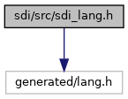
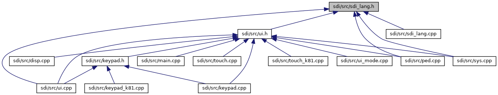

[Data Structures](#nested-classes) \| [Namespaces](#namespaces) \| [Functions](#func-members)

`#include "generated/lang.h"`

Include dependency graph for sdi_lang.h:

This graph shows which files directly or indirectly include this file:

<a href="sdi__lang_8h_source.md">Go to the source code of this file.</a>

|  |  |
|----|----|
| Data Structures |  |
| class   | <a href="classsdi_1_1_sdi_language.md">SdiLanguage</a> |

|            |                                            |
|------------|--------------------------------------------|
| Namespaces |                                            |
|            | <a href="namespacesdi.md">sdi</a> |

|  |  |
|----|----|
| Functions |  |
| Language  | <a href="namespacesdi.md#a4353239935bf1239c84dfa9020272ad3">languageSupported</a> (unsigned val) |
| const char \*  | <a href="namespacesdi.md#a97211a5500a8f9b7e877624f5330460f">getLanguageIsoCode</a> (Language lang_id) |
| unsigned  | <a href="namespacesdi.md#a41554c6333a616786bb285dc51ab8ba9">getLanguage</a> (const char \*ISO_639) |
