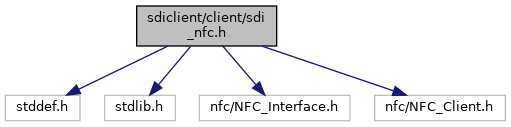

[Namespaces](#namespaces) \| [Macros](#define-members) \| [Functions](#func-members)

`#include <stddef.h>`
`#include <stdlib.h>`
`#include <nfc/NFC_Interface.h>`
`#include <nfc/NFC_Client.h>`

Include dependency graph for sdi_nfc.h:

<a href="sdi__nfc_8h_source.md">Go to the source code of this file.</a>

|            |                                                  |
|------------|--------------------------------------------------|
| Namespaces |                                                  |
|            | <a href="namespacelibsdi.md">libsdi</a> |

|  |  |
|----|----|
| Macros |  |
| #define  | [NFC_Client_Init](#a7a9419cd6aa7aa9185fb249ce761ae0f)   libsdi::NFC_Client_Init |
| #define  | [NFC_Client_Init_CheckVer](#a5f084aa038d869023d4adcf5324535ff)   libsdi::NFC_Client_Init_CheckVer |
| #define  | [NFC_SerialOpen](#a70bb11b4c0d061db8ca5435f17187ca3)   libsdi::NFC_SerialOpen |
| #define  | [NFC_SerialClose](#a3f4b01935c33a7b7339187ae0baba2e0)   libsdi::NFC_SerialClose |
| #define  | [NFC_Ping](#a2a6ea83c72ad383401d3f00e51d25e23)   libsdi::NFC_Ping |
| #define  | [NFC_Get_Version](#a7e475d639fe88323208beef908223ab2)   libsdi::NFC_Get_Version |
| #define  | [NFC_Config_Init](#a66b104ffc591487c0725461adc5fbbee)   libsdi::NFC_Config_Init |
| #define  | [NFC_Set_Callback_Function](#aa57659975f2480a1d07845e181de9519)   libsdi::NFC_Set_Callback_Function |
| #define  | [NFC_Callback_Test](#a91e433117cd636124dc1c94b3ae757c9)   libsdi::NFC_Callback_Test |
| #define  | [NFC_PT_Open](#a9407a28ffd731a86c08d5c9e13ecd2a4)   libsdi::NFC_PT_Open |
| #define  | [NFC_PT_Close](#ac9e3d1e964ffb8bb3923e989b968df0d)   libsdi::NFC_PT_Close |
| #define  | [NFC_PT_FieldOn](#a099ef9f3ff7261bac7bedd140613dba6)   libsdi::NFC_PT_FieldOn |
| #define  | [NFC_PT_FieldOff](#ac02dad845a9116e51a68f4bfb394d93b)   libsdi::NFC_PT_FieldOff |
| #define  | [NFC_PT_Polling](#a309c7373d9b530f7c6027466d7e6f6f7)   libsdi::NFC_PT_Polling |
| #define  | [NFC_PT_PollingFull](#abcc66aaf4a10a256c2c303487e8507f7)   libsdi::NFC_PT_PollingFull |
| #define  | [NFC_Free_Poll_Data](#abee9ce46691f1a791035539bdccd55c4)   libsdi::NFC_Free_Poll_Data |
| #define  | [NFC_Free_Poll_Data_Full](#a82a122b52e7c6e1f461117a1ebda6949)   libsdi::NFC_Free_Poll_Data_Full |
| #define  | [NFC_PT_Cancel_Polling](#a167c5c7e903dd7f5a3acdb70f7ff8a66)   libsdi::NFC_PT_Cancel_Polling |
| #define  | [NFC_PT_Activation](#a3eabcba13619a1388458848aeb81234c)   libsdi::NFC_PT_Activation |
| #define  | [NFC_PT_FtechBaud](#a653f2131d7eae300a7035a7b5430405c)   libsdi::NFC_PT_FtechBaud |
| #define  | [NFC_PT_TxRx](#a668a6a40090d34ee7f9314a9b7a1e67c)   libsdi::NFC_PT_TxRx |
| #define  | [NFC_Mifare_Authenticate](#a754f2fb39a1132dc5de68a8c6743d23b)   libsdi::NFC_Mifare_Authenticate |
| #define  | [NFC_Mifare_Read](#ad1171a19fb3b2b1545a91c49da67b341)   libsdi::NFC_Mifare_Read |
| #define  | [NFC_Mifare_Write](#aa07a2c9d57d47e0dfd9099cd3f739321)   libsdi::NFC_Mifare_Write |
| #define  | [NFC_Mifare_Increment](#a52a8a28d2317e77994570d6e9dbfc599)   libsdi::NFC_Mifare_Increment |
| #define  | [NFC_Mifare_Decrement](#a1c3ab8af1973a4c01ee1125a256c9fcc)   libsdi::NFC_Mifare_Decrement |
| #define  | [NFC_Mifare_Increment_Only](#a81854a6696f2ef4942925eefb6615003)   libsdi::NFC_Mifare_Increment_Only |
| #define  | [NFC_Mifare_Decrement_Only](#a95b9daa11669ad992967dd8e1dad539b)   libsdi::NFC_Mifare_Decrement_Only |
| #define  | [NFC_Mifare_Transfer](#ae3c299890ef9f3eb9306edc7415fe1d1)   libsdi::NFC_Mifare_Transfer |
| #define  | [NFC_Mifare_Restore](#a15263dc4011284d7a3dae61c1a8f7114)   libsdi::NFC_Mifare_Restore |
| #define  | [NFC_Felica_Exchange](#a32cdb54809cf1386509bb5f5eaf05bad)   libsdi::NFC_Felica_Exchange |
| #define  | [NFC_Felica_Polling](#aeaf5016cc3f72d1b8587281997fa9aa4)   libsdi::NFC_Felica_Polling |
| #define  | [NFC_APDU_Exchange](#ac17cf22c461d04ea8daf5f2993e559d9)   libsdi::NFC_APDU_Exchange |
| #define  | [NFC_Terminal_Config](#a86d1953748c0d7e6b9e621c2a36dd8e9)   libsdi::NFC_Terminal_Config |
| #define  | [NFC_TERMINAL_ReadConfig](#a064b234e44e08f833cc9d2e153260164)   libsdi::NFC_TERMINAL_ReadConfig |
| #define  | [NFC_VAS_ReadConfig](#a7a81c9d472b5da94ae76272358f38dac)   libsdi::NFC_VAS_ReadConfig |
| #define  | [NFC_VAS_Activate](#a4dc6d61bb9ed1d3e8cef769db32f6ac6)   libsdi::NFC_VAS_Activate |
| #define  | [NFC_VAS_Cancel](#a2ae23fb43b8c06ebd88933e1a1b46aa1)   libsdi::NFC_VAS_Cancel |
| #define  | [NFC_VAS_UpdateConfig](#aade0ed84b10cb0108216011ba8a30993)   libsdi::NFC_VAS_UpdateConfig |
| #define  | [NFC_VAS_CancelConfig](#a1667152f04801a8ef8bb47c5ea3b8930)   libsdi::NFC_VAS_CancelConfig |
| #define  | [NFC_VAS_PreLoad](#a071c33860fb2cf846a1466edf5bedfb7)   libsdi::NFC_VAS_PreLoad |
| #define  | [NFC_VAS_CancelPreLoad](#a097ab5411367f3b1b4275d1ae3567219)   libsdi::NFC_VAS_CancelPreLoad |
| #define  | [NFC_VAS_Decrypt](#a800f9f9d4df08b07fe4c28116dda9c90)   libsdi::NFC_VAS_Decrypt |
| #define  | [NFC_VAS_Action](#afbf908bd85c0c1318f763e880bb09571)   libsdi::NFC_VAS_Action |

|  |  |
|----|----|
| Functions |  |
| CL_STATUS  | <a href="namespacelibsdi.md#ac04174b3f4524e1f9942ebd550ec4743">NFC_Client_Init</a> (CONNECTION_TYPE type) |
| CL_STATUS  | <a href="namespacelibsdi.md#acd919133d0159ee801b6a3b9afdd50ed">NFC_Client_Init_CheckVer</a> (CONNECTION_TYPE type, int maj, int <a href="http__get__curl_8c.md#a8195a86b6d75b9a3939505e8bb50021e">min</a>, int bld) |
| CL_STATUS  | <a href="namespacelibsdi.md#a016910912f29079a54e53843aa248424">NFC_SerialOpen</a> (void) |
| CL_STATUS  | <a href="namespacelibsdi.md#a0dac7cde7c42f27b7d0999f524f1213f">NFC_SerialClose</a> (void) |
| <a href="titusstubs_8cpp.md#a42e167e83e1f0229d501a09e3f1d2b1a">ResponseCodes</a>  | <a href="namespacelibsdi.md#af2720b510afe83dfbb88f8525998110e">NFC_Ping</a> (<a href="titusstubs_8cpp.md#structraw_data">rawData</a> \*output) |
| <a href="titusstubs_8cpp.md#a42e167e83e1f0229d501a09e3f1d2b1a">ResponseCodes</a>  | <a href="namespacelibsdi.md#ac67395030324faba382bf017a031cccd">NFC_Get_Version</a> (<a href="titusstubs_8cpp.md#structraw_data">rawData</a> \*output) |
| <a href="titusstubs_8cpp.md#a42e167e83e1f0229d501a09e3f1d2b1a">ResponseCodes</a>  | <a href="namespacelibsdi.md#adeae9cc7983e75ba2a418f4227eb8e33">NFC_Config_Init</a> (void) |
| <a href="titusstubs_8cpp.md#a42e167e83e1f0229d501a09e3f1d2b1a">ResponseCodes</a>  | <a href="namespacelibsdi.md#a2e0afcf19bc4945282d984edfcb26b5d">NFC_Set_Callback_Function</a> (<a href="titusstubs_8cpp.md#structraw_data">rawData</a> \*id, <a href="titusstubs_8cpp.md#a09e0971bdc5fca16b920275a5f9aa508">NfcCallbackFunction</a> \*callbackFunction) |
| <a href="titusstubs_8cpp.md#a42e167e83e1f0229d501a09e3f1d2b1a">ResponseCodes</a>  | <a href="namespacelibsdi.md#a49339ad1d7b339377f38add056b17d2b">NFC_Callback_Test</a> (void) |
| <a href="titusstubs_8cpp.md#a42e167e83e1f0229d501a09e3f1d2b1a">ResponseCodes</a>  | <a href="namespacelibsdi.md#a725fcbe27b01fb76f0a311837df2b6a2">NFC_PT_Open</a> () |
| <a href="titusstubs_8cpp.md#a42e167e83e1f0229d501a09e3f1d2b1a">ResponseCodes</a>  | <a href="namespacelibsdi.md#a1ed7f9f633b243555c21f6e743f93818">NFC_PT_Close</a> () |
| <a href="titusstubs_8cpp.md#a42e167e83e1f0229d501a09e3f1d2b1a">ResponseCodes</a>  | <a href="namespacelibsdi.md#aac507fa74c6e4dee274e8e319fae53b4">NFC_PT_FieldOn</a> () |
| <a href="titusstubs_8cpp.md#a42e167e83e1f0229d501a09e3f1d2b1a">ResponseCodes</a>  | <a href="namespacelibsdi.md#a6d22f7f2995498c3deeff5ca14f035cd">NFC_PT_FieldOff</a> () |
| <a href="titusstubs_8cpp.md#a42e167e83e1f0229d501a09e3f1d2b1a">ResponseCodes</a>  | <a href="namespacelibsdi.md#a7b8940cfad41a41aa030a403673ff08e">NFC_PT_Polling</a> (<a href="titusstubs_8cpp.md#ab4fc5a0481fff4756bbb875051581e61">pollReq</a> \*inPollReq, <a href="titusstubs_8cpp.md#abc99c096c433e8ed2fc1a6ac42d2bbc6">pollRes</a> \*outPollRes) |
| <a href="titusstubs_8cpp.md#a42e167e83e1f0229d501a09e3f1d2b1a">ResponseCodes</a>  | <a href="namespacelibsdi.md#a4a38cf0fdbc941135a826e5fb44eeb72">NFC_PT_PollingFull</a> (<a href="titusstubs_8cpp.md#ab4fc5a0481fff4756bbb875051581e61">pollReq</a> \*inPollReq, <a href="titusstubs_8cpp.md#abffd13a24a89d1aedf98ae22d6e40eb4">pollResFull</a> \*outPollRes) |
| void  | <a href="namespacelibsdi.md#afd6ca719b830ca453cc910dda46abdd6">NFC_Free_Poll_Data</a> (<a href="titusstubs_8cpp.md#abc99c096c433e8ed2fc1a6ac42d2bbc6">pollRes</a> \*outPollRes) |
| void  | <a href="namespacelibsdi.md#a55f7271ee3dd3c5f13e12aa2dd80f989">NFC_Free_Poll_Data_Full</a> (<a href="titusstubs_8cpp.md#abffd13a24a89d1aedf98ae22d6e40eb4">pollResFull</a> \*outPollRes) |
| <a href="titusstubs_8cpp.md#a42e167e83e1f0229d501a09e3f1d2b1a">ResponseCodes</a>  | <a href="namespacelibsdi.md#a79e97742ed363fa19b107b3306f5628d">NFC_PT_Cancel_Polling</a> (void) |
| <a href="titusstubs_8cpp.md#a42e167e83e1f0229d501a09e3f1d2b1a">ResponseCodes</a>  | <a href="namespacelibsdi.md#a81820d4b1d383f7dbec708a62be8682c">NFC_PT_Activation</a> (<a href="titusstubs_8cpp.md#aaa127d57ebb465856805042ac5cd3276">NFC_CARD_TYPE</a> cardtype, <a href="titusstubs_8cpp.md#structraw_data">rawData</a> \*rd_activationData) |
| <a href="titusstubs_8cpp.md#a42e167e83e1f0229d501a09e3f1d2b1a">ResponseCodes</a>  | <a href="namespacelibsdi.md#a1f60cbbb8ab69f84d3dea7bc2370be7f">NFC_PT_FtechBaud</a> (<a href="titusstubs_8cpp.md#afbdd40a0f001fb7ab2c52ee99422b5eb">NFC_F_BAUD</a> baud) |
| <a href="titusstubs_8cpp.md#a42e167e83e1f0229d501a09e3f1d2b1a">ResponseCodes</a>  | <a href="namespacelibsdi.md#a1f3eb229b32c5a66e9249be7be57cdfe">NFC_PT_TxRx</a> (<a href="titusstubs_8cpp.md#aaa127d57ebb465856805042ac5cd3276">NFC_CARD_TYPE</a> cardtype, <a href="titusstubs_8cpp.md#structraw_data">rawData</a> \*inBuff, <a href="titusstubs_8cpp.md#structraw_data">rawData</a> \*outBuff) |
| <a href="titusstubs_8cpp.md#a42e167e83e1f0229d501a09e3f1d2b1a">ResponseCodes</a>  | <a href="namespacelibsdi.md#a6307dc1a4339c298bbeaf61ffff8fb4f">NFC_Mifare_Authenticate</a> (unsigned char blockNumber, <a href="titusstubs_8cpp.md#a72881cdace76f5df6b0296a826ea71ee">MIFARE_KEY_TYPE</a> keyType, <a href="titusstubs_8cpp.md#structraw_data">rawData</a> \*Key) |
| <a href="titusstubs_8cpp.md#a42e167e83e1f0229d501a09e3f1d2b1a">ResponseCodes</a>  | <a href="namespacelibsdi.md#a1bab92fb0966e68a4318d6fec39cd501">NFC_Mifare_Read</a> (<a href="titusstubs_8cpp.md#a305e8ef6dafad4980a3c94ce20eb4528">I_MIFARE_CARD_TYPE</a> m_cardType, unsigned int StartBlockNum, unsigned int blockAmount, <a href="titusstubs_8cpp.md#structraw_data">rawData</a> \*out_buff) |
| <a href="titusstubs_8cpp.md#a42e167e83e1f0229d501a09e3f1d2b1a">ResponseCodes</a>  | <a href="namespacelibsdi.md#ad4b883fc075f8f66b860ca97cb1a06d5">NFC_Mifare_Write</a> (<a href="titusstubs_8cpp.md#a305e8ef6dafad4980a3c94ce20eb4528">I_MIFARE_CARD_TYPE</a> m_cardType, unsigned int StartBlockNum, unsigned int blockAmount, <a href="titusstubs_8cpp.md#structraw_data">rawData</a> \*in_buff) |
| <a href="titusstubs_8cpp.md#a42e167e83e1f0229d501a09e3f1d2b1a">ResponseCodes</a>  | <a href="namespacelibsdi.md#ac25aa2323c5c8bc10a993d2e89335037">NFC_Mifare_Increment</a> (unsigned int blockNum, int amount) |
| <a href="titusstubs_8cpp.md#a42e167e83e1f0229d501a09e3f1d2b1a">ResponseCodes</a>  | <a href="namespacelibsdi.md#ad95d22bd21e99d44afccdf91e45daaa4">NFC_Mifare_Decrement</a> (unsigned int blockNum, int amount) |
| <a href="titusstubs_8cpp.md#a42e167e83e1f0229d501a09e3f1d2b1a">ResponseCodes</a>  | <a href="namespacelibsdi.md#a0501c6d614390321c449b609148b8b79">NFC_Mifare_Increment_Only</a> (unsigned int blockNum, int amount) |
| <a href="titusstubs_8cpp.md#a42e167e83e1f0229d501a09e3f1d2b1a">ResponseCodes</a>  | <a href="namespacelibsdi.md#a35e059c78ad0c5b3a64bf731ea025565">NFC_Mifare_Decrement_Only</a> (unsigned int blockNum, int amount) |
| <a href="titusstubs_8cpp.md#a42e167e83e1f0229d501a09e3f1d2b1a">ResponseCodes</a>  | <a href="namespacelibsdi.md#af34c2125714ab64c3b6f6483bb481f1b">NFC_Mifare_Transfer</a> (unsigned int blockNum) |
| <a href="titusstubs_8cpp.md#a42e167e83e1f0229d501a09e3f1d2b1a">ResponseCodes</a>  | <a href="namespacelibsdi.md#a9dd06c4cbae1d1c5148120dd166a3ddf">NFC_Mifare_Restore</a> (unsigned int blockNum) |
| <a href="titusstubs_8cpp.md#a42e167e83e1f0229d501a09e3f1d2b1a">ResponseCodes</a>  | <a href="namespacelibsdi.md#a608fb992b1d21dad9dd507d0b7673d27">NFC_Felica_Exchange</a> (<a href="titusstubs_8cpp.md#structfelica_tx_data">felicaTxData</a> \*in_buff, <a href="titusstubs_8cpp.md#structfelica_rx_data">felicaRxData</a> \*out_buff) |
| <a href="titusstubs_8cpp.md#a42e167e83e1f0229d501a09e3f1d2b1a">ResponseCodes</a>  | <a href="namespacelibsdi.md#afbc84f034c17d26d0254a0ee0bca9da6">NFC_Felica_Polling</a> (unsigned int pollTimeout, <a href="titusstubs_8cpp.md#structfelica_polling">felicaPolling</a> \*inData, <a href="titusstubs_8cpp.md#structfelica_polling_output">felicaPollingOutput</a> \*outData) |
| <a href="titusstubs_8cpp.md#a42e167e83e1f0229d501a09e3f1d2b1a">ResponseCodes</a>  | <a href="namespacelibsdi.md#ab4e820ce6573ae601d8a3a66d7a775ec">NFC_APDU_Exchange</a> (<a href="titusstubs_8cpp.md#structapdu_tx_data">apduTxData</a> \*txData, <a href="titusstubs_8cpp.md#structapdu_rx_data">apduRxData</a> \*rxData) |
| <a href="titusstubs_8cpp.md#a23878ec2ab700ea0ebd617a736ff664d">VasStatus</a>  | <a href="namespacelibsdi.md#a3b0973ce25d6c02fcd568cd2c7cc8a76">NFC_Terminal_Config</a> (<a href="titusstubs_8cpp.md#structraw_data">rawData</a> \*input, <a href="titusstubs_8cpp.md#structraw_data">rawData</a> \*output) |
| <a href="titusstubs_8cpp.md#a23878ec2ab700ea0ebd617a736ff664d">VasStatus</a>  | <a href="namespacelibsdi.md#a55382d02bcabcb88a34fa55bc671a87d">NFC_TERMINAL_ReadConfig</a> (<a href="titusstubs_8cpp.md#structraw_data">rawData</a> \*id, <a href="titusstubs_8cpp.md#structraw_data">rawData</a> \*output) |
| <a href="titusstubs_8cpp.md#a23878ec2ab700ea0ebd617a736ff664d">VasStatus</a>  | <a href="namespacelibsdi.md#adf9ad7a8bd41321326437e43912f5142">NFC_VAS_ReadConfig</a> (<a href="titusstubs_8cpp.md#structraw_data">rawData</a> \*id, <a href="titusstubs_8cpp.md#structraw_data">rawData</a> \*output) |
| <a href="titusstubs_8cpp.md#a23878ec2ab700ea0ebd617a736ff664d">VasStatus</a>  | <a href="namespacelibsdi.md#a9bbdb328e88858f94fdf1044e570c104">NFC_VAS_Activate</a> (<a href="titusstubs_8cpp.md#structraw_data">rawData</a> \*id, <a href="titusstubs_8cpp.md#structraw_data">rawData</a> \*input, <a href="titusstubs_8cpp.md#structraw_data">rawData</a> \*output) |
| <a href="titusstubs_8cpp.md#a23878ec2ab700ea0ebd617a736ff664d">VasStatus</a>  | <a href="namespacelibsdi.md#a1dd2e9ef4621db0030ee9018f2ff5169">NFC_VAS_Cancel</a> (void) |
| <a href="titusstubs_8cpp.md#a23878ec2ab700ea0ebd617a736ff664d">VasStatus</a>  | <a href="namespacelibsdi.md#ab54ae674653c3a11b093fa18cb181f96">NFC_VAS_UpdateConfig</a> (<a href="titusstubs_8cpp.md#structraw_data">rawData</a> \*id, <a href="titusstubs_8cpp.md#structraw_data">rawData</a> \*input, <a href="titusstubs_8cpp.md#structraw_data">rawData</a> \*output) |
| <a href="titusstubs_8cpp.md#a23878ec2ab700ea0ebd617a736ff664d">VasStatus</a>  | <a href="namespacelibsdi.md#a5569bbf869f3660c48940654b06b17a6">NFC_VAS_CancelConfig</a> (<a href="titusstubs_8cpp.md#structraw_data">rawData</a> \*id) |
| <a href="titusstubs_8cpp.md#a23878ec2ab700ea0ebd617a736ff664d">VasStatus</a>  | <a href="namespacelibsdi.md#a1462bff8b73099bdb78609ecf374ce30">NFC_VAS_PreLoad</a> (<a href="titusstubs_8cpp.md#structraw_data">rawData</a> \*id, <a href="titusstubs_8cpp.md#structraw_data">rawData</a> \*input, <a href="titusstubs_8cpp.md#structraw_data">rawData</a> \*output) |
| <a href="titusstubs_8cpp.md#a23878ec2ab700ea0ebd617a736ff664d">VasStatus</a>  | <a href="namespacelibsdi.md#a1de872f3d1cecf8d7b266773910bfe4b">NFC_VAS_CancelPreLoad</a> (<a href="titusstubs_8cpp.md#structraw_data">rawData</a> \*id) |
| <a href="titusstubs_8cpp.md#a23878ec2ab700ea0ebd617a736ff664d">VasStatus</a>  | <a href="namespacelibsdi.md#afe16916defaa30dac8f7df05e097e92e">NFC_VAS_Decrypt</a> (<a href="titusstubs_8cpp.md#structraw_data">rawData</a> \*id, <a href="titusstubs_8cpp.md#structraw_data">rawData</a> \*input, <a href="titusstubs_8cpp.md#structraw_data">rawData</a> \*output) |
| <a href="titusstubs_8cpp.md#a23878ec2ab700ea0ebd617a736ff664d">VasStatus</a>  | <a href="namespacelibsdi.md#a634649fbecf2d18816f6e48854916d79">NFC_VAS_Action</a> (<a href="titusstubs_8cpp.md#structraw_data">rawData</a> \*id, int action, <a href="titusstubs_8cpp.md#structraw_data">rawData</a> \*inData, <a href="titusstubs_8cpp.md#structraw_data">rawData</a> \*outBuff) |

## MacroDefinition Documentation {#macro-definition-documentation}

## NFC_APDU_Exchange 

#define NFC_APDU_Exchange   libsdi::NFC_APDU_Exchange

## NFC_Callback_Test 

#define NFC_Callback_Test   libsdi::NFC_Callback_Test

## NFC_Client_Init 

#define NFC_Client_Init   libsdi::NFC_Client_Init

## NFC_Client_Init_CheckVer 

#define NFC_Client_Init_CheckVer   libsdi::NFC_Client_Init_CheckVer

## NFC_Config_Init 

#define NFC_Config_Init   libsdi::NFC_Config_Init

## NFC_Felica_Exchange 

#define NFC_Felica_Exchange   libsdi::NFC_Felica_Exchange

## NFC_Felica_Polling 

#define NFC_Felica_Polling   libsdi::NFC_Felica_Polling

## NFC_Free_Poll_Data 

#define NFC_Free_Poll_Data   libsdi::NFC_Free_Poll_Data

## NFC_Free_Poll_Data_Full 

#define NFC_Free_Poll_Data_Full   libsdi::NFC_Free_Poll_Data_Full

## NFC_Get_Version 

#define NFC_Get_Version   libsdi::NFC_Get_Version

## NFC_Mifare_Authenticate 

#define NFC_Mifare_Authenticate   libsdi::NFC_Mifare_Authenticate

## NFC_Mifare_Decrement 

#define NFC_Mifare_Decrement   libsdi::NFC_Mifare_Decrement

## NFC_Mifare_Decrement_Only 

#define NFC_Mifare_Decrement_Only   libsdi::NFC_Mifare_Decrement_Only

## NFC_Mifare_Increment 

#define NFC_Mifare_Increment   libsdi::NFC_Mifare_Increment

## NFC_Mifare_Increment_Only 

#define NFC_Mifare_Increment_Only   libsdi::NFC_Mifare_Increment_Only

## NFC_Mifare_Read 

#define NFC_Mifare_Read   libsdi::NFC_Mifare_Read

## NFC_Mifare_Restore 

#define NFC_Mifare_Restore   libsdi::NFC_Mifare_Restore

## NFC_Mifare_Transfer 

#define NFC_Mifare_Transfer   libsdi::NFC_Mifare_Transfer

## NFC_Mifare_Write 

#define NFC_Mifare_Write   libsdi::NFC_Mifare_Write

## NFC_Ping 

#define NFC_Ping   libsdi::NFC_Ping

## NFC_PT_Activation 

#define NFC_PT_Activation   libsdi::NFC_PT_Activation

## NFC_PT_Cancel_Polling 

#define NFC_PT_Cancel_Polling   libsdi::NFC_PT_Cancel_Polling

## NFC_PT_Close 

#define NFC_PT_Close   libsdi::NFC_PT_Close

## NFC_PT_FieldOff 

#define NFC_PT_FieldOff   libsdi::NFC_PT_FieldOff

## NFC_PT_FieldOn 

#define NFC_PT_FieldOn   libsdi::NFC_PT_FieldOn

## NFC_PT_FtechBaud 

#define NFC_PT_FtechBaud   libsdi::NFC_PT_FtechBaud

## NFC_PT_Open 

#define NFC_PT_Open   libsdi::NFC_PT_Open

## NFC_PT_Polling 

#define NFC_PT_Polling   libsdi::NFC_PT_Polling

## NFC_PT_PollingFull 

#define NFC_PT_PollingFull   libsdi::NFC_PT_PollingFull

## NFC_PT_TxRx 

#define NFC_PT_TxRx   libsdi::NFC_PT_TxRx

## NFC_SerialClose 

#define NFC_SerialClose   libsdi::NFC_SerialClose

## NFC_SerialOpen 

#define NFC_SerialOpen   libsdi::NFC_SerialOpen

## NFC_Set_Callback_Function 

#define NFC_Set_Callback_Function   libsdi::NFC_Set_Callback_Function

## NFC_Terminal_Config 

#define NFC_Terminal_Config   libsdi::NFC_Terminal_Config

## NFC_TERMINAL_ReadConfig 

#define NFC_TERMINAL_ReadConfig   libsdi::NFC_TERMINAL_ReadConfig

## NFC_VAS_Action 

#define NFC_VAS_Action   libsdi::NFC_VAS_Action

## NFC_VAS_Activate 

#define NFC_VAS_Activate   libsdi::NFC_VAS_Activate

## NFC_VAS_Cancel 

#define NFC_VAS_Cancel   libsdi::NFC_VAS_Cancel

## NFC_VAS_CancelConfig 

#define NFC_VAS_CancelConfig   libsdi::NFC_VAS_CancelConfig

## NFC_VAS_CancelPreLoad 

#define NFC_VAS_CancelPreLoad   libsdi::NFC_VAS_CancelPreLoad

## NFC_VAS_Decrypt 

#define NFC_VAS_Decrypt   libsdi::NFC_VAS_Decrypt

## NFC_VAS_PreLoad 

#define NFC_VAS_PreLoad   libsdi::NFC_VAS_PreLoad

## NFC_VAS_ReadConfig 

#define NFC_VAS_ReadConfig   libsdi::NFC_VAS_ReadConfig

## NFC_VAS_UpdateConfig 

#define NFC_VAS_UpdateConfig   libsdi::NFC_VAS_UpdateConfig

