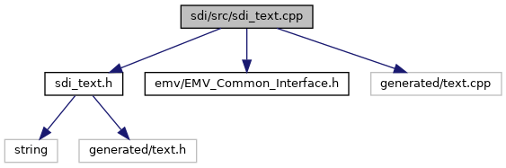

[Namespaces](#namespaces) \| [Functions](#func-members)

`#include "`<a href="sdi__text_8h_source.md">sdi_text.h</a>`"`
`#include "`<a href="_e_m_v___common___interface_8h_source.md">emv/EMV_Common_Interface.h</a>`"`
`#include "generated/text.cpp"`

Include dependency graph for sdi_text.cpp:

|            |                                            |
|------------|--------------------------------------------|
| Namespaces |                                            |
|            | <a href="namespacesdi.md">sdi</a> |

|  |  |
|----|----|
| Functions |  |
| const std::string  | <a href="namespacesdi.md#acbe03b26f4cc788074b40c5f8245bc21">getInternalTextKey</a> (unsigned EmvTextId) |
