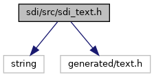
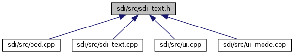

[Namespaces](#namespaces) \| [Functions](#func-members)

`#include <string>`
`#include "generated/text.h"`

Include dependency graph for sdi_text.h:

This graph shows which files directly or indirectly include this file:

<a href="sdi__text_8h_source.md">Go to the source code of this file.</a>

|            |                                            |
|------------|--------------------------------------------|
| Namespaces |                                            |
|            | <a href="namespacesdi.md">sdi</a> |

|  |  |
|----|----|
| Functions |  |
| const std::string  | <a href="namespacesdi.md#acbe03b26f4cc788074b40c5f8245bc21">getInternalTextKey</a> (unsigned EmvTextId) |
