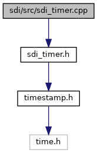

[Namespaces](#namespaces)

`#include "`<a href="sdi__timer_8h_source.md">sdi_timer.h</a>`"`

Include dependency graph for sdi_timer.cpp:

|            |                                            |
|------------|--------------------------------------------|
| Namespaces |                                            |
|            | <a href="namespacesdi.md">sdi</a> |
