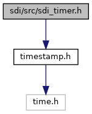
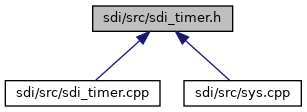

[Data Structures](#nested-classes) \| [Namespaces](#namespaces)

`#include "`<a href="sdi_2src_2timestamp_8h_source.md">timestamp.h</a>`"`

Include dependency graph for sdi_timer.h:

This graph shows which files directly or indirectly include this file:

<a href="sdi__timer_8h_source.md">Go to the source code of this file.</a>

|                 |                                                    |
|-----------------|----------------------------------------------------|
| Data Structures |                                                    |
| class           | <a href="classsdi_1_1_timer.md">Timer</a> |

|            |                                            |
|------------|--------------------------------------------|
| Namespaces |                                            |
|            | <a href="namespacesdi.md">sdi</a> |
