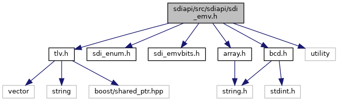
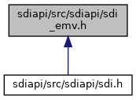
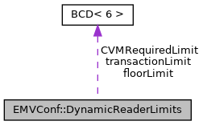

[Data Structures](#nested-classes) \| [Namespaces](#namespaces) \| [Macros](#define-members) \| [Typedefs](#typedef-members)

`#include "`<a href="tlv_8h_source.md">tlv.h</a>`"`
`#include "`<a href="sdi__enum_8h_source.md">sdi_enum.h</a>`"`
`#include "`<a href="sdi__emvbits_8h_source.md">sdi_emvbits.h</a>`"`
`#include "`<a href="array_8h_source.md">array.h</a>`"`
`#include "`<a href="bcd_8h_source.md">bcd.h</a>`"`
`#include <utility>`

Include dependency graph for sdi_emv.h:

This graph shows which files directly or indirectly include this file:

<a href="sdiapi_2src_2sdiapi_2sdi__emv_8h_source.md">Go to the source code of this file.</a>

|  |  |
|----|----|
| Data Structures |  |
| class   | <a href="classvfisdi_1_1_e_m_v_special_transactions.md">EMVSpecialTransactions</a> |
| struct   | <a href="structvfisdi_1_1_e_m_v_conf.md">EMVConf</a> |
| struct   | <a href="structvfisdi_1_1_e_m_v_conf.md#structvfisdi_1_1_e_m_v_conf_1_1_dynamic_reader_limits">EMVConf::DynamicReaderLimits</a> |
| struct   | <a href="structvfisdi_1_1_e_m_v_txn.md">EMVTxn</a> |
| struct   | <a href="structvfisdi_1_1_e_m_v_txn.md#structvfisdi_1_1_e_m_v_txn_1_1_domestic_app">EMVTxn::DomesticApp</a> |
| struct   | <a href="structvfisdi_1_1_e_m_v_txn.md#structvfisdi_1_1_e_m_v_txn_1_1_fallback_m_s_r">EMVTxn::FallbackMSR</a> |
| struct   | <a href="structvfisdi_1_1_e_m_v_txn.md#structvfisdi_1_1_e_m_v_txn_1_1_candidate">EMVTxn::Candidate</a> |
| struct   | <a href="structvfisdi_1_1_e_m_v_txn.md#structvfisdi_1_1_e_m_v_txn_1_1_candidate_ext">EMVTxn::CandidateExt</a> |

|            |                                                  |
|------------|--------------------------------------------------|
| Namespaces |                                                  |
|            | <a href="namespacevfisdi.md">vfisdi</a> |

|          |                                               |
|----------|-----------------------------------------------|
| Macros   |                                               |
| #define  | [DllSpec](#ad7c2e1cb200073ed64c64285a5f37231) |

|  |  |
|----|----|
| Typedefs |  |
| typedef BitMask\< 40, EMVAppFlowCapabilityBits \>  | <a href="namespacevfisdi.md#a44617adc8f4a66d0aed5cc243140d735">EMVAppFlowCapabilities</a> |
| typedef BitMask\< 40, EMVKernelAppFlowCapabilityBits \>  | <a href="namespacevfisdi.md#afbf44378c420013894c6d1ec2396557a">EMVKernelAppFlowCapabilities</a> |
| typedef BitMask\< 80, EMVFlowOptionBits \>  | <a href="namespacevfisdi.md#a7aa35087a65d5c2673093eaeecd7a30f">EMVFlowOptions</a> |
| typedef BitMask\< 40, EMVChecksumOptionBits \>  | <a href="namespacevfisdi.md#af00bb692a2a174186fe3cb16326581bd">EMVChecksumOptions</a> |
| typedef BitMask\< 40, EMVTransactionOptionBits \>  | <a href="namespacevfisdi.md#aa3b8e383f2f4b4a88300bbeb10f423bb">EMVTransactionOptions</a> |
| typedef BitMask\< 24, EMVTransactionStepBits \>  | <a href="namespacevfisdi.md#ab48783102ea080d5f86d54616950c195">EMVTransactionSteps</a> |
| typedef BitMask\< 24, EMVDomesticOptionBits \>  | <a href="namespacevfisdi.md#a7fcca20a9f7822f498e8019bb6418bd9">EMVDomesticOptions</a> |

------------------------------------------------------------------------

## DataStructure Documentation {#data-structure-documentation}

## vfisdi::EMVConf::DynamicReaderLimits 

struct vfisdi::EMVConf::DynamicReaderLimits

dynamic reader limits

Collaboration diagram for EMVConf::DynamicReaderLimits:

\[<a href="graph_legend.md">legend</a>\]

| Data Fields |  |  |
|----|----|----|
| <a href="structvfisdi_1_1_e_m_v_conf.md#a64b5be62be31dcda165d2c6c3c262fb5">bytevector</a> | appProgramID | 
application program ID (9F5A)
 |
| <a href="classvfisdi_1_1_b_c_d.md">BCD</a>\< 6 \> | CVMRequiredLimit | 
CVM required limit (DFAB42)
 |
| <a href="classvfisdi_1_1_b_c_d.md">BCD</a>\< 6 \> | floorLimit | 
floor limit (DFAB40)
 |
| unsigned char | options | 
dynamic reader options (DFAB49)
 |
| <a href="classvfisdi_1_1_b_c_d.md">BCD</a>\< 6 \> | transactionLimit | 
transaction limit (DFAB41)
 |

## vfisdi::EMVTxn::DomesticApp 

struct vfisdi::EMVTxn::DomesticApp

domestic application information

| Data Fields |  |  |
|----|----|----|
| <a href="structvfisdi_1_1_e_m_v_txn.md#a64b5be62be31dcda165d2c6c3c262fb5">bytevector</a> | aid | 
(DF04) 
 |
| string | appLabel | 
(50) 
 |
| unsigned char | asi | 
(DFAB02)
 |
| unsigned char | noEMVConformSelect | 
(DF6A) 
 |
| unsigned char | specialTX\[8\] | 
(DF1C) 
 |

## vfisdi::EMVTxn::FallbackMSR 

struct vfisdi::EMVTxn::FallbackMSR

fallback configuration

| Data Fields   |                |                                 |
|---------------|----------------|---------------------------------|
| unsigned char | fallback       | 
(DF18)
 |
| unsigned char | mid            | 
(DF17)
 |
| unsigned char | options        | 
(DF3A)
 |
| unsigned char | specialTX\[8\] | 
(DF1C)
 |

## vfisdi::EMVTxn::Candidate 

struct vfisdi::EMVTxn::Candidate

<a href="structvfisdi_1_1_e_m_v_txn.md#structvfisdi_1_1_e_m_v_txn_1_1_candidate">Candidate</a>

| Data Fields |  |  |
|----|----|----|
| <a href="structvfisdi_1_1_e_m_v_txn.md#a64b5be62be31dcda165d2c6c3c262fb5">bytevector</a> | aid | 
(DF04)
 |
| string | appName | 
(50) 
 |

## vfisdi::EMVTxn::CandidateExt 

struct vfisdi::EMVTxn::CandidateExt

<a href="structvfisdi_1_1_e_m_v_txn.md#structvfisdi_1_1_e_m_v_txn_1_1_candidate">Candidate</a> entry in callback

| Data Fields |  |  |
|----|----|----|
| <a href="structvfisdi_1_1_e_m_v_txn.md#a64b5be62be31dcda165d2c6c3c262fb5">bytevector</a> | aid | 
(DF04)
 |
| string | appName | 
(50) 
 |
| unsigned | kernelID | 
(DFD003)
 |
| string | language | 
(5F2D)
 |
| unsigned char | velocityOrigIdx | 
(DF60)
 |
| unsigned char | velocityProcResult | 
(DF63)
 |

## MacroDefinition Documentation {#macro-definition-documentation}

## DllSpec 

#define DllSpec

