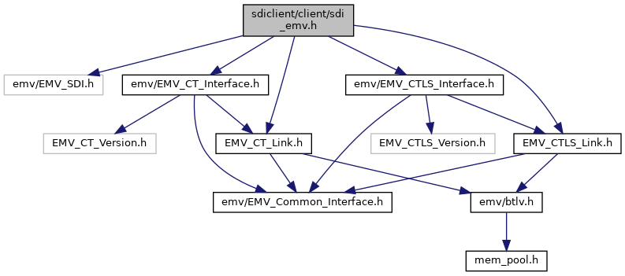

[Macros](#define-members) \| [Functions](#func-members)

`#include "emv/EMV_SDI.h"`
`#include "`<a href="_e_m_v___c_t___interface_8h_source.md">emv/EMV_CT_Interface.h</a>`"`
`#include "`<a href="_e_m_v___c_t___link_8h_source.md">emv/EMV_CT_Link.h</a>`"`
`#include "`<a href="_e_m_v___c_t_l_s___interface_8h_source.md">emv/EMV_CTLS_Interface.h</a>`"`
`#include "`<a href="_e_m_v___c_t_l_s___link_8h_source.md">emv/EMV_CTLS_Link.h</a>`"`

Include dependency graph for sdi_emv.h:

<a href="sdiclient_2client_2sdi__emv_8h_source.md">Go to the source code of this file.</a>

|  |  |
|----|----|
| Macros |  |
| #define  | [SDI_CT_Init_Framework](#a01a41b8c21f17bab420a71c88a9bcad7)(numberOfAIDs, EMV_Callback, externalData, options)   [SDI_CT_Init_Framework_Client](#acb8dae1b10008c830377312aa7b1a483)(EMV_CT_FRAMEWORK_VERSION, (numberOfAIDs), (EMV_Callback), (externalData), (options)) |
| #define  | [SDI_CTLS_Init_Framework](#ad0094543adddebbe0667a3bd92ab8d67)(numberOfAIDs, EMV_Callback, externalData, options, ulResult)   [SDI_CTLS_Init_Framework_Client](#a44f8c529b02eaa92db9b21d3af1d7db3)(EMV_CTLS_FRAMEWORK_VERSION, (numberOfAIDs), (EMV_Callback), (externalData), (options),(ulResult)) |

|  |  |
|----|----|
| Functions |  |
| int  | [SDI_Client_Init](#a7eb6fda45175e1bc49a4764081ea76cf) (const char \*options) |
|   | Initialize SDI client. [More\...](#a7eb6fda45175e1bc49a4764081ea76cf)  |
| <a href="group___a_d_k___r_e_t___c_o_d_e.md#gaa5ed8ecc7a31f36a8927e6e258187810">EMV_ADK_INFO</a>  | [SDI_CT_Init_Framework_Client](#acb8dae1b10008c830377312aa7b1a483) (const char \*version, unsigned char numberOfAIDs, <a href="adk__emv__contactless__programmers__guide_8dox.md#a591fd0f380cd390007ce78b47be923c4">EMV_CT_CALLBACK_FnT</a> EMV_Callback, void \*externalData, unsigned long options) |
| void  | [SDI_CT_Exit_Framework](#aacb84d76cf1cb9968aee2c952bd931c8) (void) |
| void  | [SDI_CT_Exit_Framework_extended](#a0b73b11d63b3db8f712ccd0d4ca037da) (unsigned char options) |
| const char \*  | [SDI_CT_CLIENT_GetVersion](#adb81a3d31f7a88cf6a9768c4ba1fc062) (void) |
| const char \*  | [SDI_CT_FRAMEWORK_GetVersion](#a70b4594f9dd637f0f823fb76ff551769) (void) |
| <a href="group___a_d_k___r_e_t___c_o_d_e.md#gaa5ed8ecc7a31f36a8927e6e258187810">EMV_ADK_INFO</a>  | [SDI_CT_MapVirtualTerminal](#a24decafe63c8f3f793f3cb1778411156) (<a href="group___v_i_r_t_u_a_l_t_e_r_m_m_a_p___m_o_d_e.md#ga8549dc337b3e6382af882edd8a4ef5dc">EMV_ADK_VIRTUALTERMMAP_TYPE</a> VirtualTermMapType, unsigned char \*TLVSwitchValue, unsigned int TLVBufLen, unsigned char VirtualTerminal) |
| <a href="group___a_d_k___r_e_t___c_o_d_e.md#gaa5ed8ecc7a31f36a8927e6e258187810">EMV_ADK_INFO</a>  | [SDI_CT_StoreCAPKey](#ae4efad90d867c2fe4086b4ccbe4d986f) (<a href="group___a_p_p_l_i___c_o_n_f___m_o_d_e.md#gadcf8867daf908d411db4651db09aaa54">EMV_ADK_HANDLE_RECORD_TYPE</a> eHandleCAPKeyType, const <a href="group___d_e_f___c_a_r_d___c_o_n_f.md#gaec114225658dc96eade72d72c1a7ca58">EMV_CT_CAPKEY_TYPE</a> \*pxKeyData) |
| <a href="group___a_d_k___r_e_t___c_o_d_e.md#gaa5ed8ecc7a31f36a8927e6e258187810">EMV_ADK_INFO</a>  | [SDI_CT_ReadCAPKeys](#adcc88c7d18377af00d029786d695e68d) (<a href="group___d_e_f___c_a_r_d___c_o_n_f.md#ga1d17166f51e2bc35511368552eab687a">EMV_CT_CAPREAD_TYPE</a> \*pxKeyData, unsigned char \*pucMaxnum) |
| <a href="group___a_d_k___r_e_t___c_o_d_e.md#gaa5ed8ecc7a31f36a8927e6e258187810">EMV_ADK_INFO</a>  | [SDI_CT_GetCAPKeyInfo](#aefca28186d400736b0f33a4768b685fe) (<a href="group___d_e_f___c_a_r_d___c_o_n_f.md#ga1d17166f51e2bc35511368552eab687a">EMV_CT_CAPREAD_TYPE</a> \*pxKeyInfo, unsigned capacity, unsigned offset, unsigned \*received, unsigned \*configured) |
| <a href="group___a_d_k___r_e_t___c_o_d_e.md#gaa5ed8ecc7a31f36a8927e6e258187810">EMV_ADK_INFO</a>  | [SDI_CT_SetTermData](#adeae7a144a729b82e93ff92abd463fd6) (<a href="group___d_e_f___c_o_n_f___t_e_r_m.md#gafdbb8cf654b659b9830896a7f82e5e24">EMV_CT_TERMDATA_TYPE</a> \*pxTermData) |
| <a href="group___a_d_k___r_e_t___c_o_d_e.md#gaa5ed8ecc7a31f36a8927e6e258187810">EMV_ADK_INFO</a>  | [SDI_CT_GetTermData](#aa02e34b3ec12329f41c03f6ff6d28424) (<a href="group___d_e_f___c_o_n_f___t_e_r_m.md#gafdbb8cf654b659b9830896a7f82e5e24">EMV_CT_TERMDATA_TYPE</a> \*pxTermData) |
| <a href="group___a_d_k___r_e_t___c_o_d_e.md#gaa5ed8ecc7a31f36a8927e6e258187810">EMV_ADK_INFO</a>  | [SDI_CT_SetAppliData](#a566f5011af25eeaa9ddb4a34dd893c58) (<a href="group___a_p_p_l_i___c_o_n_f___m_o_d_e.md#gadcf8867daf908d411db4651db09aaa54">EMV_ADK_HANDLE_RECORD_TYPE</a> eHandleAppliType, <a href="_e_m_v___c_t___interface_8h.md#ae836cd33e4343219ad6106a383afd876">EMV_CT_APPLI_TYPE</a> \*pxAID, <a href="group___d_e_f___c_o_n_f___a_p_p_l_i.md#gaa8587e7da8f3e6d6dc3c4b1e803ce1b3">EMV_CT_APPLIDATA_TYPE</a> \*pxAppliData) |
| <a href="group___a_d_k___r_e_t___c_o_d_e.md#gaa5ed8ecc7a31f36a8927e6e258187810">EMV_ADK_INFO</a>  | [SDI_CT_GetAppliData](#a23c10ab76e436e6b4e895f622a6107fe) (<a href="group___r_e_a_d___a_p_p_l_i___t_y_p_e.md#ga10b4ef6968ff77acaf7f70ff9d95ad03">EMV_ADK_READAPPLI_TYPE</a> eReadAppliType, <a href="_e_m_v___c_t___interface_8h.md#ae836cd33e4343219ad6106a383afd876">EMV_CT_APPLI_TYPE</a> \*pxAID, <a href="group___d_e_f___c_o_n_f___a_p_p_l_i.md#gaa8587e7da8f3e6d6dc3c4b1e803ce1b3">EMV_CT_APPLIDATA_TYPE</a> \*pxAppliData) |
| <a href="group___a_d_k___r_e_t___c_o_d_e.md#gaa5ed8ecc7a31f36a8927e6e258187810">EMV_ADK_INFO</a>  | [SDI_CT_ApplyConfiguration](#ad814ebfe5ca88dc0768c71f5223fde29) (unsigned long options) |
| <a href="group___a_d_k___r_e_t___c_o_d_e.md#gaa5ed8ecc7a31f36a8927e6e258187810">EMV_ADK_INFO</a>  | [SDI_CT_StartTransaction](#a478841176a5e0ba2f91485b6c96f9258) (<a href="group___a_d_k___t_r_x___e_x_e_c.md#ga58431469c9e1e41d6e419cbc246fd4bb">EMV_CT_SELECT_TYPE</a> \*pxSelectInput, <a href="group___a_d_k___t_r_x___e_x_e_c.md#ga7e8a721d6043e021fcc24b36f2aca33f">EMV_CT_SELECTRES_TYPE</a> \*pxSelectRes) |
| <a href="group___a_d_k___r_e_t___c_o_d_e.md#gaa5ed8ecc7a31f36a8927e6e258187810">EMV_ADK_INFO</a>  | [SDI_CT_GetCandidateData](#aace8b5361882d055e739c2ef972b9b92) (<a href="group___a_d_k___t_r_x___e_x_e_c.md#ga27bfe240213c6d19faa79f347c30715e">EMV_CT_CANDIDATE_DATA_TYPE</a> \*candidateData) |
| <a href="group___a_d_k___r_e_t___c_o_d_e.md#gaa5ed8ecc7a31f36a8927e6e258187810">EMV_ADK_INFO</a>  | [SDI_CT_ContinueOffline](#a3c717f500d88355431c389b9278ee2d2) (<a href="group___a_d_k___t_r_x___e_x_e_c.md#gae6382746c700031a73d619e7bda2c5af">EMV_CT_TRANSAC_TYPE</a> \*pxTransactionInput, <a href="group___a_d_k___t_r_x___e_x_e_c.md#ga3361b4c859aae10793dce6803138150f">EMV_CT_TRANSRES_TYPE</a> \*pxTransRes, EMV_SDI_CT_TRANSRES_TYPE \*pxSdiTransRes) |
| <a href="group___a_d_k___r_e_t___c_o_d_e.md#gaa5ed8ecc7a31f36a8927e6e258187810">EMV_ADK_INFO</a>  | [SDI_CT_ContinueOnline](#a9916bb98ecefc1525293662b1f635d7e) (<a href="group___a_d_k___t_r_x___e_x_e_c.md#ga87fb8729a9792ab70bdae526f3a938c2">EMV_CT_HOST_TYPE</a> \*pxOnlineInput, <a href="group___a_d_k___t_r_x___e_x_e_c.md#ga3361b4c859aae10793dce6803138150f">EMV_CT_TRANSRES_TYPE</a> \*pxTransRes, EMV_SDI_CT_TRANSRES_TYPE \*pxSdiTransRes) |
| <a href="group___a_d_k___r_e_t___c_o_d_e.md#gaa5ed8ecc7a31f36a8927e6e258187810">EMV_ADK_INFO</a>  | [SDI_CT_updateTxnTags](#ad9d70b7cdd6e4ad3a1a8e84764d9f52a) (unsigned long options, unsigned char \*tlvBuffer, unsigned short bufferLength) |
| <a href="group___a_d_k___r_e_t___c_o_d_e.md#gaa5ed8ecc7a31f36a8927e6e258187810">EMV_ADK_INFO</a>  | [SDI_CT_CheckSupportedAID](#a560fa3ca8d377ab8f7263e3188ceed5f) (const <a href="_e_m_v___c_t___interface_8h.md#ae836cd33e4343219ad6106a383afd876">EMV_CT_APPLI_TYPE</a> \*aid, unsigned char ASI, const unsigned char \*defaultLabel, <a href="group___a_d_k___t_r_x___e_x_e_c.md#struct_e_m_v___c_t___cand_list_type">EMV_CT_CandListType</a> \*pCandList, unsigned char MaxCand, unsigned char \*pCandidateCount, unsigned short \*sw12, const unsigned char \*adtCardTagList) |
| <a href="group___a_d_k___r_e_t___c_o_d_e.md#gaa5ed8ecc7a31f36a8927e6e258187810">EMV_ADK_INFO</a>  | [SDI_CT_EndTransaction](#a56ba63dac87a3c55e5434e25a81eb0b7) (unsigned long options) |
| unsigned char  | [SDI_CT_SmartISO](#a9e40db3cda39667912f7fb665efb1827) (unsigned char ucOptions, unsigned short usInDataLen, unsigned char \*pucDataIn, unsigned short \*pusOutDataLen, unsigned char \*pucDataOut, unsigned short usOutBufferLength) |
| unsigned char  | [SDI_CT_SmartDetect](#a54d8b8cad0b78c0614fd30007edbe173) (unsigned char ucOptions) |
| unsigned char  | [SDI_CT_SmartReset](#a16eb48c1413a968f909929261e8670b6) (unsigned char ucOptions, unsigned char \*pucATR, unsigned long \*pnATRLength) |
| unsigned char  | [SDI_CT_SmartPowerOff](#acf66aae1d9be2f8daffdb454b23f4a21) (unsigned char ucOptions) |
| unsigned char  | [SDI_CT_Send_PIN_Offline](#a92f31bb5f5b44eed55fb0297755c3954) (unsigned char \*pucPINResultData) |
| unsigned char  | [SDI_CT_LED](#a5cb2cb595561e9589d24145184bee449) (unsigned char ucLedId, unsigned char ucLedState, unsigned char ucLedColor, unsigned long ulTimeoutMs) |
| <a href="group___a_d_k___r_e_t___c_o_d_e.md#gaa5ed8ecc7a31f36a8927e6e258187810">EMV_ADK_INFO</a>  | [SDI_CT_SER_Init_Framework](#a6d3d54c7f670c64d1fe2aac85b45bd64) (const unsigned char \*dataIn, unsigned short dataInLen, unsigned char \*dataOut, unsigned short \*dataOutLen) |
| void  | [SDI_CT_SER_Exit_Framework](#a0d96023d402832bc5083303e125622c7) (const unsigned char \*dataIn, unsigned short dataInLen, unsigned char \*dataOut, unsigned short \*dataOutLen) |
| <a href="group___a_d_k___r_e_t___c_o_d_e.md#gaa5ed8ecc7a31f36a8927e6e258187810">EMV_ADK_INFO</a>  | [SDI_CT_SER_MapVirtualTerminal](#ab0dfdd48ee3d552f7677034fb0484139) (const unsigned char \*dataIn, unsigned short dataInLen, unsigned char \*dataOut, unsigned short \*dataOutLen) |
| <a href="group___a_d_k___r_e_t___c_o_d_e.md#gaa5ed8ecc7a31f36a8927e6e258187810">EMV_ADK_INFO</a>  | [SDI_CT_SER_StoreCAPKey](#af33ac0163099eec293d28292727a7150) (const unsigned char \*dataIn, unsigned short dataInLen, unsigned char \*dataOut, unsigned short \*dataOutLen) |
| <a href="group___a_d_k___r_e_t___c_o_d_e.md#gaa5ed8ecc7a31f36a8927e6e258187810">EMV_ADK_INFO</a>  | [SDI_CT_SER_ReadCAPKeys](#ad517595830e9dbde3c413fd091f8683c) (const unsigned char \*dataIn, unsigned short dataInLen, unsigned char \*dataOut, unsigned short \*dataOutLen) |
| <a href="group___a_d_k___r_e_t___c_o_d_e.md#gaa5ed8ecc7a31f36a8927e6e258187810">EMV_ADK_INFO</a>  | [SDI_CT_SER_SetTermData](#a7ab831caa40bf178b61cde2ced49093c) (const unsigned char \*dataIn, unsigned short dataInLen, unsigned char \*dataOut, unsigned short \*dataOutLen) |
| <a href="group___a_d_k___r_e_t___c_o_d_e.md#gaa5ed8ecc7a31f36a8927e6e258187810">EMV_ADK_INFO</a>  | [SDI_CT_SER_GetTermData](#a901d28293831e3396bacbd26c4b4eb34) (const unsigned char \*dataIn, unsigned short dataInLen, unsigned char \*dataOut, unsigned short \*dataOutLen) |
| <a href="group___a_d_k___r_e_t___c_o_d_e.md#gaa5ed8ecc7a31f36a8927e6e258187810">EMV_ADK_INFO</a>  | [SDI_CT_SER_SetAppliData](#a3e1303d97abf508e71c0e47b534971bc) (const unsigned char \*dataIn, unsigned short dataInLen, unsigned char \*dataOut, unsigned short \*dataOutLen) |
| <a href="group___a_d_k___r_e_t___c_o_d_e.md#gaa5ed8ecc7a31f36a8927e6e258187810">EMV_ADK_INFO</a>  | [SDI_CT_SER_GetAppliData](#a59449950d1ead1f8f20546dc8e820d5d) (const unsigned char \*dataIn, unsigned short dataInLen, unsigned char \*dataOut, unsigned short \*dataOutLen) |
| <a href="group___a_d_k___r_e_t___c_o_d_e.md#gaa5ed8ecc7a31f36a8927e6e258187810">EMV_ADK_INFO</a>  | [SDI_CT_SER_StartTransaction](#a077ac984247175e10856baf30e333b79) (const unsigned char \*dataIn, unsigned short dataInLen, unsigned char \*dataOut, unsigned short \*dataOutLen) |
| <a href="group___a_d_k___r_e_t___c_o_d_e.md#gaa5ed8ecc7a31f36a8927e6e258187810">EMV_ADK_INFO</a>  | [SDI_CT_SER_GetCandidateData](#a0e062ddf576e27123804ee90fb79c8c9) (const unsigned char \*dataIn, unsigned short dataInLen, unsigned char \*dataOut, unsigned short \*dataOutLen) |
| <a href="group___a_d_k___r_e_t___c_o_d_e.md#gaa5ed8ecc7a31f36a8927e6e258187810">EMV_ADK_INFO</a>  | [SDI_CT_SER_ContinueOffline](#a5f97b3cd02b2858376f69d18d2b58539) (const unsigned char \*dataIn, unsigned short dataInLen, unsigned char \*dataOut, unsigned short \*dataOutLen) |
| <a href="group___a_d_k___r_e_t___c_o_d_e.md#gaa5ed8ecc7a31f36a8927e6e258187810">EMV_ADK_INFO</a>  | [SDI_CT_SER_ContinueOnline](#a58b2db6f6b6fdc39918b8ef914995c07) (const unsigned char \*dataIn, unsigned short dataInLen, unsigned char \*dataOut, unsigned short \*dataOutLen) |
| <a href="group___a_d_k___r_e_t___c_o_d_e.md#gaa5ed8ecc7a31f36a8927e6e258187810">EMV_ADK_INFO</a>  | [SDI_CT_SER_updateTxnTags](#ae991286cf76f18687e1fa201d5393f5a) (const unsigned char \*dataIn, unsigned short dataInLen, unsigned char \*dataOut, unsigned short \*dataOutLen) |
| <a href="group___a_d_k___r_e_t___c_o_d_e.md#gaa5ed8ecc7a31f36a8927e6e258187810">EMV_ADK_INFO</a>  | [SDI_CT_SER_CheckSupportedAID](#a93babb48fc42f785a8c94f5be260f15b) (const unsigned char \*dataIn, unsigned short dataInLen, unsigned char \*dataOut, unsigned short \*dataOutLen) |
| <a href="group___a_d_k___r_e_t___c_o_d_e.md#gaa5ed8ecc7a31f36a8927e6e258187810">EMV_ADK_INFO</a>  | [SDI_CT_SER_EndTransaction](#a52bb3d4f3f886052ac28fea873472490) (const unsigned char \*dataIn, unsigned short dataInLen, unsigned char \*dataOut, unsigned short \*dataOutLen) |
| unsigned char  | [SDI_CT_SER_SmartISO](#a89d92655babbd308231f10093e8c45a2) (const unsigned char \*dataIn, unsigned short dataInLen, unsigned char \*dataOut, unsigned short \*dataOutLen) |
| unsigned char  | [SDI_CT_SER_SmartDetect](#aa45e4f0af41b5104a56921a57c451c65) (const unsigned char \*dataIn, unsigned short dataInLen, unsigned char \*dataOut, unsigned short \*dataOutLen) |
| unsigned char  | [SDI_CT_SER_SmartReset](#a5b1906203816e8575edd252978c49c7f) (const unsigned char \*dataIn, unsigned short dataInLen, unsigned char \*dataOut, unsigned short \*dataOutLen) |
| unsigned char  | [SDI_CT_SER_SmartPowerOff](#ad7bbf8dc74d035f836cc406c24962e4d) (const unsigned char \*dataIn, unsigned short dataInLen, unsigned char \*dataOut, unsigned short \*dataOutLen) |
| unsigned char  | [SDI_CT_SER_SmartPIN](#a83076485568c086b1f5d61d1ef3d3ae5) (const unsigned char \*dataIn, unsigned short dataInLen, unsigned char \*dataOut, unsigned short \*dataOutLen) |
| unsigned char  | [SDI_CT_SER_Send_PIN_Offline](#a6faaffa531b55313e4ac71dace0a080d) (const unsigned char \*dataIn, unsigned short dataInLen, unsigned char \*dataOut, unsigned short \*dataOutLen) |
| <a href="group___a_d_k___r_e_t___c_o_d_e.md#gaa5ed8ecc7a31f36a8927e6e258187810">EMV_ADK_INFO</a>  | [SDI_CTLS_Init_Framework_Client](#a44f8c529b02eaa92db9b21d3af1d7db3) (const char \*version, unsigned char numberOfAIDs, <a href="group___t_l_v___c_a_l_l_b_c_k.md#ga6557e914101768d67635ca44e54362ab">EMV_CTLS_CALLBACK_FnT</a> EMV_Callback, void \*externalData, unsigned long options, unsigned long \*ulResult) |
| void  | [SDI_CTLS_Exit_Framework](#a091c03aae4a936db4aea7de946bbd7df) (void) |
| void  | [SDI_CTLS_Exit_Framework_extended](#ac84dff021f4cb33ad617bd8fe6218700) (unsigned char options) |
| const char \*  | [SDI_CTLS_CLIENT_GetVersion](#a7338c85bcef9a810abeb04a964ba7ac1) (void) |
| const char \*  | [SDI_CTLS_FRAMEWORK_GetVersion](#a3f04822f7cf7255d501d6705b9b10c4d) (void) |
| <a href="group___a_d_k___r_e_t___c_o_d_e.md#gaa5ed8ecc7a31f36a8927e6e258187810">EMV_ADK_INFO</a>  | [SDI_CTLS_MapVirtualTerminal](#a0f94ff4f712670646d91cf4c1c5ad7b7) (<a href="group___v_i_r_t_u_a_l_t_e_r_m_m_a_p___m_o_d_e.md#ga8549dc337b3e6382af882edd8a4ef5dc">EMV_ADK_VIRTUALTERMMAP_TYPE</a> VirtualTermMapType, unsigned char \*TLVSwitchValue, unsigned int TLVBufLen, unsigned char VirtualTerminal) |
| <a href="group___a_d_k___r_e_t___c_o_d_e.md#gaa5ed8ecc7a31f36a8927e6e258187810">EMV_ADK_INFO</a>  | [SDI_CTLS_StoreCAPKey](#ab15cd410ec08579adb2703afb222a5f7) (<a href="group___a_p_p_l_i___c_o_n_f___m_o_d_e.md#gadcf8867daf908d411db4651db09aaa54">EMV_ADK_HANDLE_RECORD_TYPE</a> eHandleCAPKeyType, const <a href="group___d_e_f___c_a_r_d___c_o_n_f.md#ga29fb30f218cea136b382fedf85650300">EMV_CTLS_CAPKEY_TYPE</a> \*pxKeyData) |
| <a href="group___a_d_k___r_e_t___c_o_d_e.md#gaa5ed8ecc7a31f36a8927e6e258187810">EMV_ADK_INFO</a>  | [SDI_CTLS_ReadCAPKeys](#a480502b2428eca1197826a541d0a0773) (<a href="group___d_e_f___c_a_r_d___c_o_n_f.md#ga0bc19981bd2520ebd2fb7b58a70dde6b">EMV_CTLS_CAPREAD_TYPE</a> \*pxKeyData, unsigned char \*pucMaxnum) |
| <a href="group___a_d_k___r_e_t___c_o_d_e.md#gaa5ed8ecc7a31f36a8927e6e258187810">EMV_ADK_INFO</a>  | [SDI_CTLS_GetCAPKeyInfo](#a9c68d6ac64c4cbfe4ccad9ec2b2dc94b) (<a href="group___d_e_f___c_a_r_d___c_o_n_f.md#ga0bc19981bd2520ebd2fb7b58a70dde6b">EMV_CTLS_CAPREAD_TYPE</a> \*pxKeyInfo, unsigned capacity, unsigned offset, unsigned \*received, unsigned \*configured) |
| <a href="group___a_d_k___r_e_t___c_o_d_e.md#gaa5ed8ecc7a31f36a8927e6e258187810">EMV_ADK_INFO</a>  | [SDI_CTLS_SetTermData](#a2c173b8efa5a7f874e3a9161e9522592) (<a href="group___d_e_f___c_o_n_f___t_e_r_m.md#gaf6a1624499c8eb3e1f914ba5cfc72b2e">EMV_CTLS_TERMDATA_TYPE</a> \*pxTermData) |
| <a href="group___a_d_k___r_e_t___c_o_d_e.md#gaa5ed8ecc7a31f36a8927e6e258187810">EMV_ADK_INFO</a>  | [SDI_CTLS_GetTermData](#a85415e42f910ffff697898d3f2627203) (<a href="group___d_e_f___c_o_n_f___t_e_r_m.md#gaf6a1624499c8eb3e1f914ba5cfc72b2e">EMV_CTLS_TERMDATA_TYPE</a> \*pxTermData) |
| <a href="group___a_d_k___r_e_t___c_o_d_e.md#gaa5ed8ecc7a31f36a8927e6e258187810">EMV_ADK_INFO</a>  | [SDI_CTLS_SetAppliDataSchemeSpecific](#a9cb348913360ea6b898607ca137f019e) (<a href="group___a_p_p_l_i___c_o_n_f___m_o_d_e.md#gadcf8867daf908d411db4651db09aaa54">EMV_ADK_HANDLE_RECORD_TYPE</a> eHandleAppliType, <a href="_e_m_v___c_t_l_s___interface_8h.md#a25ffa91f872706fea760a3c2e76464f8">EMV_CTLS_APPLI_KERNEL_TYPE</a> \*pxAID, <a href="group___d_e_f___c_o_n_f___a_p_p_l_i.md#ga6632685219259930248b2c7aa2186f66">EMV_CTLS_APPLIDATA_SCHEME_SPECIFIC_TYPE</a> \*pxAppliData) |
| <a href="group___a_d_k___r_e_t___c_o_d_e.md#gaa5ed8ecc7a31f36a8927e6e258187810">EMV_ADK_INFO</a>  | [SDI_CTLS_GetAppliDataSchemeSpecific](#af46039aee2eff5a0029b4b2fcfe580bf) (<a href="group___r_e_a_d___a_p_p_l_i___t_y_p_e.md#ga10b4ef6968ff77acaf7f70ff9d95ad03">EMV_ADK_READAPPLI_TYPE</a> eReadAppliType, <a href="_e_m_v___c_t_l_s___interface_8h.md#a25ffa91f872706fea760a3c2e76464f8">EMV_CTLS_APPLI_KERNEL_TYPE</a> \*pxAID, <a href="group___d_e_f___c_o_n_f___a_p_p_l_i.md#ga6632685219259930248b2c7aa2186f66">EMV_CTLS_APPLIDATA_SCHEME_SPECIFIC_TYPE</a> \*pxAppliData) |
| <a href="group___a_d_k___r_e_t___c_o_d_e.md#gaa5ed8ecc7a31f36a8927e6e258187810">EMV_ADK_INFO</a>  | [SDI_CTLS_ApplyConfiguration](#a70ff02dafb4e117aa99fa3eb3a67b53f) (unsigned long options) |
| <a href="group___a_d_k___r_e_t___c_o_d_e.md#gaa5ed8ecc7a31f36a8927e6e258187810">EMV_ADK_INFO</a>  | [SDI_CTLS_SetupTransaction](#a0cedaed434229de9771965b0b3ecf1cd) (<a href="group___d_e_f___f_l_o_w___i_n_p_u_t.md#gacc76bf526bd4c060620bd6fd81e77a3b">EMV_CTLS_START_TYPE</a> \*pxStartInput, <a href="group___d_e_f___f_l_o_w___o_u_t_p_u_t.md#ga2dce20509b74f876a52aa2e6fc42ec6b">EMV_CTLS_STARTRES_TYPE</a> \*pxStartRes) |
| <a href="group___a_d_k___r_e_t___c_o_d_e.md#gaa5ed8ecc7a31f36a8927e6e258187810">EMV_ADK_INFO</a>  | [SDI_CTLS_ContinueOffline](#a8f840b23f10cfd012035529a742da311) (<a href="group___d_e_f___f_l_o_w___o_u_t_p_u_t.md#ga0d11e77342658b02a027f9493e10b70a">EMV_CTLS_TRANSRES_TYPE</a> \*pxTransRes, EMV_SDI_CTLS_TRANSRES_TYPE \*pxSdiTransRes) |
| <a href="group___a_d_k___r_e_t___c_o_d_e.md#gaa5ed8ecc7a31f36a8927e6e258187810">EMV_ADK_INFO</a>  | [SDI_CTLS_ContinueOfflineExt](#ade5c78dfdb3e1d87bca3473c4b7b15aa) (<a href="group___d_e_f___f_l_o_w___i_n_p_u_t.md#gadf960925e57bbb7c2cba692f4553adcd">EMV_CTLS_CONT_OFFL_TYPE</a> \*pxContOfflInput, <a href="group___d_e_f___f_l_o_w___o_u_t_p_u_t.md#ga0d11e77342658b02a027f9493e10b70a">EMV_CTLS_TRANSRES_TYPE</a> \*pxTransRes, EMV_SDI_CTLS_TRANSRES_TYPE \*pxSdiTransRes) |
| <a href="group___a_d_k___r_e_t___c_o_d_e.md#gaa5ed8ecc7a31f36a8927e6e258187810">EMV_ADK_INFO</a>  | [SDI_CTLS_ContinueOnline](#a0ec21e60d70435450c5ecbf0b6cec8da) (<a href="group___d_e_f___f_l_o_w___i_n_p_u_t.md#ga778c9baaa08a647c7aa57ac0ab39ad82">EMV_CTLS_HOST_TYPE</a> \*pxOnlineInput, <a href="group___d_e_f___f_l_o_w___o_u_t_p_u_t.md#ga0d11e77342658b02a027f9493e10b70a">EMV_CTLS_TRANSRES_TYPE</a> \*pxTransRes, EMV_SDI_CTLS_TRANSRES_TYPE \*pxSdiTransRes) |
| <a href="group___a_d_k___r_e_t___c_o_d_e.md#gaa5ed8ecc7a31f36a8927e6e258187810">EMV_ADK_INFO</a>  | [SDI_CTLS_EndTransaction](#af971a09777bf760df91396afc2f9a4fb) (unsigned long options) |
| unsigned char  | [SDI_CTLS_SmartISO](#ac1650604f4ce6c911b1e6a9d33f5e2f4) (unsigned char ucOptions, unsigned short usInDataLen, unsigned char \*pucDataIn, unsigned short \*pusOutDataLen, unsigned char \*pucDataOut, unsigned short usOutBufferLength) |
| unsigned char  | [SDI_CTLS_SmartReset](#a6a525de44bb40afcf19c1a913986efd8) (unsigned char ucOptions, unsigned char \*pucCardInfo, unsigned long \*pnInfoLength) |
| unsigned char  | [SDI_CTLS_SmartPowerOff](#a3ac830135da154343c655ad8650e65af) (unsigned char ucOptions) |
| unsigned char  | [SDI_CTLS_CardRemoval](#a0810a73ee9af9f7e8ead9751422fd172) (long timeoutMillis) |
| unsigned char  | [SDI_CTLS_LED](#adafede7433a6ea37d1644ac2a9f97eb4) (unsigned char ucLedId, unsigned char ucLedState) |
| unsigned char  | [SDI_CTLS_LED_SetMode](#a4519178a19f6e841b069ed2d4c2eb75c) (unsigned char ucLedMode) |
| unsigned char  | [SDI_CTLS_Break](#ac371002a617daefdbf15829424ba41d7) (void) |
| <a href="group___a_d_k___r_e_t___c_o_d_e.md#gaa5ed8ecc7a31f36a8927e6e258187810">EMV_ADK_INFO</a>  | [SDI_CTLS_GetCandidateData](#a9eb1db9d7e8a5285150d22cb695ac4ef) (<a href="group___f_u_n_c___f_l_o_w.md#gaa5b2c1b07fd779960790f10a52352869">EMV_CTLS_CANDIDATE_DATA_TYPE</a> \*candidateData) |
| <a href="group___a_d_k___r_e_t___c_o_d_e.md#gaa5ed8ecc7a31f36a8927e6e258187810">EMV_ADK_INFO</a>  | [SDI_CTLS_SER_Init_Framework](#a7650b33e526a81c677e9bfd96eace1aa) (const unsigned char \*dataIn, unsigned short dataInLen, unsigned char \*dataOut, unsigned short \*dataOutLen) |
| void  | [SDI_CTLS_SER_Exit_Framework](#a1a2e978c683043e3547c802663adcc1f) (const unsigned char \*dataIn, unsigned short dataInLen, unsigned char \*dataOut, unsigned short \*dataOutLen) |
| <a href="group___a_d_k___r_e_t___c_o_d_e.md#gaa5ed8ecc7a31f36a8927e6e258187810">EMV_ADK_INFO</a>  | [SDI_CTLS_SER_MapVirtualTerminal](#a3c932ce26a4145a465656745873a311c) (const unsigned char \*dataIn, unsigned short dataInLen, unsigned char \*dataOut, unsigned short \*dataOutLen) |
| <a href="group___a_d_k___r_e_t___c_o_d_e.md#gaa5ed8ecc7a31f36a8927e6e258187810">EMV_ADK_INFO</a>  | [SDI_CTLS_SER_StoreCAPKey](#a598f167d2e5a1c2e821e3dd46b94ff41) (const unsigned char \*dataIn, unsigned short dataInLen, unsigned char \*dataOut, unsigned short \*dataOutLen) |
| <a href="group___a_d_k___r_e_t___c_o_d_e.md#gaa5ed8ecc7a31f36a8927e6e258187810">EMV_ADK_INFO</a>  | [SDI_CTLS_SER_ReadCAPKeys](#a830892b6a5cf8d42095e0708264b7d44) (const unsigned char \*dataIn, unsigned short dataInLen, unsigned char \*dataOut, unsigned short \*dataOutLen) |
| <a href="group___a_d_k___r_e_t___c_o_d_e.md#gaa5ed8ecc7a31f36a8927e6e258187810">EMV_ADK_INFO</a>  | [SDI_CTLS_SER_SetTermData](#ade1ae16a808102943d7e1d1db0c48c68) (const unsigned char \*dataIn, unsigned short dataInLen, unsigned char \*dataOut, unsigned short \*dataOutLen) |
| <a href="group___a_d_k___r_e_t___c_o_d_e.md#gaa5ed8ecc7a31f36a8927e6e258187810">EMV_ADK_INFO</a>  | [SDI_CTLS_SER_GetTermData](#adcc628a729a1ec55b6a07cf0fee2ac19) (const unsigned char \*dataIn, unsigned short dataInLen, unsigned char \*dataOut, unsigned short \*dataOutLen) |
| <a href="group___a_d_k___r_e_t___c_o_d_e.md#gaa5ed8ecc7a31f36a8927e6e258187810">EMV_ADK_INFO</a>  | [SDI_CTLS_SER_SetAppliDataSchemeSpecific](#a88e44834e4923066261dd9bb6c8d992b) (const unsigned char \*dataIn, unsigned short dataInLen, unsigned char \*dataOut, unsigned short \*dataOutLen) |
| <a href="group___a_d_k___r_e_t___c_o_d_e.md#gaa5ed8ecc7a31f36a8927e6e258187810">EMV_ADK_INFO</a>  | [SDI_CTLS_SER_GetAppliDataSchemeSpecific](#af7ac5dcebe8749f3e50bf304c46a097f) (const unsigned char \*dataIn, unsigned short dataInLen, unsigned char \*dataOut, unsigned short \*dataOutLen) |
| <a href="group___a_d_k___r_e_t___c_o_d_e.md#gaa5ed8ecc7a31f36a8927e6e258187810">EMV_ADK_INFO</a>  | [SDI_CTLS_SER_SetupTransaction](#a916a7dc9febded5023782901d59922fa) (const unsigned char \*dataIn, unsigned short dataInLen, unsigned char \*dataOut, unsigned short \*dataOutLen) |
| <a href="group___a_d_k___r_e_t___c_o_d_e.md#gaa5ed8ecc7a31f36a8927e6e258187810">EMV_ADK_INFO</a>  | [SDI_CTLS_SER_ContinueOffline](#a8d460435a8eaa093c690bc950f4689f4) (const unsigned char \*dataIn, unsigned short dataInLen, unsigned char \*dataOut, unsigned short \*dataOutLen) |
| <a href="group___a_d_k___r_e_t___c_o_d_e.md#gaa5ed8ecc7a31f36a8927e6e258187810">EMV_ADK_INFO</a>  | [SDI_CTLS_SER_ContinueOnline](#ad7c9cdec278f04dee4ab8f6f783f56cd) (const unsigned char \*dataIn, unsigned short dataInLen, unsigned char \*dataOut, unsigned short \*dataOutLen) |
| <a href="group___a_d_k___r_e_t___c_o_d_e.md#gaa5ed8ecc7a31f36a8927e6e258187810">EMV_ADK_INFO</a>  | [SDI_CTLS_SER_EndTransaction](#a1360db1492f0a391dd99e3ec13040e47) (const unsigned char \*dataIn, unsigned short dataInLen, unsigned char \*dataOut, unsigned short \*dataOutLen) |
| unsigned char  | [SDI_CTLS_SER_SmartISO](#a9cbf5c78570ce455e95c9949014700cb) (const unsigned char \*dataIn, unsigned short dataInLen, unsigned char \*dataOut, unsigned short \*dataOutLen) |
| unsigned char  | [SDI_CTLS_SER_SmartReset](#a405dc4ba4b34bbac5cf38610448582ab) (const unsigned char \*dataIn, unsigned short dataInLen, unsigned char \*dataOut, unsigned short \*dataOutLen) |
| unsigned char  | [SDI_CTLS_SER_SmartPowerOff](#a664844478bc81952581c5038bfeefc2f) (const unsigned char \*dataIn, unsigned short dataInLen, unsigned char \*dataOut, unsigned short \*dataOutLen) |
| unsigned char  | [SDI_CTLS_SER_CardRemoval](#a7385667f3b2d1218c21d296ab2af8298) (const unsigned char \*dataIn, unsigned short dataInLen, unsigned char \*dataOut, unsigned short \*dataOutLen) |
| unsigned char  | [SDI_CTLS_SER_LED_SetMode](#a96474e7fd98325c0e9f7d0d2ba16b3c3) (const unsigned char \*dataIn, unsigned short dataInLen, unsigned char \*dataOut, unsigned short \*dataOutLen) |
| unsigned char  | [SDI_CTLS_SER_LED](#acca07fe15f547c650d0771d2cc757a8a) (const unsigned char \*dataIn, unsigned short dataInLen, unsigned char \*dataOut, unsigned short \*dataOutLen) |
| unsigned char  | [SDI_CTLS_SER_Break](#a062f5a34dfc8804b5cf30c862ffba413) (const unsigned char \*dataIn, unsigned short dataInLen, unsigned char \*dataOut, unsigned short \*dataOutLen) |
| <a href="group___a_d_k___r_e_t___c_o_d_e.md#gaa5ed8ecc7a31f36a8927e6e258187810">EMV_ADK_INFO</a>  | [SDI_CTLS_SER_GetCandidateData](#af194b3b9d5f66bfb0405967fbabb8c37) (const unsigned char \*dataIn, unsigned short dataInLen, unsigned char \*dataOut, unsigned short \*dataOutLen) |

## MacroDefinition Documentation {#macro-definition-documentation}

## SDI_CT_Init_Framework 

#define SDI_CT_Init_Framework

## SDI_CTLS_Init_Framework 

#define SDI_CTLS_Init_Framework

## FunctionDocumentation {#function-documentation}

## SDI_Client_Init() 

int SDI_Client_Init

Initialize SDI client.

Initializes EMV-ADK link libraries to use SDI server. It should be called at application start-up if SDI server use is wanted (although some functionality might be available without).

### Author

GSS R&D Germany

**Parameters**

\[in\] **options** future use

### Returns

0=okay, else error

## SDI_CT_ApplyConfiguration() 

<a href="group___a_d_k___r_e_t___c_o_d_e.md#gaa5ed8ecc7a31f36a8927e6e258187810">EMV_ADK_INFO</a> SDI_CT_ApplyConfiguration

## SDI_CT_CheckSupportedAID() 

<a href="group___a_d_k___r_e_t___c_o_d_e.md#gaa5ed8ecc7a31f36a8927e6e258187810">EMV_ADK_INFO</a> SDI_CT_CheckSupportedAID

## SDI_CT_CLIENT_GetVersion() 

const char\* SDI_CT_CLIENT_GetVersion

## SDI_CT_ContinueOffline() 

<a href="group___a_d_k___r_e_t___c_o_d_e.md#gaa5ed8ecc7a31f36a8927e6e258187810">EMV_ADK_INFO</a> SDI_CT_ContinueOffline

## SDI_CT_ContinueOnline() 

<a href="group___a_d_k___r_e_t___c_o_d_e.md#gaa5ed8ecc7a31f36a8927e6e258187810">EMV_ADK_INFO</a> SDI_CT_ContinueOnline

## SDI_CT_EndTransaction() 

<a href="group___a_d_k___r_e_t___c_o_d_e.md#gaa5ed8ecc7a31f36a8927e6e258187810">EMV_ADK_INFO</a> SDI_CT_EndTransaction

## SDI_CT_Exit_Framework() 

void SDI_CT_Exit_Framework

## SDI_CT_Exit_Framework_extended() 

void SDI_CT_Exit_Framework_extended

## SDI_CT_FRAMEWORK_GetVersion() 

const char\* SDI_CT_FRAMEWORK_GetVersion

## SDI_CT_GetAppliData() 

<a href="group___a_d_k___r_e_t___c_o_d_e.md#gaa5ed8ecc7a31f36a8927e6e258187810">EMV_ADK_INFO</a> SDI_CT_GetAppliData

## SDI_CT_GetCandidateData() 

<a href="group___a_d_k___r_e_t___c_o_d_e.md#gaa5ed8ecc7a31f36a8927e6e258187810">EMV_ADK_INFO</a> SDI_CT_GetCandidateData

## SDI_CT_GetCAPKeyInfo() 

<a href="group___a_d_k___r_e_t___c_o_d_e.md#gaa5ed8ecc7a31f36a8927e6e258187810">EMV_ADK_INFO</a> SDI_CT_GetCAPKeyInfo

## SDI_CT_GetTermData() 

<a href="group___a_d_k___r_e_t___c_o_d_e.md#gaa5ed8ecc7a31f36a8927e6e258187810">EMV_ADK_INFO</a> SDI_CT_GetTermData

## SDI_CT_Init_Framework_Client() 

<a href="group___a_d_k___r_e_t___c_o_d_e.md#gaa5ed8ecc7a31f36a8927e6e258187810">EMV_ADK_INFO</a> SDI_CT_Init_Framework_Client

## SDI_CT_LED() 

unsigned char SDI_CT_LED

## SDI_CT_MapVirtualTerminal() 

<a href="group___a_d_k___r_e_t___c_o_d_e.md#gaa5ed8ecc7a31f36a8927e6e258187810">EMV_ADK_INFO</a> SDI_CT_MapVirtualTerminal

## SDI_CT_ReadCAPKeys() 

<a href="group___a_d_k___r_e_t___c_o_d_e.md#gaa5ed8ecc7a31f36a8927e6e258187810">EMV_ADK_INFO</a> SDI_CT_ReadCAPKeys

## SDI_CT_Send_PIN_Offline() 

unsigned char SDI_CT_Send_PIN_Offline

## SDI_CT_SER_CheckSupportedAID() 

<a href="group___a_d_k___r_e_t___c_o_d_e.md#gaa5ed8ecc7a31f36a8927e6e258187810">EMV_ADK_INFO</a> SDI_CT_SER_CheckSupportedAID

## SDI_CT_SER_ContinueOffline() 

<a href="group___a_d_k___r_e_t___c_o_d_e.md#gaa5ed8ecc7a31f36a8927e6e258187810">EMV_ADK_INFO</a> SDI_CT_SER_ContinueOffline

## SDI_CT_SER_ContinueOnline() 

<a href="group___a_d_k___r_e_t___c_o_d_e.md#gaa5ed8ecc7a31f36a8927e6e258187810">EMV_ADK_INFO</a> SDI_CT_SER_ContinueOnline

## SDI_CT_SER_EndTransaction() 

<a href="group___a_d_k___r_e_t___c_o_d_e.md#gaa5ed8ecc7a31f36a8927e6e258187810">EMV_ADK_INFO</a> SDI_CT_SER_EndTransaction

## SDI_CT_SER_Exit_Framework() 

void SDI_CT_SER_Exit_Framework

## SDI_CT_SER_GetAppliData() 

<a href="group___a_d_k___r_e_t___c_o_d_e.md#gaa5ed8ecc7a31f36a8927e6e258187810">EMV_ADK_INFO</a> SDI_CT_SER_GetAppliData

## SDI_CT_SER_GetCandidateData() 

<a href="group___a_d_k___r_e_t___c_o_d_e.md#gaa5ed8ecc7a31f36a8927e6e258187810">EMV_ADK_INFO</a> SDI_CT_SER_GetCandidateData

## SDI_CT_SER_GetTermData() 

<a href="group___a_d_k___r_e_t___c_o_d_e.md#gaa5ed8ecc7a31f36a8927e6e258187810">EMV_ADK_INFO</a> SDI_CT_SER_GetTermData

## SDI_CT_SER_Init_Framework() 

<a href="group___a_d_k___r_e_t___c_o_d_e.md#gaa5ed8ecc7a31f36a8927e6e258187810">EMV_ADK_INFO</a> SDI_CT_SER_Init_Framework

## SDI_CT_SER_MapVirtualTerminal() 

<a href="group___a_d_k___r_e_t___c_o_d_e.md#gaa5ed8ecc7a31f36a8927e6e258187810">EMV_ADK_INFO</a> SDI_CT_SER_MapVirtualTerminal

## SDI_CT_SER_ReadCAPKeys() 

<a href="group___a_d_k___r_e_t___c_o_d_e.md#gaa5ed8ecc7a31f36a8927e6e258187810">EMV_ADK_INFO</a> SDI_CT_SER_ReadCAPKeys

## SDI_CT_SER_Send_PIN_Offline() 

unsigned char SDI_CT_SER_Send_PIN_Offline

## SDI_CT_SER_SetAppliData() 

<a href="group___a_d_k___r_e_t___c_o_d_e.md#gaa5ed8ecc7a31f36a8927e6e258187810">EMV_ADK_INFO</a> SDI_CT_SER_SetAppliData

## SDI_CT_SER_SetTermData() 

<a href="group___a_d_k___r_e_t___c_o_d_e.md#gaa5ed8ecc7a31f36a8927e6e258187810">EMV_ADK_INFO</a> SDI_CT_SER_SetTermData

## SDI_CT_SER_SmartDetect() 

unsigned char SDI_CT_SER_SmartDetect

## SDI_CT_SER_SmartISO() 

unsigned char SDI_CT_SER_SmartISO

## SDI_CT_SER_SmartPIN() 

unsigned char SDI_CT_SER_SmartPIN

## SDI_CT_SER_SmartPowerOff() 

unsigned char SDI_CT_SER_SmartPowerOff

## SDI_CT_SER_SmartReset() 

unsigned char SDI_CT_SER_SmartReset

## SDI_CT_SER_StartTransaction() 

<a href="group___a_d_k___r_e_t___c_o_d_e.md#gaa5ed8ecc7a31f36a8927e6e258187810">EMV_ADK_INFO</a> SDI_CT_SER_StartTransaction

## SDI_CT_SER_StoreCAPKey() 

<a href="group___a_d_k___r_e_t___c_o_d_e.md#gaa5ed8ecc7a31f36a8927e6e258187810">EMV_ADK_INFO</a> SDI_CT_SER_StoreCAPKey

## SDI_CT_SER_updateTxnTags() 

<a href="group___a_d_k___r_e_t___c_o_d_e.md#gaa5ed8ecc7a31f36a8927e6e258187810">EMV_ADK_INFO</a> SDI_CT_SER_updateTxnTags

## SDI_CT_SetAppliData() 

<a href="group___a_d_k___r_e_t___c_o_d_e.md#gaa5ed8ecc7a31f36a8927e6e258187810">EMV_ADK_INFO</a> SDI_CT_SetAppliData

## SDI_CT_SetTermData() 

<a href="group___a_d_k___r_e_t___c_o_d_e.md#gaa5ed8ecc7a31f36a8927e6e258187810">EMV_ADK_INFO</a> SDI_CT_SetTermData

## SDI_CT_SmartDetect() 

unsigned char SDI_CT_SmartDetect

## SDI_CT_SmartISO() 

unsigned char SDI_CT_SmartISO

## SDI_CT_SmartPowerOff() 

unsigned char SDI_CT_SmartPowerOff

## SDI_CT_SmartReset() 

unsigned char SDI_CT_SmartReset

## SDI_CT_StartTransaction() 

<a href="group___a_d_k___r_e_t___c_o_d_e.md#gaa5ed8ecc7a31f36a8927e6e258187810">EMV_ADK_INFO</a> SDI_CT_StartTransaction

## SDI_CT_StoreCAPKey() 

<a href="group___a_d_k___r_e_t___c_o_d_e.md#gaa5ed8ecc7a31f36a8927e6e258187810">EMV_ADK_INFO</a> SDI_CT_StoreCAPKey

## SDI_CT_updateTxnTags() 

<a href="group___a_d_k___r_e_t___c_o_d_e.md#gaa5ed8ecc7a31f36a8927e6e258187810">EMV_ADK_INFO</a> SDI_CT_updateTxnTags

## SDI_CTLS_ApplyConfiguration() 

<a href="group___a_d_k___r_e_t___c_o_d_e.md#gaa5ed8ecc7a31f36a8927e6e258187810">EMV_ADK_INFO</a> SDI_CTLS_ApplyConfiguration

## SDI_CTLS_Break() 

unsigned char SDI_CTLS_Break

## SDI_CTLS_CardRemoval() 

unsigned char SDI_CTLS_CardRemoval

## SDI_CTLS_CLIENT_GetVersion() 

const char\* SDI_CTLS_CLIENT_GetVersion

## SDI_CTLS_ContinueOffline() 

<a href="group___a_d_k___r_e_t___c_o_d_e.md#gaa5ed8ecc7a31f36a8927e6e258187810">EMV_ADK_INFO</a> SDI_CTLS_ContinueOffline

## SDI_CTLS_ContinueOfflineExt() 

<a href="group___a_d_k___r_e_t___c_o_d_e.md#gaa5ed8ecc7a31f36a8927e6e258187810">EMV_ADK_INFO</a> SDI_CTLS_ContinueOfflineExt

## SDI_CTLS_ContinueOnline() 

<a href="group___a_d_k___r_e_t___c_o_d_e.md#gaa5ed8ecc7a31f36a8927e6e258187810">EMV_ADK_INFO</a> SDI_CTLS_ContinueOnline

## SDI_CTLS_EndTransaction() 

<a href="group___a_d_k___r_e_t___c_o_d_e.md#gaa5ed8ecc7a31f36a8927e6e258187810">EMV_ADK_INFO</a> SDI_CTLS_EndTransaction

## SDI_CTLS_Exit_Framework() 

void SDI_CTLS_Exit_Framework

## SDI_CTLS_Exit_Framework_extended() 

void SDI_CTLS_Exit_Framework_extended

## SDI_CTLS_FRAMEWORK_GetVersion() 

const char\* SDI_CTLS_FRAMEWORK_GetVersion

## SDI_CTLS_GetAppliDataSchemeSpecific() 

<a href="group___a_d_k___r_e_t___c_o_d_e.md#gaa5ed8ecc7a31f36a8927e6e258187810">EMV_ADK_INFO</a> SDI_CTLS_GetAppliDataSchemeSpecific

## SDI_CTLS_GetCandidateData() 

<a href="group___a_d_k___r_e_t___c_o_d_e.md#gaa5ed8ecc7a31f36a8927e6e258187810">EMV_ADK_INFO</a> SDI_CTLS_GetCandidateData

## SDI_CTLS_GetCAPKeyInfo() 

<a href="group___a_d_k___r_e_t___c_o_d_e.md#gaa5ed8ecc7a31f36a8927e6e258187810">EMV_ADK_INFO</a> SDI_CTLS_GetCAPKeyInfo

## SDI_CTLS_GetTermData() 

<a href="group___a_d_k___r_e_t___c_o_d_e.md#gaa5ed8ecc7a31f36a8927e6e258187810">EMV_ADK_INFO</a> SDI_CTLS_GetTermData

## SDI_CTLS_Init_Framework_Client() 

<a href="group___a_d_k___r_e_t___c_o_d_e.md#gaa5ed8ecc7a31f36a8927e6e258187810">EMV_ADK_INFO</a> SDI_CTLS_Init_Framework_Client

## SDI_CTLS_LED() 

unsigned char SDI_CTLS_LED

## SDI_CTLS_LED_SetMode() 

unsigned char SDI_CTLS_LED_SetMode

## SDI_CTLS_MapVirtualTerminal() 

<a href="group___a_d_k___r_e_t___c_o_d_e.md#gaa5ed8ecc7a31f36a8927e6e258187810">EMV_ADK_INFO</a> SDI_CTLS_MapVirtualTerminal

## SDI_CTLS_ReadCAPKeys() 

<a href="group___a_d_k___r_e_t___c_o_d_e.md#gaa5ed8ecc7a31f36a8927e6e258187810">EMV_ADK_INFO</a> SDI_CTLS_ReadCAPKeys

## SDI_CTLS_SER_Break() 

unsigned char SDI_CTLS_SER_Break

## SDI_CTLS_SER_CardRemoval() 

unsigned char SDI_CTLS_SER_CardRemoval

## SDI_CTLS_SER_ContinueOffline() 

<a href="group___a_d_k___r_e_t___c_o_d_e.md#gaa5ed8ecc7a31f36a8927e6e258187810">EMV_ADK_INFO</a> SDI_CTLS_SER_ContinueOffline

## SDI_CTLS_SER_ContinueOnline() 

<a href="group___a_d_k___r_e_t___c_o_d_e.md#gaa5ed8ecc7a31f36a8927e6e258187810">EMV_ADK_INFO</a> SDI_CTLS_SER_ContinueOnline

## SDI_CTLS_SER_EndTransaction() 

<a href="group___a_d_k___r_e_t___c_o_d_e.md#gaa5ed8ecc7a31f36a8927e6e258187810">EMV_ADK_INFO</a> SDI_CTLS_SER_EndTransaction

## SDI_CTLS_SER_Exit_Framework() 

void SDI_CTLS_SER_Exit_Framework

## SDI_CTLS_SER_GetAppliDataSchemeSpecific() 

<a href="group___a_d_k___r_e_t___c_o_d_e.md#gaa5ed8ecc7a31f36a8927e6e258187810">EMV_ADK_INFO</a> SDI_CTLS_SER_GetAppliDataSchemeSpecific

## SDI_CTLS_SER_GetCandidateData() 

<a href="group___a_d_k___r_e_t___c_o_d_e.md#gaa5ed8ecc7a31f36a8927e6e258187810">EMV_ADK_INFO</a> SDI_CTLS_SER_GetCandidateData

## SDI_CTLS_SER_GetTermData() 

<a href="group___a_d_k___r_e_t___c_o_d_e.md#gaa5ed8ecc7a31f36a8927e6e258187810">EMV_ADK_INFO</a> SDI_CTLS_SER_GetTermData

## SDI_CTLS_SER_Init_Framework() 

<a href="group___a_d_k___r_e_t___c_o_d_e.md#gaa5ed8ecc7a31f36a8927e6e258187810">EMV_ADK_INFO</a> SDI_CTLS_SER_Init_Framework

## SDI_CTLS_SER_LED() 

unsigned char SDI_CTLS_SER_LED

## SDI_CTLS_SER_LED_SetMode() 

unsigned char SDI_CTLS_SER_LED_SetMode

## SDI_CTLS_SER_MapVirtualTerminal() 

<a href="group___a_d_k___r_e_t___c_o_d_e.md#gaa5ed8ecc7a31f36a8927e6e258187810">EMV_ADK_INFO</a> SDI_CTLS_SER_MapVirtualTerminal

## SDI_CTLS_SER_ReadCAPKeys() 

<a href="group___a_d_k___r_e_t___c_o_d_e.md#gaa5ed8ecc7a31f36a8927e6e258187810">EMV_ADK_INFO</a> SDI_CTLS_SER_ReadCAPKeys

## SDI_CTLS_SER_SetAppliDataSchemeSpecific() 

<a href="group___a_d_k___r_e_t___c_o_d_e.md#gaa5ed8ecc7a31f36a8927e6e258187810">EMV_ADK_INFO</a> SDI_CTLS_SER_SetAppliDataSchemeSpecific

## SDI_CTLS_SER_SetTermData() 

<a href="group___a_d_k___r_e_t___c_o_d_e.md#gaa5ed8ecc7a31f36a8927e6e258187810">EMV_ADK_INFO</a> SDI_CTLS_SER_SetTermData

## SDI_CTLS_SER_SetupTransaction() 

<a href="group___a_d_k___r_e_t___c_o_d_e.md#gaa5ed8ecc7a31f36a8927e6e258187810">EMV_ADK_INFO</a> SDI_CTLS_SER_SetupTransaction

## SDI_CTLS_SER_SmartISO() 

unsigned char SDI_CTLS_SER_SmartISO

## SDI_CTLS_SER_SmartPowerOff() 

unsigned char SDI_CTLS_SER_SmartPowerOff

## SDI_CTLS_SER_SmartReset() 

unsigned char SDI_CTLS_SER_SmartReset

## SDI_CTLS_SER_StoreCAPKey() 

<a href="group___a_d_k___r_e_t___c_o_d_e.md#gaa5ed8ecc7a31f36a8927e6e258187810">EMV_ADK_INFO</a> SDI_CTLS_SER_StoreCAPKey

## SDI_CTLS_SetAppliDataSchemeSpecific() 

<a href="group___a_d_k___r_e_t___c_o_d_e.md#gaa5ed8ecc7a31f36a8927e6e258187810">EMV_ADK_INFO</a> SDI_CTLS_SetAppliDataSchemeSpecific

## SDI_CTLS_SetTermData() 

<a href="group___a_d_k___r_e_t___c_o_d_e.md#gaa5ed8ecc7a31f36a8927e6e258187810">EMV_ADK_INFO</a> SDI_CTLS_SetTermData

## SDI_CTLS_SetupTransaction() 

<a href="group___a_d_k___r_e_t___c_o_d_e.md#gaa5ed8ecc7a31f36a8927e6e258187810">EMV_ADK_INFO</a> SDI_CTLS_SetupTransaction

## SDI_CTLS_SmartISO() 

unsigned char SDI_CTLS_SmartISO

## SDI_CTLS_SmartPowerOff() 

unsigned char SDI_CTLS_SmartPowerOff

## SDI_CTLS_SmartReset() 

unsigned char SDI_CTLS_SmartReset

## SDI_CTLS_StoreCAPKey() 

<a href="group___a_d_k___r_e_t___c_o_d_e.md#gaa5ed8ecc7a31f36a8927e6e258187810">EMV_ADK_INFO</a> SDI_CTLS_StoreCAPKey

