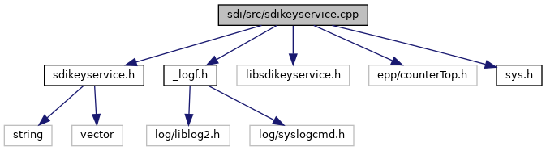

[Macros](#define-members) \| [Functions](#func-members)

`#include "`<a href="sdikeyservice_8h_source.md">sdikeyservice.h</a>`"`
`#include "`<a href="__logf_8h_source.md">_logf.h</a>`"`
`#include "libsdikeyservice.h"`
`#include "epp/counterTop.h"`
`#include "`<a href="sys_8h_source.md">sys.h</a>`"`

Include dependency graph for sdikeyservice.cpp:

|  |  |
|----|----|
| Macros |  |
| #define  | [SDI_KS_LOCALHOST](#a9c5d4c71dc8376183e2a56b4e3912f2c)   \"127.0.0.1\" |
| #define  | [SDI_KS_HOST_INT_ANDROID](#ab2018ee2cc3fdb3ebc9317ed23c3615b)   \"vfi-terminal\" |
| #define  | [SDI_KS_PORT](#aafcd34a5dc43606c57b4b9c8b0cbea11)   12001 |
| #define  | [SDI_KS_LOG_CHANNEL](#afe721ff5529fb139bd8ba375599d500a)   \"SDIKS\" |

|  |  |
|----|----|
| Functions |  |
| string  | [keyservice_get_libname](#ade45a421d3a30912d254dc9fbee2ba2a) () |
| string  | [keyservice_get_build_date](#a5b89ea49a6fdb8f2f7f1821ea9636915) () |
| string  | [keyservice_get_version](#af9ab59e3a46544a91b38f6f458c3dd37) () |
| void  | [keyservice_start](#aff15ff808005686075653f803fad5a00) () |
| void  | [keyservice_stop](#a9e49df21fedb4d23fc8c0ea2f8b6f4e0) () |
| unsigned short  | [keyservice_read_certificate](#a9a4d0843e4abfa130e3cac563376c8e1) (const string &refname, vector\< unsigned char \> &certificate) |

## MacroDefinition Documentation {#macro-definition-documentation}

## SDI_KS_HOST_INT_ANDROID 

#define SDI_KS_HOST_INT_ANDROID   \"vfi-terminal\"

## SDI_KS_LOCALHOST 

#define SDI_KS_LOCALHOST   \"127.0.0.1\"

## SDI_KS_LOG_CHANNEL 

#define SDI_KS_LOG_CHANNEL   \"SDIKS\"

## SDI_KS_PORT 

#define SDI_KS_PORT   12001

## FunctionDocumentation {#function-documentation}

## keyservice_get_build_date() 

string keyservice_get_build_date

returns the build date string for the SDI remote keyservice library

### Returns

build date or an empty string, if SDI remote keyservice is not supported for this device type

## keyservice_get_libname() 

string keyservice_get_libname

returns the library name for the SDI remote keyservice

### Returns

library name or an empty string, if SDI remote keyservice is not supported for this device type

## keyservice_get_version() 

string keyservice_get_version

returns the version string for the SDI remote keyservice library

### Returns

version string or an empty string, if SDI remote keyservice is not supported for this device type

## keyservice_read_certificate() 

unsigned short keyservice_read_certificate

## keyservice_start() 

void keyservice_start

starts the SDI remote keyservice


This function does nothing, if SDI remote keyservice is not supported for this device type


## keyservice_stop() 

void keyservice_stop

stops the SDI remote keyservice


This function does nothing, if SDI remote keyservice is not supported for this device type

