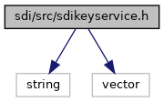
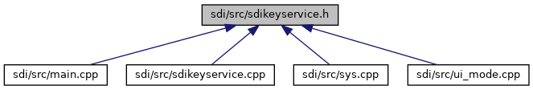

[Functions](#func-members)

`#include <string>`
`#include <vector>`

Include dependency graph for sdikeyservice.h:

This graph shows which files directly or indirectly include this file:

<a href="sdikeyservice_8h_source.md">Go to the source code of this file.</a>

|  |  |
|----|----|
| Functions |  |
| std::string  | [keyservice_get_libname](#a3fabfa707548aef85d0a275bf161437d) () |
| std::string  | [keyservice_get_build_date](#ab421e5234fb10c889cddac6b78d3c5ea) () |
| std::string  | [keyservice_get_version](#ad987589fe9eb5c2406524bf8ec4147df) () |
| void  | [keyservice_start](#aff15ff808005686075653f803fad5a00) () |
| void  | [keyservice_stop](#a9e49df21fedb4d23fc8c0ea2f8b6f4e0) () |
| unsigned short  | [keyservice_read_certificate](#ab974c4fe15eef3d7f1599b8a5d965cb5) (const std::string &refname, std::vector\< unsigned char \> &certificate) |

## FunctionDocumentation {#function-documentation}

## keyservice_get_build_date() 

std::string keyservice_get_build_date

returns the build date string for the SDI remote keyservice library

### Returns

build date or an empty string, if SDI remote keyservice is not supported for this device type

## keyservice_get_libname() 

std::string keyservice_get_libname

returns the library name for the SDI remote keyservice

### Returns

library name or an empty string, if SDI remote keyservice is not supported for this device type

## keyservice_get_version() 

std::string keyservice_get_version

returns the version string for the SDI remote keyservice library

### Returns

version string or an empty string, if SDI remote keyservice is not supported for this device type

## keyservice_read_certificate() 

unsigned short keyservice_read_certificate

read a X.509 certificate for a corresponding reference name specified by parameter `refname`. As reference name the friendly certificate labels (as specified for Android keystore) are used cross over platforms. Example: \"VFI_AUTHN_RSA\" to read the Authex certificate \"VFI_VRK_RSA\" or \"VFI_VRK_ECC\" to read the certificate for remote keyloading The certificate is returned as second parameter `certificate` in binary DER format.

**Parameters**

\[in\] **refname** reference name used to select the corresponding certificate to be read \[in\] **certificate** buffer containing the X.509 certificate

### Returns

SDI error code: 0x9000 for success 0x64FE for parameter error (reference name not supported) 0x6400 for execution error (certificate not installed or invalid)

## keyservice_start() 

void keyservice_start

starts the SDI remote keyservice


This function does nothing, if SDI remote keyservice is not supported for this device type


## keyservice_stop() 

void keyservice_stop

stops the SDI remote keyservice


This function does nothing, if SDI remote keyservice is not supported for this device type

