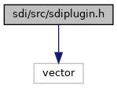
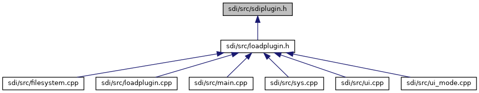

[Data Structures](#nested-classes) \| [Macros](#define-members) \| [Typedefs](#typedef-members) \| [Functions](#func-members)

`#include <vector>`

Include dependency graph for sdiplugin.h:

This graph shows which files directly or indirectly include this file:

<a href="sdiplugin_8h_source.md">Go to the source code of this file.</a>

|                 |                                                        |
|-----------------|--------------------------------------------------------|
| Data Structures |                                                        |
| class           | <a href="class_s_d_i_plugin.md">SDIPlugin</a> |

|  |  |
|----|----|
| Macros |  |
| #define  | [CLA_PLUGIN_CMD](#ae46bbd2ec875260da9eb2686b3ce4856)   0x26 |
|   | Class for plugin commands. [More\...](#ae46bbd2ec875260da9eb2686b3ce4856)  |

|  |  |
|----|----|
| Typedefs |  |
| typedef void(\*  | [Vcl_Encryption_Callback](#acdab1a2f24dd2c626dbbaf8b99bcc8ff)) (void \*data, unsigned short \*size, void \*context) |
| typedef void(\*  | [Vcl_Encryption_Callback_Setter](#aa5c37bc80612b625dd20f7c970c36d11)) ([Vcl_Encryption_Callback](#acdab1a2f24dd2c626dbbaf8b99bcc8ff) cb, void \*context) |

|  |  |
|----|----|
| Functions |  |
|   | [\_\_attribute\_\_](#a0e4254a95d52cd9b80405385066fee37) ((visibility(\"default\"))) SDIPlugin \*getSDIPlugin() |

## MacroDefinition Documentation {#macro-definition-documentation}

## CLA_PLUGIN_CMD 

#define CLA_PLUGIN_CMD   0x26

Class for plugin commands.

## TypedefDocumentation {#typedef-documentation}

## Vcl_Encryption_Callback 

typedef void(\* Vcl_Encryption_Callback) (void \*data, unsigned short \*size, void \*context)

Type of function that is called after external manual card data entry to perform VCL encryption. The plugin must provide PAN, expiry date and optional CVV in clear and gets the data back VCL encrypted.

**Parameters**

**\[in/out\]** data Data pointer provided by the plugin.in: The data provided by the plugin should have following structure:Byte 1 and 2 should contain the length of the provided dataFollowing bytes should contain the data in BERTLV formatout: The returned data provided by the SDI should have following structure:Byte 1 and 2 should contain SW1/SW2If SW1/SW2 is 90 00 the following bytes should contain the data in BERTLV format **\[in/out\]** size Pointer to the buffer/data sizein: buffer sizeout: data size **\[in/out\]** context generic context data pointer, currently not used.

## Vcl_Encryption_Callback_Setter 

typedef void(\* Vcl_Encryption_Callback_Setter) ([Vcl_Encryption_Callback](#acdab1a2f24dd2c626dbbaf8b99bcc8ff) cb, void \*context)

Setter for Vcl_Encryption_Callback. This function should be implemented in the plugin and returned by the openExtension() function when called with the extension ID <a href="class_s_d_i_plugin.md#ac54b73bc0f666acecb26aec563933dabadfaf20e6f6b758be305a019675c7b015">SDIPlugin::SDIExt_VCL_Callback</a>. SDI Server calls this function to set the Vcl_Encryption_Callback pointer in the plugin. The plugin can then call this function in order to perform VCL encryption for externally entered manual card data.

**Parameters**

\[in\] **cb** pointer to the VCL Encryption Callback function. \[in\] **context** generic context data pointer, currently not used.

## FunctionDocumentation {#function-documentation}

## \_\_attribute\_\_() 

\_\_attribute\_\_

new

SDI plugin entry function

### Returns

<a href="class_s_d_i_plugin.md">SDIPlugin</a> object
