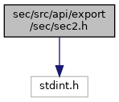
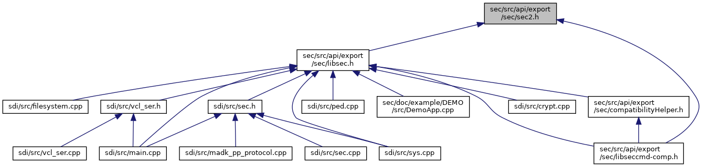

[Namespaces](#namespaces) \| [Macros](#define-members) \| [Typedefs](#typedef-members) \| [Enumerations](#enum-members)

ADK Security Definitions. [More\...](#details)

`#include <stdint.h>`

Include dependency graph for sec2.h:

This graph shows which files directly or indirectly include this file:

<a href="sec2_8h_source.md">Go to the source code of this file.</a>

|  |  |
|----|----|
| Namespaces |  |
|   | <a href="namespacecom__verifone__host.md">com_verifone_host</a> |

|  |  |
|----|----|
| Macros |  |
| #define  | [KEY_TYPE_TPK_FOR_PIN](#a478411dacd6804a158809097d824f2df)   KEY_TYPE_PPK |
| #define  | [KEY_TYPE_TAK_FOR_GEN_MAC](#a6d4d7f005b2871c18569bba76836f233)   KEY_TYPE_MGK |
| #define  | [KEY_TYPE_TPK_FOR_ENC_DATA](#a2b768ebb9dbccc709cfb5fe0c24cac9d)   KEY_TYPE_DEK |
| #define  | [KEY_TYPE_TAK_FOR_VER_MAC](#a33a5318b63ee38fb8f6d4e25f2845a05)   KEY_TYPE_MVK |
| #define  | [KEY_TYPE_TPK_FOR_DEC_DATA](#a3ccd3024447221b65a98e72905edb613)   KEY_TYPE_DDK |
| #define  | [KEY_TYPE_TPK_FOR_KEK](#a20ec969182bfbb30970efa7a1f2a0bca)   KEY_TYPE_KEK |
| #define  | [PIN_BLOCK_FORMAT_MIN](#a5424ce382a93195958480d9224e7ad7a)   (PIN_BLOCK_FORMAT_ISO0_E) |
| #define  | [PIN_BLOCK_FORMAT_MAX](#a44aad3991d8950186aaefff8ba4ae3ae)   (PIN_BLOCK_FORMAT_INC_KSN) |
| #define  | [NEXT_KSN](#ac87cdb44ffe0983da72623af316326a6)   1 |
| #define  | [SAME_KSN](#a7ba70d6ecae5050fbb6c2f4c7e3f3157)   2 |
| #define  | [VISADSP_NEXT_KSN](#a7c740ebd18939b92024ad457329ba460)   [NEXT_KSN](#ac87cdb44ffe0983da72623af316326a6) |
| #define  | [VISADSP_SAME_KSN](#a6299747a71629e066290fb7102139e1d)   [SAME_KSN](#a7ba70d6ecae5050fbb6c2f4c7e3f3157) |
| #define  | [DO_KSN_INCREMENTATION](#aeb5ca7571ca45e74743c0fe81977dcf2)   \"KSN incrementation\" |

|  |  |
|----|----|
| Typedefs |  |
| typedef uint8_t  | <a href="namespacecom__verifone__host.md#a2418ec606f68970a9ed5ddf6ede58a2f">key_type_t</a> |
| typedef enum <a href="namespacecom__verifone__host.md#a112cf2dddd5a504da9cb646fe6df856a">com_verifone_host::pin_entry_type_e</a>  | <a href="namespacecom__verifone__host.md#a8912bf5e7a5e7c3572234976755a39aa">pin_entry_type_t</a> |
| typedef enum <a href="namespacecom__verifone__host.md#a9187fdfc7bd10fdf9a04181929e41693">com_verifone_host::pin_block_format_e</a>  | <a href="namespacecom__verifone__host.md#ad9cc247c205c1cbf74aae27e459c4ce9">pin_block_format_t</a> |

|  |  |
|----|----|
| Enumerations |  |
| enum   | <a href="namespacecom__verifone__host.md#ab6420af507afd2c6a57f725ad69d11cb">key_type_e</a> {   <a href="namespacecom__verifone__host.md#ab6420af507afd2c6a57f725ad69d11cbaa2678cce73d51c8593a4b32f06e863f6">KEY_TYPE__INVALID_E</a> = -1, <a href="namespacecom__verifone__host.md#ab6420af507afd2c6a57f725ad69d11cba97fca93a5b7ec4aedee7149073db751e">KEY_TYPE_TMK</a> = 0, <a href="namespacecom__verifone__host.md#ab6420af507afd2c6a57f725ad69d11cba508471c3ad9204286222065b5adb9f23">KEY_TYPE_PPK</a> = 1, <a href="namespacecom__verifone__host.md#ab6420af507afd2c6a57f725ad69d11cba793c57ed813cdc0fcadd9a1e5d175bbc">KEY_TYPE_MGK</a> = 2,   <a href="namespacecom__verifone__host.md#ab6420af507afd2c6a57f725ad69d11cba93b5ecc6254c9553998b5b503c5565c2">KEY_TYPE_DEK</a> = 3, <a href="namespacecom__verifone__host.md#ab6420af507afd2c6a57f725ad69d11cbafde71a7e88381351a90819d189395595">KEY_TYPE_TCU_PK</a> = 4, <a href="namespacecom__verifone__host.md#ab6420af507afd2c6a57f725ad69d11cba703240f5f7a5e5250fb0c500718e4ae7">KEY_TYPE_SPONSOR_PK</a> = 5, <a href="namespacecom__verifone__host.md#ab6420af507afd2c6a57f725ad69d11cbab35dea27712284a2c1a7304978a22b29">KEY_TYPE_SPONSOR_MK</a> = 6,   <a href="namespacecom__verifone__host.md#ab6420af507afd2c6a57f725ad69d11cba09f2a46c0323886f3c0972645d766899">KEY_TYPE_SPONSOR_KI</a> = 7, <a href="namespacecom__verifone__host.md#ab6420af507afd2c6a57f725ad69d11cbaa1b0414e11ad93eea0ed683e5f71817f">KEY_TYPE_SEC_ACQ_KI</a> = 8, <a href="namespacecom__verifone__host.md#ab6420af507afd2c6a57f725ad69d11cba478004f6fb9430b21c56edae85c50a90">KEY_TYPE_ACQUIRER_MK</a> = 9, <a href="namespacecom__verifone__host.md#ab6420af507afd2c6a57f725ad69d11cba72ac58fd195ecf7c7217bea4a6ff2a23">KEY_TYPE_SEC_ACQ_MK</a> = 10,   <a href="namespacecom__verifone__host.md#ab6420af507afd2c6a57f725ad69d11cbaf79e0ff7580875d9bdcf4d10225779c7">KEY_TYPE_ACQ_SESSION_KEYS</a> = 11, <a href="namespacecom__verifone__host.md#ab6420af507afd2c6a57f725ad69d11cbae6cfdb89bd03c0a2199f28e16fec0ee7">KEY_TYPE_ENC_KI_FMT_0</a> = 12, <a href="namespacecom__verifone__host.md#ab6420af507afd2c6a57f725ad69d11cbabc5fb023d8d677e74d3b48545563a952">KEY_TYPE_ENC_KI_FMT_1</a> = 13, <a href="namespacecom__verifone__host.md#ab6420af507afd2c6a57f725ad69d11cbacbe0d7ac6481e5ab5ba76f9743313374">KEY_TYPE_ENC_KI_FMT_2</a> = 14,   <a href="namespacecom__verifone__host.md#ab6420af507afd2c6a57f725ad69d11cba3bfba7d3da9d84c4e5a17dbb531a2264">KEY_TYPE_ENC_PPID</a> = 15, <a href="namespacecom__verifone__host.md#ab6420af507afd2c6a57f725ad69d11cba87086d37574db21a706727ea790a3c08">KEY_TYPE_ENC_PPASN</a> = 16, <a href="namespacecom__verifone__host.md#ab6420af507afd2c6a57f725ad69d11cbae255a9df4e1aaefbc9366de3f8065d60">KEY_TYPE_KVC_KIA</a> = 17, <a href="namespacecom__verifone__host.md#ab6420af507afd2c6a57f725ad69d11cba824c4c6708c37969db4828faf327aca9">KEY_TYPE_KVC_KEK1</a> = 18,   <a href="namespacecom__verifone__host.md#ab6420af507afd2c6a57f725ad69d11cba7221a6157a4a90491547f38975a9ebcf">KEY_TYPE_MVK</a> = 19, <a href="namespacecom__verifone__host.md#ab6420af507afd2c6a57f725ad69d11cba06ba2d0d2a433b018b9bce5a7b703ed6">KEY_TYPE_DDK</a> = 20, <a href="namespacecom__verifone__host.md#ab6420af507afd2c6a57f725ad69d11cba768d13fac4b43aa792f2b529636ee45f">KEY_TYPE_KEK</a> = 21, <a href="namespacecom__verifone__host.md#ab6420af507afd2c6a57f725ad69d11cba7d6a499d7761faab2f2af90b7adc6f3e">KEY_TYPE_DUKPT</a> = 22,   <a href="namespacecom__verifone__host.md#ab6420af507afd2c6a57f725ad69d11cba3a40bbfe0fae7cd1418c9eeb94541ebf">KEY_TYPE_CERT</a> = 23, <a href="namespacecom__verifone__host.md#ab6420af507afd2c6a57f725ad69d11cba2623446657a3abaaa477ae31aae03538">KEY_TYPE_DIRECT_MK_PLAIN</a> = 24, <a href="namespacecom__verifone__host.md#ab6420af507afd2c6a57f725ad69d11cba5ba1a7e32fb7aff0a6c8595f3748b418">KEY_TYPE_DIRECT_MK_ENC</a> = 25, <a href="namespacecom__verifone__host.md#ab6420af507afd2c6a57f725ad69d11cbadb06bfd0ecb8cbef74ed51861c2aecd4">KEY_TYPE_DIRECT_SYSK_PLAIN</a> = 26,   <a href="namespacecom__verifone__host.md#ab6420af507afd2c6a57f725ad69d11cba5692ffc7bfa4e0a25d8dc3483ec353f9">KEY_TYPE_DIRECT_SYSK_ENC</a> = 27, <a href="namespacecom__verifone__host.md#ab6420af507afd2c6a57f725ad69d11cba331d442daf2746bf9d60b3709ec314c3">KEY_TYPE_DELETE_ALL_KEYS</a> = 28, <a href="namespacecom__verifone__host.md#ab6420af507afd2c6a57f725ad69d11cba9a7f2b8cd3918549fa78db39c4f93a68">KEY_TYPE_DELETE_SYS_KEY</a> = 29, <a href="namespacecom__verifone__host.md#ab6420af507afd2c6a57f725ad69d11cba9edf634d7c59ddb63f033e7f91dc7771">KEY_TYPE_DIRECT_AUTHEX_ENC</a> = 30,   <a href="namespacecom__verifone__host.md#ab6420af507afd2c6a57f725ad69d11cbaa50da1d301fd48e8e21e10ba499737d5">KEY_TYPE_DIRECT_AUTHEX_SYSK</a> = 31, <a href="namespacecom__verifone__host.md#ab6420af507afd2c6a57f725ad69d11cbaa7c42d56623245fd2f3f0befa0cb47f6">KEY_TYPE_DELETE_ALL_CUST_KEYS</a> = 32, <a href="namespacecom__verifone__host.md#ab6420af507afd2c6a57f725ad69d11cba95a6b8bab845cce0b7d7ea0fc6cabb3f">KEY_TYPE_DIRECT_CUSTOM_ASYM</a> = 33, <a href="namespacecom__verifone__host.md#ab6420af507afd2c6a57f725ad69d11cbaa2f6a2eeb244c7f15e35d4962b0d651c">KEY_TYPE_DIRECT_CUSTOM_ASYM_SYSK</a> = 34 } |
| enum   | <a href="namespacecom__verifone__host.md#a112cf2dddd5a504da9cb646fe6df856a">pin_entry_type_e</a> {   <a href="namespacecom__verifone__host.md#a112cf2dddd5a504da9cb646fe6df856aa0fd0290ee4f049554b606088884a5d9c">PIN_ENTRY_TYPE__INVALID_E</a> = -1, <a href="namespacecom__verifone__host.md#a112cf2dddd5a504da9cb646fe6df856aa218934142930b6e0876c1a83decae7dc">PIN_ENTRY_TYPE_MANDATORY_E</a> = 0, <a href="namespacecom__verifone__host.md#a112cf2dddd5a504da9cb646fe6df856aa81532cd64d5490e643b13b8b4cd46714">PIN_ENTRY_TYPE_OPTIONAL_E</a> = 1, <a href="namespacecom__verifone__host.md#a112cf2dddd5a504da9cb646fe6df856aa1c92c3e6fa01b594ae2b086c3eb4a63f">PIN_ENTRY_TYPE_OPTIONAL_0LN_PIN_ENC_E</a> = 2,   <a href="namespacecom__verifone__host.md#a112cf2dddd5a504da9cb646fe6df856aa84e4eca8cdc0cd40e317c9f8922511a7">PIN_ENTRY_TYPE_OPTIONAL_0LN_PIN_E</a> = 3 } |
| enum   | <a href="namespacecom__verifone__host.md#a9187fdfc7bd10fdf9a04181929e41693">pin_block_format_e</a> {   <a href="namespacecom__verifone__host.md#a9187fdfc7bd10fdf9a04181929e41693a41c2fe8ecd7de50f286582a2ae6b6fd1">PIN_BLOCK_FORMAT__INVALID_E</a> = -1, <a href="namespacecom__verifone__host.md#a9187fdfc7bd10fdf9a04181929e41693aca37b0bbb503fcbbc83126484c7c53dc">PIN_BLOCK_FORMAT_ISO0_E</a> = 0, <a href="namespacecom__verifone__host.md#a9187fdfc7bd10fdf9a04181929e41693ab26b2fa22fd9c7ccff77d51adf9fefea">PIN_BLOCK_FORMAT_ISO1_E</a> = 1, <a href="namespacecom__verifone__host.md#a9187fdfc7bd10fdf9a04181929e41693aba22b80e572de9064a7811fb10ddb1e2">PIN_BLOCK_FORMAT_ISO2_E</a> = 2,   <a href="namespacecom__verifone__host.md#a9187fdfc7bd10fdf9a04181929e41693ac81a724b79ab82756da6d67b14788514">PIN_BLOCK_FORMAT_ISO3_E</a> = 3, <a href="namespacecom__verifone__host.md#a9187fdfc7bd10fdf9a04181929e41693a70c003f1b46a252064fcfe374ab67869">PIN_BLOCK_FORMAT_ISO4_E</a> = 4, <a href="namespacecom__verifone__host.md#a9187fdfc7bd10fdf9a04181929e41693a8ef7b1bf8a286ab7cea7649a1d017761">PIN_BLOCK_FORMAT_INC_KSN</a> = 4 } |
| #define  | [CODE_UNLOCK](#a43719c572ad2d02aaddd2b6d14011309)   (0) |
| #define  | [CODE_LOCK](#a5c8c00ea4993ad9dca16fb7a1e02bb50)   (1) |
| #define  | [CODE_ACTION](#a69d4c744551add5d4f3ff518f5fe3bee)   (0x80) |
| #define  | [RESP_CODE_SIZE](#afaca498d565a761525757302243ce699)   ( 1) |
| #define  | [RESP_CODE_SUCCESS](#aedded87ae746218e4381409e9e0a8d12)   ( 0) |
| #define  | [RESP_CODE_FAILED](#a2cf52f68d075cec5f772a4d84a30bfa8)   ( 1) |
| #define  | [RESP_CODE_TIMEOUT](#a24b448944592e5924af400bad41af7c0)   ( 2) |
| #define  | [RESP_CODE_PIN_EQUAL](#aed87f5ae687ac6338f38a8642c287ac9)   ( 3) |
| #define  | [RESP_CODE_HOST_NOT_FOUND](#a33b5e786a62bafafc45b95471aa93b28)   ( 4) |
| #define  | [RESP_CODE_PIN_CANCEL](#ab72bd400b293f26bbea54a0ccfff4df6)   ( 20) |
| #define  | [RESP_CODE_PIN_BYPASS](#a7ee4bfe12e0b17ad3d6e862716735514)   ( 21) |
| #define  | [RESP_CODE_PIN_CANCELED_BY_CLEAR_KEY](#a1e3ee92b7f920f0353e9fcde15412300)   ( 22) |
| #define  | [RESP_CODE_SIZE_ERROR](#a6acb09d7d00665e5964d30110e39ebde)   ( 23) |
| #define  | [RESP_CODE_MAC_VER_FAILED](#afe6f2c453d492144f5618e6915d948e2)   ( 24) |
| #define  | [RESP_CODE_MSG_SIZE_TO_LONG](#a2a94729698b5cc86239b80702aa0da3a)   ( 25) |
| #define  | [RESP_CODE_CMD_SEQ_ERROR](#adf03aad7d6dda14ae294a6985be2f8b0)   ( 26) |
| #define  | [RESP_CODE_RETRY_LIMIT](#a997efd3b93b0cc2ca1eb9a95b492e38b)   ( 31) |
| #define  | [RESP_CODE_INVALID_REQ](#a3b8bb97add27e4783d93458e5b5d7029)   ( 35) |
| #define  | [RESP_CODE_API_REQ](#a16a9bb7a92bb25a92d31c2a6fc4ea5db)   ( 36) |
| #define  | [RESP_CODE_INVALID_CMD](#a744678f8f922bcab03f6c5dd097aebd4)   ( 37) |
| #define  | [RESP_CODE_INVALID_LOCAL_KEY_IDX](#aabd0ff62bb643ea4572c0b461db72358)   ( 40) |
| #define  | [RESP_CODE_UPDATE_KEY_FAILED](#a01b5f717319eccff9468fbbe9966a3b9)   ( 41) |
| #define  | [RESP_CODE_TRANSPORT_KEYS_CHANGED](#aeaa8e162b91f46a5eabd807b3d53eac1)   ( 42) |
| #define  | [RESP_CODE_KEY_UPDATE_LIMIT](#a4ad6a1a11cb223e770d346e3e52aa26d)   ( 43) |
| #define  | [RESP_CODE_INVALID_KEY](#a0e82765e2c270eb481b4e09bc6aa76fb)   ( 45) |
| #define  | [RESP_CODE_PIN_BLOCKED](#a4f6e722629df5454ec41530771c97e86)   ( 90) |
| #define  | [RESP_CODE_PIN_GET_CHALLENGE_ERROR](#ad414665573b7c1c03f16b010ebeaf1ee)   ( 91) |
| #define  | [RESP_CODE_PIN_ENCIPHER_ERROR](#a8a789ab196c5a3c6b3be6c5e07bebcdf)   ( 92) |
| #define  | [RESP_CODE_PIN_VERIFY_FAILED](#ae57aaaebe9692c7c3d9f2138a0d92188)   ( 93) |
| #define  | [RESP_CODE_PIN_MISSING_PIN_BLOCK_DATA](#a97e7a001c756e7a347882a50aac90656)   ( 94) |
| #define  | [RESP_CODE_INVALID_KEY_LENGTH](#a186a905dc00ab07fa534974de7bac5e1)   ( 95) |
| #define  | [RESP_CODE_MISSING_TMK_OR_DUKPT_KEY](#a95624639fa6683e909595a3972e11b3c)   ( 96) |
| #define  | [RESP_CODE_MISSING_TPK_OR_TAK](#a0b8fb404ed2332db826bdffd404985cb)   ( 97) |
| #define  | [RESP_CODE_MISSING_STAN_OR_PAN](#a133912dd98d9d8db9c2254a4ba3f63bd)   ( 98) |
| #define  | [RESP_CODE_ADE_NOT_ACTIVE](#a4640ef6a2b4052a7bced01b625c09d4d)   ( 99) |
| #define  | [RESP_CODE_CARD_REMOVED](#a5b9983d310c81207caa032ebc413989a)   (100) |
| #define  | [RESP_CODE_TAMPERED](#ad9acafac33ea3c54527752aae53549e6)   (101) |
| #define  | [RESP_CODE_NOT_SUPPORTED_KSID](#acd3a84e77166b303e1c828cb32412580)   (102) |
| #define  | [RESP_CODE_NOT_SUPPORTED_KEY_TYPE](#a2ae9043e1acdcf8223e2e12977f0f1c9)   (103) |
| #define  | [RESP_CODE_ASYNC_PIN_NOT_READY](#a983607e349a3f04cf936d1d32dc36456)   (104) |
| #define  | [RESP_CODE_CRYPTO_DEVICE_BLOCKED](#a8af46cd5f2317e930a445ec2c9b7d044)   (105) |
| #define  | [RESP_CODE_KSN_INCREMENTATION_ERROR](#a00ee0f3c96710ad4c8a464367ebfc1fe)   (106) |
| #define  | [RESP_CODE_CMD_BUSY](#a21b6d3e94e1ce8e004484f584ea77f3a)   (249) |
| #define  | [RESP_CODE_INVALID_APP_ID](#a6181d137d762437f075ce7163e685269)   (250) |
| #define  | [RESP_CODE_POS_INVALID_FIELD_LEN](#a48ef9c16d057289c475607e2d234e7db)   (251) |
| #define  | [RESP_CODE_POS_MSG_LEN](#af323d1c12037a3cf484f3917456a48df)   (252) |
| #define  | [RESP_CODE_UNKNOWN_CMD](#aef2285ccd6ca251c361c92428c28fe61)   (253) |
| #define  | [RESP_CODE_INVAL](#ae77fb4e32476d37450a1bb122d5b45e8)   (254) |
| #define  | [RESP_ADE_NOT_ACTIVE](#a5a30d512781fe64cf6d7bc1c189e3948)   [RESP_CODE_ADE_NOT_ACTIVE](#a4640ef6a2b4052a7bced01b625c09d4d) |
| #define  | [ADD_SCREEN_TEXT](#a300d4dc4bdf6ac0a094898d88f88b6cd)   (16) |
| #define  | [ACTION_CODE_SIZE](#abf6e6139b7100861aec7d9d11ec54076)   ( 1) |
| #define  | [COMMAND_SIZE](#a87738054f9a89f0ac29c6ee1fb7da08d)   ( 1) |
| #define  | [DATA_ALGORITHM_SIZE](#a1274b4f9b3de4e594e172fbe71d623af)   ( 1) |
| #define  | [PAN_SIZE](#aceeb2a7f2c289494dc2338db7f3ff895)   (10) |
| #define  | [STAN_SIZE](#a1b8b2cff07ea1a5bd6d92bf1d929d7b6)   ( 6) |
| #define  | [TRANS_AMOUNT_SIZE](#a733b5fa0159e0f063543d9be2aa3158b)   ( 6) |
| #define  | [TRANS_CURR_CODE_SIZE](#a074ef9bde5a11062331f058346e49e45)   ( 2) |
| #define  | [ONLINE_PIN_CIPHER_BLOCK_SIZE](#ac2136c07151c2da9745fab48e30adcf3)   ( 8) |
| #define  | [KSN_SIZE](#a39c92888160f6810dc7fed5fea7417f4)   (10) |
| #define  | [AES_KSN_SIZE](#af852a7f1bf904ea16e867a632107579f)   (12) |
| #define  | [POS_TIMEOUT_SIZE](#aefea51eda08782eae4697732a978cd58)   ( 1) |
| #define  | [HOST_ID_SIZE](#af126334879feee84ae6be78bcd8291df)   ( 1) |
| #define  | [KEY_TYPE_SIZE](#a20c108503e7888506afb411b702f5b3c)   ( 1) |
| #define  | [LOCK_SIZE](#a7eb09ce13675c2d56f02dbfd6f551910)   ( 1) |
| #define  | [PIN_ENTRY_TYPE_SIZE](#a2c25db0c6072d5d610d8788730257591)   ( 1) |
| #define  | [PIN_BLOCK_FORMAT_SIZE](#a805f5a5f931127b4eb0d4c6f6827a157)   ( 1) |
| #define  | [KEY_MANAGEMENT_SIZE](#af02a2605189bb69a09870f5daf092331)   ( 1) |
| #define  | [PIN_ALGORITHM_SIZE](#a745e010c088efb6cfa5ddd7b1ee6dffc)   ( 1) |
| #define  | [PIN_TRY_FLAG_SIZE](#ae49ebf33110079cb8f1c3e632316ddf0)   ( 1) |
| #define  | [TRANS_CURR_EXPONENT_SIZE](#aa4e5900850ac6ba7297f0faa1167c558)   ( 1) |
| #define  | [MAX_PIN_LENGTH_SIZE](#a49da5c136b592770c37a9ced667bcae0)   ( 1) |
| #define  | [MIN_PIN_LENGTH_SIZE](#a31cd0b0604ad3d294d8f9e89fd7ae12e)   ( 1) |
| #define  | [PIN_ENTRY_TIMEOUT_SIZE](#a8f9e6818c67cfa82c8c673ac8187b854)   ( 2) |
| #define  | [PIN_CANCEL_SIZE](#adc6f40c85a55b22928e0857d43bfbda8)   ( 1) |
| #define  | [USE_DEFAULT_CV_FLAG_SIZE](#ad99b42eb6c3ffec1b546dc2b2ec7cb51)   ( 1) |
| #define  | [MAC_MODE_SIZE](#a85d8ed52558cfc1b0b065bad47e506fc)   ( 1) |
| #define  | [HTML_FILE_PATH_SIZE](#a426957950ceec44a697adae61b2c2c6b)   (128) |
| #define  | [MACRO_PAN_SIZE](#a70d607f265444a7cc2315da0f3fc3f79)   ( 6) |
| #define  | [KEK_FLAG_SIZE](#ac83f6492e9bee3052c8041bb847837a3)   ( 1) |
| #define  | [AS2805_FUNC_SIZE](#a50abcc519e18f33de1c1443c457d05a9)   ( 1) |
| #define  | [DES_IV_SIZE](#ac3774eaa9f99a0dfefc97d62317466f2)   ( 8) |
| #define  | [POS_TIMEOUT_TS](#a6f89a54f9ea56e6c1706c8af6c1d4886)   (2) |
| #define  | [ACTION_CODE_TS](#af90554137d873b06403b4a211951207e)   (2) |
| #define  | [HOST_KEY_FILE_TS](#a8525f0574164d3e5dcc4911e7803b8fc)   (3) |
| #define  | [CODE_TS](#ad95c8233fe8028e7a10db6052b545351)   (2) |
| #define  | [HOST_ID_TS](#a878b739e12a7dde7f50f4d69c75269be)   (2) |
| #define  | [KEY_TYPE_TS](#a6d8ec5be108b104ec9e0aaaf69926864)   (2) |
| #define  | [KEY_DATA_TS](#abfb88ece471738fbd486f11f37b4b05f)   (2) |
| #define  | [LOCK_TS](#a6724506e8b89e4534b4b189b3421e7f6)   (3) |
| #define  | [PAN_TS](#a66e07a91c4208e036cf8f46d734646b8)   (2) |
| #define  | [STAN_TS](#a869a5b9719a561b73a4879408c0102f7)   (2) |
| #define  | [TRANS_AMOUNT_TS](#a57f597620332f2a2fe35cc4099293dd0)   (2) |
| #define  | [TRANS_CURR_CODE_TS](#a1a50de905e616a16481ffadb238461a4)   (2) |
| #define  | [TRANS_CURR_EXP_TS](#a339db27a69918b07eddb06956c1cdfa8)   (2) |
| #define  | [PIN_BLOCK_FORMAT_TS](#a46e0424c5acb6872e46b9f48ac95fb5c)   (3) |
| #define  | [PIN_TRY_FLAG_TS](#a75e2df4bd5aadab3b56a2e4f2fca9c8a)   (2) |
| #define  | [ADD_SCREEN_TEXT_TS](#a8c24e9e87af5c2be3c423c3d67307ba0)   (3) |
| #define  | [ADD_SCREEN_TEXT_2_TS](#acdcacd0bfa215af9e5dfd28e970dd4dc)   (3) |
| #define  | [MIN_PIN_LENGTH_TS](#ac8605d32436f707677852b23c6a58c36)   (3) |
| #define  | [MAX_PIN_LENGTH_TS](#a5eb4d9625a8ec4e9650780662b815528)   (3) |
| #define  | [PIN_ENTRY_TIMEOUT_TS](#a755ac27b722ed1079239b8b30a5c66f1)   (3) |
| #define  | [MESS_FOR_MAC_TS](#aa4d9afb756f226b05e4b319920139db5)   (2) |
| #define  | [MAC_TS](#a78266e22d0880f6f786aae9eaa4c8ee0)   (2) |
| #define  | [MESS_FOR_ENC_TS](#a53df8a6800f3945cd53aa419b9fb7f61)   (2) |
| #define  | [PIN_ENTRY_TYPE_TS](#a65de59f47e83e0364303941b9795e784)   (2) |
| #define  | [KEY_MANAGEMENT_TS](#a85f8e3ff13a58df6c15d381f974a4cd1)   (3) |
| #define  | [PIN_ALGORITHM_TS](#a0d7831e0be76fc3ffad810657b5fdc74)   (3) |
| #define  | [DATA_ALGORITHM_TS](#a441f27a6000d4c51907523c465e8df76)   (3) |
| #define  | [KSN_TS](#a5a9de4a6250281f24a1cc30f780a979d)   (3) |
| #define  | [TRANS_CAT_EXP_TS](#aa507d4ada91c18a7e59b16219f95885d)   (2) |
| #define  | [PLAIN_TXT_PIN_BLOCK_TS](#a35922f0772e5c410b4037ecdf088eaf5)   (3) |
| #define  | [SCRIPT_NAME_TS](#ad9f25e8423177804695205c3835c7fe0)   (3) |
| #define  | [PIN_CANCEL_TS](#a736081c397b95df10d74a88592bfad3c)   (3) |
| #define  | [ONLINE_PIN_CIPHER_TS](#ac642a0fc4f1a427e60650604d990d71c)   (2) |
| #define  | [MESS_FOR_DEC_TS](#ad479833ff2329d5058ae967f53d038b8)   (3) |
| #define  | [FLAGS_TS](#a1d6e38daa3f4f08c42b8a4fef397bc24)   (3) |
| #define  | [MSG_ENTER_PIN_TS](#a7398a22b9322320911064e13efbba844)   (3) |
| #define  | [MSG_AMOUNT_TS](#adf0ad030de9a893c8fd416cc011fdb9f)   (3) |
| #define  | [MSG_FONT_FILE_TS](#ac4d9cd4f6857015bec1bccda9b949f3b)   (3) |
| #define  | [MONITOR_PERIOD_TS](#ab21cb94803efba910aba136e2f91b320)   (3) |
| #define  | [SCREEN_LINES_TS](#a7862e7377161f1f0716e803f7b02ec33)   (3) |
| #define  | [PROMPT_FILL_TS](#a389f91039b11ba2ee52b15eccd0846c1)   (3) |
| #define  | [DUKPT_MASK_TS](#a6840b89b455f67fdd7459f3f83869012)   (3) |
| #define  | [AMOUNT_EMV_TS](#a392e35762a40c2205e8bf6de815ddcbb)   (2) |
| #define  | [CURR_CODE_EMV_TS](#ad4fb39820d33a2c28e9c54288b37ddc1)   (2) |
| #define  | [CURR_EXP_EMV_TS](#ad5f06d298a73ac8c4b0397c571787825)   (2) |
| #define  | [DOUBLE_KEY_SIZE](#a75aeed9500da52073cd4fa9f79cec477)   (32) |
| #define  | [MAPP_UNLOCK_DISPLAY](#ac21aaa685d906001819cbf95de268963)   (57) |
| #define  | [MAPP_LOCK_DISPLAY](#a7548f70d379ce1b874dfc45f1cad5250)   (58) |
| #define  | [INSTALL_VSS_COM](#af79d9e6a1ad81c76f8092849c23702ba)   (160) |
| #define  | [EXECUTE_VSS_MACRO_COM](#ad3fc3b3e04d45d313d903dc18fffdf31)   (161) |
| #define  | [SC_PIPE_NAME](#a3c6abfc7747544bc7e29a7c2b03f7c40)   \"/tmp/scdata\"; |
| #define  | [CERTSTORE_PIPE_NAME](#a5400afb1d49f345f9bddda2a1c9de50f)   \"/tmp/csdata\"; |
| #define  | [IPP_SET_SPEED](#aef66dc3454f262d5a2636af0d807bc56)   \"IPP19K\" |
| #define  | [CFG_FILE_NAME](#a69a7d4181851f197342dec3f4dcab992)   \"SCAPPCFG\" |
| #define  | [CFG_FILE_NAME_DEF](#a2e65f4508d4996849cc10a9b476efea6)   \"sccfg.json\" |
| #define  | [SEC_DIG_LRC](#a327f5ad0464b22d7322ecdcbda1964c4)   0x00 |
| #define  | [SEC_DIG_CRC_CRC16LSB](#aca070225bd66db0dd0bc905358b29f54)   0x01 |
| #define  | [SEC_DIG_CRC_CRC16MSB](#a09580e0dd07cc522b13c374bbbbc2827)   0x02 |
| #define  | [SEC_DIG_CRC_CCITTLSB](#a1463c80d1d739b81637dac31adecc598)   0x03 |
| #define  | [SEC_DIG_CRC_CCITTMSB](#a5ff31b6c862259163d973fe6209439b8)   0x04 |
| #define  | [SEC_DIG_CRC_CRC32LSB_0](#a4b3f79cea54a03185ee8732ffcab054e)   0x05 |
| #define  | [SEC_DIG_CRC_CRC32LSB](#a6e1c1fff6b1365257831fa838061a0ce)   0x06 |
| #define  | [SEC_DIG_CRC_CRC16MSB_1](#acbd0c64cfbbf2f6f00c456bb3f1cdf68)   0x07 |
| #define  | [SEC_DIG_CRC_CCITTMSB_1](#a8a12be3d68ab3a36ef04fd6e8af8ab0c)   0x08 |
| #define  | [SEC_DIG_SHA1](#a56708bbab6e35419aa3d74345084e2c5)   0x10 |
| #define  | [SEC_DIG_SHA256](#ad5a20012bc13d3d0c3cc1f8f5040ee06)   0x11 |
| enum   | [sec_cmd_code](#a453e6542f2cb31abde608e81d8ba6837) {   [UPDATE_KEY_COM](#a453e6542f2cb31abde608e81d8ba6837a43547836bc7dabed9e4d388547ccff32) =43, [RETRIEVE_ENCRYPTED_PIN_COM](#a453e6542f2cb31abde608e81d8ba6837a08f84e010957f4538f3a7876eb506549) = 26, [GENERATE_MAC_COM](#a453e6542f2cb31abde608e81d8ba6837a7fc5ad5c08954e937863d6b9305f7afc) = 44, [VERIFY_MAC_COM](#a453e6542f2cb31abde608e81d8ba6837a8eb264ded0b8e27ba9e2145a0e476b55) = 45,   [ENCRYPT_DATA_COM](#a453e6542f2cb31abde608e81d8ba6837a27711fd9270a6de583fdbfd35753c1a5) =46, [DECRYPT_DATA_COM](#a453e6542f2cb31abde608e81d8ba6837a9bf15e24ee7505f155e8e11c5b5c1c0a) =47, [GET_KEY_DATA_COM](#a453e6542f2cb31abde608e81d8ba6837a6429b72a936822b57c396990816c16c1) = 54, [GET_SVC_VERSION_COM](#a453e6542f2cb31abde608e81d8ba6837af35ff315c8f32b2d4b5521bc576f1227) = 60,   [OPEN_SCHEMA_COM](#a453e6542f2cb31abde608e81d8ba6837a24dcfcb843f3986df1d863c45e09bcdb) = 62, [CLOSE_SCHEMA_COM](#a453e6542f2cb31abde608e81d8ba6837af268eef0acbb6dcc9de9e1008198e737) = 63, [PUT_TRANSACTIONDATA_COM](#a453e6542f2cb31abde608e81d8ba6837a8adcf51ecf1611ec2c45e01121eb139e) = 64, [GET_KEY_INVENTORY_COM](#a453e6542f2cb31abde608e81d8ba6837a668824a6e50de74b51d063de966f230d) = 65,   [GET_TRANSACTION_VALUE](#a453e6542f2cb31abde608e81d8ba6837a3b6f2a2ba6a976ce73bedee1062e6891) = 66, [GET_PERMISSION](#a453e6542f2cb31abde608e81d8ba6837a3403a96e83499f416ceeae3f06e263c2) = 67, [CLEAR_TRANSACTIONDATA_COM](#a453e6542f2cb31abde608e81d8ba6837aec7d86ea110f5649cb7d3192626d1c7c) = 68, [GET_STATUS_COM](#a453e6542f2cb31abde608e81d8ba6837ad8f3c27adce11ca7c9e5da8aeed6c300) = 69,   [CRT_CHECK_CONN_COM](#a453e6542f2cb31abde608e81d8ba6837aaeba7adee7c5c1dc5305d4658445500f) = 70, [CRT_GET_CERT_CHAIN_COM](#a453e6542f2cb31abde608e81d8ba6837a0a37319bf48cae7a9450581a1c561947) = 71, [CRT_GET_KEY_COM](#a453e6542f2cb31abde608e81d8ba6837a5a109882616ca24f155bf1a0f84a5e7b) = 72, [CRT_UPDATE_CERT_COM](#a453e6542f2cb31abde608e81d8ba6837af5e00f510bfc3758481c8abd70a4dac8) = 73,   [CRT_UPDATE_KEY_COM](#a453e6542f2cb31abde608e81d8ba6837aa2f3dee0168fe3fd6811af6129868b05) = 74, [CRT_GET_SVC_VERSION_COM](#a453e6542f2cb31abde608e81d8ba6837a0dce9d760adddbefa459f2f0fd009562) = 75 } |

## DetailedDescription {#detailed-description}

ADK Security Definitions.

This header file contains preprocessor and data definitions of the ADK security service.

## MacroDefinition Documentation {#macro-definition-documentation}

## ACTION_CODE_SIZE 

#define ACTION_CODE_SIZE   ( 1)

## ACTION_CODE_TS 

#define ACTION_CODE_TS   (2)

## ADD_SCREEN_TEXT 

#define ADD_SCREEN_TEXT   (16)

## ADD_SCREEN_TEXT_2_TS 

#define ADD_SCREEN_TEXT_2_TS   (3)

## ADD_SCREEN_TEXT_TS 

#define ADD_SCREEN_TEXT_TS   (3)

## AES_KSN_SIZE 

#define AES_KSN_SIZE   (12)

## AMOUNT_EMV_TS 

#define AMOUNT_EMV_TS   (2)

## AS2805_FUNC_SIZE 

#define AS2805_FUNC_SIZE   ( 1)

## CERTSTORE_PIPE_NAME 

#define CERTSTORE_PIPE_NAME   \"/tmp/csdata\";

## CFG_FILE_NAME 

#define CFG_FILE_NAME   \"SCAPPCFG\"

## CFG_FILE_NAME_DEF 

#define CFG_FILE_NAME_DEF   \"sccfg.json\"

## CODE_ACTION 

#define CODE_ACTION   (0x80)

## CODE_LOCK 

#define CODE_LOCK   (1)

## CODE_TS 

#define CODE_TS   (2)

## CODE_UNLOCK 

#define CODE_UNLOCK   (0)

## COMMAND_SIZE 

#define COMMAND_SIZE   ( 1)

## CURR_CODE_EMV_TS 

#define CURR_CODE_EMV_TS   (2)

## CURR_EXP_EMV_TS 

#define CURR_EXP_EMV_TS   (2)

## DATA_ALGORITHM_SIZE 

#define DATA_ALGORITHM_SIZE   ( 1)

## DATA_ALGORITHM_TS 

#define DATA_ALGORITHM_TS   (3)

## DES_IV_SIZE 

#define DES_IV_SIZE   ( 8)

## DO_KSN_INCREMENTATION 

#define DO_KSN_INCREMENTATION   \"KSN incrementation\"

## DOUBLE_KEY_SIZE 

#define DOUBLE_KEY_SIZE   (32)

## DUKPT_MASK_TS 

#define DUKPT_MASK_TS   (3)

## EXECUTE_VSS_MACRO_COM 

#define EXECUTE_VSS_MACRO_COM   (161)

## FLAGS_TS 

#define FLAGS_TS   (3)

## HOST_ID_SIZE 

#define HOST_ID_SIZE   ( 1)

## HOST_ID_TS 

#define HOST_ID_TS   (2)

## HOST_KEY_FILE_TS 

#define HOST_KEY_FILE_TS   (3)

## HTML_FILE_PATH_SIZE 

#define HTML_FILE_PATH_SIZE   (128)

## INSTALL_VSS_COM 

#define INSTALL_VSS_COM   (160)

## IPP_SET_SPEED 

#define IPP_SET_SPEED   \"IPP19K\"

## KEK_FLAG_SIZE 

#define KEK_FLAG_SIZE   ( 1)

## KEY_DATA_TS 

#define KEY_DATA_TS   (2)

## KEY_MANAGEMENT_SIZE 

#define KEY_MANAGEMENT_SIZE   ( 1)

## KEY_MANAGEMENT_TS 

#define KEY_MANAGEMENT_TS   (3)

## KEY_TYPE_SIZE 

#define KEY_TYPE_SIZE   ( 1)

## KEY_TYPE_TAK_FOR_GEN_MAC 

#define KEY_TYPE_TAK_FOR_GEN_MAC   KEY_TYPE_MGK

## KEY_TYPE_TAK_FOR_VER_MAC 

#define KEY_TYPE_TAK_FOR_VER_MAC   KEY_TYPE_MVK

## KEY_TYPE_TPK_FOR_DEC_DATA 

#define KEY_TYPE_TPK_FOR_DEC_DATA   KEY_TYPE_DDK

## KEY_TYPE_TPK_FOR_ENC_DATA 

#define KEY_TYPE_TPK_FOR_ENC_DATA   KEY_TYPE_DEK

## KEY_TYPE_TPK_FOR_KEK 

#define KEY_TYPE_TPK_FOR_KEK   KEY_TYPE_KEK

## KEY_TYPE_TPK_FOR_PIN 

#define KEY_TYPE_TPK_FOR_PIN   KEY_TYPE_PPK

Data type definitions

## KEY_TYPE_TS 

#define KEY_TYPE_TS   (2)

## KSN_SIZE 

#define KSN_SIZE   (10)

## KSN_TS 

#define KSN_TS   (3)

## LOCK_SIZE 

#define LOCK_SIZE   ( 1)

## LOCK_TS 

#define LOCK_TS   (3)

## MAC_MODE_SIZE 

#define MAC_MODE_SIZE   ( 1)

## MAC_TS 

#define MAC_TS   (2)

## MACRO_PAN_SIZE 

#define MACRO_PAN_SIZE   ( 6)

## MAPP_LOCK_DISPLAY 

#define MAPP_LOCK_DISPLAY   (58)

## MAPP_UNLOCK_DISPLAY 

#define MAPP_UNLOCK_DISPLAY   (57)

## MAX_PIN_LENGTH_SIZE 

#define MAX_PIN_LENGTH_SIZE   ( 1)

## MAX_PIN_LENGTH_TS 

#define MAX_PIN_LENGTH_TS   (3)

## MESS_FOR_DEC_TS 

#define MESS_FOR_DEC_TS   (3)

## MESS_FOR_ENC_TS 

#define MESS_FOR_ENC_TS   (2)

## MESS_FOR_MAC_TS 

#define MESS_FOR_MAC_TS   (2)

## MIN_PIN_LENGTH_SIZE 

#define MIN_PIN_LENGTH_SIZE   ( 1)

## MIN_PIN_LENGTH_TS 

#define MIN_PIN_LENGTH_TS   (3)

## MONITOR_PERIOD_TS 

#define MONITOR_PERIOD_TS   (3)

## MSG_AMOUNT_TS 

#define MSG_AMOUNT_TS   (3)

## MSG_ENTER_PIN_TS 

#define MSG_ENTER_PIN_TS   (3)

## MSG_FONT_FILE_TS 

#define MSG_FONT_FILE_TS   (3)

## NEXT_KSN 

#define NEXT_KSN   1

KSN key state definition KSN key state: get next KSN/key

## ONLINE_PIN_CIPHER_BLOCK_SIZE 

#define ONLINE_PIN_CIPHER_BLOCK_SIZE   ( 8)

## ONLINE_PIN_CIPHER_TS 

#define ONLINE_PIN_CIPHER_TS   (2)

## PAN_SIZE 

#define PAN_SIZE   (10)

## PAN_TS 

#define PAN_TS   (2)

## PIN_ALGORITHM_SIZE 

#define PIN_ALGORITHM_SIZE   ( 1)

## PIN_ALGORITHM_TS 

#define PIN_ALGORITHM_TS   (3)

## PIN_BLOCK_FORMAT_MAX 

#define PIN_BLOCK_FORMAT_MAX   (PIN_BLOCK_FORMAT_INC_KSN)

## PIN_BLOCK_FORMAT_MIN 

#define PIN_BLOCK_FORMAT_MIN   (PIN_BLOCK_FORMAT_ISO0_E)

## PIN_BLOCK_FORMAT_SIZE 

#define PIN_BLOCK_FORMAT_SIZE   ( 1)

## PIN_BLOCK_FORMAT_TS 

#define PIN_BLOCK_FORMAT_TS   (3)

## PIN_CANCEL_SIZE 

#define PIN_CANCEL_SIZE   ( 1)

## PIN_CANCEL_TS 

#define PIN_CANCEL_TS   (3)

## PIN_ENTRY_TIMEOUT_SIZE 

#define PIN_ENTRY_TIMEOUT_SIZE   ( 2)

## PIN_ENTRY_TIMEOUT_TS 

#define PIN_ENTRY_TIMEOUT_TS   (3)

## PIN_ENTRY_TYPE_SIZE 

#define PIN_ENTRY_TYPE_SIZE   ( 1)

## PIN_ENTRY_TYPE_TS 

#define PIN_ENTRY_TYPE_TS   (2)

## PIN_TRY_FLAG_SIZE 

#define PIN_TRY_FLAG_SIZE   ( 1)

## PIN_TRY_FLAG_TS 

#define PIN_TRY_FLAG_TS   (2)

## PLAIN_TXT_PIN_BLOCK_TS 

#define PLAIN_TXT_PIN_BLOCK_TS   (3)

## POS_TIMEOUT_SIZE 

#define POS_TIMEOUT_SIZE   ( 1)

## POS_TIMEOUT_TS 

#define POS_TIMEOUT_TS   (2)

## PROMPT_FILL_TS 

#define PROMPT_FILL_TS   (3)

## RESP_ADE_NOT_ACTIVE 

#define RESP_ADE_NOT_ACTIVE   [RESP_CODE_ADE_NOT_ACTIVE](#a4640ef6a2b4052a7bced01b625c09d4d)

## RESP_CODE_ADE_NOT_ACTIVE 

#define RESP_CODE_ADE_NOT_ACTIVE   ( 99)

## RESP_CODE_API_REQ 

#define RESP_CODE_API_REQ   ( 36)

## RESP_CODE_ASYNC_PIN_NOT_READY 

#define RESP_CODE_ASYNC_PIN_NOT_READY   (104)

## RESP_CODE_CARD_REMOVED 

#define RESP_CODE_CARD_REMOVED   (100)

## RESP_CODE_CMD_BUSY 

#define RESP_CODE_CMD_BUSY   (249)

## RESP_CODE_CMD_SEQ_ERROR 

#define RESP_CODE_CMD_SEQ_ERROR   ( 26)

## RESP_CODE_CRYPTO_DEVICE_BLOCKED 

#define RESP_CODE_CRYPTO_DEVICE_BLOCKED   (105)

## RESP_CODE_FAILED 

#define RESP_CODE_FAILED   ( 1)

## RESP_CODE_HOST_NOT_FOUND 

#define RESP_CODE_HOST_NOT_FOUND   ( 4)

## RESP_CODE_INVAL 

#define RESP_CODE_INVAL   (254)

## RESP_CODE_INVALID_APP_ID 

#define RESP_CODE_INVALID_APP_ID   (250)

## RESP_CODE_INVALID_CMD 

#define RESP_CODE_INVALID_CMD   ( 37)

## RESP_CODE_INVALID_KEY 

#define RESP_CODE_INVALID_KEY   ( 45)

## RESP_CODE_INVALID_KEY_LENGTH 

#define RESP_CODE_INVALID_KEY_LENGTH   ( 95)

## RESP_CODE_INVALID_LOCAL_KEY_IDX 

#define RESP_CODE_INVALID_LOCAL_KEY_IDX   ( 40)

## RESP_CODE_INVALID_REQ 

#define RESP_CODE_INVALID_REQ   ( 35)

## RESP_CODE_KEY_UPDATE_LIMIT 

#define RESP_CODE_KEY_UPDATE_LIMIT   ( 43)

## RESP_CODE_KSN_INCREMENTATION_ERROR 

#define RESP_CODE_KSN_INCREMENTATION_ERROR   (106)

## RESP_CODE_MAC_VER_FAILED 

#define RESP_CODE_MAC_VER_FAILED   ( 24)

## RESP_CODE_MISSING_STAN_OR_PAN 

#define RESP_CODE_MISSING_STAN_OR_PAN   ( 98)

## RESP_CODE_MISSING_TMK_OR_DUKPT_KEY 

#define RESP_CODE_MISSING_TMK_OR_DUKPT_KEY   ( 96)

## RESP_CODE_MISSING_TPK_OR_TAK 

#define RESP_CODE_MISSING_TPK_OR_TAK   ( 97)

## RESP_CODE_MSG_SIZE_TO_LONG 

#define RESP_CODE_MSG_SIZE_TO_LONG   ( 25)

## RESP_CODE_NOT_SUPPORTED_KEY_TYPE 

#define RESP_CODE_NOT_SUPPORTED_KEY_TYPE   (103)

## RESP_CODE_NOT_SUPPORTED_KSID 

#define RESP_CODE_NOT_SUPPORTED_KSID   (102)

## RESP_CODE_PIN_BLOCKED 

#define RESP_CODE_PIN_BLOCKED   ( 90)

## RESP_CODE_PIN_BYPASS 

#define RESP_CODE_PIN_BYPASS   ( 21)

## RESP_CODE_PIN_CANCEL 

#define RESP_CODE_PIN_CANCEL   ( 20)

## RESP_CODE_PIN_CANCELED_BY_CLEAR_KEY 

#define RESP_CODE_PIN_CANCELED_BY_CLEAR_KEY   ( 22)

## RESP_CODE_PIN_ENCIPHER_ERROR 

#define RESP_CODE_PIN_ENCIPHER_ERROR   ( 92)

## RESP_CODE_PIN_EQUAL 

#define RESP_CODE_PIN_EQUAL   ( 3)

## RESP_CODE_PIN_GET_CHALLENGE_ERROR 

#define RESP_CODE_PIN_GET_CHALLENGE_ERROR   ( 91)

## RESP_CODE_PIN_MISSING_PIN_BLOCK_DATA 

#define RESP_CODE_PIN_MISSING_PIN_BLOCK_DATA   ( 94)

## RESP_CODE_PIN_VERIFY_FAILED 

#define RESP_CODE_PIN_VERIFY_FAILED   ( 93)

## RESP_CODE_POS_INVALID_FIELD_LEN 

#define RESP_CODE_POS_INVALID_FIELD_LEN   (251)

## RESP_CODE_POS_MSG_LEN 

#define RESP_CODE_POS_MSG_LEN   (252)

## RESP_CODE_RETRY_LIMIT 

#define RESP_CODE_RETRY_LIMIT   ( 31)

## RESP_CODE_SIZE 

#define RESP_CODE_SIZE   ( 1)

## RESP_CODE_SIZE_ERROR 

#define RESP_CODE_SIZE_ERROR   ( 23)

## RESP_CODE_SUCCESS 

#define RESP_CODE_SUCCESS   ( 0)

## RESP_CODE_TAMPERED 

#define RESP_CODE_TAMPERED   (101)

## RESP_CODE_TIMEOUT 

#define RESP_CODE_TIMEOUT   ( 2)

## RESP_CODE_TRANSPORT_KEYS_CHANGED 

#define RESP_CODE_TRANSPORT_KEYS_CHANGED   ( 42)

## RESP_CODE_UNKNOWN_CMD 

#define RESP_CODE_UNKNOWN_CMD   (253)

## RESP_CODE_UPDATE_KEY_FAILED 

#define RESP_CODE_UPDATE_KEY_FAILED   ( 41)

## SAME_KSN 

#define SAME_KSN   2

KSN key state: use same KSN/key

## SC_PIPE_NAME 

#define SC_PIPE_NAME   \"/tmp/scdata\";

## SCREEN_LINES_TS 

#define SCREEN_LINES_TS   (3)

## SCRIPT_NAME_TS 

#define SCRIPT_NAME_TS   (3)

## SEC_DIG_CRC_CCITTLSB 

#define SEC_DIG_CRC_CCITTLSB   0x03

## SEC_DIG_CRC_CCITTMSB 

#define SEC_DIG_CRC_CCITTMSB   0x04

## SEC_DIG_CRC_CCITTMSB_1 

#define SEC_DIG_CRC_CCITTMSB_1   0x08

## SEC_DIG_CRC_CRC16LSB 

#define SEC_DIG_CRC_CRC16LSB   0x01

## SEC_DIG_CRC_CRC16MSB 

#define SEC_DIG_CRC_CRC16MSB   0x02

## SEC_DIG_CRC_CRC16MSB_1 

#define SEC_DIG_CRC_CRC16MSB_1   0x07

## SEC_DIG_CRC_CRC32LSB 

#define SEC_DIG_CRC_CRC32LSB   0x06

## SEC_DIG_CRC_CRC32LSB_0 

#define SEC_DIG_CRC_CRC32LSB_0   0x05

## SEC_DIG_LRC 

#define SEC_DIG_LRC   0x00

## SEC_DIG_SHA1 

#define SEC_DIG_SHA1   0x10

## SEC_DIG_SHA256 

#define SEC_DIG_SHA256   0x11

## STAN_SIZE 

#define STAN_SIZE   ( 6)

## STAN_TS 

#define STAN_TS   (2)

## TRANS_AMOUNT_SIZE 

#define TRANS_AMOUNT_SIZE   ( 6)

## TRANS_AMOUNT_TS 

#define TRANS_AMOUNT_TS   (2)

## TRANS_CAT_EXP_TS 

#define TRANS_CAT_EXP_TS   (2)

## TRANS_CURR_CODE_SIZE 

#define TRANS_CURR_CODE_SIZE   ( 2)

## TRANS_CURR_CODE_TS 

#define TRANS_CURR_CODE_TS   (2)

## TRANS_CURR_EXP_TS 

#define TRANS_CURR_EXP_TS   (2)

## TRANS_CURR_EXPONENT_SIZE 

#define TRANS_CURR_EXPONENT_SIZE   ( 1)

## USE_DEFAULT_CV_FLAG_SIZE 

#define USE_DEFAULT_CV_FLAG_SIZE   ( 1)

## VISADSP_NEXT_KSN 

#define VISADSP_NEXT_KSN   [NEXT_KSN](#ac87cdb44ffe0983da72623af316326a6)

## VISADSP_SAME_KSN 

#define VISADSP_SAME_KSN   [SAME_KSN](#a7ba70d6ecae5050fbb6c2f4c7e3f3157)

## EnumerationType Documentation {#enumeration-type-documentation}

## sec_cmd_code 

enum [sec_cmd_code](#a453e6542f2cb31abde608e81d8ba6837)

| Enumerator                  |     |
|-----------------------------|-----|
| UPDATE_KEY_COM              |     |
| RETRIEVE_ENCRYPTED_PIN_COM  |     |
| GENERATE_MAC_COM            |     |
| VERIFY_MAC_COM              |     |
| ENCRYPT_DATA_COM            |     |
| DECRYPT_DATA_COM            |     |
| GET_KEY_DATA_COM            |     |
| GET_SVC_VERSION_COM         |     |
| OPEN_SCHEMA_COM             |     |
| CLOSE_SCHEMA_COM            |     |
| PUT_TRANSACTIONDATA_COM     |     |
| GET_KEY_INVENTORY_COM       |     |
| GET_TRANSACTION_VALUE       |     |
| GET_PERMISSION              |     |
| CLEAR_TRANSACTIONDATA_COM   |     |
| GET_STATUS_COM              |     |
| CRT_CHECK_CONN_COM          |     |
| CRT_GET_CERT_CHAIN_COM      |     |
| CRT_GET_KEY_COM             |     |
| CRT_UPDATE_CERT_COM         |     |
| CRT_UPDATE_KEY_COM          |     |
| CRT_GET_SVC_VERSION_COM     |     |
