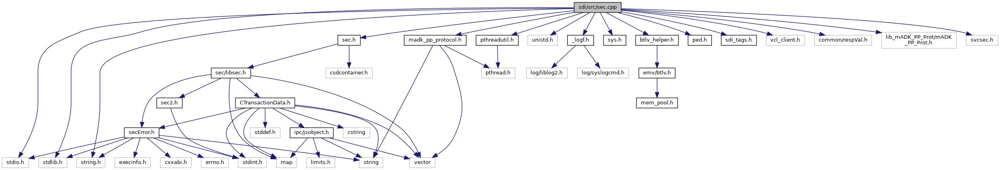

[Data Structures](#nested-classes) \| [Functions](#func-members)

`#include <stdio.h>`
`#include <stdlib.h>`
`#include <string.h>`
`#include <unistd.h>`
`#include "`<a href="__logf_8h_source.md">_logf.h</a>`"`
`#include "`<a href="sys_8h_source.md">sys.h</a>`"`
`#include "`<a href="sec_8h_source.md">sec.h</a>`"`
`#include "`<a href="btlv__helper_8h_source.md">btlv_helper.h</a>`"`
`#include "`<a href="sdi_2src_2ped_8h_source.md">ped.h</a>`"`
`#include "`<a href="src_2sdi__tags_8h_source.md">sdi_tags.h</a>`"`
`#include "vcl_client.h"`
`#include "common/respVal.h"`
`#include "`<a href="pthreadutil_8h_source.md">pthreadutil.h</a>`"`
`#include "`<a href="madk__pp__protocol_8h_source.md">madk_pp_protocol.h</a>`"`
`#include "lib_mADK_PP_Prot/mADK_PP_Prot.h"`
`#include "svcsec.h"`

Include dependency graph for sec.cpp:

|  |  |
|----|----|
| Data Structures |  |
| class   | <a href="class_sec_handle_map.md">SecHandleMap</a> |

|  |  |
|----|----|
| Functions |  |
| bool  | [getSecHandle](#a5629ef607b8d2f2c3aebd7ceb0d2f586) (void \*sdihandle, <a href="namespacecom__adksec__cmd.md#acc01edab4b0f73c92142d9d43dc7a7f7">secHandle_t</a> &h, unsigned idx) |
| void  | [cleanUpSecHandles](#a8ab35d4f50f1f1a915b30797fa283c03) (void \*sdihandle) |
| bool  | [isAdeEnabled](#acfedfb1b909acd490a61944fb6d79def) (void) |
| int  | [findCryptoHandle](#a1978b336fce513905d85e6a8d8df460d) (struct <a href="struct_b_t_l_v_node.md">BTLVNode</a> \*xBtlv, struct <a href="struct_b_t_l_v_node.md">BTLVNode</a> \*\*node, <a href="namespacecom__adksec__cmd.md#acc01edab4b0f73c92142d9d43dc7a7f7">secHandle_t</a> \*handle) |
| int  | [SEC_open](#aebf96fd0f1b808cde04999f7fa8f82f4) (struct <a href="struct_b_t_l_v_node.md">BTLVNode</a> \*xBtlv, <a href="namespacecom__adksec__cmd.md#af511ddd4237541a758df48299546d49a">secError</a> &errorCode) |
| int  | [SEC_close](#acfb4f54c6b931061d769aff87496f058) (struct <a href="struct_b_t_l_v_node.md">BTLVNode</a> \*xBtlv, <a href="namespacecom__adksec__cmd.md#af511ddd4237541a758df48299546d49a">secError</a> &errorCode) |
| int  | [SEC_encrypt](#a4102d97d783ed54dd1ddd639ea04ee5f) (struct <a href="struct_b_t_l_v_node.md">BTLVNode</a> \*xBtlv, <a href="namespacecom__adksec__cmd.md#af511ddd4237541a758df48299546d49a">secError</a> &errorCode) |
| int  | [SEC_decrypt](#a406b5bed47930a5d046ba84849584e85) (struct <a href="struct_b_t_l_v_node.md">BTLVNode</a> \*xBtlv, <a href="namespacecom__adksec__cmd.md#af511ddd4237541a758df48299546d49a">secError</a> &errorCode) |
| int  | [SEC_sign](#aef34a883e9c2e323e86d1b3719d98703) (struct <a href="struct_b_t_l_v_node.md">BTLVNode</a> \*xBtlv, <a href="namespacecom__adksec__cmd.md#af511ddd4237541a758df48299546d49a">secError</a> &errorCode) |
| int  | [SEC_verify](#ad039e93372a96fb8af70f49a13c733c9) (struct <a href="struct_b_t_l_v_node.md">BTLVNode</a> \*xBtlv, <a href="namespacecom__adksec__cmd.md#af511ddd4237541a758df48299546d49a">secError</a> &errorCode) |
| int  | [SEC_updateKey](#a9430a31487eb8d568a2a6c88ccb06506) (struct <a href="struct_b_t_l_v_node.md">BTLVNode</a> \*xBtlv, <a href="namespacecom__adksec__cmd.md#af511ddd4237541a758df48299546d49a">secError</a> &errorCode) |
| int  | [SEC_setKeySet](#ac927a6de385ff59ff2874add3a9f291f) (struct <a href="struct_b_t_l_v_node.md">BTLVNode</a> \*xBtlv, unsigned char \*rsp, unsigned short \*rspSize, <a href="namespacecom__adksec__cmd.md#af511ddd4237541a758df48299546d49a">secError</a> &errorCode) |
| int  | [SEC_getKeyInventory](#a2070fa55c8ad374deff27cabd31a7468) (struct <a href="struct_b_t_l_v_node.md">BTLVNode</a> \*xBtlv, <a href="namespacecom__adksec__cmd.md#af511ddd4237541a758df48299546d49a">secError</a> &errorCode) |
| int  | [SEC_getKeyData](#a7e56b80abb556d5957f4a4266d1b9fae) (struct <a href="struct_b_t_l_v_node.md">BTLVNode</a> \*xBtlv, <a href="namespacecom__adksec__cmd.md#af511ddd4237541a758df48299546d49a">secError</a> &errorCode) |
| int  | [SEC_getStatus](#ad2e537beb5d36ad406f5192f5b010e87) (struct <a href="struct_b_t_l_v_node.md">BTLVNode</a> \*xBtlv, <a href="namespacecom__adksec__cmd.md#af511ddd4237541a758df48299546d49a">secError</a> &errorCode) |
| int  | [SEC_getVersion](#a736eee8c0e9c3ce618c4dfc209a642b1) (struct <a href="struct_b_t_l_v_node.md">BTLVNode</a> \*xBtlv, <a href="namespacecom__adksec__cmd.md#af511ddd4237541a758df48299546d49a">secError</a> &errorCode) |
| void  | [handleSec](#ac8c59ad55811826c6d394f6ae3dfcc04) (unsigned short msgBufSize, unsigned char \*msg, unsigned short msgSize, unsigned short rspBufSize, unsigned char \*rsp, unsigned short \*rspSize) |

## FunctionDocumentation {#function-documentation}

## cleanUpSecHandles() 

void cleanUpSecHandles

## findCryptoHandle() 

int findCryptoHandle

## getSecHandle() 

bool getSecHandle

## handleSec() 

void handleSec

Dispatch function to handle different crypto interface commands

**Parameters**

\[in\] **msgBufSize** size of the input message buffer \[in\] **msg** pointer to the input message buffer \[in\] **msgSize** size of the input message \[in\] **rspBufSize** maximum size of the response buffer \[in,out\] **rsp** pointer to the response buffer \[in,out\] **rspSize** pointer to the response message size


<a href="sec_8h.md#ac8c59ad55811826c6d394f6ae3dfcc04">handleSec()</a> is always executed, even if invoked by a side command. Therefore, this function has no return value, see also <a href="main_8cpp.md#a4892e1b795462119ef4d6fa87c860b90">process_side_command()</a>.


## isAdeEnabled() 

bool isAdeEnabled

## SEC_close() 

int SEC_close

## SEC_decrypt() 

int SEC_decrypt

## SEC_encrypt() 

int SEC_encrypt

## SEC_getKeyData() 

int SEC_getKeyData

## SEC_getKeyInventory() 

int SEC_getKeyInventory

## SEC_getStatus() 

int SEC_getStatus

## SEC_getVersion() 

int SEC_getVersion

## SEC_open() 

int SEC_open

## SEC_setKeySet() 

int SEC_setKeySet

## SEC_sign() 

int SEC_sign

## SEC_updateKey() 

int SEC_updateKey

## SEC_verify() 

int SEC_verify

