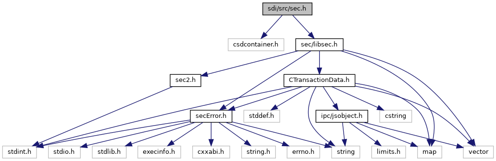
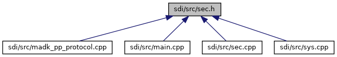

[Macros](#define-members) \| [Functions](#func-members)

`#include "csdcontainer.h"`
`#include "`<a href="libsec_8h_source.md">sec/libsec.h</a>`"`

Include dependency graph for sec.h:

This graph shows which files directly or indirectly include this file:

<a href="sec_8h_source.md">Go to the source code of this file.</a>

|  |  |
|----|----|
| Macros |  |
| #define  | [CLA_SEC](#a72e3f69af3894a5cceb704998c518665)   0x70 |
|   | Class for SEC commands. [More\...](#a72e3f69af3894a5cceb704998c518665)  |
| #define  | [INS_SEC_OPEN](#ac74bc220be6eeeefbb63b996260afc24)   0x00 |
|   | Open SecADK crypto interface. [More\...](#ac74bc220be6eeeefbb63b996260afc24)  |
| #define  | [INS_SEC_CLOSE](#a5af03568952420504b69869b655b6665)   0x01 |
|   | Close SecADK crypto interface. [More\...](#a5af03568952420504b69869b655b6665)  |
| #define  | [INS_SEC_ENCRYPT](#a2c15ab1edb92fe335f8c2362f3ceddf6)   0x02 |
|   | SecADK Encrypt. [More\...](#a2c15ab1edb92fe335f8c2362f3ceddf6)  |
| #define  | [INS_SEC_DECRYPT](#ae68f53f2d6dd3058d7a4c74a1f37e5c6)   0x03 |
|   | SecADK Decrypt. [More\...](#ae68f53f2d6dd3058d7a4c74a1f37e5c6)  |
| #define  | [INS_SEC_SIGN](#a6b65f189b9f518902cfc6d38b5972c0e)   0x04 |
|   | SecADK Singing. [More\...](#a6b65f189b9f518902cfc6d38b5972c0e)  |
| #define  | [INS_SEC_VERIFY](#afb9a2cc81a942bfd3f0ed9d6745c4878)   0x05 |
|   | SecADK Verify. [More\...](#afb9a2cc81a942bfd3f0ed9d6745c4878)  |
| #define  | [INS_SEC_UPDATE_KEY](#a7be370ee4477eaa72f63f283a99a8e1b)   0x06 |
|   | SecADK Update Key. [More\...](#a7be370ee4477eaa72f63f283a99a8e1b)  |
| #define  | [INS_SEC_SET_KEY_SET](#a796f0cb0783a46f24c3dedc304c31eb8)   0x07 |
|   | SecADK Set Key Set. [More\...](#a796f0cb0783a46f24c3dedc304c31eb8)  |
| #define  | [INS_SEC_GET_ENCRYPTED_PIN](#a79fa2cfe6114399ad96f41977bcb7fe1)   0x08 |
|   | SecADK Get encrypted Pin. [More\...](#a79fa2cfe6114399ad96f41977bcb7fe1)  |
| #define  | [INS_SEC_GET_KEY_INVENTORY](#a645ac958fd2392b18f23cba23eaf19b4)   0x09 |
|   | SecADK Get Key Inventory. [More\...](#a645ac958fd2392b18f23cba23eaf19b4)  |
| #define  | [INS_SEC_GET_KEY_DATA](#ada44cc11d4f02b072bc4a36831914b12)   0x0A |
|   | SecADK Get Key Data. [More\...](#ada44cc11d4f02b072bc4a36831914b12)  |
| #define  | [INS_SEC_GET_STATUS](#aa9fe8114148d7219b3467243e20a6d69)   0x0B |
|   | SecADK Get Status. [More\...](#aa9fe8114148d7219b3467243e20a6d69)  |
| #define  | [INS_SEC_GET_VERSION](#a72d95895724387f428c8b04913fa9e2d)   0x0C |
|   | SecADK Get Version. [More\...](#a72d95895724387f428c8b04913fa9e2d)  |

|  |  |
|----|----|
| Functions |  |
| bool  | [isAdeEnabled](#acfedfb1b909acd490a61944fb6d79def) (void) |
| void  | [handleSec](#ac8c59ad55811826c6d394f6ae3dfcc04) (unsigned short msgBufSize, unsigned char \*msg, unsigned short msgSize, unsigned short rspBufSize, unsigned char \*rsp, unsigned short \*rspSize) |
| int  | [findCryptoHandle](#a1152b5b6ef4eeeb34352d2707f6ab872) (struct <a href="struct_b_t_l_v_node.md">BTLVNode</a> \*xBtlv, struct <a href="struct_b_t_l_v_node.md">BTLVNode</a> \*\*node, <a href="namespacecom__adksec__cmd.md#acc01edab4b0f73c92142d9d43dc7a7f7">com_adksec_cmd::secHandle_t</a> \*handle) |
| int  | [SEC_getEncryptedPin](#a74d8a4aae80136676662f5c370352591) (struct <a href="struct_b_t_l_v_node.md">BTLVNode</a> \*xBtlv, <a href="namespacecom__adksec__cmd.md#af511ddd4237541a758df48299546d49a">com_adksec_cmd::secError</a> &errorCode) |
| bool  | [getSecHandle](#ad7f13c5a06cf61a03f3d0a6f993a2cc4) (void \*sdihandle, <a href="namespacecom__adksec__cmd.md#acc01edab4b0f73c92142d9d43dc7a7f7">com_adksec_cmd::secHandle_t</a> &h, unsigned idx) |
| void  | [cleanUpSecHandles](#a8ab35d4f50f1f1a915b30797fa283c03) (void \*sdihandle) |

## MacroDefinition Documentation {#macro-definition-documentation}

## CLA_SEC 

#define CLA_SEC   0x70

Class for SEC commands.

## INS_SEC_CLOSE 

#define INS_SEC_CLOSE   0x01

Close SecADK crypto interface.

## INS_SEC_DECRYPT 

#define INS_SEC_DECRYPT   0x03

SecADK Decrypt.

## INS_SEC_ENCRYPT 

#define INS_SEC_ENCRYPT   0x02

SecADK Encrypt.

## INS_SEC_GET_ENCRYPTED_PIN 

#define INS_SEC_GET_ENCRYPTED_PIN   0x08

SecADK Get encrypted Pin.

## INS_SEC_GET_KEY_DATA 

#define INS_SEC_GET_KEY_DATA   0x0A

SecADK Get Key Data.

## INS_SEC_GET_KEY_INVENTORY 

#define INS_SEC_GET_KEY_INVENTORY   0x09

SecADK Get Key Inventory.

## INS_SEC_GET_STATUS 

#define INS_SEC_GET_STATUS   0x0B

SecADK Get Status.

## INS_SEC_GET_VERSION 

#define INS_SEC_GET_VERSION   0x0C

SecADK Get Version.

## INS_SEC_OPEN 

#define INS_SEC_OPEN   0x00

Open SecADK crypto interface.

## INS_SEC_SET_KEY_SET 

#define INS_SEC_SET_KEY_SET   0x07

SecADK Set Key Set.

## INS_SEC_SIGN 

#define INS_SEC_SIGN   0x04

SecADK Singing.

## INS_SEC_UPDATE_KEY 

#define INS_SEC_UPDATE_KEY   0x06

SecADK Update Key.

## INS_SEC_VERIFY 

#define INS_SEC_VERIFY   0x05

SecADK Verify.

## FunctionDocumentation {#function-documentation}

## cleanUpSecHandles() 

void cleanUpSecHandles

## findCryptoHandle() 

int findCryptoHandle

## getSecHandle() 

bool getSecHandle

## handleSec() 

void handleSec

Dispatch function to handle different crypto interface commands

**Parameters**

\[in\] **msgBufSize** size of the input message buffer \[in\] **msg** pointer to the input message buffer \[in\] **msgSize** size of the input message \[in\] **rspBufSize** maximum size of the response buffer \[in,out\] **rsp** pointer to the response buffer \[in,out\] **rspSize** pointer to the response message size


[handleSec()](#ac8c59ad55811826c6d394f6ae3dfcc04) is always executed, even if invoked by a side command. Therefore, this function has no return value, see also <a href="main_8cpp.md#a4892e1b795462119ef4d6fa87c860b90">process_side_command()</a>.


## isAdeEnabled() 

bool isAdeEnabled

## SEC_getEncryptedPin() 

int SEC_getEncryptedPin

