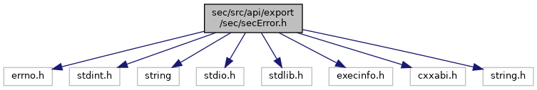
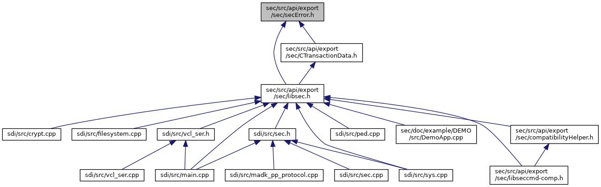

[Namespaces](#namespaces) \| [Macros](#define-members) \| [Typedefs](#typedef-members) \| [Enumerations](#enum-members) \| [Functions](#func-members)

ADK Security Service Error Codes. [More\...](#details)

`#include <errno.h>`
`#include <stdint.h>`
`#include <string>`
`#include <stdio.h>`
`#include <stdlib.h>`
`#include <execinfo.h>`
`#include <cxxabi.h>`
`#include <string.h>`

Include dependency graph for secError.h:



This graph shows which files directly or indirectly include this file:



<a href="sec_error_8h_source.md">Go to the source code of this file.</a>

|  |  |
|----|----|
| Namespaces |  |
|   | <a href="namespacecom__adksec__cmd.md">com_adksec_cmd</a> |

|  |  |
|----|----|
| Macros |  |
| #define  | [EHWPOISON](#a7ac6735b364cb147c6ce8b887506a281)   133 /\* Memory page has hardware error \*/ |
| #define  | [RESP_CODE_OLD_DEFAULT](#aca06a96ec93e86c18246ad6b08461aa3)   <a href="sec2_8h.md#a2cf52f68d075cec5f772a4d84a30bfa8">RESP_CODE_FAILED</a> |
| #define  | [ERRORS](#a3e0fd9a8c4888cc21faa55c690a4308f)(DO) |
| #define  | [DO_ENUM](#a04a18c96de7c999721957aa617bacc1d)(Name, Group, Offset, Old, Description)   /\*\* Description (in compatibility mapped to Old) \*/ Name = Group + Offset, |
| #define  | [LOG_THROW_EX](#a42b00844374090aaf4fa6705e38a8179)(error, txt) |
| #define  | [LOG_THROW](#a2308ce16ed027a95f9e60457663dd0a8)(error)   [LOG_THROW_EX](#a42b00844374090aaf4fa6705e38a8179)(error, \"\") |
| #define  | [LOG_ASSERT](#a18661c960dea09d1c6404d29442928f5)(assertion) |
| #define  | [LOG_HEXDUMP](#af816e47c8d38fdb9e4d77f6e92ed4a66)(vec)   <a href="seclogging_8h.md#aac251c3b586091a676c4484811568f0a">SEC_DBG_HEXDUMP_TRACE</a>(#vec, &vec\[0\], vec.size()) |
| #define  | [LOG_RETURN_EX](#aa15736acf4e569e18a7395154526fce7)(error, txt) |
| #define  | [LOG_RETURN](#a915de5cdaaef50181b3dd0c52d6a3dcc)(error)   [LOG_RETURN_EX](#aa15736acf4e569e18a7395154526fce7)(error, \"\") |
| #define  | [RETURN_ON](#acc5faf3b744e24a00f560a1689566106)(func)   {secError err=func; <a href="_v_h_q__vfisyspm__wrapper_8cpp.md#a12d403643236776c26b6081a4e570a27">if</a>(err) [LOG_RETURN_EX](#aa15736acf4e569e18a7395154526fce7)(err, \"\")} |

|  |  |
|----|----|
| Typedefs |  |
| typedef uint32_t  | <a href="namespacecom__adksec__cmd.md#ae9f0bf534a30b1423c9e00302d53b7b8">secError_t</a> |

|  |  |
|----|----|
| Enumerations |  |
| enum   | <a href="namespacecom__adksec__cmd.md#afe1062c1bfd2726a8d1ab38e7811bfb1">secErrorGroup</a> {<br/>  <a href="namespacecom__adksec__cmd.md#afe1062c1bfd2726a8d1ab38e7811bfb1a54e1471760a67dae8d22721a00ede39a">EsecGroupCommon</a> = 0x00000000, <a href="namespacecom__adksec__cmd.md#afe1062c1bfd2726a8d1ab38e7811bfb1a167ffff4c0820ffb92f955cb7a8d29ee">EsecGroupApi</a> = 0x00010000, <a href="namespacecom__adksec__cmd.md#afe1062c1bfd2726a8d1ab38e7811bfb1a7b2a912e9a3211090f9892b058f0a6ca">EsecGroupEncGov</a> = 0x00020000, <a href="namespacecom__adksec__cmd.md#afe1062c1bfd2726a8d1ab38e7811bfb1a8d1038dad4c0f15215f4788a08f9584e">EsecGroupIPC</a> = 0x00030000,<br/>  <a href="namespacecom__adksec__cmd.md#afe1062c1bfd2726a8d1ab38e7811bfb1a960eca2e08f9da84f901ce8e933aa07a">EsecGroupEncConfig</a> = 0x00040000, <a href="namespacecom__adksec__cmd.md#afe1062c1bfd2726a8d1ab38e7811bfb1afd58b9d738baecee7f34327b36d93e3a">EsecGroupEncTA</a> = 0x00050000, <a href="namespacecom__adksec__cmd.md#afe1062c1bfd2726a8d1ab38e7811bfb1a0eddf41a8245133990b360f9e6ac6f1c">EsecGroupEncVSS</a> = 0x00110000, <a href="namespacecom__adksec__cmd.md#afe1062c1bfd2726a8d1ab38e7811bfb1ae118f32b45b0853d48da2c67b47b4055">EsecGroupEncIPP</a> = 0x00120000,<br/>  <a href="namespacecom__adksec__cmd.md#afe1062c1bfd2726a8d1ab38e7811bfb1a212740110be098540fa62ca02ded6c37">EsecGroupEncSRED</a> = 0x00130000, <a href="namespacecom__adksec__cmd.md#afe1062c1bfd2726a8d1ab38e7811bfb1afab318675e1a1fad08fc0e153a9b1557">EsecGroupEncADE</a> = 0x00140000, <a href="namespacecom__adksec__cmd.md#afe1062c1bfd2726a8d1ab38e7811bfb1a4ee53414e3e303fe1fcd0683f49da4d4">EsecGroupEncBendigo</a> = 0x00150000, <a href="namespacecom__adksec__cmd.md#afe1062c1bfd2726a8d1ab38e7811bfb1a537062d96ccd76dc0de27bff61b91175">EsecGroupEncVOL</a> = 0x00160000,<br/>  <a href="namespacecom__adksec__cmd.md#afe1062c1bfd2726a8d1ab38e7811bfb1a4d935076f45fc9d8c21907e8277af7c3">EsecGroupEncVDSP</a> = 0x00170000, <a href="namespacecom__adksec__cmd.md#afe1062c1bfd2726a8d1ab38e7811bfb1abef4c4b4626d100bda0d1d9113c70051">EsecGroupEncRSA</a> = 0x00180000, <a href="namespacecom__adksec__cmd.md#afe1062c1bfd2726a8d1ab38e7811bfb1a019138033a54e4e59615ea7581370327">EsecGroupEncAES</a> = 0x00190000, <a href="namespacecom__adksec__cmd.md#afe1062c1bfd2726a8d1ab38e7811bfb1ad31dfaf8b9e1e4e25219430e8f9a1acf">EsecGroupEncCryptRW</a> = 0x001A0000,<br/>  <a href="namespacecom__adksec__cmd.md#afe1062c1bfd2726a8d1ab38e7811bfb1a7efded02437b12a6fa601841bdaa04dc">EsecGroupEncMSK</a> = 0x001B0000, <a href="namespacecom__adksec__cmd.md#afe1062c1bfd2726a8d1ab38e7811bfb1a96a3fb4ac144556336f923b4bd04ac40">EsecGroupEncCustRKL</a> = 0x001C0000, <a href="namespacecom__adksec__cmd.md#afe1062c1bfd2726a8d1ab38e7811bfb1a0607e193fbd3d2cfd51eb49385c95dc5">EsecGroupDUKPT</a> = 0x001D0000, <a href="namespacecom__adksec__cmd.md#afe1062c1bfd2726a8d1ab38e7811bfb1a400628f4e2dca15e56606f2095c77091">EsecGroupMASK</a> = 0x00FF0000<br/>} |
| enum   | <a href="namespacecom__adksec__cmd.md#af511ddd4237541a758df48299546d49a">secError</a> |

|  |  |
|----|----|
| Functions |  |
| std::string  | <a href="namespacecom__adksec__cmd.md#aad94ea47fc0f24cdb4d5079c910d11b5">getErrorString</a> (secError_t error) |
| std::string  | <a href="namespacecom__adksec__cmd.md#a3121d76c18d310000977ac9d2ddc3c07">getErrorDescription</a> (secError_t error) |

## DetailedDescription {#detailed-description}

ADK Security Service Error Codes.

### Author

JensW

### Date

19.04.2016

## MacroDefinition Documentation {#macro-definition-documentation}

## DO_ENUM <a href="#a04a18c96de7c999721957aa617bacc1d" id="a04a18c96de7c999721957aa617bacc1d"></a>

<p>#define DO_ENUM</p>

## EHWPOISON <a href="#a7ac6735b364cb147c6ce8b887506a281" id="a7ac6735b364cb147c6ce8b887506a281"></a>

<p>#define EHWPOISON   133 /\* Memory page has hardware error \*/</p>

## ERRORS <a href="#a3e0fd9a8c4888cc21faa55c690a4308f" id="a3e0fd9a8c4888cc21faa55c690a4308f"></a>

<p>#define ERRORS</p>

## LOG_ASSERT <a href="#a18661c960dea09d1c6404d29442928f5" id="a18661c960dea09d1c6404d29442928f5"></a>

<p>#define LOG_ASSERT</p>

**Value:**

``` cpp
{ \
   if(!(assertion)) \
   { \
   SEC_LOG_CRIT("Assertion failed: " #assertion); \
   LOG_THROW(com_adksec_cmd::EsecAssertion); \
   } \
}
```

## LOG_HEXDUMP <a href="#af816e47c8d38fdb9e4d77f6e92ed4a66" id="af816e47c8d38fdb9e4d77f6e92ed4a66"></a>

<p>#define LOG_HEXDUMP</p>

## LOG_RETURN <a href="#a915de5cdaaef50181b3dd0c52d6a3dcc" id="a915de5cdaaef50181b3dd0c52d6a3dcc"></a>

<p>#define LOG_RETURN</p>

## LOG_RETURN_EX <a href="#aa15736acf4e569e18a7395154526fce7" id="aa15736acf4e569e18a7395154526fce7"></a>

<p>#define LOG_RETURN_EX</p>

**Value:**

``` cpp
   { \
   SEC_LOG_ERROR(txt " return %s (0x%08x): %s", getErrorString(error).c_str(), error, getErrorDescription(error).c_str()); \
   return (com_adksec_cmd::secError)error; \
   }
```

## LOG_THROW <a href="#a2308ce16ed027a95f9e60457663dd0a8" id="a2308ce16ed027a95f9e60457663dd0a8"></a>

<p>#define LOG_THROW</p>

## LOG_THROW_EX <a href="#a42b00844374090aaf4fa6705e38a8179" id="a42b00844374090aaf4fa6705e38a8179"></a>

<p>#define LOG_THROW_EX</p>

**Value:**

``` cpp
   { \
   SEC_LOG_ERROR(txt " throw " #error); \
   throw (com_adksec_cmd::secError)error; \
   }
```

## RESP_CODE_OLD_DEFAULT <a href="#aca06a96ec93e86c18246ad6b08461aa3" id="aca06a96ec93e86c18246ad6b08461aa3"></a>

<p>#define RESP_CODE_OLD_DEFAULT   <a href="sec2_8h.md#a2cf52f68d075cec5f772a4d84a30bfa8">RESP_CODE_FAILED</a></p>

## RETURN_ON <a href="#acc5faf3b744e24a00f560a1689566106" id="acc5faf3b744e24a00f560a1689566106"></a>

<p>#define RETURN_ON</p>
