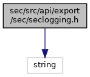
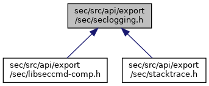

[Macros](#define-members) \| [Functions](#func-members)

`#include <string>`

Include dependency graph for seclogging.h:

This graph shows which files directly or indirectly include this file:

<a href="seclogging_8h_source.md">Go to the source code of this file.</a>

|  |  |
|----|----|
| Macros |  |
| #define  | [DllSpecSEC](#abcde1739ffe76c2296e21ce0b20f0ad3) |
| #define  | [LOGNAME_SEC](#a81050f161d9227cbf0d4c3f46c03426d)   \"SEC\" |
| #define  | [SEC_LOG_EMERG](#ad01beaff0a14d0f64db1e6e68e01cc9d)(\...)   [SECINTERNAL_LOG_EMERG](#a2c360063c00a4614ce1ec91ee9d1ba4d)(\_\_FILE\_\_, \_\_LINE\_\_, \_\_VA_ARGS\_\_) |
| #define  | [SEC_LOG_ALERT](#a978306e6ef449572579abfb701997f7a)(\...)   [SECINTERNAL_LOG_ALERT](#ad118b3df803c06511249907ae9f016ec)(\_\_FILE\_\_, \_\_LINE\_\_, \_\_VA_ARGS\_\_) |
| #define  | [SEC_LOG_CRIT](#acc979a6cb518d97cb5df5c3814388421)(\...)   [SECINTERNAL_LOG_CRIT](#abc4ce8b7690a58a16a31e580f4033fe2)(\_\_FILE\_\_, \_\_LINE\_\_, \_\_VA_ARGS\_\_) |
| #define  | [SEC_LOG_ERROR](#a08631f7820918469dcdcd29e5c24674a)(\...)   [SECINTERNAL_LOG_ERROR](#a86ffd8f767295b0661f70bd5d222844a)(\_\_FILE\_\_, \_\_LINE\_\_, \_\_VA_ARGS\_\_) |
| #define  | [SEC_LOG_WARN](#a3a9738987dcd9c7d2ee90fc560b540d9)(\...)   [SECINTERNAL_LOG_WARN](#ad7d5a9d46479647c9bfdb829d8bf5d3b)(\_\_FILE\_\_, \_\_LINE\_\_, \_\_VA_ARGS\_\_) |
| #define  | [SEC_LOG_NOTICE](#ae1c77968688fd70cc1f92b4f5464f11a)(\...)   [SECINTERNAL_LOG_NOTICE](#a58b35b2a310f61500aacd5e8879f868f)(\_\_FILE\_\_, \_\_LINE\_\_, \_\_VA_ARGS\_\_) |
| #define  | [SEC_LOG_INFO](#a56e091545e6f07d7a74c43b0bbbe620e)(\...)   [SECINTERNAL_LOG_INFO](#a1db286735c73f7c1f2290c74f5e73324)(\_\_FILE\_\_, \_\_LINE\_\_, \_\_VA_ARGS\_\_) |
| #define  | [SEC_LOG_TRACE](#a32f14167926d4ea28edd1d8924ff1c08)(\...)   [SECINTERNAL_LOG_TRACE](#ae8da07e4c67b9fffef701ca81ef9edc9)(\_\_FILE\_\_, \_\_LINE\_\_, \_\_VA_ARGS\_\_) |
| #define  | [SEC_LOG_HEXDUMP_TRACE](#a2ae8bd1bf377db6cbfc48eeac4655709)(a, b, c)   [SECINTERNAL_LOG_HEXDUMP_TRACE](#a6ec21626a5dadc6f2e8d5bf2ccb62294)(a, b, c) |
| #define  | [SEC_LOG_PRINT_CALLSTACK](#a2979f3a50a4daad56bf1d84c32a4beab)   [SECINTERNAL_PRINT_CALLSTACK](#a8eabc748315a01df2ecc3b2a818c597e) |
| #define  | [SEC_DBG_ERROR](#afb37a7176709bf62eacbce873c2ca00f)(\...) |
| #define  | [SEC_DBG_WARN](#aac2f1efecc4eb792d92a4c38c2414a93)(\...) |
| #define  | [SEC_DBG_INFO](#a9dfef20e6e2917ee0e5ea1def5d4033c)(\...) |
| #define  | [SEC_DBG_NOTICE](#ae54abd59888d9e1940cc81e17c8744af)(\...) |
| #define  | [SEC_DBG_TRACE](#ad74f4b5d9cebe2bf474f7ee3bdf6109f)(\...) |
| #define  | [SEC_DBG_HEXDUMP_INFO](#a2cf9ca8f17b040664f7b4bed2b6824db)(a, b, c) |
| #define  | [SEC_DBG_HEXDUMP_NOTICE](#a5bbcd3044fa422a9a354ba32d5db4a76)(a, b, c) |
| #define  | [SEC_DBG_HEXDUMP_TRACE](#aac251c3b586091a676c4484811568f0a)(a, b, c) |

|  |  |
|----|----|
| Functions |  |
| [DllSpecSEC](#abcde1739ffe76c2296e21ce0b20f0ad3) void  | [SECINTERNAL_LOG_EMERG](#a2c360063c00a4614ce1ec91ee9d1ba4d) (const char \*file, unsigned int line, const char \*fmt,\...) <a href="_v_h_q__vfisyspm__wrapper_8cpp.md#a9e4fa62755aeaea9c141cacda826fbcd">__attribute__</a>((format(printf |
| [DllSpecSEC](#abcde1739ffe76c2296e21ce0b20f0ad3) void [DllSpecSEC](#abcde1739ffe76c2296e21ce0b20f0ad3) void  | [SECINTERNAL_LOG_ALERT](#ad118b3df803c06511249907ae9f016ec) (const char \*file, unsigned int line, const char \*fmt,\...) <a href="_v_h_q__vfisyspm__wrapper_8cpp.md#a9e4fa62755aeaea9c141cacda826fbcd">__attribute__</a>((format(printf |
| [DllSpecSEC](#abcde1739ffe76c2296e21ce0b20f0ad3) void [DllSpecSEC](#abcde1739ffe76c2296e21ce0b20f0ad3) void [DllSpecSEC](#abcde1739ffe76c2296e21ce0b20f0ad3) void  | [SECINTERNAL_LOG_CRIT](#abc4ce8b7690a58a16a31e580f4033fe2) (const char \*file, unsigned int line, const char \*fmt,\...) <a href="_v_h_q__vfisyspm__wrapper_8cpp.md#a9e4fa62755aeaea9c141cacda826fbcd">__attribute__</a>((format(printf |
| [DllSpecSEC](#abcde1739ffe76c2296e21ce0b20f0ad3) void [DllSpecSEC](#abcde1739ffe76c2296e21ce0b20f0ad3) void [DllSpecSEC](#abcde1739ffe76c2296e21ce0b20f0ad3) void [DllSpecSEC](#abcde1739ffe76c2296e21ce0b20f0ad3) void  | [SECINTERNAL_LOG_ERROR](#a86ffd8f767295b0661f70bd5d222844a) (const char \*file, unsigned int line, const char \*fmt,\...) <a href="_v_h_q__vfisyspm__wrapper_8cpp.md#a9e4fa62755aeaea9c141cacda826fbcd">__attribute__</a>((format(printf |
| [DllSpecSEC](#abcde1739ffe76c2296e21ce0b20f0ad3) void [DllSpecSEC](#abcde1739ffe76c2296e21ce0b20f0ad3) void [DllSpecSEC](#abcde1739ffe76c2296e21ce0b20f0ad3) void [DllSpecSEC](#abcde1739ffe76c2296e21ce0b20f0ad3) void [DllSpecSEC](#abcde1739ffe76c2296e21ce0b20f0ad3) void  | [SECINTERNAL_LOG_WARN](#ad7d5a9d46479647c9bfdb829d8bf5d3b) (const char \*file, unsigned int line, const char \*fmt,\...) <a href="_v_h_q__vfisyspm__wrapper_8cpp.md#a9e4fa62755aeaea9c141cacda826fbcd">__attribute__</a>((format(printf |
| [DllSpecSEC](#abcde1739ffe76c2296e21ce0b20f0ad3) void [DllSpecSEC](#abcde1739ffe76c2296e21ce0b20f0ad3) void [DllSpecSEC](#abcde1739ffe76c2296e21ce0b20f0ad3) void [DllSpecSEC](#abcde1739ffe76c2296e21ce0b20f0ad3) void [DllSpecSEC](#abcde1739ffe76c2296e21ce0b20f0ad3) void [DllSpecSEC](#abcde1739ffe76c2296e21ce0b20f0ad3) void  | [SECINTERNAL_LOG_NOTICE](#a58b35b2a310f61500aacd5e8879f868f) (const char \*file, unsigned int line, const char \*fmt,\...) <a href="_v_h_q__vfisyspm__wrapper_8cpp.md#a9e4fa62755aeaea9c141cacda826fbcd">__attribute__</a>((format(printf |
| [DllSpecSEC](#abcde1739ffe76c2296e21ce0b20f0ad3) void [DllSpecSEC](#abcde1739ffe76c2296e21ce0b20f0ad3) void [DllSpecSEC](#abcde1739ffe76c2296e21ce0b20f0ad3) void [DllSpecSEC](#abcde1739ffe76c2296e21ce0b20f0ad3) void [DllSpecSEC](#abcde1739ffe76c2296e21ce0b20f0ad3) void [DllSpecSEC](#abcde1739ffe76c2296e21ce0b20f0ad3) void [DllSpecSEC](#abcde1739ffe76c2296e21ce0b20f0ad3) void  | [SECINTERNAL_LOG_INFO](#a1db286735c73f7c1f2290c74f5e73324) (const char \*file, unsigned int line, const char \*fmt,\...) <a href="_v_h_q__vfisyspm__wrapper_8cpp.md#a9e4fa62755aeaea9c141cacda826fbcd">__attribute__</a>((format(printf |
| [DllSpecSEC](#abcde1739ffe76c2296e21ce0b20f0ad3) void [DllSpecSEC](#abcde1739ffe76c2296e21ce0b20f0ad3) void [DllSpecSEC](#abcde1739ffe76c2296e21ce0b20f0ad3) void [DllSpecSEC](#abcde1739ffe76c2296e21ce0b20f0ad3) void [DllSpecSEC](#abcde1739ffe76c2296e21ce0b20f0ad3) void [DllSpecSEC](#abcde1739ffe76c2296e21ce0b20f0ad3) void [DllSpecSEC](#abcde1739ffe76c2296e21ce0b20f0ad3) void [DllSpecSEC](#abcde1739ffe76c2296e21ce0b20f0ad3) void  | [SECINTERNAL_LOG_TRACE](#ae8da07e4c67b9fffef701ca81ef9edc9) (const char \*file, unsigned int line, const char \*fmt,\...) <a href="_v_h_q__vfisyspm__wrapper_8cpp.md#a9e4fa62755aeaea9c141cacda826fbcd">__attribute__</a>((format(printf |
| [DllSpecSEC](#abcde1739ffe76c2296e21ce0b20f0ad3) void [DllSpecSEC](#abcde1739ffe76c2296e21ce0b20f0ad3) void [DllSpecSEC](#abcde1739ffe76c2296e21ce0b20f0ad3) void [DllSpecSEC](#abcde1739ffe76c2296e21ce0b20f0ad3) void [DllSpecSEC](#abcde1739ffe76c2296e21ce0b20f0ad3) void [DllSpecSEC](#abcde1739ffe76c2296e21ce0b20f0ad3) void [DllSpecSEC](#abcde1739ffe76c2296e21ce0b20f0ad3) void [DllSpecSEC](#abcde1739ffe76c2296e21ce0b20f0ad3) void [DllSpecSEC](#abcde1739ffe76c2296e21ce0b20f0ad3) void  | [SECINTERNAL_LOG_HEXDUMP_INFO](#acb95ea5ff24f18a06e700e131fe970ec) (const char \*title, const void \*data, unsigned int size) |
| [DllSpecSEC](#abcde1739ffe76c2296e21ce0b20f0ad3) void  | [SECINTERNAL_LOG_HEXDUMP_NOTICE](#a6d9e4ce4a4aadf761d3c23fc90755e80) (const char \*title, const void \*data, unsigned int size) |
| [DllSpecSEC](#abcde1739ffe76c2296e21ce0b20f0ad3) void  | [SECINTERNAL_LOG_HEXDUMP_TRACE](#a6ec21626a5dadc6f2e8d5bf2ccb62294) (const char \*title, const void \*data, unsigned int size) |
| [DllSpecSEC](#abcde1739ffe76c2296e21ce0b20f0ad3) void  | [SECINTERNAL_PRINT_CALLSTACK](#a8eabc748315a01df2ecc3b2a818c597e) () |
| [DllSpecSEC](#abcde1739ffe76c2296e21ce0b20f0ad3) [DllSpecSEC](#abcde1739ffe76c2296e21ce0b20f0ad3) void  | [SEC_LOG_INIT](#a558932a059edc3beeeb8dc6d4bfb7a12) (const char \*name=[LOGNAME_SEC](#a81050f161d9227cbf0d4c3f46c03426d)) |
| [DllSpecSEC](#abcde1739ffe76c2296e21ce0b20f0ad3) void  | [SEC_LOG_DEINIT](#a577b13cb0031e49eea8c11c495b5d7d1) () |

## MacroDefinition Documentation {#macro-definition-documentation}

## DllSpecSEC 

#define DllSpecSEC

## LOGNAME_SEC 

#define LOGNAME_SEC   \"SEC\"

## SEC_DBG_ERROR 

#define SEC_DBG_ERROR

## SEC_DBG_HEXDUMP_INFO 

#define SEC_DBG_HEXDUMP_INFO

## SEC_DBG_HEXDUMP_NOTICE 

#define SEC_DBG_HEXDUMP_NOTICE

## SEC_DBG_HEXDUMP_TRACE 

#define SEC_DBG_HEXDUMP_TRACE

## SEC_DBG_INFO 

#define SEC_DBG_INFO

## SEC_DBG_NOTICE 

#define SEC_DBG_NOTICE

## SEC_DBG_TRACE 

#define SEC_DBG_TRACE

## SEC_DBG_WARN 

#define SEC_DBG_WARN

## SEC_LOG_ALERT 

#define SEC_LOG_ALERT

## SEC_LOG_CRIT 

#define SEC_LOG_CRIT

## SEC_LOG_EMERG 

#define SEC_LOG_EMERG

## SEC_LOG_ERROR 

#define SEC_LOG_ERROR

## SEC_LOG_HEXDUMP_TRACE 

#define SEC_LOG_HEXDUMP_TRACE

## SEC_LOG_INFO 

#define SEC_LOG_INFO

## SEC_LOG_NOTICE 

#define SEC_LOG_NOTICE

## SEC_LOG_PRINT_CALLSTACK 

#define SEC_LOG_PRINT_CALLSTACK   [SECINTERNAL_PRINT_CALLSTACK](#a8eabc748315a01df2ecc3b2a818c597e)

## SEC_LOG_TRACE 

#define SEC_LOG_TRACE

## SEC_LOG_WARN 

#define SEC_LOG_WARN

## FunctionDocumentation {#function-documentation}

## SEC_LOG_DEINIT() 

[DllSpecSEC](#abcde1739ffe76c2296e21ce0b20f0ad3) void SEC_LOG_DEINIT

## SEC_LOG_INIT() 

[DllSpecSEC](#abcde1739ffe76c2296e21ce0b20f0ad3) [DllSpecSEC](#abcde1739ffe76c2296e21ce0b20f0ad3) void SEC_LOG_INIT

## SECINTERNAL_LOG_ALERT() 

[DllSpecSEC](#abcde1739ffe76c2296e21ce0b20f0ad3) void [DllSpecSEC](#abcde1739ffe76c2296e21ce0b20f0ad3) void SECINTERNAL_LOG_ALERT

## SECINTERNAL_LOG_CRIT() 

[DllSpecSEC](#abcde1739ffe76c2296e21ce0b20f0ad3) void [DllSpecSEC](#abcde1739ffe76c2296e21ce0b20f0ad3) void [DllSpecSEC](#abcde1739ffe76c2296e21ce0b20f0ad3) void SECINTERNAL_LOG_CRIT

## SECINTERNAL_LOG_EMERG() 

[DllSpecSEC](#abcde1739ffe76c2296e21ce0b20f0ad3) void SECINTERNAL_LOG_EMERG

## SECINTERNAL_LOG_ERROR() 

[DllSpecSEC](#abcde1739ffe76c2296e21ce0b20f0ad3) void [DllSpecSEC](#abcde1739ffe76c2296e21ce0b20f0ad3) void [DllSpecSEC](#abcde1739ffe76c2296e21ce0b20f0ad3) void [DllSpecSEC](#abcde1739ffe76c2296e21ce0b20f0ad3) void SECINTERNAL_LOG_ERROR

## SECINTERNAL_LOG_HEXDUMP_INFO() 

[DllSpecSEC](#abcde1739ffe76c2296e21ce0b20f0ad3) void [DllSpecSEC](#abcde1739ffe76c2296e21ce0b20f0ad3) void [DllSpecSEC](#abcde1739ffe76c2296e21ce0b20f0ad3) void [DllSpecSEC](#abcde1739ffe76c2296e21ce0b20f0ad3) void [DllSpecSEC](#abcde1739ffe76c2296e21ce0b20f0ad3) void [DllSpecSEC](#abcde1739ffe76c2296e21ce0b20f0ad3) void [DllSpecSEC](#abcde1739ffe76c2296e21ce0b20f0ad3) void [DllSpecSEC](#abcde1739ffe76c2296e21ce0b20f0ad3) void [DllSpecSEC](#abcde1739ffe76c2296e21ce0b20f0ad3) void SECINTERNAL_LOG_HEXDUMP_INFO

## SECINTERNAL_LOG_HEXDUMP_NOTICE() 

[DllSpecSEC](#abcde1739ffe76c2296e21ce0b20f0ad3) void SECINTERNAL_LOG_HEXDUMP_NOTICE

## SECINTERNAL_LOG_HEXDUMP_TRACE() 

[DllSpecSEC](#abcde1739ffe76c2296e21ce0b20f0ad3) void SECINTERNAL_LOG_HEXDUMP_TRACE

## SECINTERNAL_LOG_INFO() 

[DllSpecSEC](#abcde1739ffe76c2296e21ce0b20f0ad3) void [DllSpecSEC](#abcde1739ffe76c2296e21ce0b20f0ad3) void [DllSpecSEC](#abcde1739ffe76c2296e21ce0b20f0ad3) void [DllSpecSEC](#abcde1739ffe76c2296e21ce0b20f0ad3) void [DllSpecSEC](#abcde1739ffe76c2296e21ce0b20f0ad3) void [DllSpecSEC](#abcde1739ffe76c2296e21ce0b20f0ad3) void [DllSpecSEC](#abcde1739ffe76c2296e21ce0b20f0ad3) void SECINTERNAL_LOG_INFO

## SECINTERNAL_LOG_NOTICE() 

[DllSpecSEC](#abcde1739ffe76c2296e21ce0b20f0ad3) void [DllSpecSEC](#abcde1739ffe76c2296e21ce0b20f0ad3) void [DllSpecSEC](#abcde1739ffe76c2296e21ce0b20f0ad3) void [DllSpecSEC](#abcde1739ffe76c2296e21ce0b20f0ad3) void [DllSpecSEC](#abcde1739ffe76c2296e21ce0b20f0ad3) void [DllSpecSEC](#abcde1739ffe76c2296e21ce0b20f0ad3) void SECINTERNAL_LOG_NOTICE

## SECINTERNAL_LOG_TRACE() 

[DllSpecSEC](#abcde1739ffe76c2296e21ce0b20f0ad3) void [DllSpecSEC](#abcde1739ffe76c2296e21ce0b20f0ad3) void [DllSpecSEC](#abcde1739ffe76c2296e21ce0b20f0ad3) void [DllSpecSEC](#abcde1739ffe76c2296e21ce0b20f0ad3) void [DllSpecSEC](#abcde1739ffe76c2296e21ce0b20f0ad3) void [DllSpecSEC](#abcde1739ffe76c2296e21ce0b20f0ad3) void [DllSpecSEC](#abcde1739ffe76c2296e21ce0b20f0ad3) void [DllSpecSEC](#abcde1739ffe76c2296e21ce0b20f0ad3) void SECINTERNAL_LOG_TRACE

## SECINTERNAL_LOG_WARN() 

[DllSpecSEC](#abcde1739ffe76c2296e21ce0b20f0ad3) void [DllSpecSEC](#abcde1739ffe76c2296e21ce0b20f0ad3) void [DllSpecSEC](#abcde1739ffe76c2296e21ce0b20f0ad3) void [DllSpecSEC](#abcde1739ffe76c2296e21ce0b20f0ad3) void [DllSpecSEC](#abcde1739ffe76c2296e21ce0b20f0ad3) void SECINTERNAL_LOG_WARN

## SECINTERNAL_PRINT_CALLSTACK() 

[DllSpecSEC](#abcde1739ffe76c2296e21ce0b20f0ad3) void SECINTERNAL_PRINT_CALLSTACK

