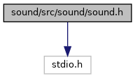

[Macros](#define-members) \| [Typedefs](#typedef-members) \| [Enumerations](#enum-members) \| [Functions](#func-members)

`#include <stdio.h>`

Include dependency graph for sound.h:

<a href="sound_8h_source.md">Go to the source code of this file.</a>

|          |                                               |
|----------|-----------------------------------------------|
| Macros   |                                               |
| #define  | [DllSpec](#ad7c2e1cb200073ed64c64285a5f37231) |

|  |  |
|----|----|
| Typedefs |  |
| typedef struct [SND](#a520814ffd85c7975c652a3bb5500430b)  | [SND](#a520814ffd85c7975c652a3bb5500430b) |
| typedef void(\*  | [SNDCallback](#aca23cc022f7f576ca8a03fe66a6817bb)) (void \*data, struct [SND](#a520814ffd85c7975c652a3bb5500430b) \*handle, enum [SNDError](#a2a29b5498b5650f52341ae534f4c7df6) reason) |

|  |  |
|----|----|
| Enumerations |  |
| enum   | [SNDError](#a2a29b5498b5650f52341ae534f4c7df6) {   [SND_OK](#a2a29b5498b5650f52341ae534f4c7df6a390962805c51d9a4e0352bf1c8d132ca) =0, [SND_ERR_FAIL](#a2a29b5498b5650f52341ae534f4c7df6afbe239ff476359fdeb61cce0c1e338e9) =-1, [SND_ERR_PARAMETER](#a2a29b5498b5650f52341ae534f4c7df6aa8e16de8f1eac179601f71c84fc7ba9d) =-2, [SND_ERR_NOT_FOUND](#a2a29b5498b5650f52341ae534f4c7df6a25fdd8fb3ab4cb8b5568fd704ea555fb) =-3,   [SND_ERR_MEMORY](#a2a29b5498b5650f52341ae534f4c7df6a7dc852e6bc7d60988b4b3739a0b7fb9a) =-4, [SND_ERR_UNSUPPORTED](#a2a29b5498b5650f52341ae534f4c7df6ad8373eee4fdfa8468b287934fdc27fa7) =-5, [SND_ERR_READ](#a2a29b5498b5650f52341ae534f4c7df6ae5da46480ef8e3e394ff06564a205e6e) =-6 } |

|  |  |
|----|----|
| Functions |  |
| [DllSpec](#ad7c2e1cb200073ed64c64285a5f37231) struct [SND](#a520814ffd85c7975c652a3bb5500430b) \*  | [sndOpenFile](#a2e0076124852060867cc4039c1719646) (const char \*filename) |
| [DllSpec](#ad7c2e1cb200073ed64c64285a5f37231) void  | [sndClose](#aac877336c270fa31b7396dd9e01a0ee5) (struct [SND](#a520814ffd85c7975c652a3bb5500430b) \*handle) |
| [DllSpec](#ad7c2e1cb200073ed64c64285a5f37231) enum [SNDError](#a2a29b5498b5650f52341ae534f4c7df6)  | [sndStart](#a6074c9bf1534c6e8e10ed0e3c72897cf) (struct [SND](#a520814ffd85c7975c652a3bb5500430b) \*handle) |
| [DllSpec](#ad7c2e1cb200073ed64c64285a5f37231) enum [SNDError](#a2a29b5498b5650f52341ae534f4c7df6)  | [sndStop](#a3fbd83f5f49d41b445b1e9dd8bc82c0f) (struct [SND](#a520814ffd85c7975c652a3bb5500430b) \*handle) |
| [DllSpec](#ad7c2e1cb200073ed64c64285a5f37231) enum [SNDError](#a2a29b5498b5650f52341ae534f4c7df6)  | [sndSeek](#a8f0945ea304cff2a5b223186b73087f7) (struct [SND](#a520814ffd85c7975c652a3bb5500430b) \*handle, double pos, int whence) |
| [DllSpec](#ad7c2e1cb200073ed64c64285a5f37231) double  | [sndTell](#a701ee6a24c4fcffacf3ec555c92caf97) (struct [SND](#a520814ffd85c7975c652a3bb5500430b) \*handle) |
| [DllSpec](#ad7c2e1cb200073ed64c64285a5f37231) double  | [sndLength](#ae7e8fbfe734a79cf6648515fb7758f12) (struct [SND](#a520814ffd85c7975c652a3bb5500430b) \*handle) |
| [DllSpec](#ad7c2e1cb200073ed64c64285a5f37231) void  | [sndSetCallback](#a7964d1213f6f330b9cf1a16dd4973826) (struct [SND](#a520814ffd85c7975c652a3bb5500430b) \*handle, [SNDCallback](#aca23cc022f7f576ca8a03fe66a6817bb) cb, void \*data) |
| [DllSpec](#ad7c2e1cb200073ed64c64285a5f37231) int  | [sndSoundSupport](#ae626fac0d0b7af4ce5a11d5d8103046f) () |
| [DllSpec](#ad7c2e1cb200073ed64c64285a5f37231) enum [SNDError](#a2a29b5498b5650f52341ae534f4c7df6)  | [sndSetMasterVolume](#ab1ab90d8fa2ebcdbb451c03514e0a62d) (int volume_percent) |
| [DllSpec](#ad7c2e1cb200073ed64c64285a5f37231) int  | [sndGetMasterVolume](#ae5bb68c7fe1cb7040fe62b859485a9a8) (void) |
| [DllSpec](#ad7c2e1cb200073ed64c64285a5f37231) enum [SNDError](#a2a29b5498b5650f52341ae534f4c7df6)  | [sndBeep](#a86a10d01a3b4ab379531f0a029455ade) (int frequency, int duration_ms, int volume) |

## MacroDefinition Documentation {#macro-definition-documentation}

## DllSpec 

#define DllSpec

## TypedefDocumentation {#typedef-documentation}

## SND 

typedef struct [SND](#a520814ffd85c7975c652a3bb5500430b) [SND](#a520814ffd85c7975c652a3bb5500430b)

SND handle identifying a sound file

## SNDCallback 

typedef void(\* SNDCallback) (void \*data, struct [SND](#a520814ffd85c7975c652a3bb5500430b) \*handle, enum [SNDError](#a2a29b5498b5650f52341ae534f4c7df6) reason)

sound callback function

**Parameters**

\[in\] **data** data pointer \[in\] **handle** handle obtained by sndOpenFile() \[in\] **reason** reason why the callback was invoked: At end of file, this is SND_OK, in case of error it is the error code

## EnumerationType Documentation {#enumeration-type-documentation}

## SNDError 

enum [SNDError](#a2a29b5498b5650f52341ae534f4c7df6)

error codes

| Enumerator |  |
|----|----|
| SND_OK  | 
no error
 |
| SND_ERR_FAIL  | 
generic error
 |
| SND_ERR_PARAMETER  | 
invalid parameters
 |
| SND_ERR_NOT_FOUND  | 
file not found or cannot be accessed
 |
| SND_ERR_MEMORY  | 
out of memory
 |
| SND_ERR_UNSUPPORTED  | 
unsupported format
 |
| SND_ERR_READ  | 
read error
 |

## FunctionDocumentation {#function-documentation}

## sndBeep() 

[DllSpec](#ad7c2e1cb200073ed64c64285a5f37231) enum [SNDError](#a2a29b5498b5650f52341ae534f4c7df6) sndBeep

play a beep tone

**Parameters**

\[in\] **frequency** frequency in Hz \[in\] **duration_ms** duration in milliseconds \[in\] **volume** volume in % (0..100)

### Returns

error code


The beep is played synchronously.


## sndClose() 

[DllSpec](#ad7c2e1cb200073ed64c64285a5f37231) void sndClose

close the file opened using [sndOpenFile](#a2e0076124852060867cc4039c1719646)

**Parameters**

\[in\] **handle** handle obtained by sndOpenFile()

## sndGetMasterVolume() 

[DllSpec](#ad7c2e1cb200073ed64c64285a5f37231) int sndGetMasterVolume

read master volume

### Returns

volume in percent (range \[0..100\]) or error code if less than 0.

## sndLength() 

[DllSpec](#ad7c2e1cb200073ed64c64285a5f37231) double sndLength

read the estimated length of the file

**Parameters**

\[in\] **handle** handle obtained by sndOpenFile()

### Returns

estimated length in seconds or error code if less than 0.


The returned length is an estimate only, that can be obtained by reading the header of the file and may not represent the exact length. Obtaining the exact length may not be possible without scanning the whole file (e.g. for MP3).


## sndOpenFile() 

[DllSpec](#ad7c2e1cb200073ed64c64285a5f37231) struct [SND](#a520814ffd85c7975c652a3bb5500430b)\* sndOpenFile

open file and return handle. Playback does not start automatically, use [sndStart()](#a6074c9bf1534c6e8e10ed0e3c72897cf) to start playing the file.

**Parameters**

\[in\] **filename** file name of a sound file.

### Returns

handle or NULL if the file cannot be found or the file format is not supported or if the sound device cannot be accessed.

## sndSeek() 

[DllSpec](#ad7c2e1cb200073ed64c64285a5f37231) enum [SNDError](#a2a29b5498b5650f52341ae534f4c7df6) sndSeek

change the current position

**Parameters**

\[in\] **handle** handle obtained by sndOpenFile() \[in\] **pos** position in seconds \[in\] **whence** one of SEEK_SET, SEEK_CUR, SEEK_END to specify whether the position pos is with respect to the file start, the current position or file end.

### Returns

error code

## sndSetCallback() 

[DllSpec](#ad7c2e1cb200073ed64c64285a5f37231) void sndSetCallback

set callback that gets invoked when playback stops due to end of file or due to error.

**Parameters**

\[in\] **handle** handle obtained by sndOpenFile() \[in\] **cb** function pointer, use NULL to delete callback \[in\] **data** data pointer that gets passed on to the callback

## sndSetMasterVolume() 

[DllSpec](#ad7c2e1cb200073ed64c64285a5f37231) enum [SNDError](#a2a29b5498b5650f52341ae534f4c7df6) sndSetMasterVolume

set master volume in percent

**Parameters**

\[in\] **volume_percent** volume in the range \[0..100\] return error code

## sndSoundSupport() 

[DllSpec](#ad7c2e1cb200073ed64c64285a5f37231) int sndSoundSupport

check whether the device has sound support for playback of MP3 or WAV files

### Returns

1 if sound support is present, else 0

## sndStart() 

[DllSpec](#ad7c2e1cb200073ed64c64285a5f37231) enum [SNDError](#a2a29b5498b5650f52341ae534f4c7df6) sndStart

start playback. Playback starts at the current position.

**Parameters**

\[in\] **handle** handle obtained by sndOpenFile()

### Returns

error code

## sndStop() 

[DllSpec](#ad7c2e1cb200073ed64c64285a5f37231) enum [SNDError](#a2a29b5498b5650f52341ae534f4c7df6) sndStop

stop playback. Stopping does not reset the current position, i.e. invoking [sndStart()](#a6074c9bf1534c6e8e10ed0e3c72897cf) after [sndStop()](#a3fbd83f5f49d41b445b1e9dd8bc82c0f) resumes playback at the position when [sndStop()](#a3fbd83f5f49d41b445b1e9dd8bc82c0f) was invoked.

**Parameters**

\[in\] **handle** handle obtained by sndOpenFile()

### Returns

error code

## sndTell() 

[DllSpec](#ad7c2e1cb200073ed64c64285a5f37231) double sndTell

read the current position

**Parameters**

\[in\] **handle** handle obtained by sndOpenFile()

### Returns

position in seconds from the file start or error code if less than 0.
