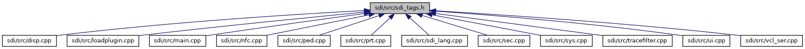

[Macros](#define-members)

This graph shows which files directly or indirectly include this file:

<a href="src_2sdi__tags_8h_source.md">Go to the source code of this file.</a>

|  |  |
|----|----|
| Macros |  |
| #define  | [NESTED_TAG](#ab378606e755a2b187650b4c7e22aac22)(maintag, subtag)   (maintag \"/\" subtag) |
| #define  | [SDI_TAG_F0_CONSTRUCTED_MESSAGE_DATA](#aa7dc9aba17a3ef5eb3d10b8d10aa7730)   \"F0\" |
| #define  | [SDI_TAG_FFA011_DISPLAY_DATA](#a4d00a0c54bd3f254f0cb47880c85b763)   \"FFA011\" |
| #define  | [SDI_TAG_FFA014_INPUT_DATA](#ad66c1caa00e6c84fbbb3f377a2997bb4)   \"FFA014\" |
| #define  | [SDI_TAG_FFA015_SIGNATURE_DATA](#a434e3afec4334c2420d9c18f9894c5b0)   \"FFA015\" |
| #define  | [SDI_TAG_FFBC01_BC_SYMBOLOGY](#a160686834e69098fce37ea5f3ba1f5ac)   \"FFBC01\" |
| #define  | [SDI_TAG_FFA101_PLACEHOLDER_DATA](#a66cb1330e0e709d10378464b7ffb412c)   \"FFA101\" |
| #define  | [SDI_TAG_FFA102_NFC_VAS_DATA](#a24c9eec6da663455d0664a2a83970126)   \"FFA102\" |
| #define  | [SDI_TAG_FFA103_SDI_COMPONENT](#a6199789271e34207ba2234f2c243d05e)   \"FFA103\" |
| #define  | [SDI_TAG_FFA104_ADDITIONAL_MATCH_LIST](#ad3874dacfc200291293dea042179bcb7)   \"FFA104\" |
| #define  | [SDI_TAG_FFA105_ADDITIONAL_MATCH](#ad879bdda134aec054b91e5f0b64016d9)   \"FFA105\" |
| #define  | [SDI_TAG_FFA106_ADDITIONAL_KEY_ACTION](#af3effdde01482a170b1328c74f9037d2)   \"FFA106\" |
| #define  | [SDI_TAG_FFA107_MULTI_PLUGIN_RESPONSE](#a36f4d5f9041f32fcfa48ce9f9abe6a61)   \"FFA107\" |
| #define  | [SDI_TAG_FFA108_VCL_MANUAL_ENTERED_DATA](#a7ac428788599b0ad0c3379620129ebd4)   \"FFA108\" |
| #define  | [SDI_TAG_BF01_CONTINUATION_REQ_CB_PAN](#aed9acdbf481dfdf9a612d3cbe0a1175d)   \"BF01\" |
| #define  | [SDI_TAG_BF02_CONTINUATION_REQ_CB_EXPIRY_DATE](#a9b1b61929bcb5fa6761cd8a418722463)   \"BF02\" |
| #define  | [SDI_TAG_DF8F30_REQUESTED_TAGS](#a3f67cee68315f1f822644fd1c2f3364c)   \"DF8F30\" |
| #define  | [SDI_TAG_DFA000_ADDITIONAL_RESULT_VALUE](#ae26ebb611eba8f0ac7acc93a4a99271c)   \"DFA000\" |
| #define  | [SDI_TAG_DFA001_IDLE_TEXT](#a0460505b5ee888d3acd922aca58252c9)   \"DFA001\" |
| #define  | [SDI_TAG_DFA002_PRT_HTML](#aabb1216a8565aa2b9d49a0a3db5d076f)   \"DFA002\" |
| #define  | [SDI_TAG_DFA003_PRT_LANDSCAPE](#a6bcb6c713f8e10510045a3405e38e4f4)   \"DFA003\" |
| #define  | [SDI_TAG_DFA004_PRT_URL](#ab22af96b9193328bc9114714492e130d)   \"DFA004\" |
| #define  | [SDI_TAG_DFA005_TIMEOUT_SEC](#a8bb01de6f2e6e3715a6c57d294001768)   \"DFA005\" |
| #define  | [SDI_TAG_DFA006_CONFIRMATION_REQUESTED](#a2759f91af03010f16236dc231841674e)   \"DFA006\" |
| #define  | [SDI_TAG_DFA007_INPUT_TEMPLATE_ID](#a9956074a80680cf3df61babf8ad05b8d)   \"DFA007\" |
| #define  | [SDI_TAG_DFA008_TEXT_LANGUAGE](#a400aa300d150d37a5841b14a0e260db9)   \"DFA008\" |
| #define  | [SDI_TAG_DFA009_HEADLESS_ENTRY_STRING](#aebe6f9788d021604a732f57d181ddcac)   \"DFA009\" |
| #define  | [SDI_TAG_DFA00A_MENU_HEADLINE_TEXT](#acc2f22c44472d1c74390a9427aba2d6e)   \"DFA00A\" |
| #define  | [SDI_TAG_DFA00B_MENU_ENTRY_TEXT](#afadcf73cd6d162b6280082d45902deb5)   \"DFA00B\" |
| #define  | [SDI_TAG_DFA00C_MENU_ENTRY_INDEX](#a11b78f5a9a8cc6ffc04b3e1241d09821)   \"DFA00C\" |
| #define  | [SDI_TAG_DFA00D_TEXT_BEEP](#a8b1a1d0f13d9131b087ac2aaca5a0c27)   \"DFA00D\" |
| #define  | [SDI_TAG_DFA00E_NAME](#aead21b52c68bf1371e0ef0e6c48fb9e5)   \"DFA00E\" |
| #define  | [SDI_TAG_DFA00F_VERSION](#a8d85a499baba52a6d9e1ddd0b739b5f8)   \"DFA00F\" |
| #define  | [SDI_TAG_DFA010_DISPLAY_TEMPLATE_ID](#aa5392ef8651644120d7b41c1265432ab)   \"DFA010\" |
| #define  | [SDI_TAG_DFA011_DISPLAY_RETURN_VALUE](#ab8db97c312a6384c88f86da6d77b9da9)   \"DFA011\" |
| #define  | [SDI_TAG_DFA012_DISPLAY_DATA_NAME](#a22222deb678fd486c5ed0139ec875185)   \"DFA012\" |
| #define  | [SDI_TAG_DFA013_DISPLAY_DATA_VALUE](#a9ef96485b468a0acd7a4550280574bb3)   \"DFA013\" |
| #define  | [SDI_TAG_DFA014_CARD_ID](#ab1395503f49e957e7a0cb19ca340b9a6)   \"DFA014\" |
| #define  | [SDI_TAG_DFA015_INPUT_DATA_NAME](#a0b0363c098f52e6adc92ba108ab46fcc)   \"DFA015\" |
| #define  | [SDI_TAG_DFA016_INPUT_DATA_VALUE](#a2c25d163bf4125b92cd678ae5c410d23)   \"DFA016\" |
| #define  | [SDI_TAG_DFA017_TEMP_CARD_ENTRY_VALUE_DEACT](#a4b9f421ae7d787089ecd91fdacb99e79)   \"DFA017\" |
| #define  | [SDI_TAG_DFA018_CARD_DATA_ENTRY_MODE](#a38c876d7a69548f97de89ba6827078e3)   \"DFA018\" |
| #define  | [SDI_TAG_DFA019_MASKING_CHARACTER](#ad254de060f0b77d1c46945dcf91b49d4)   \"DFA019\" |
| #define  | [SDI_TAG_DFA01A_ALT_INPUT_FORMAT_STRING](#a4d8739eeae9d5509be19cea565f5fe69)   \"DFA01A\" |
| #define  | [SDI_TAG_DFA01B_TIMER_MULTIPLIER](#ab322f1c1140db09dd3b6c2aa93a35fd0)   \"DFA01B\" |
| #define  | [SDI_TAG_DFA01C_SIGNATURE_FORMAT](#ac62193275ba20067826e9f6439f9a918)   \"DFA01C\" |
| #define  | [SDI_TAG_DFA01D_SIGNATURE_VALUE](#a54e00d422623895640ea88ce09d33092)   \"DFA01D\" |
| #define  | [SDI_TAG_DFA01E_CONFIG_UPLOAD_TYPE](#a76789d9dc2bf3baf5fd25a9d0d0860e7)   \"DFA01E\" |
| #define  | [SDI_TAG_DFA01F_CONFIG_UPLOAD_MAC](#a6056e1b9a397aa8ce21b50a5517c038f)   \"DFA01F\" |
| #define  | [SDI_TAG_DFA020_SOFTWARE_UPLOAD_FILENAME](#ac4dd5905d1df1f4923d3294f33c0c2c6)   \"DFA020\" |
| #define  | [SDI_TAG_DFA021_SOFTWARE_UPLOAD_RECORD_DATA](#a3b061aae75a32b6b87b0dd4e1d7a238a)   \"DFA021\" |
| #define  | [SDI_TAG_DFA022_SOFTWARE_UPLOAD_PACKET_NBR](#af5206da98a3f73ece8daa715b4806848)   \"DFA022\" |
| #define  | [SDI_TAG_DFA023_SOFTWARE_UPLOAD_MD5](#aee1c687149096fd5ff82e0d904b2c525)   \"DFA023\" |
| #define  | [SDI_TAG_DFA024_TOUCH_COORDINATES](#ae731f7e1473c8ee642976a2f733c4d7c)   \"DFA024\" |
| #define  | [SDI_TAG_DFA025_NAVIGATOR_MODE](#a9552a065cd02ae248ebb9bc8fb9a9083)   \"DFA025\" |
| #define  | [SDI_TAG_DFA026_MSR_OPTIONS](#a31247bb9358bf7ca48968c6a3f00b342)   \"DFA026\" |
| #define  | [SDI_TAG_DFA027_MSR_LED1_STATE](#a92af11e7cd4d9bd33ffc84f752dda28d)   \"DFA027\" |
| #define  | [SDI_TAG_DFA028_MSR_LED2_STATE](#a478b1bd260578355fe73d92258b6df79)   \"DFA028\" |
| #define  | [SDI_TAG_DFA029_MSR_LED3_STATE](#ad653095a9b37b153202154ccfcc17fc2)   \"DFA029\" |
| #define  | [SDI_TAG_DFA02A_MSR_LED_DURATION](#a6daac6133229aec98ee00b6e9702931a)   \"DFA02A\" |
| #define  | [SDI_TAG_DFA02B_PIN_MIN_LENGTH](#a47b4e0f74384f839c206493ba1677797)   \"DFA02B\" |
| #define  | [SDI_TAG_DFA02C_PIN_MAX_LENGTH](#a7b1f423e0d7719fa7a0a95fb0b4cb1c2)   \"DFA02C\" |
| #define  | [SDI_TAG_DFA02D_PIN_BYPASS_KEY](#a74bdfe3ee5025e2b5d64c3ab7f593642)   \"DFA02D\" |
| #define  | [SDI_TAG_DFA02E_PIN_AUTO_ENTER](#ad61a7cb984e4d85c67e38b712babf633)   \"DFA02E\" |
| #define  | [SDI_TAG_DFA02F_PIN_CLEAR_ALL](#a7cc795849011036e4ae676c13fbd0b7e)   \"DFA02F\" |
| #define  | [SDI_TAG_DFA030_PRT_BMP_DATA](#a4631a20cc4fb06b9f7a02e336bed4424)   \"DFA030\" |
| #define  | [SDI_TAG_DFA031_PRT_BMP_WIDTH](#a56b3067a9840ea07fe270bd5f3ae27b5)   \"DFA031\" |
| #define  | [SDI_TAG_DFA032_PRT_BMP_HEIGHT](#aa5f96b75115297329a6adc6d04d40c07)   \"DFA032\" |
| #define  | [SDI_TAG_DFA033_SKIP_CB_9FFE](#a0d88c602c4e17b1ed752f4c60b15e4ac)   \"DFA033\" |
| #define  | [SDI_TAG_DFA034_MSR_TRACK_STATUS](#a13b7025a4c1924179035fe105f9781e4)   \"DFA034\" |
| #define  | [SDI_TAG_DFA035_PIN_INTERCHAR_TIMEOUT](#a24eda19084d55ca28b5434d43192e567)   \"DFA035\" |
| #define  | [SDI_TAG_DFA036_PIN_ECHO_CHARACTER](#a3f9a74c800a3e4005c2e58349132518c)   \"DFA036\" |
| #define  | [SDI_TAG_DFA037_PIN_CARD_APP_LABEL](#a6bc320e462a0f8dd038c8c3ee1992970)   \"DFA037\" |
| #define  | [SDI_TAG_DFA038_PIN_BYPASS_KEY](#abf0b246484c1da4e60f0daba32360434)   \"DFA038\" |
| #define  | [SDI_TAG_DFA039_MSR_SENSITIVITY_LEVEL](#af6e42286df672e5a8f4468832bf71ac6)   \"DFA039\" |
| #define  | [SDI_TAG_DFA040_OBFUSCATED_TRACK1_HEX](#abeddd1c80ce891a13ec8dae9c0a2f254)   \"DFA040\" |
| #define  | [SDI_TAG_DFA100_USE_STORED_TRX_DATA](#ad2b1b7354974c80fd6596f852ac9dff4)   \"DFA100\" |
| #define  | [SDI_TAG_DFA101_PLUGIN_RESPONSE_DATA](#ac5f5f5c0254fafd47d543195a9ce58a1)   \"DFA101\" |
| #define  | [SDI_TAG_DFA102_ENCRYPTED_TRACK1_DATA](#a55907935c38378ed7b775794f17066b0)   \"DFA102\" |
| #define  | [SDI_TAG_DFA103_ENCRYPTED_TRACK1_DATA_KSN](#ae7b16bf5df50d99889b5ee8a997de0c6)   \"DFA103\" |
| #define  | [SDI_TAG_DFA104_PIN_BYPASS](#a1ad990b2a7a7a2492680b0d460693a89)   \"DFA104\" |
| #define  | [SDI_TAG_DFA105_ENCRYPTED_EXPIRY_DATE_KSN](#aa97e8284a41937869b5b81319ec83ad0)   \"DFA105\" |
| #define  | [SDI_TAG_DFA106_ENCRYPTED_CVV](#abec83368e031266abe79ba0e0343b78a)   \"DFA106\" |
| #define  | [SDI_TAG_DFA107_ENCRYPTED_CVV_KSN](#a726ed31e5036cf64edb0c4aace00253a)   \"DFA107\" |
| #define  | [SDI_TAG_DFA108_SUPPORTED_CARD_TECHNOLOGY](#aef9abb8ef93e7697df47bff0fdae8185)   \"DFA108\" |
| #define  | [SDI_TAG_DFA109_ALLOW_CANCEL_WHILE_CARD_DETECT](#ae207f0c103b4d845c8c260fddf3d6b35)   \"DFA109\" |
| #define  | [SDI_TAG_DFA10A_CARD_REQUEST_DISPLAY_MODE](#aa22f25595455497c8952c5f7a30eaadf)   \"DFA10A\" |
| #define  | [SDI_TAG_DFA10B_CARD_DETECTION_RESPONSE_MODE](#a8cc7395a10d210854dec635a6e93240f)   \"DFA10B\" |
| #define  | [SDI_TAG_DFA10C_PLUGIN_ID](#aaf74e7f296642c4a6ade22f2c583649c)   \"DFA10C\" |
| #define  | [SDI_TAG_DFA10D_PLUGIN_RESPONSE_CODE](#a642d3d519a2131d5469e1d0e13c06253)   \"DFA10D\" |
| #define  | [SDI_TAG_DFA10E_PLUGIN_TRIGGER_MESSAGE](#ade20b3d409ef09f91c75e4c04194b5f5)   \"DFA10E\" |
| #define  | [SDI_TAG_DFA10F_PLUGIN_TRIGGER_ID](#adaa2a8b0d743667f8b8bbffa001f5a58)   \"DFA10F\" |
| #define  | [SDI_TAG_DFA120_OPTIONAL_APPLICATION_DATA](#ad8aa7904df1cae0733c5d6044596ad5e)   \"DFA120\" |
| #define  | [SDI_TAG_DFA121_DATA_OPTIONS](#a41b12af2d528e29252c474dba09ff9fc)   \"DFA121\" |
| #define  | [SDI_TAG_DFA123_FORCE_MIN_PAN_LEN_TO_7](#a63ba1671319dc84451ec237b8c2cc7be)   \"DFA123\" |
| #define  | [SDI_TAG_DFA124_ENCRYPTED_DATA_KSN](#ab530443eb1e9b1958d641fde94d24866)   \"DFA124\" |
| #define  | [SDI_TAG_DFA125_ENCRYPTED_DATA](#ad65b200cf43f1340e2c2713a327db3d1)   \"DFA125\" |
| #define  | [SDI_TAG_DFA126_MESSAGE_TEMPLATE](#a4ab55ca586b7cbdaefbafe49b0c5d68e)   \"DFA126\" |
| #define  | [SDI_TAG_DFA127_CURRENT_DATE](#aa5148f8c905c026a35898e3c613dd257)   \"DFA127\" |
| #define  | [SDI_TAG_DFA128_CONTINUATION_RESPONSE](#a2480dcd7c657575ca8b8f69226ea2057)   \"DFA128\" |
| #define  | [SDI_TAG_DFA129_RETURN_ADDITIONAL_MATCHES](#a657e98f8a50fb95c43b4200c4af75022)   \"DFA129\" |
| #define  | [SDI_TAG_DFA12A_TEC_SEL_OPTIONS](#a065873b6e7b0e86a2012f1d951386f24)   \"DFA12A\" |
| #define  | [SDI_TAG_DFA12B_CARD_VALIDATOR_INFO](#a838645655c70cb94fca539b989e8f250)   \"DFA12B\" |
| #define  | [SDI_TAG_DFA12C_CARD_VALIDATOR_MATCH](#a5e82592921b36f9bfe7ecc2acdda8691)   \"DFA12C\" |
| #define  | [SDI_TAG_DFA12D_EXPIRY_CHECK_RESULT](#a6311c41423880ca7babce701e5726370)   \"DFA12D\" |
| #define  | [SDI_TAG_DFA12E_LUHN_CHECK_RESULT](#ac4f962563a566317155e649088adc9c5)   \"DFA12E\" |
| #define  | [SDI_TAG_DFA12F_SPONSOR_CERT](#a86dd587beb46b7d77423da228a134d5c)   \"DFA12F\" |
| #define  | [SDI_TAG_DFA130_SENSITIVE_TAG_MODE](#abd2baa33aa5ee5f80ec4611a882775c1)   \"DFA130\" |
| #define  | [SDI_TAG_DFA131_CVV](#a678e0efcbb2d2ea2a3240fe94f925d72)   \"DFA131\" |
| #define  | [SDI_TAG_DFA132_ACTIVATION_CHECK_RESULT](#a5875fd2878eaee935aefa6b8935957a6)   \"DFA132\" |
| #define  | [SDI_TAG_DFA133_ADD_TEC_SEL_OPTIONS](#affd106df0dfb8cb64e02769efd67965f)   \"DFA133\" |
| #define  | [SDI_TAG_DFA133_VCL_TRACK1](#a992c8ebccc233e52dce746988ba1f5a0)   \"DFA133\" |
| #define  | [SDI_TAG_DFA134_VCL_TRACK2](#a1cf472b6d85a44e859deb8bba28edaf7)   \"DFA134\" |
| #define  | [SDI_TAG_DFA135_VCL_TRACK3](#af859458b802a03e7c3831b2937b50e27)   \"DFA135\" |
| #define  | [SDI_TAG_DFA136_VCL_STATUS](#a4084f6ff01e5a5eaeb4e53c876b3e2c4)   \"DFA136\" |
| #define  | [SDI_TAG_DFA137_VCL_EPARMS](#a431222573fa77cce8e7f9049598fd864)   \"DFA137\" |
| #define  | [SDI_TAG_DFA138_WHITELIST_INDICATOR](#a4ede3291864bbd0ef7839e942f9060b9)   \"DFA138\" |
| #define  | [SDI_TAG_DFA139_VCL_EXPIRY_DATE_IN_CLEAR](#af8473555c0b25093e080d52253f9e78a)   \"DFA139\" |
| #define  | [SDI_TAG_DFA13A_FETCH_TAGS_DATA_OPTIONS](#a4d9d186cb6a39a0143ddba16ad661bf3)   \"DFA13A\" |
| #define  | [SDI_TAG_DFA13B_ADDITIONAL_KEY](#a19f707c24bd30498fb3dc2389bc9bfe2)   \"DFA13B\" |
| #define  | [SDI_TAG_DFA13C_ADDITIONAL_ACTION](#a6bdf29d92240a028b9f8def443975a30)   \"DFA13C\" |
| #define  | [SDI_TAG_DFA13D_DIALOG_OPTIONS](#ac7e1a16460dc102feb79b477973e356a)   \"DFA13D\" |
| #define  | [SDI_TAG_DFA13E_DIALOG_ENTER_BUTTON_LABEL](#a00d88e7172d45be77edd70c6b55a82ee)   \"DFA13E\" |
| #define  | [SDI_TAG_DFA13F_DIALOG_CLEAR_BUTTON_LABEL](#ad939da153fbd6fd463f37282a6a6f96f)   \"DFA13F\" |
| #define  | [SDI_TAG_DFA140_DIALOG_CANCEL_BUTTON_LABEL](#a129f8a551f6a431719f32fb9f9597039)   \"DFA140\" |
| #define  | [SDI_TAG_DFA141_DIALOG_UP_BUTTON_LABEL](#a3d2f0760ffd091d6102d37d636283910)   \"DFA141\" |
| #define  | [SDI_TAG_DFA142_DIALOG_DOWN_BUTTON_LABEL](#a0cb200120e967bfcc318cb9a0d0160f6)   \"DFA142\" |
| #define  | [SDI_TAG_DFA143_DIALOG_HEADER_LABEL](#abbb355a6de0f62e142173b3c6af4bd6c)   \"DFA143\" |
| #define  | [SDI_TAG_DFA144_ASYNC_DIALOG_STATUS](#ac2d9fe2a9cfe59239830b72e76b3a986)   \"DFA144\" |
| #define  | [SDI_TAG_DFA145_VCL_DQ_RESULT](#a3fd0c51c3658c2dc375f6fc380ef349c)   \"DFA145\" |
| #define  | [SDI_TAG_DFA146_VCL_DQ_OUTPUT_FORMAT](#a2964c01bf334e94c421e8597bc43000e)   \"DFA146\" |
| #define  | [SDI_TAG_DFA147_VCL_DQ_PAGE_NUMBER](#a9dbe9d01998e10c73503ecfaf2ef22c9)   \"DFA147\" |
| #define  | [SDI_TAG_DFA148_SOFTWARE_STATUS_JSON](#a72ff0cd1499a747f2128c789cd08c652)   \"DFA148\" |
| #define  | [SDI_TAG_DFA149_SOFTWARE_STATUS_BNDL_NAME](#ade839253da5a2f1603cce2fe34b0283e)   \"DFA149\" |
| #define  | [SDI_TAG_DFA150_EPP_CMD_DESTINATION](#a5a1579a61e83d6d7ff345efa807b9ed5)   \"DFA150\" |
| #define  | [SDI_TAG_DFA151_SOFTWARE_STATUS_PKG_NAME](#ad2e5e86ef5cf894b724a32d19a9f6358)   \"DFA151\" |
| #define  | [SDI_TAG_DFA152_VCL_DERIVE_RESULT](#aae46f9b795a0b6f971839132aad33190)   \"DFA152\" |
| #define  | [SDI_TAG_DFA153_UX_CARD_REMOVAL_TIMEOUT](#a7cb1c99f3039bb5c1857d5ee099fdbc3)   \"DFA153\" |
| #define  | [SDI_TAG_DFA154_TECSEL_DATA](#ae7cf32d8b2de817f356f615dca3b3924)   \"DFA154\" |
| #define  | [SDI_TAG_DFA155_IDLE_ADMIN_MENU](#a0af9f7fbcc23e582a330c56910c69583)   \"DFA155\" |
| #define  | [SDI_TAG_DFA156_FORCED_ABBREVIATION_CURRENCIES](#a6c824b820958d438a562eb2a12878c5a)   \"DFA156\" |
| #define  | [SDI_TAG_DFA157_VCL_KSN](#ab533a7a79c7aa38bbede4181febec3dd)   \"DFA157\" |
| #define  | [SDI_TAG_DFA158_CONTINUATION_MODE](#a10c24529ce3f2f1647127c4405f57c2f)   \"DFA158\" |
| #define  | [SDI_TAG_DFA159_VCL_ENCRYPTION_STATUS](#a8732e1b9cf1fef58609c548f22f54a1d)   \"DFA159\" |
| #define  | [SDI_TAG_DFA400_HOST_NAME](#a09d597665dcd1b7bdda641c6367ab623)   \"DFA400\" |
| #define  | [SDI_TAG_DFA401_CRYPTO_HANDLE](#a113b6e876126d5079dda3b5249163495)   \"DFA401\" |
| #define  | [SDI_TAG_DFA402_PLAINTEXT_DATA](#a7be9673f0d1ae19182250164b37975cd)   \"DFA402\" |
| #define  | [SDI_TAG_DFA403_INITIAL_VECTOR](#a2b43c3f4d74fb0bc145900b79b01352c)   \"DFA403\" |
| #define  | [SDI_TAG_DFA404_ENCRYPTED_DATA](#a4814b0d8eff2c149a2809b2b1d045940)   \"DFA404\" |
| #define  | [SDI_TAG_DFA405_KEY_SERIAL_NUMBER](#ab16a5db539779a71222ca5c64807df80)   \"DFA405\" |
| #define  | [SDI_TAG_DFA406_DECRYPTED_DATA](#ac4aaaf6982bd214dbe73bba30af6b2b5)   \"DFA406\" |
| #define  | [SDI_TAG_DFA407_INPUT_DATA](#ade1b7c421d52a4fd8fe93c5dd7fc75d0)   \"DFA407\" |
| #define  | [SDI_TAG_DFA408_SIGNATURE](#aecd1296a931876f8819a5735217ab888)   \"DFA408\" |
| #define  | [SDI_TAG_DFA409_KEY_SET_ID](#aae5f93e282fa306b1a22f9c15849181b)   \"DFA409\" |
| #define  | [SDI_TAG_DFA40A_PIN_BLOCK_FORMAT](#add8a7d77ca3c76fed6cfe94fe787e178)   \"DFA40A\" |
| #define  | [SDI_TAG_DFA40B_PIN_BLOCK](#a1b9c23ee2dc1a986846a43afb895aa30)   \"DFA40B\" |
| #define  | [SDI_TAG_DFA40C_KEY_TYPE](#a26c7459902f629e5fee836bd28e85723)   \"DFA40C\" |
| #define  | [SDI_TAG_DFA40D_KEY_DATA](#a3fdacfaebb33cc69f37eca17a5b20b22)   \"DFA40D\" |
| #define  | [SDI_TAG_DFA40E_JSON_FORMATTED_KEY_INFO](#addbca2078cc7d97c8e50ec51359fb935)   \"DFA40E\" |
| #define  | [SDI_TAG_DFA40F_KEY_RELEVANT_INFO](#a766d13d63ba2809eb5f67e0a60aa5b6c)   \"DFA40F\" |
| #define  | [SDI_TAG_DFA410_KEK_FLAG](#a15aebd09a94ebb069a059982a8174d49)   \"DFA410\" |
| #define  | [SDI_TAG_DFA411_AS2805_TAG](#afc883a6d022f6609deeda3831e8e27f5)   \"DFA411\" |
| #define  | [SDI_TAG_DFA412_STATUS](#a7edb0c8d2716249a32b61357ea735f61)   \"DFA412\" |
| #define  | [SDI_TAG_DFA413_VERSION](#ab20657c08b1d0b5824c37b9a7c8b663d)   \"DFA413\" |
| #define  | [SDI_TAG_DFA414_ZERO_PIN_BLOCK_REQUEST](#ab79c7ad053b3a508b0f00aa63e095a67)   \"DFA414\" |
| #define  | [SDI_TAG_DFA415_MASTER_KEY_SET_ID](#a2131a12bb609e65dba01443a6cda5448)   \"DFA415\" |
| #define  | [SDI_TAG_DFA416_KCV](#a30793ae354f3ebdc5217bfddebcc37c3)   \"DFA416\" |
| #define  | [SDI_TAG_DFA417_INCREMENT_KSN](#ac7ea57d5739e73a6992cdfc876da176f)   \"DFA417\" |
| #define  | [SDI_TAG_DFA500_KEY_REFERENCE](#a117516d409b1fc4c4db309c798274bd3)   \"DFA500\" |
| #define  | [SDI_TAG_DFA501_CERTIFICATE](#a0353158d51d0d12e056ac4c169ed8adc)   \"DFA501\" |
| #define  | [SDI_TAG_DFBC01_PROPERTY_ID](#a23b09bbc44b4e7519b2d76edb86ef642)   \"DFBC01\" |
| #define  | [SDI_TAG_DFBC02_PROPERTY_VALUE](#a1310703bd1822fde064b924b4db74d46)   \"DFBC02\" |
| #define  | [SDI_TAG_DFBC03_BC_SCANED_DATA](#a901003bf1f2be699636d5b1368f49234)   \"DFBC03\" |
| #define  | [SDI_TAG_DFBC04_BC_SYMBOLOGY_PARAM](#a8e08005046490d73f7209e7c11d28fd3)   \"DFBC04\" |
| #define  | [SDI_TAG_DFBC05_BC_SYMBOLOGY_VALUE](#aa0b19ba9b1c66d1b4284b535f38a5c7e)   \"DFBC05\" |
| #define  | [SDI_TAG_DFFF7F_PLUGIN_CARD_DATA](#a3b3b7b471db73221b964f1c0b8a1f430)   \"DFFF7F\" |
| #define  | [SDI_TAG_56_EMV_TRACK1_DATA](#a70e93f12f88c6fce42f674ca60ef1c2d)   \"56\" |
| #define  | [SDI_TAG_58_EMV_TRACK3_EQUIVALENT_DATA](#a78d1c88ff9f8f37f01035691236db853)   \"58\" |
| #define  | [SDI_TAG_DF1A_OBFUSCATED_PAN_CN](#accc7e4ba70c0a03c3cac60654400b1ec)   \"DF1A\" |
| #define  | [SDI_TAG_DF1B_OBFUSCATED_TRACK2_CN](#a9350488c3de4af3e76e90b51336dd893)   \"DF1B\" |
| #define  | [SDI_TAG_DF44_OBFUSCATED_PAN_HEX](#a2b031e866b4a71958f23efecb6848987)   \"DF44\" |
| #define  | [SDI_TAG_DF49_OBFUSCATED_TRACK2_HEX](#ab3357b0942af318edbeb401c220b8a69)   \"DF49\" |
| #define  | [SDI_TAG_C0_CPU_UNIQUE_ID](#ae4ebbcf3f3c1d5959c97e7e26d439a90)   \"C0\" |
| #define  | [SDI_TAG_C1_SERIAL_NUMBER](#a481462922aa837285c5b5e8d08b910ec)   \"C1\" |
| #define  | [SDI_TAG_C2_BOOT_SOFTWARE_ID](#afe3c5c614097ac141021eec9c97a6594)   \"C2\" |
| #define  | [SDI_TAG_C3_APPLICATION_SOFTWARE_ID](#a74a5ea510e2adf60592c19c8eeadc808)   \"C3\" |
| #define  | [SDI_TAG_C4_HARDWARE_ID](#af7fed6aa38553a224bb90131b2fd9ccf)   \"C4\" |
| #define  | [SDI_TAG_C5_IFM_ID](#a2786cd4d4074e8fd4ac2d81e8c99e45c)   \"C5\" |
| #define  | [SDI_TAG_C6_EMV_L2_ID](#a074e3099c92e4c382a349a7d0f008cff)   \"C6\" |
| #define  | [SDI_TAG_D0_SYS_TIME_DATE](#a6a88dc229eabfbd0898a144ab87234db)   \"D0\" |
| #define  | [SDI_TAG_D2_TAMPER_STATUS](#a91fdb4452cf1bbd7ca9a1765b319f3fd)   \"D2\" |
| #define  | [SDI_TAG_D4_BATTERY_CHARGE_STATUS](#a2c5e3f51f641977d4207f3d9282cb695)   \"D4\" |
| #define  | [SDI_TAG_D5_BATTERY_VOLTAGE](#ae8f68f3fd161f4ac04bf87efd20a0790)   \"D5\" |
| #define  | [SDI_TAG_D6_LANGUAGE_ID](#a0a99788275bcf5e191bffd936e6a3302)   \"D6\" |
| #define  | [SDI_TAG_D7_CARD_ENTRY_VALUE_DEACTIVATION](#a146793a6bde400b496f02844224d2d90)   \"D7\" |
| #define  | [SDI_TAG_D8_CARD_ENTRY_MODE](#aeea22eb1b0f6be5d2dcf40c0c9d4f282)   \"D8\" |
| #define  | [SDI_TAG_DC_DISPLAY_BACKLIGHT](#ac5ce5584bdbd374904705809d632d53b)   \"DC\" |
| #define  | [SDI_TAG_DD_DISPLAY_CONTRAST](#a1218bbb8d975d908a2825f126588ab7b)   \"DD\" |
| #define  | [SDI_TAG_DE_AUDIO_VOLUME](#a9ff17fb0b9e54cc0a59b15cf275effda)   \"DE\" |

## MacroDefinition Documentation {#macro-definition-documentation}

## NESTED_TAG 

#define NESTED_TAG

## SDI_TAG_56_EMV_TRACK1_DATA 

#define SDI_TAG_56_EMV_TRACK1_DATA   \"56\"

## SDI_TAG_58_EMV_TRACK3_EQUIVALENT_DATA 

#define SDI_TAG_58_EMV_TRACK3_EQUIVALENT_DATA   \"58\"

## SDI_TAG_BF01_CONTINUATION_REQ_CB_PAN 

#define SDI_TAG_BF01_CONTINUATION_REQ_CB_PAN   \"BF01\"

## SDI_TAG_BF02_CONTINUATION_REQ_CB_EXPIRY_DATE 

#define SDI_TAG_BF02_CONTINUATION_REQ_CB_EXPIRY_DATE   \"BF02\"

## SDI_TAG_C0_CPU_UNIQUE_ID 

#define SDI_TAG_C0_CPU_UNIQUE_ID   \"C0\"

## SDI_TAG_C1_SERIAL_NUMBER 

#define SDI_TAG_C1_SERIAL_NUMBER   \"C1\"

## SDI_TAG_C2_BOOT_SOFTWARE_ID 

#define SDI_TAG_C2_BOOT_SOFTWARE_ID   \"C2\"

## SDI_TAG_C3_APPLICATION_SOFTWARE_ID 

#define SDI_TAG_C3_APPLICATION_SOFTWARE_ID   \"C3\"

## SDI_TAG_C4_HARDWARE_ID 

#define SDI_TAG_C4_HARDWARE_ID   \"C4\"

## SDI_TAG_C5_IFM_ID 

#define SDI_TAG_C5_IFM_ID   \"C5\"

## SDI_TAG_C6_EMV_L2_ID 

#define SDI_TAG_C6_EMV_L2_ID   \"C6\"

## SDI_TAG_D0_SYS_TIME_DATE 

#define SDI_TAG_D0_SYS_TIME_DATE   \"D0\"

## SDI_TAG_D2_TAMPER_STATUS 

#define SDI_TAG_D2_TAMPER_STATUS   \"D2\"

## SDI_TAG_D4_BATTERY_CHARGE_STATUS 

#define SDI_TAG_D4_BATTERY_CHARGE_STATUS   \"D4\"

## SDI_TAG_D5_BATTERY_VOLTAGE 

#define SDI_TAG_D5_BATTERY_VOLTAGE   \"D5\"

## SDI_TAG_D6_LANGUAGE_ID 

#define SDI_TAG_D6_LANGUAGE_ID   \"D6\"

## SDI_TAG_D7_CARD_ENTRY_VALUE_DEACTIVATION 

#define SDI_TAG_D7_CARD_ENTRY_VALUE_DEACTIVATION   \"D7\"

## SDI_TAG_D8_CARD_ENTRY_MODE 

#define SDI_TAG_D8_CARD_ENTRY_MODE   \"D8\"

## SDI_TAG_DC_DISPLAY_BACKLIGHT 

#define SDI_TAG_DC_DISPLAY_BACKLIGHT   \"DC\"

## SDI_TAG_DD_DISPLAY_CONTRAST 

#define SDI_TAG_DD_DISPLAY_CONTRAST   \"DD\"

## SDI_TAG_DE_AUDIO_VOLUME 

#define SDI_TAG_DE_AUDIO_VOLUME   \"DE\"

## SDI_TAG_DF1A_OBFUSCATED_PAN_CN 

#define SDI_TAG_DF1A_OBFUSCATED_PAN_CN   \"DF1A\"

## SDI_TAG_DF1B_OBFUSCATED_TRACK2_CN 

#define SDI_TAG_DF1B_OBFUSCATED_TRACK2_CN   \"DF1B\"

## SDI_TAG_DF44_OBFUSCATED_PAN_HEX 

#define SDI_TAG_DF44_OBFUSCATED_PAN_HEX   \"DF44\"

## SDI_TAG_DF49_OBFUSCATED_TRACK2_HEX 

#define SDI_TAG_DF49_OBFUSCATED_TRACK2_HEX   \"DF49\"

## SDI_TAG_DF8F30_REQUESTED_TAGS 

#define SDI_TAG_DF8F30_REQUESTED_TAGS   \"DF8F30\"

## SDI_TAG_DFA000_ADDITIONAL_RESULT_VALUE 

#define SDI_TAG_DFA000_ADDITIONAL_RESULT_VALUE   \"DFA000\"

## SDI_TAG_DFA001_IDLE_TEXT 

#define SDI_TAG_DFA001_IDLE_TEXT   \"DFA001\"

## SDI_TAG_DFA002_PRT_HTML 

#define SDI_TAG_DFA002_PRT_HTML   \"DFA002\"

## SDI_TAG_DFA003_PRT_LANDSCAPE 

#define SDI_TAG_DFA003_PRT_LANDSCAPE   \"DFA003\"

## SDI_TAG_DFA004_PRT_URL 

#define SDI_TAG_DFA004_PRT_URL   \"DFA004\"

## SDI_TAG_DFA005_TIMEOUT_SEC 

#define SDI_TAG_DFA005_TIMEOUT_SEC   \"DFA005\"

## SDI_TAG_DFA006_CONFIRMATION_REQUESTED 

#define SDI_TAG_DFA006_CONFIRMATION_REQUESTED   \"DFA006\"

## SDI_TAG_DFA007_INPUT_TEMPLATE_ID 

#define SDI_TAG_DFA007_INPUT_TEMPLATE_ID   \"DFA007\"

## SDI_TAG_DFA008_TEXT_LANGUAGE 

#define SDI_TAG_DFA008_TEXT_LANGUAGE   \"DFA008\"

## SDI_TAG_DFA009_HEADLESS_ENTRY_STRING 

#define SDI_TAG_DFA009_HEADLESS_ENTRY_STRING   \"DFA009\"

## SDI_TAG_DFA00A_MENU_HEADLINE_TEXT 

#define SDI_TAG_DFA00A_MENU_HEADLINE_TEXT   \"DFA00A\"

## SDI_TAG_DFA00B_MENU_ENTRY_TEXT 

#define SDI_TAG_DFA00B_MENU_ENTRY_TEXT   \"DFA00B\"

## SDI_TAG_DFA00C_MENU_ENTRY_INDEX 

#define SDI_TAG_DFA00C_MENU_ENTRY_INDEX   \"DFA00C\"

## SDI_TAG_DFA00D_TEXT_BEEP 

#define SDI_TAG_DFA00D_TEXT_BEEP   \"DFA00D\"

## SDI_TAG_DFA00E_NAME 

#define SDI_TAG_DFA00E_NAME   \"DFA00E\"

## SDI_TAG_DFA00F_VERSION 

#define SDI_TAG_DFA00F_VERSION   \"DFA00F\"

## SDI_TAG_DFA010_DISPLAY_TEMPLATE_ID 

#define SDI_TAG_DFA010_DISPLAY_TEMPLATE_ID   \"DFA010\"

## SDI_TAG_DFA011_DISPLAY_RETURN_VALUE 

#define SDI_TAG_DFA011_DISPLAY_RETURN_VALUE   \"DFA011\"

## SDI_TAG_DFA012_DISPLAY_DATA_NAME 

#define SDI_TAG_DFA012_DISPLAY_DATA_NAME   \"DFA012\"

## SDI_TAG_DFA013_DISPLAY_DATA_VALUE 

#define SDI_TAG_DFA013_DISPLAY_DATA_VALUE   \"DFA013\"

## SDI_TAG_DFA014_CARD_ID 

#define SDI_TAG_DFA014_CARD_ID   \"DFA014\"

## SDI_TAG_DFA015_INPUT_DATA_NAME 

#define SDI_TAG_DFA015_INPUT_DATA_NAME   \"DFA015\"

## SDI_TAG_DFA016_INPUT_DATA_VALUE 

#define SDI_TAG_DFA016_INPUT_DATA_VALUE   \"DFA016\"

## SDI_TAG_DFA017_TEMP_CARD_ENTRY_VALUE_DEACT 

#define SDI_TAG_DFA017_TEMP_CARD_ENTRY_VALUE_DEACT   \"DFA017\"

## SDI_TAG_DFA018_CARD_DATA_ENTRY_MODE 

#define SDI_TAG_DFA018_CARD_DATA_ENTRY_MODE   \"DFA018\"

## SDI_TAG_DFA019_MASKING_CHARACTER 

#define SDI_TAG_DFA019_MASKING_CHARACTER   \"DFA019\"

## SDI_TAG_DFA01A_ALT_INPUT_FORMAT_STRING 

#define SDI_TAG_DFA01A_ALT_INPUT_FORMAT_STRING   \"DFA01A\"

## SDI_TAG_DFA01B_TIMER_MULTIPLIER 

#define SDI_TAG_DFA01B_TIMER_MULTIPLIER   \"DFA01B\"

## SDI_TAG_DFA01C_SIGNATURE_FORMAT 

#define SDI_TAG_DFA01C_SIGNATURE_FORMAT   \"DFA01C\"

## SDI_TAG_DFA01D_SIGNATURE_VALUE 

#define SDI_TAG_DFA01D_SIGNATURE_VALUE   \"DFA01D\"

## SDI_TAG_DFA01E_CONFIG_UPLOAD_TYPE 

#define SDI_TAG_DFA01E_CONFIG_UPLOAD_TYPE   \"DFA01E\"

## SDI_TAG_DFA01F_CONFIG_UPLOAD_MAC 

#define SDI_TAG_DFA01F_CONFIG_UPLOAD_MAC   \"DFA01F\"

## SDI_TAG_DFA020_SOFTWARE_UPLOAD_FILENAME 

#define SDI_TAG_DFA020_SOFTWARE_UPLOAD_FILENAME   \"DFA020\"

## SDI_TAG_DFA021_SOFTWARE_UPLOAD_RECORD_DATA 

#define SDI_TAG_DFA021_SOFTWARE_UPLOAD_RECORD_DATA   \"DFA021\"

## SDI_TAG_DFA022_SOFTWARE_UPLOAD_PACKET_NBR 

#define SDI_TAG_DFA022_SOFTWARE_UPLOAD_PACKET_NBR   \"DFA022\"

## SDI_TAG_DFA023_SOFTWARE_UPLOAD_MD5 

#define SDI_TAG_DFA023_SOFTWARE_UPLOAD_MD5   \"DFA023\"

## SDI_TAG_DFA024_TOUCH_COORDINATES 

#define SDI_TAG_DFA024_TOUCH_COORDINATES   \"DFA024\"

## SDI_TAG_DFA025_NAVIGATOR_MODE 

#define SDI_TAG_DFA025_NAVIGATOR_MODE   \"DFA025\"

## SDI_TAG_DFA026_MSR_OPTIONS 

#define SDI_TAG_DFA026_MSR_OPTIONS   \"DFA026\"

## SDI_TAG_DFA027_MSR_LED1_STATE 

#define SDI_TAG_DFA027_MSR_LED1_STATE   \"DFA027\"

## SDI_TAG_DFA028_MSR_LED2_STATE 

#define SDI_TAG_DFA028_MSR_LED2_STATE   \"DFA028\"

## SDI_TAG_DFA029_MSR_LED3_STATE 

#define SDI_TAG_DFA029_MSR_LED3_STATE   \"DFA029\"

## SDI_TAG_DFA02A_MSR_LED_DURATION 

#define SDI_TAG_DFA02A_MSR_LED_DURATION   \"DFA02A\"

## SDI_TAG_DFA02B_PIN_MIN_LENGTH 

#define SDI_TAG_DFA02B_PIN_MIN_LENGTH   \"DFA02B\"

## SDI_TAG_DFA02C_PIN_MAX_LENGTH 

#define SDI_TAG_DFA02C_PIN_MAX_LENGTH   \"DFA02C\"

## SDI_TAG_DFA02D_PIN_BYPASS_KEY 

#define SDI_TAG_DFA02D_PIN_BYPASS_KEY   \"DFA02D\"

## SDI_TAG_DFA02E_PIN_AUTO_ENTER 

#define SDI_TAG_DFA02E_PIN_AUTO_ENTER   \"DFA02E\"

## SDI_TAG_DFA02F_PIN_CLEAR_ALL 

#define SDI_TAG_DFA02F_PIN_CLEAR_ALL   \"DFA02F\"

## SDI_TAG_DFA030_PRT_BMP_DATA 

#define SDI_TAG_DFA030_PRT_BMP_DATA   \"DFA030\"

## SDI_TAG_DFA031_PRT_BMP_WIDTH 

#define SDI_TAG_DFA031_PRT_BMP_WIDTH   \"DFA031\"

## SDI_TAG_DFA032_PRT_BMP_HEIGHT 

#define SDI_TAG_DFA032_PRT_BMP_HEIGHT   \"DFA032\"

## SDI_TAG_DFA033_SKIP_CB_9FFE 

#define SDI_TAG_DFA033_SKIP_CB_9FFE   \"DFA033\"

## SDI_TAG_DFA034_MSR_TRACK_STATUS 

#define SDI_TAG_DFA034_MSR_TRACK_STATUS   \"DFA034\"

## SDI_TAG_DFA035_PIN_INTERCHAR_TIMEOUT 

#define SDI_TAG_DFA035_PIN_INTERCHAR_TIMEOUT   \"DFA035\"

## SDI_TAG_DFA036_PIN_ECHO_CHARACTER 

#define SDI_TAG_DFA036_PIN_ECHO_CHARACTER   \"DFA036\"

## SDI_TAG_DFA037_PIN_CARD_APP_LABEL 

#define SDI_TAG_DFA037_PIN_CARD_APP_LABEL   \"DFA037\"

## SDI_TAG_DFA038_PIN_BYPASS_KEY 

#define SDI_TAG_DFA038_PIN_BYPASS_KEY   \"DFA038\"

## SDI_TAG_DFA039_MSR_SENSITIVITY_LEVEL 

#define SDI_TAG_DFA039_MSR_SENSITIVITY_LEVEL   \"DFA039\"

## SDI_TAG_DFA040_OBFUSCATED_TRACK1_HEX 

#define SDI_TAG_DFA040_OBFUSCATED_TRACK1_HEX   \"DFA040\"

## SDI_TAG_DFA100_USE_STORED_TRX_DATA 

#define SDI_TAG_DFA100_USE_STORED_TRX_DATA   \"DFA100\"

## SDI_TAG_DFA101_PLUGIN_RESPONSE_DATA 

#define SDI_TAG_DFA101_PLUGIN_RESPONSE_DATA   \"DFA101\"

## SDI_TAG_DFA102_ENCRYPTED_TRACK1_DATA 

#define SDI_TAG_DFA102_ENCRYPTED_TRACK1_DATA   \"DFA102\"

## SDI_TAG_DFA103_ENCRYPTED_TRACK1_DATA_KSN 

#define SDI_TAG_DFA103_ENCRYPTED_TRACK1_DATA_KSN   \"DFA103\"

## SDI_TAG_DFA104_PIN_BYPASS 

#define SDI_TAG_DFA104_PIN_BYPASS   \"DFA104\"

## SDI_TAG_DFA105_ENCRYPTED_EXPIRY_DATE_KSN 

#define SDI_TAG_DFA105_ENCRYPTED_EXPIRY_DATE_KSN   \"DFA105\"

## SDI_TAG_DFA106_ENCRYPTED_CVV 

#define SDI_TAG_DFA106_ENCRYPTED_CVV   \"DFA106\"

## SDI_TAG_DFA107_ENCRYPTED_CVV_KSN 

#define SDI_TAG_DFA107_ENCRYPTED_CVV_KSN   \"DFA107\"

## SDI_TAG_DFA108_SUPPORTED_CARD_TECHNOLOGY 

#define SDI_TAG_DFA108_SUPPORTED_CARD_TECHNOLOGY   \"DFA108\"

## SDI_TAG_DFA109_ALLOW_CANCEL_WHILE_CARD_DETECT 

#define SDI_TAG_DFA109_ALLOW_CANCEL_WHILE_CARD_DETECT   \"DFA109\"

## SDI_TAG_DFA10A_CARD_REQUEST_DISPLAY_MODE 

#define SDI_TAG_DFA10A_CARD_REQUEST_DISPLAY_MODE   \"DFA10A\"

## SDI_TAG_DFA10B_CARD_DETECTION_RESPONSE_MODE 

#define SDI_TAG_DFA10B_CARD_DETECTION_RESPONSE_MODE   \"DFA10B\"

## SDI_TAG_DFA10C_PLUGIN_ID 

#define SDI_TAG_DFA10C_PLUGIN_ID   \"DFA10C\"

## SDI_TAG_DFA10D_PLUGIN_RESPONSE_CODE 

#define SDI_TAG_DFA10D_PLUGIN_RESPONSE_CODE   \"DFA10D\"

## SDI_TAG_DFA10E_PLUGIN_TRIGGER_MESSAGE 

#define SDI_TAG_DFA10E_PLUGIN_TRIGGER_MESSAGE   \"DFA10E\"

## SDI_TAG_DFA10F_PLUGIN_TRIGGER_ID 

#define SDI_TAG_DFA10F_PLUGIN_TRIGGER_ID   \"DFA10F\"

## SDI_TAG_DFA120_OPTIONAL_APPLICATION_DATA 

#define SDI_TAG_DFA120_OPTIONAL_APPLICATION_DATA   \"DFA120\"

## SDI_TAG_DFA121_DATA_OPTIONS 

#define SDI_TAG_DFA121_DATA_OPTIONS   \"DFA121\"

## SDI_TAG_DFA123_FORCE_MIN_PAN_LEN_TO_7 

#define SDI_TAG_DFA123_FORCE_MIN_PAN_LEN_TO_7   \"DFA123\"

## SDI_TAG_DFA124_ENCRYPTED_DATA_KSN 

#define SDI_TAG_DFA124_ENCRYPTED_DATA_KSN   \"DFA124\"

## SDI_TAG_DFA125_ENCRYPTED_DATA 

#define SDI_TAG_DFA125_ENCRYPTED_DATA   \"DFA125\"

## SDI_TAG_DFA126_MESSAGE_TEMPLATE 

#define SDI_TAG_DFA126_MESSAGE_TEMPLATE   \"DFA126\"

## SDI_TAG_DFA127_CURRENT_DATE 

#define SDI_TAG_DFA127_CURRENT_DATE   \"DFA127\"

## SDI_TAG_DFA128_CONTINUATION_RESPONSE 

#define SDI_TAG_DFA128_CONTINUATION_RESPONSE   \"DFA128\"

## SDI_TAG_DFA129_RETURN_ADDITIONAL_MATCHES 

#define SDI_TAG_DFA129_RETURN_ADDITIONAL_MATCHES   \"DFA129\"

## SDI_TAG_DFA12A_TEC_SEL_OPTIONS 

#define SDI_TAG_DFA12A_TEC_SEL_OPTIONS   \"DFA12A\"

## SDI_TAG_DFA12B_CARD_VALIDATOR_INFO 

#define SDI_TAG_DFA12B_CARD_VALIDATOR_INFO   \"DFA12B\"

## SDI_TAG_DFA12C_CARD_VALIDATOR_MATCH 

#define SDI_TAG_DFA12C_CARD_VALIDATOR_MATCH   \"DFA12C\"

## SDI_TAG_DFA12D_EXPIRY_CHECK_RESULT 

#define SDI_TAG_DFA12D_EXPIRY_CHECK_RESULT   \"DFA12D\"

## SDI_TAG_DFA12E_LUHN_CHECK_RESULT 

#define SDI_TAG_DFA12E_LUHN_CHECK_RESULT   \"DFA12E\"

## SDI_TAG_DFA12F_SPONSOR_CERT 

#define SDI_TAG_DFA12F_SPONSOR_CERT   \"DFA12F\"

## SDI_TAG_DFA130_SENSITIVE_TAG_MODE 

#define SDI_TAG_DFA130_SENSITIVE_TAG_MODE   \"DFA130\"

## SDI_TAG_DFA131_CVV 

#define SDI_TAG_DFA131_CVV   \"DFA131\"

## SDI_TAG_DFA132_ACTIVATION_CHECK_RESULT 

#define SDI_TAG_DFA132_ACTIVATION_CHECK_RESULT   \"DFA132\"

## SDI_TAG_DFA133_ADD_TEC_SEL_OPTIONS 

#define SDI_TAG_DFA133_ADD_TEC_SEL_OPTIONS   \"DFA133\"

## SDI_TAG_DFA133_VCL_TRACK1 

#define SDI_TAG_DFA133_VCL_TRACK1   \"DFA133\"

## SDI_TAG_DFA134_VCL_TRACK2 

#define SDI_TAG_DFA134_VCL_TRACK2   \"DFA134\"

## SDI_TAG_DFA135_VCL_TRACK3 

#define SDI_TAG_DFA135_VCL_TRACK3   \"DFA135\"

## SDI_TAG_DFA136_VCL_STATUS 

#define SDI_TAG_DFA136_VCL_STATUS   \"DFA136\"

## SDI_TAG_DFA137_VCL_EPARMS 

#define SDI_TAG_DFA137_VCL_EPARMS   \"DFA137\"

## SDI_TAG_DFA138_WHITELIST_INDICATOR 

#define SDI_TAG_DFA138_WHITELIST_INDICATOR   \"DFA138\"

## SDI_TAG_DFA139_VCL_EXPIRY_DATE_IN_CLEAR 

#define SDI_TAG_DFA139_VCL_EXPIRY_DATE_IN_CLEAR   \"DFA139\"

## SDI_TAG_DFA13A_FETCH_TAGS_DATA_OPTIONS 

#define SDI_TAG_DFA13A_FETCH_TAGS_DATA_OPTIONS   \"DFA13A\"

## SDI_TAG_DFA13B_ADDITIONAL_KEY 

#define SDI_TAG_DFA13B_ADDITIONAL_KEY   \"DFA13B\"

## SDI_TAG_DFA13C_ADDITIONAL_ACTION 

#define SDI_TAG_DFA13C_ADDITIONAL_ACTION   \"DFA13C\"

## SDI_TAG_DFA13D_DIALOG_OPTIONS 

#define SDI_TAG_DFA13D_DIALOG_OPTIONS   \"DFA13D\"

## SDI_TAG_DFA13E_DIALOG_ENTER_BUTTON_LABEL 

#define SDI_TAG_DFA13E_DIALOG_ENTER_BUTTON_LABEL   \"DFA13E\"

## SDI_TAG_DFA13F_DIALOG_CLEAR_BUTTON_LABEL 

#define SDI_TAG_DFA13F_DIALOG_CLEAR_BUTTON_LABEL   \"DFA13F\"

## SDI_TAG_DFA140_DIALOG_CANCEL_BUTTON_LABEL 

#define SDI_TAG_DFA140_DIALOG_CANCEL_BUTTON_LABEL   \"DFA140\"

## SDI_TAG_DFA141_DIALOG_UP_BUTTON_LABEL 

#define SDI_TAG_DFA141_DIALOG_UP_BUTTON_LABEL   \"DFA141\"

## SDI_TAG_DFA142_DIALOG_DOWN_BUTTON_LABEL 

#define SDI_TAG_DFA142_DIALOG_DOWN_BUTTON_LABEL   \"DFA142\"

## SDI_TAG_DFA143_DIALOG_HEADER_LABEL 

#define SDI_TAG_DFA143_DIALOG_HEADER_LABEL   \"DFA143\"

## SDI_TAG_DFA144_ASYNC_DIALOG_STATUS 

#define SDI_TAG_DFA144_ASYNC_DIALOG_STATUS   \"DFA144\"

## SDI_TAG_DFA145_VCL_DQ_RESULT 

#define SDI_TAG_DFA145_VCL_DQ_RESULT   \"DFA145\"

## SDI_TAG_DFA146_VCL_DQ_OUTPUT_FORMAT 

#define SDI_TAG_DFA146_VCL_DQ_OUTPUT_FORMAT   \"DFA146\"

## SDI_TAG_DFA147_VCL_DQ_PAGE_NUMBER 

#define SDI_TAG_DFA147_VCL_DQ_PAGE_NUMBER   \"DFA147\"

## SDI_TAG_DFA148_SOFTWARE_STATUS_JSON 

#define SDI_TAG_DFA148_SOFTWARE_STATUS_JSON   \"DFA148\"

## SDI_TAG_DFA149_SOFTWARE_STATUS_BNDL_NAME 

#define SDI_TAG_DFA149_SOFTWARE_STATUS_BNDL_NAME   \"DFA149\"

## SDI_TAG_DFA150_EPP_CMD_DESTINATION 

#define SDI_TAG_DFA150_EPP_CMD_DESTINATION   \"DFA150\"

## SDI_TAG_DFA151_SOFTWARE_STATUS_PKG_NAME 

#define SDI_TAG_DFA151_SOFTWARE_STATUS_PKG_NAME   \"DFA151\"

## SDI_TAG_DFA152_VCL_DERIVE_RESULT 

#define SDI_TAG_DFA152_VCL_DERIVE_RESULT   \"DFA152\"

## SDI_TAG_DFA153_UX_CARD_REMOVAL_TIMEOUT 

#define SDI_TAG_DFA153_UX_CARD_REMOVAL_TIMEOUT   \"DFA153\"

## SDI_TAG_DFA154_TECSEL_DATA 

#define SDI_TAG_DFA154_TECSEL_DATA   \"DFA154\"

## SDI_TAG_DFA155_IDLE_ADMIN_MENU 

#define SDI_TAG_DFA155_IDLE_ADMIN_MENU   \"DFA155\"

## SDI_TAG_DFA156_FORCED_ABBREVIATION_CURRENCIES 

#define SDI_TAG_DFA156_FORCED_ABBREVIATION_CURRENCIES   \"DFA156\"

## SDI_TAG_DFA157_VCL_KSN 

#define SDI_TAG_DFA157_VCL_KSN   \"DFA157\"

## SDI_TAG_DFA158_CONTINUATION_MODE 

#define SDI_TAG_DFA158_CONTINUATION_MODE   \"DFA158\"

## SDI_TAG_DFA159_VCL_ENCRYPTION_STATUS 

#define SDI_TAG_DFA159_VCL_ENCRYPTION_STATUS   \"DFA159\"

## SDI_TAG_DFA400_HOST_NAME 

#define SDI_TAG_DFA400_HOST_NAME   \"DFA400\"

## SDI_TAG_DFA401_CRYPTO_HANDLE 

#define SDI_TAG_DFA401_CRYPTO_HANDLE   \"DFA401\"

## SDI_TAG_DFA402_PLAINTEXT_DATA 

#define SDI_TAG_DFA402_PLAINTEXT_DATA   \"DFA402\"

## SDI_TAG_DFA403_INITIAL_VECTOR 

#define SDI_TAG_DFA403_INITIAL_VECTOR   \"DFA403\"

## SDI_TAG_DFA404_ENCRYPTED_DATA 

#define SDI_TAG_DFA404_ENCRYPTED_DATA   \"DFA404\"

## SDI_TAG_DFA405_KEY_SERIAL_NUMBER 

#define SDI_TAG_DFA405_KEY_SERIAL_NUMBER   \"DFA405\"

## SDI_TAG_DFA406_DECRYPTED_DATA 

#define SDI_TAG_DFA406_DECRYPTED_DATA   \"DFA406\"

## SDI_TAG_DFA407_INPUT_DATA 

#define SDI_TAG_DFA407_INPUT_DATA   \"DFA407\"

## SDI_TAG_DFA408_SIGNATURE 

#define SDI_TAG_DFA408_SIGNATURE   \"DFA408\"

## SDI_TAG_DFA409_KEY_SET_ID 

#define SDI_TAG_DFA409_KEY_SET_ID   \"DFA409\"

## SDI_TAG_DFA40A_PIN_BLOCK_FORMAT 

#define SDI_TAG_DFA40A_PIN_BLOCK_FORMAT   \"DFA40A\"

## SDI_TAG_DFA40B_PIN_BLOCK 

#define SDI_TAG_DFA40B_PIN_BLOCK   \"DFA40B\"

## SDI_TAG_DFA40C_KEY_TYPE 

#define SDI_TAG_DFA40C_KEY_TYPE   \"DFA40C\"

## SDI_TAG_DFA40D_KEY_DATA 

#define SDI_TAG_DFA40D_KEY_DATA   \"DFA40D\"

## SDI_TAG_DFA40E_JSON_FORMATTED_KEY_INFO 

#define SDI_TAG_DFA40E_JSON_FORMATTED_KEY_INFO   \"DFA40E\"

## SDI_TAG_DFA40F_KEY_RELEVANT_INFO 

#define SDI_TAG_DFA40F_KEY_RELEVANT_INFO   \"DFA40F\"

## SDI_TAG_DFA410_KEK_FLAG 

#define SDI_TAG_DFA410_KEK_FLAG   \"DFA410\"

## SDI_TAG_DFA411_AS2805_TAG 

#define SDI_TAG_DFA411_AS2805_TAG   \"DFA411\"

## SDI_TAG_DFA412_STATUS 

#define SDI_TAG_DFA412_STATUS   \"DFA412\"

## SDI_TAG_DFA413_VERSION 

#define SDI_TAG_DFA413_VERSION   \"DFA413\"

## SDI_TAG_DFA414_ZERO_PIN_BLOCK_REQUEST 

#define SDI_TAG_DFA414_ZERO_PIN_BLOCK_REQUEST   \"DFA414\"

## SDI_TAG_DFA415_MASTER_KEY_SET_ID 

#define SDI_TAG_DFA415_MASTER_KEY_SET_ID   \"DFA415\"

## SDI_TAG_DFA416_KCV 

#define SDI_TAG_DFA416_KCV   \"DFA416\"

## SDI_TAG_DFA417_INCREMENT_KSN 

#define SDI_TAG_DFA417_INCREMENT_KSN   \"DFA417\"

## SDI_TAG_DFA500_KEY_REFERENCE 

#define SDI_TAG_DFA500_KEY_REFERENCE   \"DFA500\"

certificate/key reference name

## SDI_TAG_DFA501_CERTIFICATE 

#define SDI_TAG_DFA501_CERTIFICATE   \"DFA501\"

certificate as result of read certificate command (binary, DER format, variable length)

## SDI_TAG_DFBC01_PROPERTY_ID 

#define SDI_TAG_DFBC01_PROPERTY_ID   \"DFBC01\"

## SDI_TAG_DFBC02_PROPERTY_VALUE 

#define SDI_TAG_DFBC02_PROPERTY_VALUE   \"DFBC02\"

## SDI_TAG_DFBC03_BC_SCANED_DATA 

#define SDI_TAG_DFBC03_BC_SCANED_DATA   \"DFBC03\"

## SDI_TAG_DFBC04_BC_SYMBOLOGY_PARAM 

#define SDI_TAG_DFBC04_BC_SYMBOLOGY_PARAM   \"DFBC04\"

## SDI_TAG_DFBC05_BC_SYMBOLOGY_VALUE 

#define SDI_TAG_DFBC05_BC_SYMBOLOGY_VALUE   \"DFBC05\"

## SDI_TAG_DFFF7F_PLUGIN_CARD_DATA 

#define SDI_TAG_DFFF7F_PLUGIN_CARD_DATA   \"DFFF7F\"

## SDI_TAG_F0_CONSTRUCTED_MESSAGE_DATA 

#define SDI_TAG_F0_CONSTRUCTED_MESSAGE_DATA   \"F0\"

## SDI_TAG_FFA011_DISPLAY_DATA 

#define SDI_TAG_FFA011_DISPLAY_DATA   \"FFA011\"

## SDI_TAG_FFA014_INPUT_DATA 

#define SDI_TAG_FFA014_INPUT_DATA   \"FFA014\"

## SDI_TAG_FFA015_SIGNATURE_DATA 

#define SDI_TAG_FFA015_SIGNATURE_DATA   \"FFA015\"

## SDI_TAG_FFA101_PLACEHOLDER_DATA 

#define SDI_TAG_FFA101_PLACEHOLDER_DATA   \"FFA101\"

## SDI_TAG_FFA102_NFC_VAS_DATA 

#define SDI_TAG_FFA102_NFC_VAS_DATA   \"FFA102\"

## SDI_TAG_FFA103_SDI_COMPONENT 

#define SDI_TAG_FFA103_SDI_COMPONENT   \"FFA103\"

## SDI_TAG_FFA104_ADDITIONAL_MATCH_LIST 

#define SDI_TAG_FFA104_ADDITIONAL_MATCH_LIST   \"FFA104\"

## SDI_TAG_FFA105_ADDITIONAL_MATCH 

#define SDI_TAG_FFA105_ADDITIONAL_MATCH   \"FFA105\"

## SDI_TAG_FFA106_ADDITIONAL_KEY_ACTION 

#define SDI_TAG_FFA106_ADDITIONAL_KEY_ACTION   \"FFA106\"

## SDI_TAG_FFA107_MULTI_PLUGIN_RESPONSE 

#define SDI_TAG_FFA107_MULTI_PLUGIN_RESPONSE   \"FFA107\"

## SDI_TAG_FFA108_VCL_MANUAL_ENTERED_DATA 

#define SDI_TAG_FFA108_VCL_MANUAL_ENTERED_DATA   \"FFA108\"

## SDI_TAG_FFBC01_BC_SYMBOLOGY 

#define SDI_TAG_FFBC01_BC_SYMBOLOGY   \"FFBC01\"

