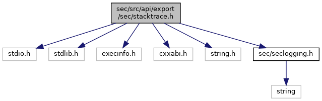

[Macros](#define-members)

`#include <stdio.h>`
`#include <stdlib.h>`
`#include <execinfo.h>`
`#include <cxxabi.h>`
`#include <string.h>`
`#include <`<a href="seclogging_8h_source.md">sec/seclogging.h</a>`>`

Include dependency graph for stacktrace.h:

<a href="stacktrace_8h_source.md">Go to the source code of this file.</a>

|          |                                                            |
|----------|------------------------------------------------------------|
| Macros   |                                                            |
| #define  | [TRUNCATED_SIZE](#a16a657a77eb2c6632ec76d0a5612ff73)   128 |

## MacroDefinition Documentation {#macro-definition-documentation}

## TRUNCATED_SIZE 

#define TRUNCATED_SIZE   128

