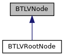
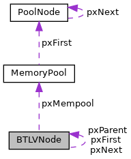

[Data Fields](#pub-attribs)

`#include <`<a href="btlv_8h_source.md">btlv.h</a>`>`

Inheritance diagram for BTLVNode:

\[<a href="graph_legend.md">legend</a>\]

Collaboration diagram for BTLVNode:

\[<a href="graph_legend.md">legend</a>\]

|  |  |
|----|----|
| Data Fields |  |
| struct <a href="struct_b_t_l_v_node.md">BTLVNode</a> \*  | [pxNext](#a048aed5fef433724f94d95cfec2d33df) |
| struct <a href="struct_b_t_l_v_node.md">BTLVNode</a> \*  | [pxFirst](#a66f9bd31fc168407f7724e16edf60bf5) |
| struct <a href="struct_b_t_l_v_node.md">BTLVNode</a> \*  | [pxParent](#a60e4095f792d811b9826a4cff5047fcc) |
| struct <a href="mem__pool_8h.md#struct_memory_pool">MemoryPool</a> \*  | [pxMempool](#a3faa46016cfde528233b2d81eddc8fd3) |
| char  | [tcName](#a135733138da2d26ea5be2810030ce389) \[2 \*<a href="btlv_8h.md#a50b52ae3c35fc20556babf890cfac1e8">MAX_TAGSIZE</a>+1\] |
| char  | [cConstructed](#aa49ad6910f8c0173df2f113ce5fe61ad) |
| unsigned char \*  | [pucData](#a53aa1f2ebeda62fb9f53902b93665db7) |
| unsigned  | [uSize](#a4701e420ca6a8de15ab0c6dcd3e58680) |

## DetailedDescription {#detailed-description}

data node containing one tag or a root node

### Date

4.12.2006

### Author

M. Meixner

## FieldDocumentation {#field-documentation}

## cConstructed 

char cConstructed

type: 0=primitive, 1=constructed

## pucData 

unsigned char\* pucData

pointer to data (only primitive nodes)

## pxFirst 

struct <a href="struct_b_t_l_v_node.md">BTLVNode</a>\* pxFirst

first child (content) node

## pxMempool 

struct <a href="mem__pool_8h.md#struct_memory_pool">MemoryPool</a>\* pxMempool

memory pool used for allocation

## pxNext 

struct <a href="struct_b_t_l_v_node.md">BTLVNode</a>\* pxNext

used for chaining nodes

## pxParent 

struct <a href="struct_b_t_l_v_node.md">BTLVNode</a>\* pxParent

parent node

## tcName 

char tcName\[2 \*<a href="btlv_8h.md#a50b52ae3c35fc20556babf890cfac1e8">MAX_TAGSIZE</a>+1\]

tag name (0-terminated C-string)

## uSize 

unsigned uSize

size of data (primitive node) or total size of child nodes (constructed). This size does not include the tag name or the number of bytes for the size field

------------------------------------------------------------------------

The documentation for this struct was generated from the following file:

- emv/TLV_Util/export/emv/<a href="btlv_8h_source.md">btlv.h</a>
