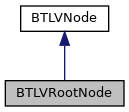
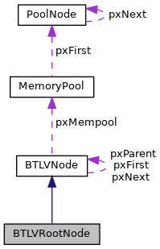

[Public Member Functions](#pub-methods)

`#include <`<a href="btlv__helper_8h_source.md">btlv_helper.h</a>`>`

Inheritance diagram for BTLVRootNode:

\[<a href="graph_legend.md">legend</a>\]

Collaboration diagram for BTLVRootNode:

\[<a href="graph_legend.md">legend</a>\]

|  |  |
|----|----|
| Public Member Functions |  |
|   | [BTLVRootNode](#af9a6dc7e987d47f0c0ad55cfffef3600) (<a href="mem__pool_8h.md#struct_memory_pool">MemoryPool</a> \*mp=0) |
| virtual  | [\~BTLVRootNode](#a52969be7807e5b2a61baf6b3010e9df1) () |

|  |  |
|----|----|
| Additional Inherited Members |  |
|  Data Fields inherited from <a href="struct_b_t_l_v_node.md">BTLVNode</a> |  |
| struct <a href="struct_b_t_l_v_node.md">BTLVNode</a> \*  | <a href="struct_b_t_l_v_node.md#a048aed5fef433724f94d95cfec2d33df">pxNext</a> |
| struct <a href="struct_b_t_l_v_node.md">BTLVNode</a> \*  | <a href="struct_b_t_l_v_node.md#a66f9bd31fc168407f7724e16edf60bf5">pxFirst</a> |
| struct <a href="struct_b_t_l_v_node.md">BTLVNode</a> \*  | <a href="struct_b_t_l_v_node.md#a60e4095f792d811b9826a4cff5047fcc">pxParent</a> |
| struct <a href="mem__pool_8h.md#struct_memory_pool">MemoryPool</a> \*  | <a href="struct_b_t_l_v_node.md#a3faa46016cfde528233b2d81eddc8fd3">pxMempool</a> |
| char  | <a href="struct_b_t_l_v_node.md#a135733138da2d26ea5be2810030ce389">tcName</a> \[2 \*<a href="btlv_8h.md#a50b52ae3c35fc20556babf890cfac1e8">MAX_TAGSIZE</a>+1\] |
| char  | <a href="struct_b_t_l_v_node.md#aa49ad6910f8c0173df2f113ce5fe61ad">cConstructed</a> |
| unsigned char \*  | <a href="struct_b_t_l_v_node.md#a53aa1f2ebeda62fb9f53902b93665db7">pucData</a> |
| unsigned  | <a href="struct_b_t_l_v_node.md#a4701e420ca6a8de15ab0c6dcd3e58680">uSize</a> |

## DetailedDescription {#detailed-description}

helper class for BTLV root nodes, which cares about automatic initialization and cleanup of the <a href="struct_b_t_l_v_node.md">BTLVNode</a>

## Constructor& Destructor Documentation

## BTLVRootNode() 

<a href="struct_b_t_l_v_root_node.md">BTLVRootNode</a>

inline

constructor to init the root node with <a href="btlv_8h.md#af6c59b296fd3283b94548f090f171844">vBTLVInit()</a>

**Parameters**

\[in\] **mp** memory pool, which shall be used for the BTLVNode (optional)

## \~BTLVRootNode() 

virtual \~<a href="struct_b_t_l_v_root_node.md">BTLVRootNode</a>

inlinevirtual

destructor which cares about the resource cleanup of the <a href="struct_b_t_l_v_node.md">BTLVNode</a> with <a href="btlv_8h.md#ae064b0803b734441d055f6b1e3fa3e2b">vBTLVClear()</a>

------------------------------------------------------------------------

The documentation for this struct was generated from the following file:

- sdi/src/<a href="btlv__helper_8h_source.md">btlv_helper.h</a>
