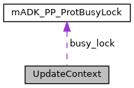

[Public Member Functions](#pub-methods) \| [Data Fields](#pub-attribs)

Collaboration diagram for UpdateContext:

\[<a href="graph_legend.md">legend</a>\]

|  |  |
|----|----|
| Public Member Functions |  |
|   | [UpdateContext](#aed2042414d1bcd5aedeb8140ab48054c) () |
| virtual  | [\~UpdateContext](#a7e5d9d6e9de3c8625bef9f98e6ff2838) () |

|  |  |
|----|----|
| Data Fields |  |
| unsigned char  | [uploadType](#a38b41dd7eed55580b64c9494d4651f65) |
| unsigned int  | [paketNbr](#a65850cf52b001c884f60f00cdaaf1a59) |
| void \*  | [handle](#a81011b79683fab64ce3aff71114f8fdd) |
| <a href="classm_a_d_k___p_p___prot_busy_lock.md">mADK_PP_ProtBusyLock</a> \*  | [busy_lock](#a2ccc77d945e9a4721f950c3fc490fa41) |
| string  | [file](#ab2c5ab3c7a17f0969cdd40146339903a) |
| string  | [dest](#a66d4da94e0e4f717ff3e7f23c53f7c2d) |

## Constructor& Destructor Documentation

## UpdateContext() 

<a href="struct_update_context.md">UpdateContext</a>

inline

constructor: init variables obtain the SDI busy lock

## \~UpdateContext() 

virtual \~<a href="struct_update_context.md">UpdateContext</a>

inlinevirtual

destructor: resets the SDI busy lock and clears the uploaded update file

## FieldDocumentation {#field-documentation}

## busy_lock 

<a href="classm_a_d_k___p_p___prot_busy_lock.md">mADK_PP_ProtBusyLock</a>\* busy_lock

SDI busy lock object

## dest 

string dest

destination of the update file (in case of config file upload)

## file 

string file

upload file for update

## handle 

void\* handle

connection handle

## paketNbr 

unsigned int paketNbr

package number

## uploadType 

unsigned char uploadType

upload tpye, e.g. UPLOAD_TYPE_SOFTWARE_UPDATE

------------------------------------------------------------------------

The documentation for this struct was generated from the following file:

- sdi/src/<a href="sys_8cpp.md">sys.cpp</a>
