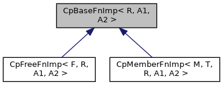

[Public Member Functions](#pub-methods)

`#include <`<a href="_cp_functional_8h_source.md">CpFunctional.h</a>`>`

Inheritance diagram for CpBaseFnImp\< R, A1, A2 \>:

\[<a href="graph_legend.md">legend</a>\]

|  |  |
|----|----|
| Public Member Functions |  |
| virtual  | [\~CpBaseFnImp](#ae060ac2a6a962cab6675a09bc6c8f724) () |
| virtual R  | [invoke](#a58ff4184bf8340a898359eac8706a2b5) (A1, A2)=0 |

## Constructor& Destructor Documentation

## \~CpBaseFnImp() 

virtual \~<a href="structvficpl_1_1_cp_base_fn_imp.md">CpBaseFnImp</a>

inlinevirtual

## MemberFunction Documentation {#member-function-documentation}

## invoke() 

virtual R invoke

pure virtual

Implemented in <a href="structvficpl_1_1_cp_member_fn_imp_3_01_m_00_01_t_00_01_r_00_01_a1_00_01_a2_01_4.md#a7ae568bafc8bd17d5829e1e3752d0772">CpMemberFnImp< M, T, R, A1, A2 ></a>, and <a href="structvficpl_1_1_cp_free_fn_imp_3_01_f_00_01_r_00_01_a1_00_01_a2_01_4.md#a7ae568bafc8bd17d5829e1e3752d0772">CpFreeFnImp< F, R, A1, A2 ></a>.

------------------------------------------------------------------------

The documentation for this struct was generated from the following file:

- cpl/include/commerce/<a href="_cp_functional_8h_source.md">CpFunctional.h</a>
