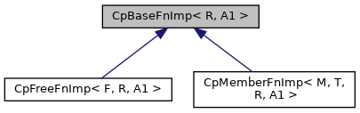

[Public Member Functions](#pub-methods)

`#include <`<a href="_cp_functional_8h_source.md">CpFunctional.h</a>`>`

Inheritance diagram for CpBaseFnImp\< R, A1 \>:

\[<a href="graph_legend.md">legend</a>\]

|  |  |
|----|----|
| Public Member Functions |  |
| virtual  | [\~CpBaseFnImp](#ae060ac2a6a962cab6675a09bc6c8f724) () |
| virtual R  | [invoke](#af13ada5f7e9cbee1d319e91c22ecbd16) (A1)=0 |

## Constructor& Destructor Documentation

## \~CpBaseFnImp() 

virtual \~<a href="structvficpl_1_1_cp_base_fn_imp.md">CpBaseFnImp</a>

inlinevirtual

## MemberFunction Documentation {#member-function-documentation}

## invoke() 

virtual R invoke

pure virtual

Implemented in <a href="structvficpl_1_1_cp_member_fn_imp_3_01_m_00_01_t_00_01_r_00_01_a1_01_4.md#a3a2b24a848c324a4e6489481009348d0">CpMemberFnImp< M, T, R, A1 ></a>, and <a href="structvficpl_1_1_cp_free_fn_imp_3_01_f_00_01_r_00_01_a1_01_4.md#a3a2b24a848c324a4e6489481009348d0">CpFreeFnImp< F, R, A1 ></a>.

------------------------------------------------------------------------

The documentation for this struct was generated from the following file:

- cpl/include/commerce/<a href="_cp_functional_8h_source.md">CpFunctional.h</a>
