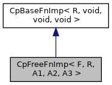

[Public Member Functions](#pub-methods) \| [Data Fields](#pub-attribs)

`#include <`<a href="_cp_functional_8h_source.md">CpFunctional.h</a>`>`

Inheritance diagram for CpFreeFnImp\< F, R, A1, A2, A3 \>:

\[<a href="graph_legend.md">legend</a>\]

Collaboration diagram for CpFreeFnImp\< F, R, A1, A2, A3 \>:

\[<a href="graph_legend.md">legend</a>\]

|  |  |
|----|----|
| Public Member Functions |  |
|   | [CpFreeFnImp](#af88487a1026c040931f481bd4b3d3f48) (<a href="md5_8cpp.md#a96d73bbd7af15cb1fc38c3f4a3bd82e9">F</a> fn) |
| virtual R  | [invoke](#ae8c596f6d6e44308f093f3edcc338eca) (A1 a1, A2 a2, A3 a3) |
|  Public Member Functions inherited from <a href="structvficpl_1_1_cp_base_fn_imp.md">CpBaseFnImp< R, void, void, void ></a> |  |
| virtual  | <a href="structvficpl_1_1_cp_base_fn_imp.md#ae060ac2a6a962cab6675a09bc6c8f724">~CpBaseFnImp</a> () |
| virtual R  | <a href="structvficpl_1_1_cp_base_fn_imp.md#a0b57f4ddc15b08754d1cd2058f6defd1">invoke</a> (void, void, void)=0 |

|  |  |
|----|----|
| Data Fields |  |
| <a href="md5_8cpp.md#a96d73bbd7af15cb1fc38c3f4a3bd82e9">F</a>  | [m_fn](#a37079a7261fff5a7c34ca2c14f8ae0eb) |

## Constructor& Destructor Documentation

## CpFreeFnImp() 

<a href="structvficpl_1_1_cp_free_fn_imp.md">CpFreeFnImp</a>

inline

## MemberFunction Documentation {#member-function-documentation}

## invoke() 

virtual R invoke

inlinevirtual

## FieldDocumentation {#field-documentation}

## m_fn 

<a href="md5_8cpp.md#a96d73bbd7af15cb1fc38c3f4a3bd82e9">F</a> m_fn

------------------------------------------------------------------------

The documentation for this struct was generated from the following file:

- cpl/include/commerce/<a href="_cp_functional_8h_source.md">CpFunctional.h</a>
