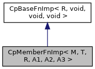

[Public Member Functions](#pub-methods) \| [Data Fields](#pub-attribs)

`#include <`<a href="_cp_functional_8h_source.md">CpFunctional.h</a>`>`

Inheritance diagram for CpMemberFnImp\< M, T, R, A1, A2, A3 \>:

\[<a href="graph_legend.md">legend</a>\]

Collaboration diagram for CpMemberFnImp\< M, T, R, A1, A2, A3 \>:

\[<a href="graph_legend.md">legend</a>\]

|  |  |
|----|----|
| Public Member Functions |  |
|   | [CpMemberFnImp](#a5fe9552fa368b95817608947f10018b1) (T \*obj, M memfn) |
|   | [CpMemberFnImp](#a562525baf7ade1fd18794f99feeb0d36) (T &obj, M memfn) |
| virtual R  | [invoke](#ae8c596f6d6e44308f093f3edcc338eca) (A1 a1, A2 a2, A3 a3) |
|  Public Member Functions inherited from <a href="structvficpl_1_1_cp_base_fn_imp.md">CpBaseFnImp< R, void, void, void ></a> |  |
| virtual  | <a href="structvficpl_1_1_cp_base_fn_imp.md#ae060ac2a6a962cab6675a09bc6c8f724">~CpBaseFnImp</a> () |
| virtual R  | <a href="structvficpl_1_1_cp_base_fn_imp.md#a0b57f4ddc15b08754d1cd2058f6defd1">invoke</a> (void, void, void)=0 |

|             |                                               |
|-------------|-----------------------------------------------|
| Data Fields |                                               |
| M           | [m_memfn](#abcfe38b083b66715c23f923ad431f27b) |
| T \*        | [m_obj](#a6f761a901d378ae84d9b32b539450d34)   |

## Constructor& Destructor Documentation

## CpMemberFnImp()\[1/2\]  {#cpmemberfnimp-12}

<a href="structvficpl_1_1_cp_member_fn_imp.md">CpMemberFnImp</a>

inline

## CpMemberFnImp()\[2/2\]  {#cpmemberfnimp-22}

<a href="structvficpl_1_1_cp_member_fn_imp.md">CpMemberFnImp</a>

inline

## MemberFunction Documentation {#member-function-documentation}

## invoke() 

virtual R invoke

inlinevirtual

## FieldDocumentation {#field-documentation}

## m_memfn 

M m_memfn

## m_obj 

T\* m_obj

------------------------------------------------------------------------

The documentation for this struct was generated from the following file:

- cpl/include/commerce/<a href="_cp_functional_8h_source.md">CpFunctional.h</a>
