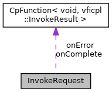

[Public Member Functions](#pub-methods) \| [Data Fields](#pub-attribs)

`#include <`<a href="_commerce_8h_source.md">Commerce.h</a>`>`

Collaboration diagram for InvokeRequest:

\[<a href="graph_legend.md">legend</a>\]

|  |  |
|----|----|
| Public Member Functions |  |
|   | [InvokeRequest](#aa4ef77951d87f5230a6927769c56c59d) () |
| <a href="namespacevficpl.md#a59e56af19e754a6aa26a612ebf91d05f">ErrorCode</a>  | [wait](#a673f471f0e601ecd70aeed75bb0d92f7) () |
| <a href="namespacevficpl.md#a59e56af19e754a6aa26a612ebf91d05f">ErrorCode</a>  | [cancel](#afe0e8c2e79f97bf48ad1bb267a810eaf) () |

|  |  |
|----|----|
| Data Fields |  |
| <a href="namespacevficpl.md#aba55b083790f62440bcff1c23bbe2f12">CpTrigger</a>  | [trigger](#abb702ef604d1f620e062df3e8dd4fd57) |
| std::string  | [program](#a451fb3866139bc9c8dfb5155974db964) |
| std::string  | [label](#a1dd28f5ea7b5b0780013e960944ddaa0) |
| int  | [display](#af36a76a97c2cc0ea7b1c0c25933934a9) |
| int  | [timeout](#a493b57f443cc38b3d3df9c1e584d9d82) |
| bool  | [toforeground](#ac366c089f0af655fd9c022db21d67c84) |
| <a href="classvficpl_1_1_cp_function.md">CpFunction</a>\< void, <a href="structvficpl_1_1_invoke_result.md">InvokeResult</a> \>  | [onComplete](#a3a5006085f62a34f5ea4e709822323f3) |
| <a href="classvficpl_1_1_cp_function.md">CpFunction</a>\< void, <a href="structvficpl_1_1_invoke_result.md">InvokeResult</a> \>  | [onError](#addc4bd9453cc576ae552c587e3641ddc) |

## Constructor& Destructor Documentation

## InvokeRequest() 

<a href="structvficpl_1_1_invoke_request.md">InvokeRequest</a>

## MemberFunction Documentation {#member-function-documentation}

## cancel() 

<a href="namespacevficpl.md#a59e56af19e754a6aa26a612ebf91d05f">ErrorCode</a> cancel

## wait() 

<a href="namespacevficpl.md#a59e56af19e754a6aa26a612ebf91d05f">ErrorCode</a> wait

## FieldDocumentation {#field-documentation}

## display 

int display

## label 

std::string label

## onComplete 

<a href="classvficpl_1_1_cp_function.md">CpFunction</a>\<void, <a href="structvficpl_1_1_invoke_result.md">InvokeResult</a>\> onComplete

## onError 

<a href="classvficpl_1_1_cp_function.md">CpFunction</a>\<void, <a href="structvficpl_1_1_invoke_result.md">InvokeResult</a>\> onError

## program 

std::string program

## timeout 

int timeout

## toforeground 

bool toforeground

## trigger 

<a href="namespacevficpl.md#aba55b083790f62440bcff1c23bbe2f12">CpTrigger</a> trigger

------------------------------------------------------------------------

The documentation for this struct was generated from the following file:

- cpl/include/commerce/<a href="_commerce_8h_source.md">Commerce.h</a>
