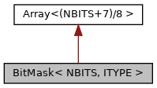

[Data Structures](#nested-classes) \| [Public Types](#pub-types) \| [Public Member Functions](#pub-methods)

`#include <`<a href="array_8h_source.md">array.h</a>`>`

Inheritance diagram for BitMask\< NBITS, ITYPE \>:

\[<a href="graph_legend.md">legend</a>\]

Collaboration diagram for BitMask\< NBITS, ITYPE \>:

\[<a href="graph_legend.md">legend</a>\]

|  |  |
|----|----|
| Data Structures |  |
| class   | <a href="classvfisdi_1_1_bit_mask_1_1_bit_access.md">BitAccess</a> |

|  |  |
|----|----|
| Public Types |  |
| typedef <a href="structvfisdi_1_1_array.md">Array</a>\<(NBITS+7)/8 \>  | [Parent](#adf55221cadf5815d3f2695c828f8bcdf) |

|  |  |
|----|----|
| Public Member Functions |  |
|   | [BitMask](#a386bfe03cf189e1667d2c058688a7200) () |
| unsigned  | [size](#a126a73e6d140f9e2a7b795c20fa42f70) () const |
| <a href="classvfisdi_1_1_bit_mask_1_1_bit_access.md">BitAccess</a>  | [operator\[\]](#a96c8ee4be1b5b8fe03760d1b7a500b47) (ITYPE idx) |
| bool  | [operator\[\]](#ac71090f374aacda878d29db8708fd23f) (ITYPE idx) const |
| void  | [set](#a33d6999231c150aadd69c9c7658656ed) (ITYPE \*bits, unsigned [size](#a126a73e6d140f9e2a7b795c20fa42f70)) |
| void  | [reset](#a605bc4d3e7d561c947d537e4c133b1cc) (ITYPE \*bits, unsigned [size](#a126a73e6d140f9e2a7b795c20fa42f70)) |
| [Parent](#adf55221cadf5815d3f2695c828f8bcdf) &  | [array](#a4b719fa639a4c57b24e6cbc9b72b04a7) () |
| const [Parent](#adf55221cadf5815d3f2695c828f8bcdf) &  | [array](#a114109fb6193d86b398f084db7e07d35) () const |

## DetailedDescription {#detailed-description}

### template\<unsignedNBITS, typename ITYPE = unsigned\>
struct vfisdi::BitMask\< NBITS, ITYPE \>

Bit mask with single bit access. Bits are stored in bytes in little endian ordering.

**Parameters**

\[in\] **NBITS** number of bits in bit mask \[in\] **ITYPE** index type


Base class Array\<\> is private to prevent automatic reference conversion to base class. Use [array()](#a4b719fa639a4c57b24e6cbc9b72b04a7) to explicitly obtain a reference to the base class.


## MemberTypedef Documentation {#member-typedef-documentation}

## Parent 

typedef <a href="structvfisdi_1_1_array.md">Array</a>\<(NBITS+7)/8\> [Parent](#adf55221cadf5815d3f2695c828f8bcdf)

## Constructor& Destructor Documentation

## BitMask() 

<a href="structvfisdi_1_1_bit_mask.md">BitMask</a>

inline

constructor, initializes all array values to 0

## MemberFunction Documentation {#member-function-documentation}

## array()\[1/2\]  {#array-12}

[Parent](#adf55221cadf5815d3f2695c828f8bcdf)& array

inline

### Returns

<a href="structvfisdi_1_1_bit_mask.md">BitMask</a> as array reference

## array()\[2/2\]  {#array-22}

const [Parent](#adf55221cadf5815d3f2695c828f8bcdf)& array

inline

### Returns

<a href="structvfisdi_1_1_bit_mask.md">BitMask</a> as array reference

## operator\[\]()\[1/2\]  {#operator-12}

<a href="classvfisdi_1_1_bit_mask_1_1_bit_access.md">BitAccess</a> operator\[\]

inline

access bit

**Parameters**

\[in\] **idx** bit index

### Returns

access object

## operator\[\]()\[2/2\]  {#operator-22}

bool operator\[\]

inline

access bit

**Parameters**

\[in\] **idx** bit index

### Returns

access object

## reset() 

void reset

inline

reset bits listed in *bits*

**Parameters**

\[in\] **bits** list of bits to set \[in\] **size** size list

## set() 

void set

inline

set bits listed in *bits*

**Parameters**

\[in\] **bits** list of bits to set \[in\] **size** size list

## size() 

unsigned size

inline

obtain size of array in bytes

### Returns

size in bytes

------------------------------------------------------------------------

The documentation for this struct was generated from the following file:

- sdiapi/src/sdiapi/<a href="array_8h_source.md">array.h</a>
