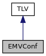
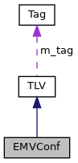

[Data Structures](#nested-classes) \| [Public Types](#pub-types) \| [Public Member Functions](#pub-methods) \| [Protected Member Functions](#pro-methods)

`#include <`<a href="sdiapi_2src_2sdiapi_2sdi__emv_8h_source.md">sdi_emv.h</a>`>`

Inheritance diagram for EMVConf:

\[<a href="graph_legend.md">legend</a>\]

Collaboration diagram for EMVConf:

\[<a href="graph_legend.md">legend</a>\]

|  |  |
|----|----|
| Data Structures |  |
| struct   | [DynamicReaderLimits](#structvfisdi_1_1_e_m_v_conf_1_1_dynamic_reader_limits) |

|  |  |
|----|----|
| Public Types |  |
| typedef std::vector\< unsigned char \>  | [bytevector](#a64b5be62be31dcda165d2c6c3c262fb5) |

|  |  |
|----|----|
| Public Member Functions |  |
| bool  | [setIssuerID](#abb559ff8be93ac3259daa9499015f7b2) (const <a href="structvfisdi_1_1_array.md">Array</a>\< 4 \> &id) |
| bool  | [getIssuerID](#aefa82473aa949ff4b84b49636e15268b) (<a href="structvfisdi_1_1_array.md">Array</a>\< 4 \> &id) const |
| bool  | [setAID](#afa6ca2d77399d2db1c12d1ff7eeda01f) (const [bytevector](#a64b5be62be31dcda165d2c6c3c262fb5) &aid) |
| template\<unsigned N\> |  |
| bool  | [setAID](#a8f3822d556d2dc65cc8ebde4a87124f5) (const unsigned char(&v)\[N\]) |
| bool  | [getAID](#a23c0f9cbcb8eac7af6d7ef6a9701f2de) ([bytevector](#a64b5be62be31dcda165d2c6c3c262fb5) &aid) const |
| bool  | [setPOIInfo](#a033ccb4d8471c313b5e94fb9e5fd6abe) (const [bytevector](#a64b5be62be31dcda165d2c6c3c262fb5) &poi) |
| bool  | [getPOIInfo](#a25aa341c9fe48345934a6d8655b76921) ([bytevector](#a64b5be62be31dcda165d2c6c3c262fb5) &poi) const |
| bool  | [setDefaultAppName](#ac460a8fd68ea45b8bc2545dc16bf607f) (const std::string &appname) |
| bool  | [getDefaultAppName](#a27002271f09298ae87fa9b98ae710198) (std::string &appname) const |
| bool  | [setTransactionCurrency](#a4de424306b728dc26ef8e9bd286b3869) (<a href="namespacevfisdi.md#a59f74bf9ae55ffd390b8806b2559021c">Currency</a> currency) |
| bool  | [getTransactionCurrency](#a7034b34fd69701b07a04477dd8a05c7d) (<a href="namespacevfisdi.md#a59f74bf9ae55ffd390b8806b2559021c">Currency</a> &currency) const |
| bool  | [setTransactionCurrency](#a249190029aeeb1d5dfe563a730cee322) (int currency) |
| bool  | [getTransactionCurrency](#ad79f4105407ee8e94477b65584b185f9) (int &currency) const |
| bool  | [setTransactionCurrencyExp](#a14b479242c47c4fb95ba179b4ffc1fd0) (unsigned char exp) |
| bool  | [getTransactionCurrencyExp](#a6067411ff4ac08ed983b918f83910a80) (unsigned char &exp) const |
| bool  | [setAcquirerID](#a992591004b8778654dbb1def13dd62d4) (const <a href="structvfisdi_1_1_array.md">Array</a>\< 6 \> &acq) |
| bool  | [getAcquirerID](#a712afef36599bab136a396b145acbb2a) (<a href="structvfisdi_1_1_array.md">Array</a>\< 6 \> &acq) const |
| bool  | [setChipAppVersionNumber](#a78b20669e72d58a734361fe8e66dea03) (const std::vector\< unsigned short \> &version) |
| template\<unsigned N\> |  |
| bool  | [setChipAppVersionNumber](#a13a0f59b1dc725c489d8af89318fc332) (const unsigned short(&v)\[N\]) |
| bool  | [getChipAppVersionNumber](#a04be57661f988e4740eb798c3b9fb9f5) (std::vector\< unsigned short \> &version) const |
| bool  | [setMerchantCategory](#a16fe2af50621397ab37e70ff7bbb775d) (const <a href="structvfisdi_1_1_array.md">Array</a>\< 2 \> &category) |
| bool  | [getMerchantCategory](#a30314b5643733c1ccd1d627922c8f76e) (<a href="structvfisdi_1_1_array.md">Array</a>\< 2 \> &category) const |
| bool  | [setMerchantID](#aa7025dd5e654b03d4dd7fd7721c1e55e) (const std::string &mid) |
| bool  | [getMerchantID](#a292dea077b233ee2dbc2dc679951cef3) (std::string &mid) const |
| bool  | [setTerminalCountryCode](#a26ba11a08044abf9e7896bce02b0044d) (unsigned short country) |
| bool  | [getTerminalCountryCode](#a7fdcd205b403d55f1c70e60b77d4b4c7) (unsigned short &country) const |
| bool  | [setFloorLimit](#ab595e9743cf110f2b3f50171ebc00d01) (const <a href="classvfisdi_1_1_b_c_d.md">BCD</a>\< 6 \> &limit) |
| bool  | [setFloorLimit](#aa515b4e613db7aadde9b59ca6a4d6e1b) (int64_t limit) |
| bool  | [getFloorLimit](#aa4ca8e0f280cf96e95ebaaa7144896ee) (<a href="classvfisdi_1_1_b_c_d.md">BCD</a>\< 6 \> &limit) const |
| bool  | [getFloorLimit](#a80a7761ccbbe9d48abe26a9bb845c590) (int64_t &limit) const |
| bool  | [setTerminalID](#a028445c0ce61b182b6f7025bb3d24648) (const <a href="structvfisdi_1_1_array.md">Array</a>\< 8 \> &id) |
| bool  | [getTerminalID](#a6945b6085243187b638d0f78738dc7d2) (<a href="structvfisdi_1_1_array.md">Array</a>\< 8 \> &id) const |
| bool  | [setTerminalRiskManagement](#a71bb7b1cbbca2c3b238872d2ed4f99aa) (const <a href="structvfisdi_1_1_array.md">Array</a>\< 8 \> &trm) |
| bool  | [getTerminalRiskManagement](#ad5f7e845ab5dbbdb6d2c1a9be2d1111e) (<a href="structvfisdi_1_1_array.md">Array</a>\< 8 \> &trm) const |
| bool  | [setIFDSerial](#ac29805aade8042332fd036c3c104318e) (const <a href="structvfisdi_1_1_array.md">Array</a>\< 8 \> &serial) |
| bool  | [getIFDSerial](#a32be7437a7f7ac177dd68832ea31f0f7) (<a href="structvfisdi_1_1_array.md">Array</a>\< 8 \> &serial) const |
| bool  | [setTerminalCapabilities](#a07d1104f8dd06bbe1ed6c8e784bf9881) (const <a href="structvfisdi_1_1_array.md">Array</a>\< 3 \> &caps) |
| bool  | [getTerminalCapabilities](#a69f4d7f026f4298506088e080dbc332d) (<a href="structvfisdi_1_1_array.md">Array</a>\< 3 \> &caps) const |
| bool  | [setTerminalType](#adfb374e87dc82e434c7c7d010fa0ee95) (unsigned char type) |
| bool  | [getTerminalType](#a41858348eb0babcc5e7ee61aaa31fcb4) (unsigned char &type) const |
| bool  | [setPOSEntryMode](#a6de298ced2503dde5eb2a5ddaa8d694b) (unsigned char mode) |
| bool  | [getPOSEntryMode](#af0a7d48a059d253f4595690d55f38a35) (unsigned char &mode) const |
| bool  | [setAdditionalCapabilities](#a361cb80e0113f51685cdedf03ed39bd7) (const <a href="structvfisdi_1_1_array.md">Array</a>\< 5 \> &caps) |
| bool  | [getAdditionalCapabilities](#a2742ef7d2429c0fe340bc29c046cae3c) (<a href="structvfisdi_1_1_array.md">Array</a>\< 5 \> &caps) const |
| bool  | [setMerchantNameLocation](#a9d36ac80f76252f97b8bcc2d803e8339) (const std::string &nameloc) |
| bool  | [getMerchantNameLocation](#a7b138f57dbc037bce51adaadc55e90b6) (std::string &nameloc) const |
| bool  | [setTransactionCategory](#ae84f0f7e295f28a7213665957fb70602) (unsigned char cat) |
| bool  | [getTransactionCategory](#a11e7e5dc1f9dc1cb95a86ee7b25f841f) (unsigned char &cat) const |
| bool  | [setInterchangeProfile](#a4cd72cf6df9418cac98ebb5eb7130633) (const <a href="structvfisdi_1_1_array.md">Array</a>\< 3 \> &icc) |
| bool  | [getInterchangeProfile](#a2d3ccb584815ab9370639b31305f6a49) (<a href="structvfisdi_1_1_array.md">Array</a>\< 3 \> &icc) const |
| bool  | [setMerchantType](#ad505041a40c1902c77db28fed56810e2) (unsigned char type) |
| bool  | [getMerchantType](#ac3c7fcd35d56c932e1695ca7a821730c) (unsigned char &type) const |
| bool  | [setTerminalTransactionInformation](#a82001e81901f14dcc02b6298a739aca4) (const <a href="structvfisdi_1_1_array.md">Array</a>\< 3 \> &info) |
| bool  | [getTerminalTransactionInformation](#a6dc862d3f9b5af3050eef7f5bab6c7a7) (<a href="structvfisdi_1_1_array.md">Array</a>\< 3 \> &info) const |
| bool  | [setAppProgramID](#a4a6f268a4cf91ef502047ee13f581e64) (const [bytevector](#a64b5be62be31dcda165d2c6c3c262fb5) &id) |
| template\<unsigned N\> |  |
| bool  | [setAppProgramID](#adde962dd2be57c7b059e5dd2343ac34b) (const unsigned char(&v)\[N\]) |
| bool  | [getAppProgramID](#a2c29b4c7f3b64ccc8faddc8fd2c8dba1) ([bytevector](#a64b5be62be31dcda165d2c6c3c262fb5) &id) const |
| bool  | [setDataStoreRequestedOperatorID](#af037a896167759bd2cde1e14aa497c64) (const <a href="structvfisdi_1_1_array.md">Array</a>\< 8 \> &id) |
| bool  | [getDataStoreRequestedOperatorID](#a07f7cf7609d9babc5ee6e7a0ad34767f) (<a href="structvfisdi_1_1_array.md">Array</a>\< 8 \> &id) const |
| bool  | [setReceiptRequiredLimit](#af53ee03fc080cdecf0a87c25555de1db) (const <a href="classvfisdi_1_1_b_c_d.md">BCD</a>\< 6 \> &limit) |
| bool  | [setReceiptRequiredLimit](#a4e0b4bc8e522e9dab42810dd825c2ba7) (int64_t limit) |
| bool  | [getReceiptRequiredLimit](#a8637e6ff9a4f866a43e406a70303b85c) (<a href="classvfisdi_1_1_b_c_d.md">BCD</a>\< 6 \> &limit) const |
| bool  | [getReceiptRequiredLimit](#a013e0c58d3f902fd19c512bf9b87c06f) (int64_t &limit) const |
| bool  | [setOptionStatus](#abe2c2d7933e589a8448498a1c991470b) (const <a href="structvfisdi_1_1_array.md">Array</a>\< 2 \> &status) |
| bool  | [getOptionStatus](#a4cacbe130218c5dfacfb0a42a9a9e940) (<a href="structvfisdi_1_1_array.md">Array</a>\< 2 \> &status) const |
| bool  | [setTransactionQualifier](#a120d76e75ec875eb16b8f55b3dcbe8cf) (const <a href="structvfisdi_1_1_array.md">Array</a>\< 4 \> &q) |
| bool  | [getTransactionQualifier](#a963ccd93741c4a44bd2a26a4cd3eecab) (<a href="structvfisdi_1_1_array.md">Array</a>\< 4 \> &q) const |
| bool  | [setMSRVersionNumber](#ad4cd3ae9ae436b306411de5b6a4912cb) (const std::vector\< unsigned short \> &ver) |
| template\<unsigned N\> |  |
| bool  | [setMSRVersionNumber](#a4f35dde20654c381f773632c0d198e26) (const unsigned short(&v)\[N\]) |
| bool  | [getMSRVersionNumber](#aac9562792654e840e38080bcc5c92ff5) (std::vector\< unsigned short \> &ver) const |
| bool  | [setReaderCapabilities](#ac35c21a74ebd284f3ae6aed5c09a734b) (unsigned char caps) |
| bool  | [getReaderCapabilities](#a2917b5838570b25f713e62a8ee534997) (unsigned char &caps) const |
| bool  | [setTransactionCapabilities](#ad43828c716b4393bdebccd34eb438c92) (const <a href="structvfisdi_1_1_array.md">Array</a>\< 4 \> &caps) |
| bool  | [getTransactionCapabilities](#a4029cd769a059130ede19f0629fd1820) (<a href="structvfisdi_1_1_array.md">Array</a>\< 4 \> &caps) const |
| bool  | [setTerminalTransactionData](#a58e8ef98aca4b02d4c786d0c20349ded) (const [bytevector](#a64b5be62be31dcda165d2c6c3c262fb5) &data) |
| template\<unsigned N\> |  |
| bool  | [setTerminalTransactionData](#a052466ea2567fac19e91b81723064a6f) (const unsigned char(&v)\[N\]) |
| bool  | [getTerminalTransactionData](#aa13563bee27518c3ca274ecfbf779b52) ([bytevector](#a64b5be62be31dcda165d2c6c3c262fb5) &data) const |
| bool  | [setMerchantCustomData](#a0b5482372cee17d3d772a0b235cb517e) (const <a href="structvfisdi_1_1_array.md">Array</a>\< 20 \> &data) |
| bool  | [getMerchantCustomData](#a532ad7aaf94c250f4468e360d0e33ce6) (<a href="structvfisdi_1_1_array.md">Array</a>\< 20 \> &data) const |
| bool  | [getLibVersion](#a3e2fb8dab22cf44d1f268a5fb68dc39a) (std::string &version) const |
| bool  | [getEMVCOChecksum](#afd59b122daf5cfeeed9944f60f4fe25f) (std::string &chk) const |
| bool  | [setEMVCOChecksumParameter](#a2c627e463855ebc71ed38f1edda33141) (const <a href="structvfisdi_1_1_array.md">Array</a>\< 5 \> &cp) |
| bool  | [setEMVCOChecksumParameter](#add4287368826da94431c8f90ac0021da) (const <a href="namespacevfisdi.md#af00bb692a2a174186fe3cb16326581bd">EMVChecksumOptions</a> &cp) |
| bool  | [getEMVCOChecksumParameter](#accc66b1697dda007238d7cf027c0baeb) (<a href="structvfisdi_1_1_array.md">Array</a>\< 5 \> &cp) const |
| bool  | [getEMVCOChecksumParameter](#a9e84b65a17974a832c0acb1749a77af6) (<a href="namespacevfisdi.md#af00bb692a2a174186fe3cb16326581bd">EMVChecksumOptions</a> &cp) const |
| bool  | [setOfflineOnly](#a4dbac50d08cd8cb2173352f2aba0c8be) (bool flag) |
| bool  | [getOfflineOnly](#a30ea6d505d445a6ad8075df2a4ab97b0) (bool &flag) const |
| bool  | [setTACIACDefaultHandling](#a04e1a840016a967dc69605da89d4bccc) (unsigned char def) |
| bool  | [getTACIACDefaultHandling](#ad80b2c96b5cac6941bb8ae49d9f4e695) (unsigned char &def) const |
| bool  | [setFallbackMIDs](#aa873c4ba7490d4a915015730720cab44) (const <a href="structvfisdi_1_1_array.md">Array</a>\< 3 \> &mid) |
| bool  | [getFallbackMIDs](#a575a64e54ab99e140150e09888007bc2) (<a href="structvfisdi_1_1_array.md">Array</a>\< 3 \> &mid) const |
| bool  | [setEMVFallback](#a7a402df3400009a6e11f0a2e21a4d81f) (unsigned char fb) |
| bool  | [getEMVFallback](#ae9a523919303b0a5213bbea4f8035e5c) (unsigned char &fb) const |
| bool  | [setSpecialTransactions](#ae4fd867a3e4118251e40456cc288d972) (const <a href="classvfisdi_1_1_e_m_v_special_transactions.md">EMVSpecialTransactions</a> &tx) |
| bool  | [getSpecialTransactions](#a0e4a0afe63161c7252abc9d7bfc3b559) (<a href="classvfisdi_1_1_e_m_v_special_transactions.md">EMVSpecialTransactions</a> &tx) const |
| bool  | [setPriorityApplications](#aad1c53153bb3f34cb4716e11d0455756) (const std::vector\< [bytevector](#a64b5be62be31dcda165d2c6c3c262fb5) \> &apps) |
| bool  | [getPriorityApplications](#a7e7afd4dedf633509fedb716d10c8ea8) (std::vector\< [bytevector](#a64b5be62be31dcda165d2c6c3c262fb5) \> &apps) const |
| bool  | [setASI](#aee2895d6b9d860737043c4d4ac17d459) (unsigned char asi) |
| bool  | [getASI](#aea3bf97f454a70ebbafeefaa7c1912a0) (unsigned char &asi) const |
| bool  | [setTACDenial](#a1fbe09894edee9a9defb6392bf9b0d4c) (const <a href="structvfisdi_1_1_array.md">Array</a>\< 5 \> &tac) |
| bool  | [getTACDenial](#ac315853ec5525af2be4c64f080aeb387) (<a href="structvfisdi_1_1_array.md">Array</a>\< 5 \> &tac) const |
| bool  | [setTACOnline](#a54adce7113b725b91b03bc4196f373e5) (const <a href="structvfisdi_1_1_array.md">Array</a>\< 5 \> &tac) |
| bool  | [getTACOnline](#aafd3a4332acc0a0d47f268fff2d58e51) (<a href="structvfisdi_1_1_array.md">Array</a>\< 5 \> &tac) const |
| bool  | [setTACDefault](#aa16dc8da02807d622670272a08e83180) (const <a href="structvfisdi_1_1_array.md">Array</a>\< 5 \> &tac) |
| bool  | [getTACDefault](#ac7fc5757e37d02f050b8ac83eb859195) (<a href="structvfisdi_1_1_array.md">Array</a>\< 5 \> &tac) const |
| bool  | [setThreshold](#a2dec606c02b9ae63632f58cc782f1f6d) (unsigned th) |
| bool  | [getThreshold](#ac262cb7820834aff81225314a6c86ad0) (unsigned &th) const |
| bool  | [setMaxPercentOnline](#ae17d16d6ea2917121d8173c881fae47d) (const <a href="classvfisdi_1_1_b_c_d.md">BCD</a>\< 1 \> &p) |
| bool  | [setMaxPercentOnline](#a2235b3c08185a66db080178c0e5a2223) (int p) |
| bool  | [getMaxPercentOnline](#af6ea0a6c92ac9b6a6b39b8d88d2c63a8) (<a href="classvfisdi_1_1_b_c_d.md">BCD</a>\< 1 \> &p) const |
| bool  | [getMaxPercentOnline](#a61144b3c745acfc6957fdaa65050f573) (int &p) const |
| bool  | [setPercentOnline](#ac1c69656a96b3adc9b98f2213e938ae5) (const <a href="classvfisdi_1_1_b_c_d.md">BCD</a>\< 1 \> &p) |
| bool  | [setPercentOnline](#abd4f5dcf4332cbb54fa1dcff09fd2c89) (int p) |
| bool  | [getPercentOnline](#abd8e754a5e60ebc61f42d51401b6a5a5) (<a href="classvfisdi_1_1_b_c_d.md">BCD</a>\< 1 \> &p) const |
| bool  | [getPercentOnline](#aaf6ba71003da849c7d441aa6163e80d4) (int &p) const |
| bool  | [setDefaultTDOL](#ab0a4bdbe47269faa17780e8bf8b42192) (const [bytevector](#a64b5be62be31dcda165d2c6c3c262fb5) &tdol) |
| template\<unsigned N\> |  |
| bool  | [setDefaultTDOL](#a1d601e60eae6862f13a268fc2841a0fd) (const unsigned char(&v)\[N\]) |
| bool  | [getDefaultTDOL](#a46f1d33ce412f8fd6da330b7bf0d68f8) ([bytevector](#a64b5be62be31dcda165d2c6c3c262fb5) &tdol) const |
| bool  | [setDefaultDDOL](#a2a1adce116851fef1a47848edeae8db2) (const [bytevector](#a64b5be62be31dcda165d2c6c3c262fb5) &ddol) |
| template\<unsigned N\> |  |
| bool  | [setDefaultDDOL](#a07dd7117a61e4f9e4b0f29dfe99f6b1a) (const unsigned char(&v)\[N\]) |
| bool  | [getDefaultDDOL](#a4fc154389934bdebc2471b330c0a0001) ([bytevector](#a64b5be62be31dcda165d2c6c3c262fb5) &ddol) const |
| bool  | [setAdditionalTags](#ad6570dd728bb4cf247046d65855b2f67) (const [bytevector](#a64b5be62be31dcda165d2c6c3c262fb5) &tags) |
| template\<unsigned N\> |  |
| bool  | [setAdditionalTags](#a8d5fe4a6f8c93a1aca399c34f4f8439a) (const unsigned char(&v)\[N\]) |
| bool  | [getAdditionalTags](#af8ce026db647dfe900e8a8c382b26a8f) ([bytevector](#a64b5be62be31dcda165d2c6c3c262fb5) &tags) const |
| bool  | [setMandatoryTags](#a48acece0cf56e4ee670d1ecb6987bec4) (const std::vector\< unsigned \> &tags) |
| template\<unsigned N\> |  |
| bool  | [setMandatoryTags](#abce92facbcd0e6b47d7bf48a60339894) (const unsigned(&v)\[N\]) |
| bool  | [getMandatoryTags](#a822c428c19967cc6e3266e9ec85d5841) (std::vector\< unsigned \> &tags) const |
| bool  | [setAppFlowCapabilities](#a11cc6c0ed3f098781b926eb828bd93f6) (const <a href="structvfisdi_1_1_array.md">Array</a>\< 5 \> &caps) |
| bool  | [setAppFlowCapabilities](#a1f5b64125e5d7c91c16cef0989d0064f) (const <a href="namespacevfisdi.md#a44617adc8f4a66d0aed5cc243140d735">EMVAppFlowCapabilities</a> &caps) |
| bool  | [getAppFlowCapabilities](#a897156b68ac2ade58642c6f40ee63480) (<a href="structvfisdi_1_1_array.md">Array</a>\< 5 \> &caps) const |
| bool  | [getAppFlowCapabilities](#a76d40d835cd6ec81d11132969a09d8bf) (<a href="namespacevfisdi.md#a44617adc8f4a66d0aed5cc243140d735">EMVAppFlowCapabilities</a> &caps) const |
| bool  | [setAdditionalTagsCRD](#ae663d5d3400fc53f4a07bfdbdb1fe848) (const [bytevector](#a64b5be62be31dcda165d2c6c3c262fb5) &tags) |
| template\<unsigned N\> |  |
| bool  | [setAdditionalTagsCRD](#a7b480df6b19fcb536c8bcc5096db9c93) (const unsigned char(&v)\[N\]) |
| bool  | [getAdditionalTagsCRD](#a76609122aa6fc3e32f353de64e1210fd) ([bytevector](#a64b5be62be31dcda165d2c6c3c262fb5) &tags) const |
| bool  | [setEMVApplication](#aa388efe3b922b9657a4dd4bed6775160) (unsigned char emv) |
| bool  | [getEMVApplication](#a07e90fc4f30a97fe9ae9ff617f84e192) (unsigned char &emv) const |
| bool  | [setAIPNoCVM](#a6e2a00679978108600c099026ea3942f) (unsigned char cvm) |
| bool  | [getAIPNoCVM](#ab081c8e6f28d879622720eccbb462390) (unsigned char &cvm) const |
| bool  | [setCustomCVM](#a7792d8e5caba63749b4d5cf9c0956d3b) (unsigned char cvm) |
| bool  | [getCustomCVM](#a29a07daabb195194b7ada9f841b28976) (unsigned char &cvm) const |
| bool  | [setAdditionalTerminalCapabilities](#a512031f4b94fd3aa6fa69462dc9bd69f) (const <a href="structvfisdi_1_1_array.md">Array</a>\< 5 \> &caps) |
| bool  | [getAdditionalTerminalCapabilities](#ae3e1fb510d3f1d32a5fe523286c21849) (<a href="structvfisdi_1_1_array.md">Array</a>\< 5 \> &caps) const |
| bool  | [setCDAProcessing](#afa00316ca4d85df57cd6b7c346919308) (unsigned char cda) |
| bool  | [getCDAProcessing](#ac1e1de16afeb1d9ed392177d443f066d) (unsigned char &cda) const |
| bool  | [getObfuscatedPANString](#a2bd0873661349f471249d69d17470115) (std::string &pan) const |
| bool  | [getObfuscatedTrack2String](#a3cd87f89ac1ba177f09ad65856a6368f) (std::string &track) const |
| bool  | [setSecurityLimit](#a23944c5404ef4d52e125c4c20d89218b) (unsigned limit) |
| bool  | [getSecurityLimit](#abfd8c8392eb38b9f66a3857d6cf10ba7) (unsigned &limit) const |
| bool  | [setCapabilitiesBelowLimit](#a6c12754ceee746595dde62d8195c43a0) (const <a href="structvfisdi_1_1_array.md">Array</a>\< 3 \> &caps) |
| bool  | [getCapabilitiesBelowLimit](#a002d2ca3fd83a477a7eebcf15862c423) (<a href="structvfisdi_1_1_array.md">Array</a>\< 3 \> &caps) const |
| bool  | [setBeepVolume](#a9cbd88642dfab95bdefe8fa2aa7ee1f2) (unsigned short volume) |
| bool  | [getBeepVolume](#a6af7f563c166d0d486fa6f2d1b695059) (unsigned short &volume) const |
| bool  | [getKernelVersion](#aa9cbae93a9f0632b2328ef5c7f0b4a7f) (std::string &version) const |
| bool  | [setConfigCommand](#af0321a7441eb8a2778434d478210a8a9) (unsigned char cmd) |
| bool  | [getConfigCommand](#a873b6e79b31594814b223abedc58d4f6) (unsigned char &cmd) const |
| bool  | [setSupportedLanguages](#a66ce297cb7e9121630cd009bca05e57b) (const [bytevector](#a64b5be62be31dcda165d2c6c3c262fb5) &lang) |
| template\<unsigned N\> |  |
| bool  | [setSupportedLanguages](#abf1b52c5a3d312686c62b0dd825e9efa) (const unsigned char(&v)\[N\]) |
| bool  | [getSupportedLanguages](#af9ddf687dee67be34c80e2db5bfcc51c) ([bytevector](#a64b5be62be31dcda165d2c6c3c262fb5) &lang) const |
| bool  | [setRetryLimit](#a003a1c3edd5249615df653a30522d180) (unsigned char limit) |
| bool  | [getRetryLimit](#a3e63f8b30550fa05f0f6210d3797c313) (unsigned char &limit) const |
| bool  | [getL1DriverVersion](#ad1178b8ca8bc2674ffa4d57df7ccb485) (std::string &version) const |
| bool  | [getCtL1DriverVersion](#a8080d923d89910e12ed2aba336cd4dd2) (std::string &version) const |
| bool  | [getCtlsL1DriverVersion](#a9ac2186b16f51260ed5f13136e74d203) (std::string &version) const |
| bool  | [setShortKernelID](#a6270324bd4dfd4aa8e429069be983a5b) (unsigned char id) |
| bool  | [getShortKernelID](#a2fc699ae395de4bf054542f391fdc88c) (unsigned char &id) const |
| bool  | [setProceedToFirstWriteFlag](#a633058fba03032002fdd21e03b1f51cb) (unsigned char flag) |
| bool  | [getProceedToFirstWriteFlag](#a4f522f1254562c6dd0f56e7c0f117e48) (unsigned char &flag) const |
| bool  | [setTagsToRead](#a001378ce1dba34045e2e8bb87d81cc2f) (const [bytevector](#a64b5be62be31dcda165d2c6c3c262fb5) &ttr) |
| template\<unsigned N\> |  |
| bool  | [setTagsToRead](#a8c1bb516927a2ba04742c98728079a53) (const unsigned char(&v)\[N\]) |
| bool  | [getTagsToRead](#ab71aa039f23d6298cb72fe802c1919ba) ([bytevector](#a64b5be62be31dcda165d2c6c3c262fb5) &ttr) const |
| bool  | [setCardDataInputCapability](#a093a2edbfed0cd823e3b2f2135b8bb3f) (unsigned char cap) |
| bool  | [getCardDataInputCapability](#aa143de12e44d67730d1c27f756772681) (unsigned char &cap) const |
| bool  | [setChipCVMAboveLimit](#aea4f5798a129294ed78eb74845d0fe3e) (unsigned char cvm) |
| bool  | [getChipCVMAboveLimit](#aad322fe28d97e243328c9ac0286d4157) (unsigned char &cvm) const |
| bool  | [setChipCVMBelowLimit](#a8b372ff9faf19de96af52a1349ec0236) (unsigned char cvm) |
| bool  | [getChipCVMBelowLimit](#af551ebe20456eb2038986c764be39bff) (unsigned char &cvm) const |
| bool  | [setKernelConfiguration](#a36cfede5536b67ca1b0a4c96c98ff1c1) (unsigned char conf) |
| bool  | [getKernelConfiguration](#a323085394d35f68f696a49e3bf93e2ea) (unsigned char &conf) const |
| bool  | [setTornTransactionLifetime](#a83516f4c4af369883490e90070f3f202) (unsigned short ttl) |
| bool  | [getTornTransactionLifetime](#aa6de3b6a02f87496588c52b105c764f1) (unsigned short &ttl) const |
| bool  | [setTornTransactionNumber](#af469aab31416581bc4ef16cb1c69f68a) (unsigned char num) |
| bool  | [getTornTransactionNumber](#a3c7cae15923d2cc97aa79b599ce160b2) (unsigned char &num) const |
| bool  | [setMagstripeCVMAboveLimit](#a71b005d0d2879620afbec96bddafbadc) (unsigned char cvm) |
| bool  | [getMagstripeCVMAboveLimit](#a4db4377f7806777470aef8463c8e4c96) (unsigned char &cvm) const |
| bool  | [setSecurityCapability](#a0fd7016489c80d1f11ba0ba094f6b074) (unsigned char cap) |
| bool  | [getSecurityCapability](#a2eafbab90c849733446f3e593a750b41) (unsigned char &cap) const |
| bool  | [setTransactionLimitNoCVMOnDevice](#aeb9b799556815de6518e4a477dacb91a) (const <a href="classvfisdi_1_1_b_c_d.md">BCD</a>\< 6 \> &limit) |
| bool  | [setTransactionLimitNoCVMOnDevice](#a6160b85b804a481c0de12cebeea91927) (int64_t limit) |
| bool  | [getTransactionLimitNoCVMOnDevice](#a87e73b1a2419f6997cc9968fe21417bc) (<a href="classvfisdi_1_1_b_c_d.md">BCD</a>\< 6 \> &limit) const |
| bool  | [getTransactionLimitNoCVMOnDevice](#a76827561e8e09284e8930916163381b8) (int64_t &limit) const |
| bool  | [setTransactionLimitCVMOnDevice](#aa510a78cff69e15c9205cf90366500c5) (const <a href="classvfisdi_1_1_b_c_d.md">BCD</a>\< 6 \> &limit) |
| bool  | [setTransactionLimitCVMOnDevice](#a0b3c32f7b2ba5de77b9b1e8aaa776e94) (int64_t limit) |
| bool  | [getTransactionLimitCVMOnDevice](#ae900ca6a1517ab5285e7a1fdbb6cdace) (<a href="classvfisdi_1_1_b_c_d.md">BCD</a>\< 6 \> &limit) const |
| bool  | [getTransactionLimitCVMOnDevice](#af883685d1794dd84f5091657e5e60a79) (int64_t &limit) const |
| bool  | [setDataExchangeTimeout](#a5714682545e65df193afe38a95dbbd0c) (unsigned short tout) |
| bool  | [getDataExchangeTimeout](#a604188eff08782539adb084ababa53a9) (unsigned short &tout) const |
| bool  | [setMagstripeCVMBelowLimit](#a28592d8035d2ffd2f4966208a29de010) (unsigned char cvm) |
| bool  | [getMagstripeCVMBelowLimit](#afefc8c2c0805a2306b34a667c9e76600) (unsigned char &cvm) const |
| bool  | [setMessageHoldTime](#ad237c8ceced35ebc512cd91e64ff6ece) (const <a href="classvfisdi_1_1_b_c_d.md">BCD</a>\< 3 \> &time) |
| bool  | [setMessageHoldTime](#ae23cce28a28e025fe495a163fe4b5c88) (int time) |
| bool  | [getMessageHoldTime](#a51efc8543d1bc4de59135563bbaf3c1e) (<a href="classvfisdi_1_1_b_c_d.md">BCD</a>\< 3 \> &time) const |
| bool  | [getMessageHoldTime](#a7ded03c6471cadf543721676c3df4f85) (int &time) const |
| bool  | [setFieldOffTime](#a4839ef45f00d2cc44476cd27f851231d) (unsigned char time) |
| bool  | [getFieldOffTime](#a5ae22c7f8970528d9554194acfbc9b57) (unsigned char &time) const |
| bool  | [setPhoneMessageTable](#a95cf7e484435a8a4ebbc6b3e703c8b38) (const [bytevector](#a64b5be62be31dcda165d2c6c3c262fb5) &pmt) |
| template\<unsigned N\> |  |
| bool  | [setPhoneMessageTable](#a353f423cecd0ccf3d214a61de229b721) (const unsigned char(&v)\[N\]) |
| bool  | [getPhoneMessageTable](#a38edaa776e62d3a89d96c4d08377dd53) ([bytevector](#a64b5be62be31dcda165d2c6c3c262fb5) &pmt) const |
| bool  | [setRelayResistanceMinGracePeriod](#a7aca6cfd35d5a3ecf85937a38a00ef80) (unsigned short time) |
| bool  | [getRelayResistanceMinGracePeriod](#a49e50948b8f592850d92ac44113d43c0) (unsigned short &time) const |
| bool  | [setRelayResistanceMaxGracePeriod](#a9d3d7bebea4b8bcacc38eadf9e2a3c8a) (unsigned short time) |
| bool  | [getRelayResistanceMaxGracePeriod](#a2f5db61044e999695238b8210672c019) (unsigned short &time) const |
| bool  | [setRelayResistanceCAPDUTime](#ad2ffb20d260ea28ec6b255afbb13b45e) (unsigned short time) |
| bool  | [getRelayResistanceCAPDUTime](#aa0f754b5eaa420ee8f1474a4e436aa0b) (unsigned short &time) const |
| bool  | [setRelayResistanceRAPDUTime](#a4912adf2fd514ceece2e3d041543319a) (unsigned short time) |
| bool  | [getRelayResistanceRAPDUTime](#a2c7a49423777231dfc32f6caa84fc962) (unsigned short &time) const |
| bool  | [setRelayResistanceAccuracy](#a7a4b623860d1924201f2107ee9237ef0) (unsigned short time) |
| bool  | [getRelayResistanceAccuracy](#a381186ff7a130b4b4c82cca1d13f3d4a) (unsigned short &time) const |
| bool  | [setRelayResistanceTimeMismatchThreshold](#a6b475a753cbd9f9f20e4f6aa39315129) (unsigned char percent) |
| bool  | [getRelayResistanceTimeMismatchThreshold](#adcc65049ab3a8145b393c92d79643ff9) (unsigned char &percent) const |
| bool  | [setFlowOptions](#a718b3fbbed05cbbdd84ad9d9e33f7e51) (const <a href="structvfisdi_1_1_array.md">Array</a>\< 10 \> &opt) |
| bool  | [setFlowOptions](#ac84d9d6bf666f21f3ba16f4c9961c8c9) (const <a href="namespacevfisdi.md#a7aa35087a65d5c2673093eaeecd7a30f">EMVFlowOptions</a> &opt) |
| bool  | [getFlowOptions](#a6f2297ba9927abce9efb169397dae8be) (<a href="structvfisdi_1_1_array.md">Array</a>\< 10 \> &opt) const |
| bool  | [getFlowOptions](#aa3e4426435a48d2eab8cb87096ca4ed4) (<a href="namespacevfisdi.md#a7aa35087a65d5c2673093eaeecd7a30f">EMVFlowOptions</a> &opt) const |
| bool  | [setCtlsTerminalLimit](#aab40050466c3cc1445b2f6261c5716a1) (unsigned limit) |
| bool  | [getCtlsTerminalLimit](#a18a7b88b9a555062966a8eb3409b097f) (unsigned &limit) const |
| bool  | [setKernelID](#acf57e5f023c2eb15ec9553b1a5eeac5a) (const <a href="structvfisdi_1_1_array.md">Array</a>\< 3 \> &id) |
| bool  | [setKernelID](#a401e0c9ca0cf63771b81faec6e853411) (unsigned id) |
| bool  | [getKernelID](#ac124e485e36a770c4ee9d7006e746f69) (<a href="structvfisdi_1_1_array.md">Array</a>\< 3 \> &id) const |
| bool  | [getKernelID](#a83e1f97ad3d1760c391c7e1883397b97) (unsigned &id) const |
| bool  | [getEntryPointChecksum](#ac6ba4a64844643d0b9e959ad98fe9d41) (std::string &chk) const |
| bool  | [getKernelChecksum](#a1f39e83780b688672f8a4f7e9e848a3b) (std::string &chk) const |
| bool  | [setRetapFieldOff](#a7aabbd63c4e65e6ab6f32d8eacd8b75c) (unsigned char offtime) |
| bool  | [getRetapFieldOff](#a196c6d38e72884101d2e534d99684c1a) (unsigned char &offtime) const |
| bool  | [setInternalKernelID](#a9a06b53f11a80cfac834061909ee9a73) (const <a href="structvfisdi_1_1_array.md">Array</a>\< 3 \> &id) |
| bool  | [setInternalKernelID](#a81bea2de34f23bf56261dc66b734f4de) (unsigned id) |
| bool  | [getInternalKernelID](#abae9d95f70c657f6e47fc272f430f3e4) (<a href="structvfisdi_1_1_array.md">Array</a>\< 3 \> &id) const |
| bool  | [getInternalKernelID](#ad4e6e640bdd3fe58ceacd7a70cb8b4ed) (unsigned &id) const |
| bool  | [setTECSupport](#a7dcb369d66a56ec31389058b032ab0e0) (unsigned char ts) |
| bool  | [getTECSupport](#a86d8cb4d5600c86a6010b66094b4177b) (unsigned char &ts) const |
| bool  | [setKernelAppFlowCapabilities](#ab930683eb6482c0c03aea64914c2f3e5) (const <a href="structvfisdi_1_1_array.md">Array</a>\< 5 \> &caps) |
| bool  | [setKernelAppFlowCapabilities](#ab5db5e50001cf03769feb2aaa5950c5a) (const <a href="namespacevfisdi.md#afbf44378c420013894c6d1ec2396557a">EMVKernelAppFlowCapabilities</a> &caps) |
| bool  | [getKernelAppFlowCapabilities](#a2b6a7710d29fffc7436b659287d1cea2) (<a href="structvfisdi_1_1_array.md">Array</a>\< 5 \> &caps) const |
| bool  | [getKernelAppFlowCapabilities](#ae286ce129b1bef5033b813b3d714d7c1) (<a href="namespacevfisdi.md#afbf44378c420013894c6d1ec2396557a">EMVKernelAppFlowCapabilities</a> &caps) const |
| bool  | [setCtlsTransactionLimit](#a4d3283808c2a03b8ecab3e5f27b99e5a) (const <a href="classvfisdi_1_1_b_c_d.md">BCD</a>\< 6 \> &limit) |
| bool  | [setCtlsTransactionLimit](#a3f2d807765d19122e72792381989c9ca) (int64_t limit) |
| bool  | [getCtlsTransactionLimit](#aa10d59cf5abbec878929ac7e1ca44856) (<a href="classvfisdi_1_1_b_c_d.md">BCD</a>\< 6 \> &limit) const |
| bool  | [getCtlsTransactionLimit](#a03bb5734321e79d17703a97c7d40f14c) (int64_t &limit) const |
| bool  | [setCVMRequiredLimit](#a329bc3515eee2a56cc5aca5da8693cff) (const <a href="classvfisdi_1_1_b_c_d.md">BCD</a>\< 6 \> &limit) |
| bool  | [setCVMRequiredLimit](#ae536afec125ea7b53848be2accfbd281) (int64_t limit) |
| bool  | [getCVMRequiredLimit](#add1c93ea4d1f03e001f368f04e2215e6) (<a href="classvfisdi_1_1_b_c_d.md">BCD</a>\< 6 \> &limit) const |
| bool  | [getCVMRequiredLimit](#a56b3e6c2d11c3c1d7bf021022ae0e1c8) (int64_t &limit) const |
| bool  | [setRiskManagementThreshold](#a77a78dfdfda384c1b1b806c4dec0b67c) (const <a href="classvfisdi_1_1_b_c_d.md">BCD</a>\< 6 \> &t) |
| bool  | [setRiskManagementThreshold](#a946b178f465e957f260ecf75f157e8bb) (int64_t t) |
| bool  | [getRiskManagementThreshold](#a565c1c14e0dd3b431f114a0ac09248b9) (<a href="classvfisdi_1_1_b_c_d.md">BCD</a>\< 6 \> &t) const |
| bool  | [getRiskManagementThreshold](#a32be1ee6090c696981f65c67cb29fc2d) (int64_t &t) const |
| bool  | [setRiskManagementTargetPercentage](#a5c50496f68b252b0ca619deab91a2f26) (const <a href="classvfisdi_1_1_b_c_d.md">BCD</a>\< 1 \> &p) |
| bool  | [setRiskManagementTargetPercentage](#a73fe1a321a9a8cea415f310d70efb938) (int p) |
| bool  | [getRiskManagementTargetPercentage](#ae75435ff37b01a7aee22eb0ef9adfd91) (<a href="classvfisdi_1_1_b_c_d.md">BCD</a>\< 1 \> &p) const |
| bool  | [getRiskManagementTargetPercentage](#a0256f10884a662ca63995af732680141) (int &p) const |
| bool  | [setRiskManagementMaxTargetPercentage](#a6f00f026a6444d90f6da194157ce1258) (const <a href="classvfisdi_1_1_b_c_d.md">BCD</a>\< 1 \> &p) |
| bool  | [setRiskManagementMaxTargetPercentage](#a0ae031c37387fae0380889bdd03387ba) (int p) |
| bool  | [getRiskManagementMaxTargetPercentage](#a793109d3389fd1c9aa29172e485213e3) (<a href="classvfisdi_1_1_b_c_d.md">BCD</a>\< 1 \> &p) const |
| bool  | [getRiskManagementMaxTargetPercentage](#acac8b03f5fc44ae335028b39257f7a0a) (int &p) const |
| bool  | [setDynamicReaderLimitsOptions](#a86001593b736d0f4dd7ef721c4ab2024) (unsigned char opts) |
| bool  | [getDynamicReaderLimitsOptions](#ac2629b8ced460ce3cc5874c083ecb5fb) (unsigned char &opts) const |
| bool  | [setTransactionLimitCash](#aec92077bcc0ac8cba2ec09ab6a5e6aea) (const <a href="classvfisdi_1_1_b_c_d.md">BCD</a>\< 6 \> &limit) |
| bool  | [setTransactionLimitCash](#a48b9e043b15d95c54f0cf41fe624491e) (int64_t limit) |
| bool  | [getTransactionLimitCash](#a8640b173de8e54d5b5040f43c0d19bca) (<a href="classvfisdi_1_1_b_c_d.md">BCD</a>\< 6 \> &limit) const |
| bool  | [getTransactionLimitCash](#a7dac143bd0161c3de6878f1cb5143a8e) (int64_t &limit) const |
| bool  | [setCombinationOptions](#aa93907ac7ec8ab27b46b5f4d7457c061) (const <a href="structvfisdi_1_1_array.md">Array</a>\< 2 \> &opt) |
| bool  | [getCombinationOptions](#a1bbc4bb2bdf72b1da0ee9341d033bfeb) (<a href="structvfisdi_1_1_array.md">Array</a>\< 2 \> &opt) const |
| bool  | [setRemovalTimeout](#a17481097c7c2c9b0a513a0ca173f2532) (unsigned short tout) |
| bool  | [getRemovalTimeout](#adb7a4658e427984d9f462e8c5cff4484) (unsigned short &tout) const |
| bool  | [setCallbackTimeout](#a5c47fae549a3502dcd443f2f011687cb) (unsigned short tout) |
| bool  | [getCallbackTimeout](#a2612baf913935e5f93c78619b2137099) (unsigned short &tout) const |
| bool  | [setTornTransactionInterval](#a25ddc08e256e44f056d9f0034bd44f58) (const <a href="structvfisdi_1_1_array.md">Array</a>\< 2 \> &interval) |
| bool  | [getTornTransactionInterval](#a319943f921b910dd15eef530c36686eb) (<a href="structvfisdi_1_1_array.md">Array</a>\< 2 \> &interval) const |
| bool  | [setCtlsKernelCapabilities](#a68a9e68addf82bfcef4b9c8863f4861a) (const <a href="structvfisdi_1_1_array.md">Array</a>\< 5 \> &caps) |
| bool  | [getCtlsKernelCapabilities](#a9e8a3f500c79d72504a1d2fb402c58ae) (<a href="structvfisdi_1_1_array.md">Array</a>\< 5 \> &caps) const |
| bool  | [setMTOL](#adb837358091963e002d53a165605e85a) (const [bytevector](#a64b5be62be31dcda165d2c6c3c262fb5) &mtol) |
| template\<unsigned N\> |  |
| bool  | [setMTOL](#ab72ac44098341d8bc962a9cf06aee188) (const unsigned char(&v)\[N\]) |
| bool  | [getMTOL](#a260ea5a97554397ab678c1f827bb3f31) ([bytevector](#a64b5be62be31dcda165d2c6c3c262fb5) &mtol) const |
| bool  | [setUnpredictableNumberRange](#ae7f3bf39feb7ca8ac8da4f1d89049798) (unsigned char range) |
| bool  | [getUnpredictableNumberRange](#a19ef99bc11860ed66ad40ffed04d3b76) (unsigned char &range) const |
| bool  | [setTermcapAboveCVMLimit](#a71dd4c3cc9459b4a7f9a1f2d5dbb9853) (const <a href="structvfisdi_1_1_array.md">Array</a>\< 3 \> &tcap) |
| bool  | [getTermcapAboveCVMLimit](#a525ea158a80c2805afec2c78e651a851) (<a href="structvfisdi_1_1_array.md">Array</a>\< 3 \> &tcap) const |
| bool  | [setTermcapBelowCVMLimit](#a30bf49e5f079e690eef988ba3c805fc7) (const <a href="structvfisdi_1_1_array.md">Array</a>\< 3 \> &tcap) |
| bool  | [getTermcapBelowCVMLimit](#afaa6ebc70c67a19ea18a6e71f1bea514) (<a href="structvfisdi_1_1_array.md">Array</a>\< 3 \> &tcap) const |
| bool  | [setTACSwitch](#a8da4eaedae5350516b374769dcfdcf48) (const <a href="structvfisdi_1_1_array.md">Array</a>\< 5 \> &sw) |
| bool  | [getTACSwitch](#aaa527d810224ae8baa95a39524bd7f64) (<a href="structvfisdi_1_1_array.md">Array</a>\< 5 \> &sw) const |
| bool  | [setIACSwitch](#a2d1817e4d2ed100812054f2d8cf6aedf) (const <a href="structvfisdi_1_1_array.md">Array</a>\< 5 \> &sw) |
| bool  | [getIACSwitch](#ab1df4f188c305e4038d9b9e1a3b5128e) (<a href="structvfisdi_1_1_array.md">Array</a>\< 5 \> &sw) const |
| bool  | [setDataExchangeTags](#a8caaf4061add89b5cda617612907279f) (const [bytevector](#a64b5be62be31dcda165d2c6c3c262fb5) &tags) |
| template\<unsigned N\> |  |
| bool  | [setDataExchangeTags](#a5ed85e6233284d80fbc0dcc633e9e70c) (const unsigned char(&v)\[N\]) |
| bool  | [getDataExchangeTags](#a4cdaf894c3b7e16d8c680792eef86849) ([bytevector](#a64b5be62be31dcda165d2c6c3c262fb5) &tags) const |
| bool  | [setDCRListIDs](#a66456d4a942899b4f9a2c2514f1d4cd6) (const [bytevector](#a64b5be62be31dcda165d2c6c3c262fb5) &idlist) |
| bool  | [getDCRListIDs](#a1b0d0c1cb7fb883fa60aa2326b34f8e9) ([bytevector](#a64b5be62be31dcda165d2c6c3c262fb5) &idlist) const |
| bool  | [setDCRListRanges](#a977fbe89310f72efc804278ff8a800fc) (const [bytevector](#a64b5be62be31dcda165d2c6c3c262fb5) &rangelist) |
| bool  | [getDCRListRanges](#a790ff49d327b3c9200df2cc0270e5d2e) ([bytevector](#a64b5be62be31dcda165d2c6c3c262fb5) &rangelist) const |
| bool  | [setApplicationAuthTransactionType](#a87282b304e448ef2bd1c8eb95c00cf02) (unsigned char type) |
| bool  | [getApplicationAuthTransactionType](#a5b933fb301ce16c507e994113cbbd6e6) (unsigned char &type) const |
| bool  | [setsetCtlsTransactionLimitODCVM](#aa96a4813ea7400ede53a17a89679b81b) (const <a href="classvfisdi_1_1_b_c_d.md">BCD</a>\< 6 \> &limit) |
| bool  | [setsetCtlsTransactionLimitODCVM](#af993a43d94e6a933c25daa89ec2b2f9c) (int64_t limit) |
| bool  | [getsetCtlsTransactionLimitODCVM](#a9d8c8bb1a4d9798f3770ce60a94b93f7) (<a href="classvfisdi_1_1_b_c_d.md">BCD</a>\< 6 \> &limit) const |
| bool  | [getsetCtlsTransactionLimitODCVM](#a93abbe33a6120317ce84d4c14be20086) (int64_t &limit) const |
| bool  | [setTransactionTypesSale](#a756625e010f1c8c56b0ce2e8c5b68fcc) (const <a href="structvfisdi_1_1_array.md">Array</a>\< 3 \> &type) |
| bool  | [getTransactionTypesSale](#aef39c407f19c57f04e64c2747fe77a3c) (<a href="structvfisdi_1_1_array.md">Array</a>\< 3 \> &type) const |
| bool  | [setTransactionTypesCash](#afc8b8fce7a51599074b2894b4d811aa5) (const <a href="structvfisdi_1_1_array.md">Array</a>\< 3 \> &type) |
| bool  | [getTransactionTypesCash](#ac00a423fc2f6b8d51bf08bb1bcb46b90) (<a href="structvfisdi_1_1_array.md">Array</a>\< 3 \> &type) const |
| bool  | [setTransactionTypesCashback](#a0767e651e879c4609381102afefa3774) (const <a href="structvfisdi_1_1_array.md">Array</a>\< 3 \> &type) |
| bool  | [getTransactionTypesCashback](#a32d2f87f0431933d5202bbc6be393548) (<a href="structvfisdi_1_1_array.md">Array</a>\< 3 \> &type) const |
| bool  | [setBeepFreqSuccess](#ae759b4ae0675a958a50205a4349561e6) (unsigned short freq) |
| bool  | [getBeepFreqSuccess](#a35bc95e10ed39f880c021612eeba6c65) (unsigned short &freq) const |
| bool  | [setTransactionTypesRefund](#ab418e88e90385509a1c5362ce01dacff) (const <a href="structvfisdi_1_1_array.md">Array</a>\< 3 \> &type) |
| bool  | [getTransactionTypesRefund](#ae2eb70b6d09efbe379425f6e58c7b286) (<a href="structvfisdi_1_1_array.md">Array</a>\< 3 \> &type) const |
| bool  | [setBeepFreqAlert](#a3cf267323d07698cdbdeca1a65bf6bb6) (unsigned short freq) |
| bool  | [getBeepFreqAlert](#a2109829fedb315e7d4f51c0b8979d31f) (unsigned short &freq) const |
| bool  | [setSecondTapDelay](#ad69e11850cea2b8833f07b37e13827e1) (unsigned char delay) |
| bool  | [getSecondTapDelay](#aa05a79f3816c0832269a9c82d18b6b70) (unsigned char &delay) const |
| bool  | [setHostTimeout](#aef9bb7b9175ff138d675b26b78783a46) (unsigned char tout) |
| bool  | [getHostTimeout](#a0b03105ce9bff4117bd0f80d961aef25) (unsigned char &tout) const |
| bool  | [setHotlist](#a30e8b98aa8c21ae4ae6af6ad1d34066c) (const [bytevector](#a64b5be62be31dcda165d2c6c3c262fb5) &hotlist) |
| template\<unsigned N\> |  |
| bool  | [setHotlist](#adf3e718ae50c8ae7a4b4e05b0a6ab0b1) (const unsigned char(&v)\[N\]) |
| bool  | [setHotlist](#ae1fd36bd290045af83473a20d0d5883b) (const <a href="classvfisdi_1_1_t_l_v.md">TLV</a> &hotlist) |
| bool  | [getHotlist](#a436612174e4733af34cd3b66388d54cb) ([bytevector](#a64b5be62be31dcda165d2c6c3c262fb5) &hotlist) const |
| bool  | [getHotlist](#a80707f9c4fffdcc0b70a378c7aa0c8fa) (<a href="classvfisdi_1_1_t_l_v.md">TLV</a> &hotlist) const |
| bool  | [setTagsToWriteBeforeGenAC](#aae4b80bc28eeffa70ca17f5ea9049a83) (const <a href="classvfisdi_1_1_t_l_v.md">TLV</a> &ttw) |
| bool  | [getTagsToWriteBeforeGenAC](#afa9219c0beb96a7abfb6d3f6eb33d44b) (<a href="classvfisdi_1_1_t_l_v.md">TLV</a> &ttw) const |
| bool  | [setTagsToWriteAfterGenAC](#a717b63c359b9b10e9007554d8124880b) (const <a href="classvfisdi_1_1_t_l_v.md">TLV</a> &ttw) |
| bool  | [getTagsToWriteAfterGenAC](#a21c9fb6a00a84088d9d82c69ed45893e) (<a href="classvfisdi_1_1_t_l_v.md">TLV</a> &ttw) const |
| bool  | [setDynamicReaderLimits](#a52f3a704c5a6b6f2d381dfd27855c7af) (const std::vector\< [DynamicReaderLimits](#structvfisdi_1_1_e_m_v_conf_1_1_dynamic_reader_limits) \> &limits) |
| bool  | [getDynamicReaderLimits](#a9bd7441dfc2ba41a42013e809b7ecaa0) (std::vector\< [DynamicReaderLimits](#structvfisdi_1_1_e_m_v_conf_1_1_dynamic_reader_limits) \> &limits) const |
| bool  | [setTransactionTypeIK](#a92512fb8b5b7dcf7a9d01f3e6161ccdb) (unsigned char type) |
| bool  | [getTransactionTypeIK](#a17513c261986c4110324b957368fd7e3) (unsigned char &type) const |
| bool  | [setFloorLimitIK](#acf138f6552cc7bd380b093450261ad55) (const <a href="classvfisdi_1_1_b_c_d.md">BCD</a>\< 6 \> &limit) |
| bool  | [setFloorLimitIK](#a83eb03b0566d42ef059ae69e97cd0460) (int64_t limit) |
| bool  | [getFloorLimitIK](#a95206676d2fbcb23d7f914ed9753d5a6) (<a href="classvfisdi_1_1_b_c_d.md">BCD</a>\< 6 \> &limit) const |
| bool  | [getFloorLimitIK](#ab01c3a7a1b63eb5e748f8bb0e14918ab) (int64_t &limit) const |
| bool  | [setCVMRequiredLimitPK](#a39e55985efeb72e7ae36246bdf7d4a08) (const <a href="classvfisdi_1_1_b_c_d.md">BCD</a>\< 6 \> &limit) |
| bool  | [setCVMRequiredLimitPK](#a0bbc3736f23513a2f392b990bd375e83) (int64_t limit) |
| bool  | [getCVMRequiredLimitPK](#aa52219dee82d19e11a5ef4f1d68763c7) (<a href="classvfisdi_1_1_b_c_d.md">BCD</a>\< 6 \> &limit) const |
| bool  | [getCVMRequiredLimitPK](#a775d1c60da287d7a55324384c7b37ad7) (int64_t &limit) const |
| bool  | [setFloorlimitPK](#a9bacb97544622307d8799067013204b2) (const <a href="classvfisdi_1_1_b_c_d.md">BCD</a>\< 6 \> &limit) |
| bool  | [setFloorlimitPK](#a43a2455e024dde73f96f6ae928787c74) (int64_t limit) |
| bool  | [getFloorlimitPK](#a9ff322baeadfb9933816f3f12310dc23) (<a href="classvfisdi_1_1_b_c_d.md">BCD</a>\< 6 \> &limit) const |
| bool  | [getFloorlimitPK](#a70f2ed8c8bcc1f0020defea92ec3bb7f) (int64_t &limit) const |
| bool  | [setFloorLimitMIR](#acb2477167d72cb697ccaf982414de3c7) (const <a href="classvfisdi_1_1_b_c_d.md">BCD</a>\< 6 \> &limit) |
| bool  | [setFloorLimitMIR](#a2378264e34ad1ee9eb292c6ca6684ea0) (int64_t limit) |
| bool  | [getFloorLimitMIR](#a03fbcfee61143781ee2076b614eeac2a) (<a href="classvfisdi_1_1_b_c_d.md">BCD</a>\< 6 \> &limit) const |
| bool  | [getFloorLimitMIR](#a09870175d9f3703af0946cdf6d5829a7) (int64_t &limit) const |
| bool  | [setTransactionLimitNoCVMMIR](#a1c495e257f5644d12a1ab2f62b87cdc2) (const <a href="classvfisdi_1_1_b_c_d.md">BCD</a>\< 6 \> &limit) |
| bool  | [setTransactionLimitNoCVMMIR](#af02d2b86965aaec7796368f79ff65f09) (int64_t limit) |
| bool  | [getTransactionLimitNoCVMMIR](#a1cd26026319859bfe759f403fb588042) (<a href="classvfisdi_1_1_b_c_d.md">BCD</a>\< 6 \> &limit) const |
| bool  | [getTransactionLimitNoCVMMIR](#a88d95922c9fcfa3f9ae0a84659b2016d) (int64_t &limit) const |
| bool  | [setTransactionLimitNoCDCVMMIR](#a842cb847b9db51137224c6261c1b25ef) (const <a href="classvfisdi_1_1_b_c_d.md">BCD</a>\< 6 \> &limit) |
| bool  | [setTransactionLimitNoCDCVMMIR](#a4586b80a59c75bf56e2a934654a7f11d) (int64_t limit) |
| bool  | [getTransactionLimitNoCDCVMMIR](#a474dfeaf7de7000ec330c103b673565e) (<a href="classvfisdi_1_1_b_c_d.md">BCD</a>\< 6 \> &limit) const |
| bool  | [getTransactionLimitNoCDCVMMIR](#af848206d8c6fa543180a3c30087375a6) (int64_t &limit) const |
| bool  | [setTransactionLimitCDCVMMIR](#a96529d3c0c9a424c0e58574c33cbf91f) (const <a href="classvfisdi_1_1_b_c_d.md">BCD</a>\< 6 \> &limit) |
| bool  | [setTransactionLimitCDCVMMIR](#a81f043e0ea67ba60593226775625417d) (int64_t limit) |
| bool  | [getTransactionLimitCDCVMMIR](#a3e4a9cb3c0a62285d941168a734047cb) (<a href="classvfisdi_1_1_b_c_d.md">BCD</a>\< 6 \> &limit) const |
| bool  | [getTransactionLimitCDCVMMIR](#a5ef53f3dbdc3a02b8bb31ef4caaf072d) (int64_t &limit) const |
| bool  | [setTPMCapabilitiesMIR](#a60fe515d731c9426f1b08539dae45dee) (const <a href="structvfisdi_1_1_array.md">Array</a>\< 2 \> &caps) |
| bool  | [getTPMCapabilitiesMIR](#ab22ca043810554073dc9cac7e280a6d3) (<a href="structvfisdi_1_1_array.md">Array</a>\< 2 \> &caps) const |
| bool  | [setTransactionRecoveryLimitMIR](#ae1d1a8d1bab7867e83bb7daa81840635) (unsigned char limit) |
| bool  | [getTransactionRecoveryLimitMIR](#a559091431bfc09b721ba9793415ed766) (unsigned char &limit) const |
| bool  | [setAdditionalVersionNumbers](#a4b5d25988e3b8a67d89fe9f693479240) (const [bytevector](#a64b5be62be31dcda165d2c6c3c262fb5) &ver) |
| template\<unsigned N\> |  |
| bool  | [setAdditionalVersionNumbers](#addddc6f0afeb94192cf294ecee97aeec) (const unsigned char(&v)\[N\]) |
| bool  | [getAdditionalVersionNumbers](#a667bfa5d067c0841fb87c19b92b12060) ([bytevector](#a64b5be62be31dcda165d2c6c3c262fb5) &ver) const |
| bool  | [setTACDefaultMK](#a9f43c293e840bafac71d00fa0e940f1b) (const <a href="structvfisdi_1_1_array.md">Array</a>\< 5 \> &tac) |
| bool  | [getTACDefaultMK](#a14adedf812d1375bb3675f984bb14075) (<a href="structvfisdi_1_1_array.md">Array</a>\< 5 \> &tac) const |
| bool  | [setTACDenialMK](#a1140000dbfd380ac9b7214002f935cf1) (const <a href="structvfisdi_1_1_array.md">Array</a>\< 5 \> &tac) |
| bool  | [getTACDenialMK](#a581a6952840599bc15d2ca8f4a8f848a) (<a href="structvfisdi_1_1_array.md">Array</a>\< 5 \> &tac) const |
| bool  | [setTACOnlineMK](#a4d4e47c305778931a7635f14cec5383e) (const <a href="structvfisdi_1_1_array.md">Array</a>\< 5 \> &tac) |
| bool  | [getTACOnlineMK](#a6d8d3d3427da38d938c2291191e254d4) (<a href="structvfisdi_1_1_array.md">Array</a>\< 5 \> &tac) const |
| bool  | [setFloorLimitMK](#acdd810a2344136d088522cc74f9f0d04) (const <a href="classvfisdi_1_1_b_c_d.md">BCD</a>\< 6 \> &limit) |
| bool  | [setFloorLimitMK](#a2ba4214d75c91dd788be24e95f079f63) (int64_t limit) |
| bool  | [getFloorLimitMK](#a368a5bafbb220f69169a01c0e29dbe30) (<a href="classvfisdi_1_1_b_c_d.md">BCD</a>\< 6 \> &limit) const |
| bool  | [getFloorLimitMK](#a105512bcc59e85f1e77e428818c0f1c8) (int64_t &limit) const |
| bool  | [setCVMRequiredLimitMK](#a3d619d04f1872d79fc03a76744bb24e3) (const <a href="classvfisdi_1_1_b_c_d.md">BCD</a>\< 6 \> &limit) |
| bool  | [setCVMRequiredLimitMK](#a93361244de3c9be8cc096e8da2b3fd8f) (int64_t limit) |
| bool  | [getCVMRequiredLimitMK](#a02056703b928b836f359c1ca1cea84dd) (<a href="classvfisdi_1_1_b_c_d.md">BCD</a>\< 6 \> &limit) const |
| bool  | [getCVMRequiredLimitMK](#ac8bff6c4480873d20e41d5c090bc6e8c) (int64_t &limit) const |
|  Public Member Functions inherited from <a href="classvfisdi_1_1_t_l_v.md">TLV</a> |  |
|   | <a href="classvfisdi_1_1_t_l_v.md#adadcd6e42174d9efaf5a865af404c110">TLV</a> (const char \*t) |
|   | <a href="classvfisdi_1_1_t_l_v.md#a8a8f3aeb5d4c632ca8016ce176a21747">TLV</a> (unsigned t=0) |
|   | <a href="classvfisdi_1_1_t_l_v.md#a88bf7d93f01d3f32956a08ab6f32f73c">TLV</a> (const <a href="classvfisdi_1_1_t_l_v_1_1_tag.md">Tag</a> &t) |
|   | <a href="classvfisdi_1_1_t_l_v.md#aed2b08b3df2ad75ba400b3bf8dd774db">TLV</a> (const <a href="classvfisdi_1_1_t_l_v.md">TLV</a> &o) |
| <a href="classvfisdi_1_1_t_l_v.md">TLV</a> &  | <a href="classvfisdi_1_1_t_l_v.md#a75d46eee22a46308f285eb71cae10157">operator=</a> (const <a href="classvfisdi_1_1_t_l_v.md">TLV</a> &o) |
| void  | <a href="classvfisdi_1_1_t_l_v.md#ae930d8b6374a5c5ec0bfd38daf6c1419">assign</a> (const <a href="classvfisdi_1_1_t_l_v.md">TLV</a> &o) |
| void  | <a href="classvfisdi_1_1_t_l_v.md#a3eae1500a6c7de2686a8aa681ffda0f9">tag</a> (const char \*t) |
| void  | <a href="classvfisdi_1_1_t_l_v.md#ab1ec860091384b859a71b54ecb0b4981">tag</a> (unsigned t) |
| void  | <a href="classvfisdi_1_1_t_l_v.md#ad19dd4ec1fd1b22699e44b4fbb63a8cd">tag</a> (const <a href="classvfisdi_1_1_t_l_v_1_1_tag.md">Tag</a> &t) |
| const <a href="classvfisdi_1_1_t_l_v_1_1_tag.md">Tag</a> &  | <a href="classvfisdi_1_1_t_l_v.md#ab329e76e88f49dd0d203def343e78adb">tag</a> () const |
| void  | <a href="classvfisdi_1_1_t_l_v.md#a82392f1ed229723c1c7df979f4e29087">operator=</a> (const std::string &data) |
| void  | <a href="classvfisdi_1_1_t_l_v.md#a92d118aca55189a6549b6ce9c9117d97">operator=</a> (const char \*data) |
|   | <a href="classvfisdi_1_1_t_l_v.md#a3888dcd59dd5acd1ca5b9bee4c2e252a">operator std::string</a> () const |
| std::string  | <a href="classvfisdi_1_1_t_l_v.md#a23bdc20544ca28878b1ffea144ac2730">getString</a> () const |
| void  | <a href="classvfisdi_1_1_t_l_v.md#a223ecb947b6d285e46543dab8042d2c5">operator=</a> (long data) |
| void  | <a href="classvfisdi_1_1_t_l_v.md#a1a78e62dcebf1473663ab7952690f3ac">operator=</a> (int data) |
| void  | <a href="classvfisdi_1_1_t_l_v.md#a77859fa0bdc7e0f43b79a26fe0da5c23">operator=</a> (unsigned data) |
|   | <a href="classvfisdi_1_1_t_l_v.md#ad7ce59321a0dd63e7f1fab6dceabe53b">operator long</a> () const |
|   | <a href="classvfisdi_1_1_t_l_v.md#a48d27bd92e68c69527589ea65a9af69f">operator int</a> () const |
|   | <a href="classvfisdi_1_1_t_l_v.md#a7fa77e07b31af13679aa65b9cd60e548">operator unsigned</a> () const |
| long  | <a href="classvfisdi_1_1_t_l_v.md#af777e662a783ae11cf93d6b5d355277a">getNumber</a> () const |
| unsigned long  | <a href="classvfisdi_1_1_t_l_v.md#a1ea25a489f43dcbe390a609ba912cbcb">getUnsigned</a> () const |
| void  | <a href="classvfisdi_1_1_t_l_v.md#afd260029cef89db3e86258c8ac847754">operator=</a> (bool data) |
|   | <a href="classvfisdi_1_1_t_l_v.md#a67b76affb3b5d35fa419ac234144038b">operator bool</a> () const |
| bool  | <a href="classvfisdi_1_1_t_l_v.md#a56e70a2d753746f23f8bfb677a030086">getBool</a> () const |
| void  | <a href="classvfisdi_1_1_t_l_v.md#ad6daa5d828624745ba7e25921531f52f">operator=</a> (unsigned char data) |
|   | <a href="classvfisdi_1_1_t_l_v.md#a891f3d5b152d0bd0b8bc27726d45a491">operator unsigned char</a> () const |
| unsigned char  | <a href="classvfisdi_1_1_t_l_v.md#ad1a7498668250d5596044bf990ad35f5">getByte</a> () const |
| void  | <a href="classvfisdi_1_1_t_l_v.md#a4d834054339da8c3b4f06c5b38dd5d30">operator=</a> (const std::vector\< unsigned char \> &data) |
| void  | <a href="classvfisdi_1_1_t_l_v.md#a2ed0480b92a6c441073c7de9225f7b0c">operator=</a> (const std::vector\< char \> &data) |
| void  | <a href="classvfisdi_1_1_t_l_v.md#ab7fd53770bccecd3bde53277b9b53a29">assign</a> (const void \*data, unsigned size) |
| std::vector\< unsigned char \> &  | <a href="classvfisdi_1_1_t_l_v.md#a91ff9d66f21f0e4ec5fc1dc4a7f9a7e9">value</a> () |
| const std::vector\< unsigned char \> &  | <a href="classvfisdi_1_1_t_l_v.md#a275964d772537b4db3c7bdec7d53f85c">value</a> () const |
| bool  | <a href="classvfisdi_1_1_t_l_v.md#a34ae3b644043aa36d38f313a8d32217b">load</a> (const std::vector\< unsigned char \> &data, bool indefinite=false) |
| void  | <a href="classvfisdi_1_1_t_l_v.md#ab49c30c493b589a012e3f6889baee8dd">store</a> (std::vector\< unsigned char \> &data, bool use_indefinite=false) const |
| bool  | <a href="classvfisdi_1_1_t_l_v.md#adc704c269fd1ee99360afc447920358d">operator==</a> (const <a href="classvfisdi_1_1_t_l_v.md">TLV</a> &o) const |
| bool  | <a href="classvfisdi_1_1_t_l_v.md#a239917db00f9c13d7df8e323582532c8">operator!=</a> (const <a href="classvfisdi_1_1_t_l_v.md">TLV</a> &o) const |
| void  | <a href="classvfisdi_1_1_t_l_v.md#a99aee2ed96208af2ef520b3d8e9c6d97">dumptree</a> (bool use_indefinite=false, int indent=0, bool skip_toplevel_tag=true) |
| unsigned  | <a href="classvfisdi_1_1_t_l_v.md#a5b0bf194cbc6562759f877a82aa5ad28">count</a> () const |
| <a href="classvfisdi_1_1_t_l_v.md">TLV</a> &  | <a href="classvfisdi_1_1_t_l_v.md#aea4f1a4a85b385f08634a6a8c6e317fa">operator[]</a> (unsigned idx) |
| const <a href="classvfisdi_1_1_t_l_v.md">TLV</a> &  | <a href="classvfisdi_1_1_t_l_v.md#ada66e365c36d43f34151a9b7f5735c3e">operator[]</a> (unsigned idx) const |
| void  | <a href="classvfisdi_1_1_t_l_v.md#ad1030ac85b7ccb1fe5e190a2d1b40c79">erasepos</a> (unsigned idx) |
| <a href="classvfisdi_1_1_t_l_v.md">TLV</a> &  | <a href="classvfisdi_1_1_t_l_v.md#a30b22ed76f2c6745d8a9d7d075917b72">operator()</a> (const char \*t, unsigned idx=0) |
| <a href="classvfisdi_1_1_t_l_v.md">TLV</a> &  | <a href="classvfisdi_1_1_t_l_v.md#ad329e848a42ff3f39bd29a9f9c8c0b92">operator()</a> (unsigned t, unsigned idx=0) |
| <a href="classvfisdi_1_1_t_l_v.md">TLV</a> &  | <a href="classvfisdi_1_1_t_l_v.md#ad406f97de0275e34b6516777846d2c3b">operator()</a> (const <a href="classvfisdi_1_1_t_l_v_1_1_tag.md">Tag</a> &t, unsigned idx=0) |
| unsigned  | <a href="classvfisdi_1_1_t_l_v.md#a021f777c8da209f75e387bb78f1ddcbe">count</a> (const char \*t) const |
| unsigned  | <a href="classvfisdi_1_1_t_l_v.md#a60bb5fe248b02ff1ccc01aacca577bd4">count</a> (unsigned t) const |
| unsigned  | <a href="classvfisdi_1_1_t_l_v.md#a19377f556d4118d75da504a2159398e6">count</a> (const <a href="classvfisdi_1_1_t_l_v_1_1_tag.md">Tag</a> &t) const |
| unsigned  | <a href="classvfisdi_1_1_t_l_v.md#a4059a86d9d3afa2b94a53e8a7e428fd9">rename</a> (const char \*from, const char \*to) |
| unsigned  | <a href="classvfisdi_1_1_t_l_v.md#ab78b6da71aa6afd0e5a46ada612c237f">rename</a> (unsigned from, unsigned to) |
| unsigned  | <a href="classvfisdi_1_1_t_l_v.md#ad6fb714f198bc53716e9a713757076f0">rename</a> (const <a href="classvfisdi_1_1_t_l_v_1_1_tag.md">Tag</a> &from, const <a href="classvfisdi_1_1_t_l_v_1_1_tag.md">Tag</a> &to) |
| bool  | <a href="classvfisdi_1_1_t_l_v.md#a27abda24ad246b03c2244f695d7ba639">constructed</a> () const |
| <a href="classvfisdi_1_1_t_l_v.md">TLV</a> &  | <a href="classvfisdi_1_1_t_l_v.md#aea80d57ebb1a89005665d685ded70bda">add</a> (const char \*t) |
| <a href="classvfisdi_1_1_t_l_v.md">TLV</a> &  | <a href="classvfisdi_1_1_t_l_v.md#a9329215305b8bb3711fe9dbe73398aba">add</a> (unsigned t) |
| <a href="classvfisdi_1_1_t_l_v.md">TLV</a> &  | <a href="classvfisdi_1_1_t_l_v.md#a272a220c4a8e3f194e6472586c6f1b60">add</a> (const <a href="classvfisdi_1_1_t_l_v_1_1_tag.md">Tag</a> &t) |
| void  | <a href="classvfisdi_1_1_t_l_v.md#ac8bb3912a3ce86b15842e79d0b421204">clear</a> () |
| unsigned  | <a href="classvfisdi_1_1_t_l_v.md#a932be40e588c0287cb1fa38e4f3a152d">erasetag</a> (const char \*t) |
| unsigned  | <a href="classvfisdi_1_1_t_l_v.md#a11104ed545ccded52eedb452b0150b08">erasetag</a> (unsigned t) |
| unsigned  | <a href="classvfisdi_1_1_t_l_v.md#a13f15840dc0bdbf7c90020c6a4bc7ecc">erasetag</a> (const <a href="classvfisdi_1_1_t_l_v_1_1_tag.md">Tag</a> &t) |

|  |  |
|----|----|
| Protected Member Functions |  |
| bool  | [exists](#afaab4aca1d134a05fb0990b5c78a9575) (unsigned tag1) const |
| bool  | [exists](#a2e12447be1d21f68a93a6f3d62964617) (unsigned tag1, unsigned tag2) const |
|  Protected Member Functions inherited from <a href="classvfisdi_1_1_t_l_v.md">TLV</a> |  |
| void  | <a href="classvfisdi_1_1_t_l_v.md#a596d0da8a3f24918e1da061ab58e1ab3">initSize</a> (bool use_indefinite) |
| unsigned  | <a href="classvfisdi_1_1_t_l_v.md#a3cc82af912384a0099a9646cd0706815">storedSize</a> (bool use_indefinite) const |
| void  | <a href="classvfisdi_1_1_t_l_v.md#aeb3bb0b33fa1d0331fc810db5efddae0">storeAdd</a> (std::vector\< unsigned char \> &data, bool use_indefinite) const |
| bool  | <a href="classvfisdi_1_1_t_l_v.md#af502026d9727fde52b81a3a64f3c620e">load</a> (const unsigned char \*&start, const unsigned char \*end, bool indefinite=false) |

|  |  |
|----|----|
| Additional Inherited Members |  |
|  Protected Attributes inherited from <a href="classvfisdi_1_1_t_l_v.md">TLV</a> |  |
| <a href="classvfisdi_1_1_t_l_v_1_1_tag.md">Tag</a>  | <a href="classvfisdi_1_1_t_l_v.md#a48ed14e787b1be6dd92a2782d11a4ff4">m_tag</a> |
| std::vector\< unsigned char \>  | <a href="classvfisdi_1_1_t_l_v.md#a4252108bbe731880b31e853b01cd16d0">m_data</a> |
| std::vector\< std::shared_ptr\< <a href="classvfisdi_1_1_t_l_v.md">TLV</a> \> \>  | <a href="classvfisdi_1_1_t_l_v.md#afcc2734e12c53b8280390e586b4daf54">m_child</a> |
| unsigned  | <a href="classvfisdi_1_1_t_l_v.md#abf78ef14b931e61d33be622a0605f454">m_contentsize</a> |

## DetailedDescription {#detailed-description}

SDI EMV configuration context, provides set/get functions for common data elements

------------------------------------------------------------------------

## DataStructure Documentation {#data-structure-documentation}

## vfisdi::EMVConf::DynamicReaderLimits 

struct vfisdi::EMVConf::DynamicReaderLimits

dynamic reader limits

Collaboration diagram for EMVConf::DynamicReaderLimits:

\[<a href="graph_legend.md">legend</a>\]

| Data Fields |  |  |
|----|----|----|
| [bytevector](#a64b5be62be31dcda165d2c6c3c262fb5) | appProgramID | 
application program ID (9F5A)
 |
| <a href="classvfisdi_1_1_b_c_d.md">BCD</a>\< 6 \> | CVMRequiredLimit | 
CVM required limit (DFAB42)
 |
| <a href="classvfisdi_1_1_b_c_d.md">BCD</a>\< 6 \> | floorLimit | 
floor limit (DFAB40)
 |
| unsigned char | options | 
dynamic reader options (DFAB49)
 |
| <a href="classvfisdi_1_1_b_c_d.md">BCD</a>\< 6 \> | transactionLimit | 
transaction limit (DFAB41)
 |

## MemberTypedef Documentation {#member-typedef-documentation}

## bytevector 

typedef std::vector\<unsigned char\> [bytevector](#a64b5be62be31dcda165d2c6c3c262fb5)

byte vector typedef

## MemberFunction Documentation {#member-function-documentation}

## exists()\[1/2\]  {#exists-12}

bool exists

protected

## exists()\[2/2\]  {#exists-22}

bool exists

protected

## getAcquirerID() 

bool getAcquirerID

get acquirer ID

**Parameters**

\[out\] **acq** acquirer ID (9F01)

### Returns

true if successful, false if not found or invalid format

## getAdditionalCapabilities() 

bool getAdditionalCapabilities

get additional terminal capabilities

**Parameters**

\[out\] **caps** terminal capabilities (9F40)

### Returns

true if successful, false in case of invalid format

## getAdditionalTags() 

bool getAdditionalTags

get additional terminal tags

**Parameters**

\[out\] **tags** additional tags (DF29/DFAB20)

### Returns

true if successful, false if not found

## getAdditionalTagsCRD() 

bool getAdditionalTagsCRD

get additional ICC tags

**Parameters**

\[out\] **tags** additional tags (DF2C/DFAB21)

### Returns

true if successful, false if not found

## getAdditionalTerminalCapabilities() 

bool getAdditionalTerminalCapabilities

get additional terminal capabilities

**Parameters**

\[out\] **caps** capabilities (DF3A)

### Returns

true if successful, false if not found or invalid format

## getAdditionalVersionNumbers() 

bool getAdditionalVersionNumbers

get additional version numbers

**Parameters**

\[out\] **ver** additional version numbers (DF5F)

### Returns

true if successful, false if not found

## getAID() 

bool getAID

get AID

**Parameters**

\[out\] **aid** AID (4F)

### Returns

true if successful, false if not found

## getAIPNoCVM() 

bool getAIPNoCVM

get AIP \'CVM not supported\'

**Parameters**

\[out\] **cvm** CVM not supported (EMVAIPNoCVM) (DF2E)

### Returns

true if successful, false if not found

## getAppFlowCapabilities()\[1/2\]  {#getappflowcapabilities-12}

bool getAppFlowCapabilities

get application flow capabilities

**Parameters**

\[out\] **caps** capabilities (DF2B/DFAB03)

### Returns

true if successful, false if not found or invalid format

## getAppFlowCapabilities()\[2/2\]  {#getappflowcapabilities-22}

bool getAppFlowCapabilities

inline

get application flow capabilities

**Parameters**

\[out\] **caps** capabilities (DF2B/DFAB03)

### Returns

true if successful, false if not found or invalid format

## getApplicationAuthTransactionType() 

bool getApplicationAuthTransactionType

get transaction type used for application authentication transaction

**Parameters**

\[out\] **type** transaction type used for application authentication transaction (DFAB5A)

### Returns

true if successful, false if not found

## getAppProgramID() 

bool getAppProgramID

get application program ID

**Parameters**

\[out\] **id** application program ID (9F5A)

### Returns

true if successful, false if not found

## getASI() 

bool getASI

get application selection indicator

**Parameters**

\[out\] **asi** application selection indicator (DF20/DFAB02)

### Returns

true if successful, false if not found

## getBeepFreqAlert() 

bool getBeepFreqAlert

get beep frequence for alert

**Parameters**

\[out\] **freq** frequency (DFD007)

### Returns

true if successful, false if not found

## getBeepFreqSuccess() 

bool getBeepFreqSuccess

get beep frequence for success

**Parameters**

\[out\] **freq** frequency (DFD006)

### Returns

true if successful, false if not found

## getBeepVolume() 

bool getBeepVolume

get beep volume

**Parameters**

\[out\] **volume** beep volume (DF62)

### Returns

true if successful, false if not found

## getCallbackTimeout() 

bool getCallbackTimeout

get callback timeout

**Parameters**

\[out\] **tout** callback timeout (DFAB4D)

### Returns

true if successful, false if not found

## getCapabilitiesBelowLimit() 

bool getCapabilitiesBelowLimit

get capabilities below limit

**Parameters**

\[out\] **caps** capabilities below limit (DF4A)

### Returns

true if successful, false if not found or invalid format

## getCardDataInputCapability() 

bool getCardDataInputCapability

get card data input capability of the terminal and reader

**Parameters**

\[out\] **cap** input capability (DF8117)

### Returns

true if successful, false if not found

## getCDAProcessing() 

bool getCDAProcessing

get CDA processing

**Parameters**

\[out\] **cda** CDA processing (EMVCDAMode) (DF3E)

### Returns

true if successful, false if not found

## getChipAppVersionNumber() 

bool getChipAppVersionNumber

get get chip application version number

**Parameters**

\[out\] **version** version number (9F09)

### Returns

true if successful, false if not found or invalid format

## getChipCVMAboveLimit() 

bool getChipCVMAboveLimit

get chip CVM method above limit

**Parameters**

\[out\] **cvm** CVM method above limit (EMVChipCVMCapability) (DF8118)

### Returns

true if successful, false if not found

## getChipCVMBelowLimit() 

bool getChipCVMBelowLimit

get chip CVM method below limit

**Parameters**

\[out\] **cvm** CVM method below limit (EMVChipCVMCapability) (DF8119)

### Returns

true if successful, false if not found

## getCombinationOptions() 

bool getCombinationOptions

get flags for terminal apabilities

**Parameters**

\[out\] **opt** flags for terminal apabilities (DFAB4B)

### Returns

true if successful, false if not found or invalid format

## getConfigCommand() 

bool getConfigCommand

get configuration command

**Parameters**

\[out\] **cmd** configuration command (DF66)

### Returns

true if successful, false if not found

## getCtL1DriverVersion() 

bool getCtL1DriverVersion

get level 1 CT driver version (DF6B)

**Parameters**

\[out\] **version** L1 driver version (CT)

### Returns

true if successful, false if not found

## getCtlsKernelCapabilities() 

bool getCtlsKernelCapabilities

get contactless kernel capabilities

**Parameters**

\[out\] **caps** contactless kernel capabilities (DFAB4F)

### Returns

true if successful, false if not found or invalid format

## getCtlsL1DriverVersion() 

bool getCtlsL1DriverVersion

get level 1 CTLS PCD version (DF6F)

**Parameters**

\[out\] **version** L1 driver version (CTLS)

### Returns

true if successful, false if not found

## getCtlsTerminalLimit() 

bool getCtlsTerminalLimit

get terminal contactless transaction limit

**Parameters**

\[out\] **limit** limit amount (DF8F0E)

### Returns

true if successful, false if not found

## getCtlsTransactionLimit()\[1/2\]  {#getctlstransactionlimit-12}

bool getCtlsTransactionLimit

get application specific contactless transaction limit

**Parameters**

\[out\] **limit** transaction limit (DFAB41)

### Returns

true if successful, false if not found or invalid format

## getCtlsTransactionLimit()\[2/2\]  {#getctlstransactionlimit-22}

bool getCtlsTransactionLimit

get application specific contactless transaction limit

**Parameters**

\[out\] **limit** transaction limit (DFAB41)

### Returns

true if successful, false if not found or invalid format

## getCustomCVM() 

bool getCustomCVM

get custom CVM

**Parameters**

\[out\] **cvm** customer CVM (DF2F)

### Returns

true if successful, false if not found

## getCVMRequiredLimit()\[1/2\]  {#getcvmrequiredlimit-12}

bool getCVMRequiredLimit

get CVM required limit

**Parameters**

\[out\] **limit** CVM required limit (DFAB42)

### Returns

true if successful, false if not found

## getCVMRequiredLimit()\[2/2\]  {#getcvmrequiredlimit-22}

bool getCVMRequiredLimit

get CVM required limit

**Parameters**

\[out\] **limit** CVM required limit (DFAB42)

### Returns

true if successful, false if not found

## getCVMRequiredLimitMK()\[1/2\]  {#getcvmrequiredlimitmk-12}

bool getCVMRequiredLimitMK

get Mastercard/CPACE CVM required limit

**Parameters**

\[out\] **limit** Mastercard CVM required limit (DF8126)

### Returns

true if successful, false if not found or invalid format

## getCVMRequiredLimitMK()\[2/2\]  {#getcvmrequiredlimitmk-22}

bool getCVMRequiredLimitMK

get Mastercard/CPACE CVM required limit

**Parameters**

\[out\] **limit** Mastercard CVM required limit (DF8126)

### Returns

true if successful, false if not found or invalid format

## getCVMRequiredLimitPK()\[1/2\]  {#getcvmrequiredlimitpk-12}

bool getCVMRequiredLimitPK

get Visa Asia/Pacific CVM required limit

**Parameters**

\[out\] **limit** limit (DF01)

### Returns

true if successful, false if not found or invalid format

## getCVMRequiredLimitPK()\[2/2\]  {#getcvmrequiredlimitpk-22}

bool getCVMRequiredLimitPK

get Visa Asia/Pacific CVM required limit

**Parameters**

\[out\] **limit** limit (DF01)

### Returns

true if successful, false if not found or invalid format

## getDataExchangeTags() 

bool getDataExchangeTags

get data exchange tag list

**Parameters**

\[out\] **tags** data exchange tag list (DFAB57)

### Returns

true if successful, false if not found

## getDataExchangeTimeout() 

bool getDataExchangeTimeout

get data exchange timeout in ms

**Parameters**

\[out\] **tout** data exchange timeout in ms (DF8127)

### Returns

true if successful, false if not found

## getDataStoreRequestedOperatorID() 

bool getDataStoreRequestedOperatorID

get ID for data storage

**Parameters**

\[out\] **id** ID for data storage (9F5C)

### Returns

true if successful, false if not found or invalid format

## getDCRListIDs() 

bool getDCRListIDs

get data container read list IDs (CTLS/CT)

**Parameters**

\[out\] **idlist** data container read list IDs (DFAB58)

### Returns

true if successful, false if not found

## getDCRListRanges() 

bool getDCRListRanges

get data container read list ranges

**Parameters**

\[out\] **rangelist** data container read list ranges (DFAB59)

### Returns

true if successful, false if not found

## getDefaultAppName() 

bool getDefaultAppName

get application name

**Parameters**

\[out\] **appname** application name (50/DFAB22)

### Returns

true if successful, false if not found

## getDefaultDDOL() 

bool getDefaultDDOL

get DDOL

**Parameters**

\[out\] **ddol** DDOL (DF28/DFAB51)

### Returns

true if successful, false if not found

## getDefaultTDOL() 

bool getDefaultTDOL

get TDOL

**Parameters**

\[out\] **tdol** TDOL (DF27)

### Returns

true if successful, false if not found

## getDynamicReaderLimits() 

bool getDynamicReaderLimits

get dynamic reader limits

**Parameters**

\[out\] **limits** dynamic limits (FFAB01)

### Returns

true in case of success, false if not found or invalid format

## getDynamicReaderLimitsOptions() 

bool getDynamicReaderLimitsOptions

get dynamic reader limits options

**Parameters**

\[out\] **opts** dynamic reader limits options (DFAB49)

### Returns

true if successful, false if not found

## getEMVApplication() 

bool getEMVApplication

get EMV application

**Parameters**

\[out\] **emv** EMV application (EMVApplication) (DF2D)

### Returns

true if successful, false if not found

## getEMVCOChecksum() 

bool getEMVCOChecksum

get EMVCO checksum

**Parameters**

\[out\] **chk** EMVCO checksum (DF12)

### Returns

true if successful, false if not found

## getEMVCOChecksumParameter()\[1/2\]  {#getemvcochecksumparameter-12}

bool getEMVCOChecksumParameter

get EMVCO checksum parameter

**Parameters**

\[out\] **cp** EMVCO checksum parameter (DF13)

### Returns

true if successful, false if not found or invalid format

## getEMVCOChecksumParameter()\[2/2\]  {#getemvcochecksumparameter-22}

bool getEMVCOChecksumParameter

inline

get EMVCO checksum parameter

**Parameters**

\[out\] **cp** EMVCO checksum parameter (DF13)

### Returns

true if successful, false if not found or invalid format

## getEMVFallback() 

bool getEMVFallback

get How to handle Fallback after Final select for the selected application

**Parameters**

\[out\] **fb** How to handle Fallback after Final select for the selected application (DF18)

### Returns

true if successful, false if not found

## getEntryPointChecksum() 

bool getEntryPointChecksum

get checksum of entry point

**Parameters**

\[out\] **chk** checksum (DFAB06)

### Returns

true if successful, false if not found

## getFallbackMIDs() 

bool getFallbackMIDs

get fallback MIDs

**Parameters**

\[out\] **mid** fallback MIDs (DF17)

### Returns

true if successful, false if not found or invalid format

## getFieldOffTime() 

bool getFieldOffTime

get field off time after the transaction is completed

**Parameters**

\[out\] **time** off time in units of 100ms (DF8130)

### Returns

true if successful, false if not found

## getFloorLimit()\[1/2\]  {#getfloorlimit-12}

bool getFloorLimit

get floor limit

**Parameters**

\[out\] **limit** floor limit (9F1B/DFAB40)

### Returns

true if successful, false if not found or invalid format

## getFloorLimit()\[2/2\]  {#getfloorlimit-22}

bool getFloorLimit

get floor limit

**Parameters**

\[out\] **limit** floor limit (9F1B/DFAB40)

### Returns

true if successful, false if not found or invalid format

## getFloorLimitIK()\[1/2\]  {#getfloorlimitik-12}

bool getFloorLimitIK

get floor limit Interac

**Parameters**

\[out\] **limit** floor limit Interac (9F5F)

### Returns

true if successful, false if not found or invalid format

## getFloorLimitIK()\[2/2\]  {#getfloorlimitik-22}

bool getFloorLimitIK

get floor limit Interac

**Parameters**

\[out\] **limit** floor limit Interac (9F5F)

### Returns

true if successful, false if not found or invalid format

## getFloorLimitMIR()\[1/2\]  {#getfloorlimitmir-12}

bool getFloorLimitMIR

get MIR floor limit

**Parameters**

\[out\] **limit** floor limit (DF51)

### Returns

true if successful, false if not found or invalid format

## getFloorLimitMIR()\[2/2\]  {#getfloorlimitmir-22}

bool getFloorLimitMIR

get MIR floor limit

**Parameters**

\[out\] **limit** floor limit (DF51)

### Returns

true if successful, false if not found or invalid format

## getFloorLimitMK()\[1/2\]  {#getfloorlimitmk-12}

bool getFloorLimitMK

get Mastercard/CPACE floor limit

**Parameters**

\[out\] **limit** Mastercard floor limit (DF8123)

### Returns

true if successful, false if not found or invalid format

## getFloorLimitMK()\[2/2\]  {#getfloorlimitmk-22}

bool getFloorLimitMK

get Mastercard/CPACE floor limit

**Parameters**

\[out\] **limit** Mastercard floor limit (DF8123)

### Returns

true if successful, false if not found or invalid format

## getFloorlimitPK()\[1/2\]  {#getfloorlimitpk-12}

bool getFloorlimitPK

get Visa Asia/Pacific floor limit

**Parameters**

\[out\] **limit** limit (DF02)

### Returns

true if successful, false if not found or invalid format

## getFloorlimitPK()\[2/2\]  {#getfloorlimitpk-22}

bool getFloorlimitPK

get Visa Asia/Pacific floor limit

**Parameters**

\[out\] **limit** limit (DF02)

### Returns

true if successful, false if not found or invalid format

## getFlowOptions()\[1/2\]  {#getflowoptions-12}

bool getFlowOptions

get flow options

**Parameters**

\[out\] **opt** options (DF8F0B)

### Returns

true if successful, false if not found or invalid format

## getFlowOptions()\[2/2\]  {#getflowoptions-22}

bool getFlowOptions

inline

get flow options

**Parameters**

\[out\] **opt** options (DF8F0B)

### Returns

true if successful, false if not found or invalid format

## getHostTimeout() 

bool getHostTimeout

get host connection timeout

**Parameters**

\[out\] **tout** host connection timeout (DFD009)

### Returns

true if successful, false if not found

## getHotlist()\[1/2\]  {#gethotlist-12}

bool getHotlist

get hotlist

**Parameters**

\[out\] **hotlist** TLV encoded hotlist (FF05)

### Returns

true if successful, false if not found

## getHotlist()\[2/2\]  {#gethotlist-22}

bool getHotlist

get hotlist

**Parameters**

\[out\] **hotlist** TLV encoded hotlist (FF05)

### Returns

true if successful, false if not found

## getIACSwitch() 

bool getIACSwitch

get issuer action code switch interface

**Parameters**

\[out\] **sw** issuer action code switch interface (DFAB56)

### Returns

true if successful, false if not found or invalid format

## getIFDSerial() 

bool getIFDSerial

get IFD serial number

**Parameters**

\[out\] **serial** serial number (9F1E)

### Returns

true if successful, false if not found or invalid format

## getInterchangeProfile() 

bool getInterchangeProfile

get interchange profile

**Parameters**

\[out\] **icc** interchange profile (9F53)

### Returns

true if successful, false if not found or invalid format

## getInternalKernelID()\[1/2\]  {#getinternalkernelid-12}

bool getInternalKernelID

get internal EMV kernel ID

**Parameters**

\[out\] **id** kernel ID (DFAB23)

### Returns

true if successful, false if not found

## getInternalKernelID()\[2/2\]  {#getinternalkernelid-22}

bool getInternalKernelID

get internal EMV kernel ID

**Parameters**

\[out\] **id** kernel ID (DFAB23)

### Returns

true if successful, false if not found or invalid format

## getIssuerID() 

bool getIssuerID

get issuer ID

**Parameters**

\[out\] **id** issuer ID (42)

### Returns

true if successful, false if not found or invalid format

## getKernelAppFlowCapabilities()\[1/2\]  {#getkernelappflowcapabilities-12}

bool getKernelAppFlowCapabilities

get kernel specific application flow capabilities

**Parameters**

\[out\] **caps** application flow capabilities (DFAB31)

### Returns

true if successful, false if not found or invalid format

## getKernelAppFlowCapabilities()\[2/2\]  {#getkernelappflowcapabilities-22}

bool getKernelAppFlowCapabilities

inline

get kernel specific application flow capabilities

**Parameters**

\[out\] **caps** application flow capabilities (DFAB31)

### Returns

true if successful, false if not found or invalid format

## getKernelChecksum() 

bool getKernelChecksum

get checksum of entry point

**Parameters**

\[out\] **chk** checksum (DFAB07)

### Returns

true if successful, false if not found

## getKernelConfiguration() 

bool getKernelConfiguration

get kernel configuration

**Parameters**

\[out\] **conf** kernel configuration (DF811B)

### Returns

true if successful, false if not found

## getKernelID()\[1/2\]  {#getkernelid-12}

bool getKernelID

get EMV kernel ID

**Parameters**

\[out\] **id** kernel ID (DFAB01)

### Returns

true if successful, false if not found

## getKernelID()\[2/2\]  {#getkernelid-22}

bool getKernelID

get EMV kernel ID

**Parameters**

\[out\] **id** kernel ID (DFAB01)

### Returns

true if successful, false if not found or invalid format

## getKernelVersion() 

bool getKernelVersion

get kernel version

**Parameters**

\[out\] **version** kernel version (DF65)

### Returns

true if successful, false if not found

## getL1DriverVersion() 

bool getL1DriverVersion

get level 1 CT driver version (DF6B) or CTLS PCD version (DF6F) If both (DF6B) or (DF6F) exist, (DF6B) is returned. In this case, please use [getCtlsL1DriverVersion()](#a9ac2186b16f51260ed5f13136e74d203) to obtain CLTS driver version.

**Parameters**

\[out\] **version** L1 driver version (CT or CTLS)

### Returns

true if successful, false if not found

## getLibVersion() 

bool getLibVersion

get library version

**Parameters**

\[out\] **version** kernel version (DF11)

### Returns

true if successful, false if not found

## getMagstripeCVMAboveLimit() 

bool getMagstripeCVMAboveLimit

get MSR CVM method above limit

**Parameters**

\[out\] **cvm** CVM method above limit (EMVMsrCVMCapability) (DF811E)

### Returns

true if successful, false if not found

## getMagstripeCVMBelowLimit() 

bool getMagstripeCVMBelowLimit

get MSR CVM method below limit

**Parameters**

\[out\] **cvm** CVM method below limit (EMVMsrCVMCapability) (DF812C)

### Returns

true if successful, false if not found

## getMandatoryTags() 

bool getMandatoryTags

get mandatory tags

**Parameters**

\[out\] **tags** list of mandatory tags (DF2A)

### Returns

true if successful, false if not found

## getMaxPercentOnline()\[1/2\]  {#getmaxpercentonline-12}

bool getMaxPercentOnline

get maximum target percentage for random online selection during risk management

**Parameters**

\[out\] **p** percentage (DF25)

### Returns

true if successful, false if not found or invalid format

## getMaxPercentOnline()\[2/2\]  {#getmaxpercentonline-22}

bool getMaxPercentOnline

get maximum target percentage for random online selection during risk management

**Parameters**

\[out\] **p** percentage (DF25)

### Returns

true if successful, false if not found or invalid format

## getMerchantCategory() 

bool getMerchantCategory

get merchant category code

**Parameters**

\[out\] **category** merchant category code (9F15)

### Returns

true if successful, false if not found or invalid format

## getMerchantCustomData() 

bool getMerchantCustomData

get merchant data

**Parameters**

\[out\] **data** merchant data (9F7C)

### Returns

true if successful, false if not found or invalid format

## getMerchantID() 

bool getMerchantID

get merchant identifier

**Parameters**

\[out\] **mid** merchant identifier (9F16)

### Returns

true if successful, false if not found

## getMerchantNameLocation() 

bool getMerchantNameLocation

get merchant name and location

**Parameters**

\[out\] **nameloc** merchant name and location (9F4E)

### Returns

true if successful, false if not found

## getMerchantType() 

bool getMerchantType

get merchant type

**Parameters**

\[out\] **type** merchant type (9F58)

### Returns

true if successful, false if not found

## getMessageHoldTime()\[1/2\]  {#getmessageholdtime-12}

bool getMessageHoldTime

get message hold time in 100ms units

**Parameters**

\[out\] **time** hold time (DF812D)

### Returns

true if successful, false if not found or invalid format

## getMessageHoldTime()\[2/2\]  {#getmessageholdtime-22}

bool getMessageHoldTime

get message hold time in 100ms units

**Parameters**

\[out\] **time** hold time (DF812D)

### Returns

true if successful, false if not found or invalid format

## getMSRVersionNumber() 

bool getMSRVersionNumber

get MSR version numbers

**Parameters**

\[out\] **ver** up to 10 version numbers (9F6D)

### Returns

true if successful, false if not found or invalid format

## getMTOL() 

bool getMTOL

get mandatory tag object list

**Parameters**

\[out\] **mtol** mandatory tag object list (DFAB50)

### Returns

true if successful, false if not found

## getObfuscatedPANString() 

bool getObfuscatedPANString

get obfuscated PAN

**Parameters**

\[out\] **pan** obfuscated PAN (DF44)

### Returns

true if successful, false if not found

## getObfuscatedTrack2String() 

bool getObfuscatedTrack2String

get obfuscated track 2

**Parameters**

\[out\] **track** obfuscated track 2 (DF49)

### Returns

true if successful, false if not found

## getOfflineOnly() 

bool getOfflineOnly

get EMV offline only processing

**Parameters**

\[out\] **flag** EMV offline only processing (DF15)

### Returns

true if successful, false if not found


deprecated, use [setTACIACDefaultHandling()](#a04e1a840016a967dc69605da89d4bccc) instead


## getOptionStatus() 

bool getOptionStatus

get option status

**Parameters**

\[out\] **status** option status (9F5E)

### Returns

true if successful, false if not found or invalid format

## getPercentOnline()\[1/2\]  {#getpercentonline-12}

bool getPercentOnline

get target percentage for random online selection during risk management

**Parameters**

\[out\] **p** percentage (DF26)

### Returns

true if successful, false if not found or invalid format

## getPercentOnline()\[2/2\]  {#getpercentonline-22}

bool getPercentOnline

get target percentage for random online selection during risk management

**Parameters**

\[out\] **p** percentage (DF26)

### Returns

true if successful, false if not found or invalid format

## getPhoneMessageTable() 

bool getPhoneMessageTable

get phone message table

**Parameters**

\[out\] **pmt** phone message table (DF8131)

### Returns

true if successful, false if not found

## getPOIInfo() 

bool getPOIInfo

get POI information

**Parameters**

\[out\] **poi** POI information (8B)

### Returns

true if successful, false if not found

## getPOSEntryMode() 

bool getPOSEntryMode

get POS entry mode

**Parameters**

\[out\] **mode** POS entry mode (9F39)

### Returns

true if successful, false if not found

## getPriorityApplications() 

bool getPriorityApplications

get list of priority applications

**Parameters**

\[out\] **apps** priority applications (DF1D/DFAB04)

### Returns

true if successful, false if not found

## getProceedToFirstWriteFlag() 

bool getProceedToFirstWriteFlag

get proceed to first write flag

**Parameters**

\[out\] **flag** flag (DF8110)

### Returns

true in case of success, false if not found

## getReaderCapabilities() 

bool getReaderCapabilities

get reader capabilities

**Parameters**

\[out\] **caps** reader capabilities (9F6D)

### Returns

true if successful, false if not found

## getReceiptRequiredLimit()\[1/2\]  {#getreceiptrequiredlimit-12}

bool getReceiptRequiredLimit

get receipt required limit

**Parameters**

\[out\] **limit** receipt required limit (9F5D)

### Returns

true if successful, false if not found or invalid format

## getReceiptRequiredLimit()\[2/2\]  {#getreceiptrequiredlimit-22}

bool getReceiptRequiredLimit

get receipt required limit

**Parameters**

\[out\] **limit** receipt required limit (9F5D)

### Returns

true if successful, false if not found or invalid format

## getRelayResistanceAccuracy() 

bool getRelayResistanceAccuracy

get relay resistance accuracy threshold

**Parameters**

\[out\] **time** relay resistance accuracy threshold (DF8136)

### Returns

true if successful, false if not found

## getRelayResistanceCAPDUTime() 

bool getRelayResistanceCAPDUTime

get expected transmission time for C-APDU

**Parameters**

\[out\] **time** expected transmission time for C-APDU (DF8134)

### Returns

true if successful, false if not found

## getRelayResistanceMaxGracePeriod() 

bool getRelayResistanceMaxGracePeriod

get maximum relay resistance grace period

**Parameters**

\[out\] **time** maximum relay resistance grace period (DF8133)

### Returns

true if successful, false if not found

## getRelayResistanceMinGracePeriod() 

bool getRelayResistanceMinGracePeriod

get minimum relay resistance grace period

**Parameters**

\[out\] **time** minimum relay resistance grace period (DF8132)

### Returns

true if successful, false if not found

## getRelayResistanceRAPDUTime() 

bool getRelayResistanceRAPDUTime

get expected transmission time for R-APDU

**Parameters**

\[out\] **time** expected transmission time for R-APDU (DF8135)

### Returns

true if successful, false if not found

## getRelayResistanceTimeMismatchThreshold() 

bool getRelayResistanceTimeMismatchThreshold

get relay resistance transmission time mismatch threshold in percent

**Parameters**

\[out\] **percent** relay resistance transmission time mismatch threshold in percent (DF8137)

### Returns

true if successful, false if not found

## getRemovalTimeout() 

bool getRemovalTimeout

get removal timeout

**Parameters**

\[out\] **tout** removal timeout (DFAB4C)

### Returns

true if successful, false if not found

## getRetapFieldOff() 

bool getRetapFieldOff

get field off time

**Parameters**

\[out\] **offtime** field off time (DFAB08)

### Returns

true if successful, false if not found

## getRetryLimit() 

bool getRetryLimit

get limit of retries

**Parameters**

\[out\] **limit** limit of retries (DF6D)

### Returns

true if successful, false if not found

## getRiskManagementMaxTargetPercentage()\[1/2\]  {#getriskmanagementmaxtargetpercentage-12}

bool getRiskManagementMaxTargetPercentage

get risk management maximum target percentage

**Parameters**

\[out\] **p** risk management maximum target percentage (DFAB48)

### Returns

true if successful, false if not found or invalid format

## getRiskManagementMaxTargetPercentage()\[2/2\]  {#getriskmanagementmaxtargetpercentage-22}

bool getRiskManagementMaxTargetPercentage

get risk management maximum target percentage

**Parameters**

\[out\] **p** risk management maximum target percentage (DFAB48)

### Returns

true if successful, false if not found or invalid format

## getRiskManagementTargetPercentage()\[1/2\]  {#getriskmanagementtargetpercentage-12}

bool getRiskManagementTargetPercentage

get risk management target percentage

**Parameters**

\[out\] **p** risk management target percentage (DFAB47)

### Returns

true if successful, false if not found or invalid format

## getRiskManagementTargetPercentage()\[2/2\]  {#getriskmanagementtargetpercentage-22}

bool getRiskManagementTargetPercentage

get risk management target percentage

**Parameters**

\[out\] **p** risk management target percentage (DFAB47)

### Returns

true if successful, false if not found or invalid format

## getRiskManagementThreshold()\[1/2\]  {#getriskmanagementthreshold-12}

bool getRiskManagementThreshold

get risk management threshold

**Parameters**

\[out\] **t** risk management threshold (DFAB46)

### Returns

true if successful, false if not found or invalid format

## getRiskManagementThreshold()\[2/2\]  {#getriskmanagementthreshold-22}

bool getRiskManagementThreshold

get risk management threshold

**Parameters**

\[out\] **t** risk management threshold (DFAB46)

### Returns

true if successful, false if not found or invalid format

## getSecondTapDelay() 

bool getSecondTapDelay

get second tap delay

**Parameters**

\[out\] **delay** delay (DFD008)

### Returns

true if successful, false if not found

## getSecurityCapability() 

bool getSecurityCapability

get security capability of the kernel

**Parameters**

\[out\] **cap** security capability of the kernel (DF811F)

### Returns

true if successful, false if not found

## getSecurityLimit() 

bool getSecurityLimit

get Security limit

**Parameters**

\[out\] **limit** Security limit (DF49)

### Returns

true if successful, false if not found

## getsetCtlsTransactionLimitODCVM()\[1/2\]  {#getsetctlstransactionlimitodcvm-12}

bool getsetCtlsTransactionLimitODCVM

get contactless transaction limit for On-Device Card Holder Verification Method

**Parameters**

\[out\] **limit** contactless transaction limit for On-Device Card Holder Verification Method (DFAB5B)

### Returns

true if successful, false if not found or invalid format

## getsetCtlsTransactionLimitODCVM()\[2/2\]  {#getsetctlstransactionlimitodcvm-22}

bool getsetCtlsTransactionLimitODCVM

get contactless transaction limit for On-Device Card Holder Verification Method

**Parameters**

\[out\] **limit** contactless transaction limit for On-Device Card Holder Verification Method (DFAB5B)

### Returns

true if successful, false if not found or invalid format

## getShortKernelID() 

bool getShortKernelID

get short kernel ID

**Parameters**

\[out\] **id** short kernel ID (DF810C)

### Returns

true if successful, false if not found

## getSpecialTransactions() 

bool getSpecialTransactions

get List of special allowed transactions (manual reversal, refund, reservation, tip, Referral)

**Parameters**

\[out\] **tx** list of special allowed transactions (DF1C/DFAB05)

### Returns

true if successful, false if not found or invalid format

## getSupportedLanguages() 

bool getSupportedLanguages

get supported languages

**Parameters**

\[out\] **lang** array containing the supported languages (DF67)

### Returns

true if successful, false if not found

## getTACDefault() 

bool getTACDefault

get TAC default

**Parameters**

\[out\] **tac** contact TAC default (DF23/DFAB43)

### Returns

true if successful, false if not found or invalid format

## getTACDefaultMK() 

bool getTACDefaultMK

get Mastercard/CPACE TAC default

**Parameters**

\[out\] **tac** Mastercard TAC default (DF8120)

### Returns

true if successful, false if not found or invalid format

## getTACDenial() 

bool getTACDenial

get TAC denial

**Parameters**

\[out\] **tac** contact TAC denial (DF21/DFAB44)

### Returns

true if successful, false if not found or invalid format

## getTACDenialMK() 

bool getTACDenialMK

get Mastercard/CPACE TAC denial

**Parameters**

\[out\] **tac** Mastercard TAC denial (DF8121)

### Returns

true if successful, false if not found or invalid format

## getTACIACDefaultHandling() 

bool getTACIACDefaultHandling

get EMV Ct TAC IAC default handling (<a href="namespacevfisdi.md#abf4be50b275bd2590cd619749657678f">EMVTACIACDefaultHandling</a>) (DF15)

**Parameters**

\[out\] **def** TAC IAC default handling

### Returns

true if successful, false if not found or invalid format

## getTACOnline() 

bool getTACOnline

get TAC online

**Parameters**

\[out\] **tac** contact TAC online (DF22/DFAB45)

### Returns

true if successful, false if not found or invalid format

## getTACOnlineMK() 

bool getTACOnlineMK

get Mastercard/CPACE TAC online

**Parameters**

\[out\] **tac** Mastercard TAC online (DF8122)

### Returns

true if successful, false if not found or invalid format

## getTACSwitch() 

bool getTACSwitch

get terminal action code switch interface

**Parameters**

\[out\] **sw** terminal action code switch interface (DFAB55)

### Returns

true if successful, false if not found or invalid format

## getTagsToRead() 

bool getTagsToRead

get tags to read

**Parameters**

\[out\] **ttr** tags to read (DF8112)

### Returns

true if successful, false if not found

## getTagsToWriteAfterGenAC() 

bool getTagsToWriteAfterGenAC

get tags to write after Gen AC

**Parameters**

\[out\] **ttw** tags to write after Gen AC (FF8103)

### Returns

true if successful, false if not found

## getTagsToWriteBeforeGenAC() 

bool getTagsToWriteBeforeGenAC

get tags to write before Gen AC

**Parameters**

\[out\] **ttw** tags to write before Gen AC (FF8102)

### Returns

true if successful, false if not found

## getTECSupport() 

bool getTECSupport

get TEC support

**Parameters**

\[out\] **ts** TEC support: chip=1, msr=2, chip+msr=3 (DFAB30)

### Returns

true if successful, false if not found

## getTermcapAboveCVMLimit() 

bool getTermcapAboveCVMLimit

get CVM methods above CVM limit

**Parameters**

\[out\] **tcap** CVM methods above CVM limit (DFAB53)

### Returns

true if successful, false if not found or invalid format

## getTermcapBelowCVMLimit() 

bool getTermcapBelowCVMLimit

get CVM methods below CVM limit

**Parameters**

\[out\] **tcap** CVM methods below CVM limit (DFAB54)

### Returns

true if successful, false if not found or invalid format

## getTerminalCapabilities() 

bool getTerminalCapabilities

get terminal capabilities

**Parameters**

\[out\] **caps** terminal capabilities (9F33)

### Returns

true if successful, false in case of invalid format

## getTerminalCountryCode() 

bool getTerminalCountryCode

get terminal country code

**Parameters**

\[out\] **country** terminal country code (9F1A)

### Returns

true if successful, false if not found

## getTerminalID() 

bool getTerminalID

get terminal ID

**Parameters**

\[out\] **id** terminal ID (9F1C)

### Returns

true if successful, false if not found or invalid format

## getTerminalRiskManagement() 

bool getTerminalRiskManagement

get terminal risk management

**Parameters**

\[out\] **trm** terminal risk management (9F1D)

### Returns

true if successful, false if not found or invalid format

## getTerminalTransactionData() 

bool getTerminalTransactionData

get terminal transaction data

**Parameters**

\[out\] **data** terminal transaction data (9F76)

### Returns

true if successful, false if not found

## getTerminalTransactionInformation() 

bool getTerminalTransactionInformation

get terminal transaction information

**Parameters**

\[out\] **info** terminal transaction information (9F59)

### Returns

true if successful, false if not found or invalid format

## getTerminalType() 

bool getTerminalType

get terminal type

**Parameters**

\[out\] **type** terminal type (EMVTerminalType) (9F35)

### Returns

true if successful, false if not found

## getThreshold() 

bool getThreshold

get threshold value for biased random online selection during risk management

**Parameters**

\[out\] **th** threshold value (DF24)

### Returns

true if successful, false if not found

## getTornTransactionInterval() 

bool getTornTransactionInterval

get torn transaction interval

**Parameters**

\[out\] **interval** torn transaction interval (DFAB4E)

### Returns

true if successful, false if not found or invalid format

## getTornTransactionLifetime() 

bool getTornTransactionLifetime

get torn transaction lifetime in seconds

**Parameters**

\[out\] **ttl** torn transaction lifetime in seconds (DF811C)

### Returns

true if successful, false if not found

## getTornTransactionNumber() 

bool getTornTransactionNumber

get number of torn transaction

**Parameters**

\[out\] **num** number of torn transaction (DF811D)

### Returns

true if successful, false if not found

## getTPMCapabilitiesMIR() 

bool getTPMCapabilitiesMIR

get MIR TPM capabilities

**Parameters**

\[out\] **caps** TPM capabilities (DF55)

### Returns

true if successful, false if not found or invalid format

## getTransactionCapabilities() 

bool getTransactionCapabilities

get transaction capabilities

**Parameters**

\[out\] **caps** transaction capabilities (9F6E)

### Returns

true if successful, false if not found or invalid format

## getTransactionCategory() 

bool getTransactionCategory

get transaction category code

**Parameters**

\[out\] **cat** transaction category code (9F53)

### Returns

true if successful, false if not found

## getTransactionCurrency()\[1/2\]  {#gettransactioncurrency-12}

bool getTransactionCurrency

get transaction currency

**Parameters**

\[out\] **currency** currency (5F2A)

### Returns

true if successful, false if not found

## getTransactionCurrency()\[2/2\]  {#gettransactioncurrency-22}

bool getTransactionCurrency

get transaction currency

**Parameters**

\[out\] **currency** currency (5F2A)

### Returns

true if successful, false if not found

## getTransactionCurrencyExp() 

bool getTransactionCurrencyExp

get transaction currency exponent

**Parameters**

\[out\] **exp** currency exponent (5F36)

### Returns

true if successful, false if not found

## getTransactionLimitCash()\[1/2\]  {#gettransactionlimitcash-12}

bool getTransactionLimitCash

get limit for cash and cashback transactions

**Parameters**

\[out\] **limit** limit for cash and cashback transactions (DFAB4A)

### Returns

true if successful, false if not found or invalid format

## getTransactionLimitCash()\[2/2\]  {#gettransactionlimitcash-22}

bool getTransactionLimitCash

get limit for cash and cashback transactions

**Parameters**

\[out\] **limit** limit for cash and cashback transactions (DFAB4A)

### Returns

true if successful, false if not found or invalid format

## getTransactionLimitCDCVMMIR()\[1/2\]  {#gettransactionlimitcdcvmmir-12}

bool getTransactionLimitCDCVMMIR

get MIR contactless limit for CD-CVM

**Parameters**

\[out\] **limit** contactless limit for CD-CVM (DF54)

### Returns

true if successful, false if not found or invalid format

## getTransactionLimitCDCVMMIR()\[2/2\]  {#gettransactionlimitcdcvmmir-22}

bool getTransactionLimitCDCVMMIR

get MIR contactless limit for CD-CVM

**Parameters**

\[out\] **limit** contactless limit for CD-CVM (DF54)

### Returns

true if successful, false if not found or invalid format

## getTransactionLimitCVMOnDevice()\[1/2\]  {#gettransactionlimitcvmondevice-12}

bool getTransactionLimitCVMOnDevice

get transaction limit for on-device CVM

**Parameters**

\[out\] **limit** transaction limit for on-device CVM (DF8125)

### Returns

true if successful, false if not found or invalid format

## getTransactionLimitCVMOnDevice()\[2/2\]  {#gettransactionlimitcvmondevice-22}

bool getTransactionLimitCVMOnDevice

get transaction limit for on-device CVM

**Parameters**

\[out\] **limit** transaction limit for on-device CVM (DF8125)

### Returns

true if successful, false if not found or invalid format

## getTransactionLimitNoCDCVMMIR()\[1/2\]  {#gettransactionlimitnocdcvmmir-12}

bool getTransactionLimitNoCDCVMMIR

get MIR contactless limit for non CD-VM

**Parameters**

\[out\] **limit** contactless limit for non CD-VM (DF53)

### Returns

true if successful, false if not found or invalid format

## getTransactionLimitNoCDCVMMIR()\[2/2\]  {#gettransactionlimitnocdcvmmir-22}

bool getTransactionLimitNoCDCVMMIR

get MIR contactless limit for non CD-VM

**Parameters**

\[out\] **limit** contactless limit for non CD-VM (DF53)

### Returns

true if successful, false if not found or invalid format

## getTransactionLimitNoCVMMIR()\[1/2\]  {#gettransactionlimitnocvmmir-12}

bool getTransactionLimitNoCVMMIR

get MIR transaction limit for no-CVM

**Parameters**

\[out\] **limit** limit (DF52)

### Returns

true if successful, false if not found or invalid format

## getTransactionLimitNoCVMMIR()\[2/2\]  {#gettransactionlimitnocvmmir-22}

bool getTransactionLimitNoCVMMIR

get MIR transaction limit for no-CVM

**Parameters**

\[out\] **limit** limit (DF52)

### Returns

true if successful, false if not found or invalid format

## getTransactionLimitNoCVMOnDevice()\[1/2\]  {#gettransactionlimitnocvmondevice-12}

bool getTransactionLimitNoCVMOnDevice

get transaction limit for no on-device CVM

**Parameters**

\[out\] **limit** transaction limit for no on-device CVM (DF8124)

### Returns

true if successful, false if not found or invalid format

## getTransactionLimitNoCVMOnDevice()\[2/2\]  {#gettransactionlimitnocvmondevice-22}

bool getTransactionLimitNoCVMOnDevice

get transaction limit for no on-device CVM

**Parameters**

\[out\] **limit** transaction limit for no on-device CVM (DF8124)

### Returns

true if successful, false if not found or invalid format

## getTransactionQualifier() 

bool getTransactionQualifier

get transaction qualifier

**Parameters**

\[out\] **q** transaction qualifier (9F66)

### Returns

true if successful, false if not found or invalid format

## getTransactionRecoveryLimitMIR() 

bool getTransactionRecoveryLimitMIR

get MIR transaction recovery limit

**Parameters**

\[out\] **limit** MIR transaction recovery limit (DF56)

### Returns

true if successful, false if not found

## getTransactionTypeIK() 

bool getTransactionTypeIK

get Interac transaction type

**Parameters**

\[out\] **type** transaction type (9F5A)

### Returns

true if successful, false if not found

## getTransactionTypesCash() 

bool getTransactionTypesCash

get transaction types for cash

**Parameters**

\[out\] **type** transaction types (DFD005)

### Returns

true if successful, false if not found or invalid format

## getTransactionTypesCashback() 

bool getTransactionTypesCashback

get transaction types for cashbash

**Parameters**

\[out\] **type** transaction types (DFD006)

### Returns

true if successful, false if not found or invalid format

## getTransactionTypesRefund() 

bool getTransactionTypesRefund

get transaction types for refund

**Parameters**

\[out\] **type** transaction types (DFD007)

### Returns

true if successful, false if not found or invalid format

## getTransactionTypesSale() 

bool getTransactionTypesSale

get transaction types for sale

**Parameters**

\[out\] **type** transaction types (DFD004)

### Returns

true if successful, false if not found or invalid format

## getUnpredictableNumberRange() 

bool getUnpredictableNumberRange

get unpredictable number range

**Parameters**

\[out\] **range** unpredictable number range (DFAB52)

### Returns

true if successful, false if not found

## setAcquirerID() 

bool setAcquirerID

set acquirer ID

**Parameters**

\[in\] **acq** acquirer ID (9F01)

### Returns

true

## setAdditionalCapabilities() 

bool setAdditionalCapabilities

set additional terminal capabilities

**Parameters**

\[in\] **caps** terminal capabilities (9F40)

### Returns

true

## setAdditionalTags()\[1/2\]  {#setadditionaltags-12}

bool setAdditionalTags

set additional terminal tags

**Parameters**

\[in\] **tags** additional tags (DF29/DFAB20)

### Returns

true

## setAdditionalTags()\[2/2\]  {#setadditionaltags-22}

bool setAdditionalTags

inline

set additional terminal tags

**Parameters**

\[in\] **tags** additional tags (DF29/DFAB20)

### Returns

true

## setAdditionalTagsCRD()\[1/2\]  {#setadditionaltagscrd-12}

bool setAdditionalTagsCRD

set additional ICC tags

**Parameters**

\[in\] **tags** additional tags (DF2C/DFAB21)

### Returns

true

## setAdditionalTagsCRD()\[2/2\]  {#setadditionaltagscrd-22}

bool setAdditionalTagsCRD

inline

set additional ICC tags

**Parameters**

\[in\] **tags** additional tags (DF2C/DFAB21)

### Returns

true

## setAdditionalTerminalCapabilities() 

bool setAdditionalTerminalCapabilities

set additional terminal capabilities

**Parameters**

\[in\] **caps** capabilities (DF3A)

### Returns

true

## setAdditionalVersionNumbers()\[1/2\]  {#setadditionalversionnumbers-12}

bool setAdditionalVersionNumbers

set additional version numbers

**Parameters**

\[in\] **ver** additional version numbers (DF5F)

### Returns

true

## setAdditionalVersionNumbers()\[2/2\]  {#setadditionalversionnumbers-22}

bool setAdditionalVersionNumbers

inline

set additional version numbers

**Parameters**

\[in\] **ver** additional version numbers (DF5F)

### Returns

true

## setAID()\[1/2\]  {#setaid-12}

bool setAID

set AID

**Parameters**

\[in\] **aid** AID (4F)

### Returns

true if successful, false in case of invalid format

## setAID()\[2/2\]  {#setaid-22}

bool setAID

inline

set AID

**Parameters**

\[in\] **aid** AID (4F)

### Returns

true if successful, false in case of invalid format

## setAIPNoCVM() 

bool setAIPNoCVM

set AIP \'CVM not supported\'

**Parameters**

\[in\] **cvm** CVM not supported (EMVAIPNoCVM) (DF2E)

### Returns

true

## setAppFlowCapabilities()\[1/2\]  {#setappflowcapabilities-12}

bool setAppFlowCapabilities

set application flow capabilities

**Parameters**

\[in\] **caps** capabilities (DF2B/DFAB03)

### Returns

true

## setAppFlowCapabilities()\[2/2\]  {#setappflowcapabilities-22}

bool setAppFlowCapabilities

inline

set application flow capabilities

**Parameters**

\[in\] **caps** capabilities (DF2B/DFAB03)

### Returns

true

## setApplicationAuthTransactionType() 

bool setApplicationAuthTransactionType

set transaction type used for application authentication transaction

**Parameters**

\[in\] **type** transaction type used for application authentication transaction (DFAB5A)

### Returns

true

## setAppProgramID()\[1/2\]  {#setappprogramid-12}

bool setAppProgramID

set application program ID

**Parameters**

\[in\] **id** application program ID (9F5A)

### Returns

true

## setAppProgramID()\[2/2\]  {#setappprogramid-22}

bool setAppProgramID

inline

set application program ID

**Parameters**

\[in\] **id** application program ID (9F5A)

### Returns

true

## setASI() 

bool setASI

set application selection indicator

**Parameters**

\[in\] **asi** application selection indicator (DF20/DFAB02)

### Returns

true

## setBeepFreqAlert() 

bool setBeepFreqAlert

set beep frequence for alert

**Parameters**

\[in\] **freq** frequency (DFD007)

### Returns

true

## setBeepFreqSuccess() 

bool setBeepFreqSuccess

set beep frequence for success

**Parameters**

\[in\] **freq** frequency (DFD006)

### Returns

true

## setBeepVolume() 

bool setBeepVolume

set beep volume

**Parameters**

\[in\] **volume** beep volume (DF62)

### Returns

true

## setCallbackTimeout() 

bool setCallbackTimeout

set callback timeout

**Parameters**

\[in\] **tout** callback timeout (DFAB4D)

### Returns

true

## setCapabilitiesBelowLimit() 

bool setCapabilitiesBelowLimit

set capabilities below limit

**Parameters**

\[in\] **caps** capabilities below limit (DF4A)

### Returns

true

## setCardDataInputCapability() 

bool setCardDataInputCapability

set card data input capability of the terminal and reader

**Parameters**

\[in\] **cap** input capability (DF8117)

### Returns

true

## setCDAProcessing() 

bool setCDAProcessing

set CDA processing

**Parameters**

\[in\] **cda** CDA processing (EMVCDAMode) (DF3E)

### Returns

true

## setChipAppVersionNumber()\[1/2\]  {#setchipappversionnumber-12}

bool setChipAppVersionNumber

set get chip application version numbers

**Parameters**

\[in\] **version** version numbers (up to 10) (9F09)

### Returns

true

## setChipAppVersionNumber()\[2/2\]  {#setchipappversionnumber-22}

bool setChipAppVersionNumber

inline

set get chip application version numbers

**Parameters**

\[in\] **version** version numbers (up to 10) (9F09)

### Returns

true

## setChipCVMAboveLimit() 

bool setChipCVMAboveLimit

set chip CVM method above limit

**Parameters**

\[in\] **cvm** CVM method above limit (EMVChipCVMCapability) (DF8118)

### Returns

true

## setChipCVMBelowLimit() 

bool setChipCVMBelowLimit

set chip CVM method below limit

**Parameters**

\[in\] **cvm** CVM method below limit (EMVChipCVMCapability) (DF8119)

### Returns

true

## setCombinationOptions() 

bool setCombinationOptions

set flags for terminal apabilities

**Parameters**

\[in\] **opt** flags for terminal apabilities (DFAB4B)

### Returns

true

## setConfigCommand() 

bool setConfigCommand

set configuration command

**Parameters**

\[in\] **cmd** configuration command (DF66)

### Returns

true

## setCtlsKernelCapabilities() 

bool setCtlsKernelCapabilities

set contactless kernel capabilities

**Parameters**

\[in\] **caps** contactless kernel capabilities (DFAB4F)

### Returns

true

## setCtlsTerminalLimit() 

bool setCtlsTerminalLimit

set terminal contactless transaction limit

**Parameters**

\[in\] **limit** limit amount (DF8F0E)

### Returns

true

## setCtlsTransactionLimit()\[1/2\]  {#setctlstransactionlimit-12}

bool setCtlsTransactionLimit

set application specific contactless transaction limit

**Parameters**

\[in\] **limit** transaction limit (DFAB41)

### Returns

true

## setCtlsTransactionLimit()\[2/2\]  {#setctlstransactionlimit-22}

bool setCtlsTransactionLimit

set application specific contactless transaction limit

**Parameters**

\[in\] **limit** transaction limit (DFAB41)

### Returns

true if successful, false in case of overflow

## setCustomCVM() 

bool setCustomCVM

set custom CVM

**Parameters**

\[in\] **cvm** customer CVM (DF2F)

### Returns

true

## setCVMRequiredLimit()\[1/2\]  {#setcvmrequiredlimit-12}

bool setCVMRequiredLimit

set CVM required limit

**Parameters**

\[in\] **limit** CVM required limit (DFAB42)

### Returns

true

## setCVMRequiredLimit()\[2/2\]  {#setcvmrequiredlimit-22}

bool setCVMRequiredLimit

set CVM required limit

**Parameters**

\[in\] **limit** CVM required limit (DFAB42)

### Returns

true if successful, false in case of overflow

## setCVMRequiredLimitMK()\[1/2\]  {#setcvmrequiredlimitmk-12}

bool setCVMRequiredLimitMK

set Mastercard/CPACE CVM required limit

**Parameters**

\[in\] **limit** Mastercard CVM required limit (DF8126)

### Returns

true

## setCVMRequiredLimitMK()\[2/2\]  {#setcvmrequiredlimitmk-22}

bool setCVMRequiredLimitMK

set Mastercard/CPACE CVM required limit

**Parameters**

\[in\] **limit** Mastercard CVM required limit (DF8126)

### Returns

true if successful, false in case of overflow

## setCVMRequiredLimitPK()\[1/2\]  {#setcvmrequiredlimitpk-12}

bool setCVMRequiredLimitPK

set Visa Asia/Pacific CVM required limit

**Parameters**

\[in\] **limit** limit (DF01)

### Returns

true

## setCVMRequiredLimitPK()\[2/2\]  {#setcvmrequiredlimitpk-22}

bool setCVMRequiredLimitPK

set Visa Asia/Pacific CVM required limit

**Parameters**

\[in\] **limit** limit (DF01)

### Returns

true if successful, false in case of overflow

## setDataExchangeTags()\[1/2\]  {#setdataexchangetags-12}

bool setDataExchangeTags

set data exchange tag list

**Parameters**

\[in\] **tags** data exchange tag list (DFAB57)

### Returns

true

## setDataExchangeTags()\[2/2\]  {#setdataexchangetags-22}

bool setDataExchangeTags

inline

set data exchange tag list

**Parameters**

\[in\] **tags** data exchange tag list (DFAB57)

### Returns

true

## setDataExchangeTimeout() 

bool setDataExchangeTimeout

set data exchange timeout in ms

**Parameters**

\[in\] **tout** data exchange timeout in ms (DF8127)

### Returns

true

## setDataStoreRequestedOperatorID() 

bool setDataStoreRequestedOperatorID

set ID for data storage

**Parameters**

\[in\] **id** ID for data storage (9F5C)

### Returns

true

## setDCRListIDs() 

bool setDCRListIDs

set data container read list IDs (CTLS/CT)

**Parameters**

\[in\] **idlist** data container read list IDs (89 bytes for CT, variable for CTLS) (DFAB58)

### Returns

true

## setDCRListRanges() 

bool setDCRListRanges

set data container read list ranges

**Parameters**

\[in\] **rangelist** data container read list ranges (89 bytes for CT, variable for CTLS) (DFAB59)

### Returns

true

## setDefaultAppName() 

bool setDefaultAppName

set application name

**Parameters**

\[in\] **appname** application name (50/DFAB22)

### Returns

true

## setDefaultDDOL()\[1/2\]  {#setdefaultddol-12}

bool setDefaultDDOL

set DDOL

**Parameters**

\[in\] **ddol** DDOL (DF28/DFAB51)

### Returns

true

## setDefaultDDOL()\[2/2\]  {#setdefaultddol-22}

bool setDefaultDDOL

inline

set DDOL

**Parameters**

\[in\] **ddol** DDOL (DF28/DFAB51)

### Returns

true

## setDefaultTDOL()\[1/2\]  {#setdefaulttdol-12}

bool setDefaultTDOL

set TDOL

**Parameters**

\[in\] **tdol** TDOL (DF27)

### Returns

true

## setDefaultTDOL()\[2/2\]  {#setdefaulttdol-22}

bool setDefaultTDOL

inline

set TDOL

**Parameters**

\[in\] **tdol** TDOL (DF27)

### Returns

true

## setDynamicReaderLimits() 

bool setDynamicReaderLimits

set dynamic reader limits

**Parameters**

\[in\] **limits** dynamic limits (FFAB01)

### Returns

true

## setDynamicReaderLimitsOptions() 

bool setDynamicReaderLimitsOptions

set dynamic reader limits options

**Parameters**

\[in\] **opts** dynamic reader limits options (DFAB49)

### Returns

true

## setEMVApplication() 

bool setEMVApplication

set EMV application

**Parameters**

\[in\] **emv** EMV application (EMVApplication) (DF2D)

### Returns

true

## setEMVCOChecksumParameter()\[1/2\]  {#setemvcochecksumparameter-12}

bool setEMVCOChecksumParameter

set EMVCO checksum parameter

**Parameters**

\[in\] **cp** EMVCO checksum parameter (DF13)

### Returns

true

## setEMVCOChecksumParameter()\[2/2\]  {#setemvcochecksumparameter-22}

bool setEMVCOChecksumParameter

inline

set EMVCO checksum parameter

**Parameters**

\[in\] **cp** EMVCO checksum parameter (DF13)

### Returns

true

## setEMVFallback() 

bool setEMVFallback

set How to handle Fallback after Final select for the selected application

**Parameters**

\[in\] **fb** How to handle Fallback after Final select for the selected application (DF18)

### Returns

true

## setFallbackMIDs() 

bool setFallbackMIDs

set fallback MIDs

**Parameters**

\[in\] **mid** fallback MIDs (DF17)

### Returns

true

## setFieldOffTime() 

bool setFieldOffTime

set field off time after the transaction is completed

**Parameters**

\[in\] **time** off time in units of 100ms (DF8130)

### Returns

true

## setFloorLimit()\[1/2\]  {#setfloorlimit-12}

bool setFloorLimit

set floor limit

**Parameters**

\[in\] **limit** floor limit (9F1B/DFAB40)

### Returns

true

## setFloorLimit()\[2/2\]  {#setfloorlimit-22}

bool setFloorLimit

set floor limit

**Parameters**

\[in\] **limit** floor limit (9F1B/DFAB40)

### Returns

true if successful, false in case of overflow

## setFloorLimitIK()\[1/2\]  {#setfloorlimitik-12}

bool setFloorLimitIK

set floor limit Interac

**Parameters**

\[in\] **limit** floor limit Interac (9F5F)

### Returns

true

## setFloorLimitIK()\[2/2\]  {#setfloorlimitik-22}

bool setFloorLimitIK

set floor limit Interac

**Parameters**

\[in\] **limit** floor limit Interac (9F5F)

### Returns

true if successful, false in case of overflow

## setFloorLimitMIR()\[1/2\]  {#setfloorlimitmir-12}

bool setFloorLimitMIR

set MIR floor limit

**Parameters**

\[in\] **limit** floor limit (DF51)

### Returns

true

## setFloorLimitMIR()\[2/2\]  {#setfloorlimitmir-22}

bool setFloorLimitMIR

set MIR floor limit

**Parameters**

\[in\] **limit** floor limit (DF51)

### Returns

true if successful, false in case of overflow

## setFloorLimitMK()\[1/2\]  {#setfloorlimitmk-12}

bool setFloorLimitMK

set Mastercard/CPACE floor limit

**Parameters**

\[in\] **limit** Mastercard floor limit (DF8123)

### Returns

true

## setFloorLimitMK()\[2/2\]  {#setfloorlimitmk-22}

bool setFloorLimitMK

set Mastercard/CPACE floor limit

**Parameters**

\[in\] **limit** Mastercard floor limit (DF8123)

### Returns

true if successful, false in case of overflow

## setFloorlimitPK()\[1/2\]  {#setfloorlimitpk-12}

bool setFloorlimitPK

set Visa Asia/Pacific floor limit

**Parameters**

\[in\] **limit** limit (DF02)

### Returns

true

## setFloorlimitPK()\[2/2\]  {#setfloorlimitpk-22}

bool setFloorlimitPK

set Visa Asia/Pacific floor limit

**Parameters**

\[in\] **limit** limit (DF02)

### Returns

true if successful, false in case of overflow

## setFlowOptions()\[1/2\]  {#setflowoptions-12}

bool setFlowOptions

set flow options

**Parameters**

\[in\] **opt** options (DF8F0B)

### Returns

true

## setFlowOptions()\[2/2\]  {#setflowoptions-22}

bool setFlowOptions

inline

set flow options

**Parameters**

\[in\] **opt** options (DF8F0B)

### Returns

true

## setHostTimeout() 

bool setHostTimeout

set host connection timeout

**Parameters**

\[in\] **tout** host connection timeout (DFD009)

### Returns

true

## setHotlist()\[1/3\]  {#sethotlist-13}

bool setHotlist

set hotlist

**Parameters**

\[in\] **hotlist** TLV encoded hotlist (FF05)

### Returns

true if successful, false in case of invalid format

## setHotlist()\[2/3\]  {#sethotlist-23}

bool setHotlist

set hotlist

**Parameters**

\[in\] **hotlist** hotlist (FF05)

### Returns

true

## setHotlist()\[3/3\]  {#sethotlist-33}

bool setHotlist

inline

set hotlist

**Parameters**

\[in\] **hotlist** TLV encoded hotlist (FF05)

### Returns

true if successful, false in case of invalid format

## setIACSwitch() 

bool setIACSwitch

set issuer action code switch interface

**Parameters**

\[in\] **sw** issuer action code switch interface (DFAB56)

### Returns

true

## setIFDSerial() 

bool setIFDSerial

set IFD serial number

**Parameters**

\[in\] **serial** serial number (9F1E)

### Returns

true

## setInterchangeProfile() 

bool setInterchangeProfile

set interchange profile

**Parameters**

\[in\] **icc** interchange profile (9F53)

### Returns

true

## setInternalKernelID()\[1/2\]  {#setinternalkernelid-12}

bool setInternalKernelID

set internal EMV kernel ID

**Parameters**

\[in\] **id** kernel ID (DFAB23)

### Returns

true

## setInternalKernelID()\[2/2\]  {#setinternalkernelid-22}

bool setInternalKernelID

set internal EMV kernel ID

**Parameters**

\[in\] **id** kernel ID (DFAB23)

### Returns

true if successful, false in case of invalid format

## setIssuerID() 

bool setIssuerID

set issuer ID

**Parameters**

\[in\] **id** issuer ID (42)

### Returns

true

## setKernelAppFlowCapabilities()\[1/2\]  {#setkernelappflowcapabilities-12}

bool setKernelAppFlowCapabilities

set kernel specific application flow capabilities

**Parameters**

\[in\] **caps** application flow capabilities (DFAB31)

### Returns

true

## setKernelAppFlowCapabilities()\[2/2\]  {#setkernelappflowcapabilities-22}

bool setKernelAppFlowCapabilities

inline

set kernel specific application flow capabilities

**Parameters**

\[in\] **caps** application flow capabilities (DFAB31)

### Returns

true

## setKernelConfiguration() 

bool setKernelConfiguration

set kernel configuration

**Parameters**

\[in\] **conf** kernel configuration (DF811B)

### Returns

true

## setKernelID()\[1/2\]  {#setkernelid-12}

bool setKernelID

set EMV kernel ID

**Parameters**

\[in\] **id** kernel ID (DFAB01)

### Returns

true

## setKernelID()\[2/2\]  {#setkernelid-22}

bool setKernelID

set EMV kernel ID

**Parameters**

\[in\] **id** kernel ID (DFAB01)

### Returns

true if successful, false in case of invalid format

## setMagstripeCVMAboveLimit() 

bool setMagstripeCVMAboveLimit

set MSR CVM method above limit

**Parameters**

\[in\] **cvm** CVM method above limit (EMVMsrCVMCapability) (DF811E)

### Returns

true

## setMagstripeCVMBelowLimit() 

bool setMagstripeCVMBelowLimit

set MSR CVM method below limit

**Parameters**

\[in\] **cvm** CVM method below limit (EMVMsrCVMCapability) (DF812C)

### Returns

true

## setMandatoryTags()\[1/2\]  {#setmandatorytags-12}

bool setMandatoryTags

set mandatory tags

**Parameters**

\[in\] **tags** list of mandatory tags (DF2A)

### Returns

true

## setMandatoryTags()\[2/2\]  {#setmandatorytags-22}

bool setMandatoryTags

inline

set mandatory tags

**Parameters**

\[in\] **tags** list of mandatory tags (DF2A)

### Returns

true

## setMaxPercentOnline()\[1/2\]  {#setmaxpercentonline-12}

bool setMaxPercentOnline

set maximum target percentage for random online selection during risk management

**Parameters**

\[in\] **p** percentage (DF25)

### Returns

true

## setMaxPercentOnline()\[2/2\]  {#setmaxpercentonline-22}

bool setMaxPercentOnline

set maximum target percentage for random online selection during risk management

**Parameters**

\[in\] **p** percentage (DF25)

### Returns

true if successful, false in case of overflow

## setMerchantCategory() 

bool setMerchantCategory

set merchant category code

**Parameters**

\[in\] **category** merchant category code (9F15)

### Returns

true

## setMerchantCustomData() 

bool setMerchantCustomData

set merchant data

**Parameters**

\[in\] **data** merchant data (9F7C)

### Returns

true

## setMerchantID() 

bool setMerchantID

set merchant identifier

**Parameters**

\[in\] **mid** merchant identifier (9F16)

### Returns

true

## setMerchantNameLocation() 

bool setMerchantNameLocation

set merchant name and location

**Parameters**

\[in\] **nameloc** merchant name and location (9F4E)

### Returns

true if successful, false if length too long

## setMerchantType() 

bool setMerchantType

set merchant type

**Parameters**

\[in\] **type** merchant type (9F58)

### Returns

true

## setMessageHoldTime()\[1/2\]  {#setmessageholdtime-12}

bool setMessageHoldTime

set message hold time in 100ms units

**Parameters**

\[in\] **time** hold time (DF812D)

### Returns

true

## setMessageHoldTime()\[2/2\]  {#setmessageholdtime-22}

bool setMessageHoldTime

set message hold time in 100ms units

**Parameters**

\[in\] **time** hold time (DF812D)

### Returns

true if successful, false in case of overflow

## setMSRVersionNumber()\[1/2\]  {#setmsrversionnumber-12}

bool setMSRVersionNumber

set MSR version numbers

**Parameters**

\[in\] **ver** up to 10 version numbers (9F6D)

### Returns

true

## setMSRVersionNumber()\[2/2\]  {#setmsrversionnumber-22}

bool setMSRVersionNumber

inline

set MSR version numbers

**Parameters**

\[in\] **ver** up to 10 version numbers (9F6D)

### Returns

true

## setMTOL()\[1/2\]  {#setmtol-12}

bool setMTOL

set mandatory tag object list

**Parameters**

\[in\] **mtol** mandatory tag object list (DFAB50)

### Returns

true

## setMTOL()\[2/2\]  {#setmtol-22}

bool setMTOL

inline

set mandatory tag object list

**Parameters**

\[in\] **mtol** mandatory tag object list (DFAB50)

### Returns

true

## setOfflineOnly() 

bool setOfflineOnly

set EMV offline only processing

**Parameters**

\[in\] **flag** EMV offline only processing (DF15)

### Returns

true


deprecated, use [setTACIACDefaultHandling()](#a04e1a840016a967dc69605da89d4bccc) instead


## setOptionStatus() 

bool setOptionStatus

set option status

**Parameters**

\[in\] **status** option status (9F5E)

### Returns

true

## setPercentOnline()\[1/2\]  {#setpercentonline-12}

bool setPercentOnline

set target percentage for random online selection during risk management

**Parameters**

\[in\] **p** percentage (DF26)

### Returns

true

## setPercentOnline()\[2/2\]  {#setpercentonline-22}

bool setPercentOnline

set target percentage for random online selection during risk management

**Parameters**

\[in\] **p** percentage (DF26)

### Returns

true if successful, false in case of overflow

## setPhoneMessageTable()\[1/2\]  {#setphonemessagetable-12}

bool setPhoneMessageTable

set phone message table

**Parameters**

\[in\] **pmt** phone message table (DF8131)

### Returns

true

## setPhoneMessageTable()\[2/2\]  {#setphonemessagetable-22}

bool setPhoneMessageTable

inline

set phone message table

**Parameters**

\[in\] **pmt** phone message table (DF8131)

### Returns

true

## setPOIInfo() 

bool setPOIInfo

set POI information

**Parameters**

\[in\] **poi** POI information (8B)

### Returns

true

## setPOSEntryMode() 

bool setPOSEntryMode

set POS entry mode

**Parameters**

\[in\] **mode** POS entry mode, should be always 5 (9F39)

### Returns

true

## setPriorityApplications() 

bool setPriorityApplications

set list of priority applications. To delete all applications set a list containing a single, empty application.

**Parameters**

\[in\] **apps** priority applications (DF1D/DFAB04)

### Returns

true

## setProceedToFirstWriteFlag() 

bool setProceedToFirstWriteFlag

set proceed to first write flag

**Parameters**

\[in\] **flag** flag (DF8110)

### Returns

true

## setReaderCapabilities() 

bool setReaderCapabilities

set reader capabilities

**Parameters**

\[in\] **caps** reader capabilities (9F6D)

### Returns

true

## setReceiptRequiredLimit()\[1/2\]  {#setreceiptrequiredlimit-12}

bool setReceiptRequiredLimit

set receipt required limit

**Parameters**

\[in\] **limit** receipt required limit (9F5D)

### Returns

true

## setReceiptRequiredLimit()\[2/2\]  {#setreceiptrequiredlimit-22}

bool setReceiptRequiredLimit

set receipt required limit

**Parameters**

\[in\] **limit** receipt required limit (9F5D)

### Returns

true if successful, false in case of overflow

## setRelayResistanceAccuracy() 

bool setRelayResistanceAccuracy

set relay resistance accuracy threshold

**Parameters**

\[in\] **time** relay resistance accuracy threshold (DF8136)

### Returns

true

## setRelayResistanceCAPDUTime() 

bool setRelayResistanceCAPDUTime

set expected transmission time for C-APDU

**Parameters**

\[in\] **time** expected transmission time for C-APDU (DF8134)

### Returns

true

## setRelayResistanceMaxGracePeriod() 

bool setRelayResistanceMaxGracePeriod

set maximum relay resistance grace period

**Parameters**

\[in\] **time** maximum relay resistance grace period (DF8133)

### Returns

true

## setRelayResistanceMinGracePeriod() 

bool setRelayResistanceMinGracePeriod

set minimum relay resistance grace period

**Parameters**

\[in\] **time** minimum relay resistance grace period (DF8132)

### Returns

true

## setRelayResistanceRAPDUTime() 

bool setRelayResistanceRAPDUTime

set expected transmission time for R-APDU

**Parameters**

\[in\] **time** expected transmission time for R-APDU (DF8135)

### Returns

true

## setRelayResistanceTimeMismatchThreshold() 

bool setRelayResistanceTimeMismatchThreshold

set relay resistance transmission time mismatch threshold in percent

**Parameters**

\[in\] **percent** relay resistance transmission time mismatch threshold in percent (DF8137)

### Returns

true

## setRemovalTimeout() 

bool setRemovalTimeout

set removal timeout

**Parameters**

\[in\] **tout** removal timeout (DFAB4C)

### Returns

true

## setRetapFieldOff() 

bool setRetapFieldOff

set field off time

**Parameters**

\[in\] **offtime** field off time (DFAB08)

### Returns

true

## setRetryLimit() 

bool setRetryLimit

set limit of retries

**Parameters**

\[in\] **limit** limit of retries (DF6D)

### Returns

true

## setRiskManagementMaxTargetPercentage()\[1/2\]  {#setriskmanagementmaxtargetpercentage-12}

bool setRiskManagementMaxTargetPercentage

set risk management maximum target percentage

**Parameters**

\[in\] **p** risk management maximum target percentage (DFAB48)

### Returns

true

## setRiskManagementMaxTargetPercentage()\[2/2\]  {#setriskmanagementmaxtargetpercentage-22}

bool setRiskManagementMaxTargetPercentage

set risk management maximum target percentage

**Parameters**

\[in\] **p** risk management maximum target percentage (DFAB48)

### Returns

true if successful, false in case of overflow

## setRiskManagementTargetPercentage()\[1/2\]  {#setriskmanagementtargetpercentage-12}

bool setRiskManagementTargetPercentage

set risk management target percentage

**Parameters**

\[in\] **p** risk management target percentage (DFAB47)

### Returns

true

## setRiskManagementTargetPercentage()\[2/2\]  {#setriskmanagementtargetpercentage-22}

bool setRiskManagementTargetPercentage

set risk management target percentage

**Parameters**

\[in\] **p** risk management target percentage (DFAB47)

### Returns

true if successful, false in case of overflow

## setRiskManagementThreshold()\[1/2\]  {#setriskmanagementthreshold-12}

bool setRiskManagementThreshold

set risk management threshold

**Parameters**

\[in\] **t** risk management threshold (DFAB46)

### Returns

true

## setRiskManagementThreshold()\[2/2\]  {#setriskmanagementthreshold-22}

bool setRiskManagementThreshold

set risk management threshold

**Parameters**

\[in\] **t** risk management threshold (DFAB46)

### Returns

true if successful, false in case of overflow

## setSecondTapDelay() 

bool setSecondTapDelay

set second tap delay

**Parameters**

\[in\] **delay** delay (DFD008)

### Returns

true

## setSecurityCapability() 

bool setSecurityCapability

set security capability of the kernel

**Parameters**

\[in\] **cap** security capability of the kernel (DF811F)

### Returns

true

## setSecurityLimit() 

bool setSecurityLimit

set Security limit

**Parameters**

\[in\] **limit** Security limit (DF49)

### Returns

true

## setsetCtlsTransactionLimitODCVM()\[1/2\]  {#setsetctlstransactionlimitodcvm-12}

bool setsetCtlsTransactionLimitODCVM

set contactless transaction limit for On-Device Card Holder Verification Method

**Parameters**

\[in\] **limit** contactless transaction limit for On-Device Card Holder Verification Method (DFAB5B)

### Returns

true

## setsetCtlsTransactionLimitODCVM()\[2/2\]  {#setsetctlstransactionlimitodcvm-22}

bool setsetCtlsTransactionLimitODCVM

set contactless transaction limit for On-Device Card Holder Verification Method

**Parameters**

\[in\] **limit** contactless transaction limit for On-Device Card Holder Verification Method (DFAB5B)

### Returns

true if successful, false in case of overflow

## setShortKernelID() 

bool setShortKernelID

set short kernel ID

**Parameters**

\[in\] **id** short kernel ID (DF810C)

### Returns

true

## setSpecialTransactions() 

bool setSpecialTransactions

set list of special allowed transactions (manual reversal, refund, reservation, tip, Referral)

**Parameters**

\[in\] **tx** list of special allowed transactions (DF1C/DFAB05)

### Returns

true

## setSupportedLanguages()\[1/2\]  {#setsupportedlanguages-12}

bool setSupportedLanguages

set supported languages

**Parameters**

\[in\] **lang** array containing the supported languages (DF67)

### Returns

true

## setSupportedLanguages()\[2/2\]  {#setsupportedlanguages-22}

bool setSupportedLanguages

inline

set supported languages

**Parameters**

\[in\] **lang** array containing the supported languages (DF67)

### Returns

true

## setTACDefault() 

bool setTACDefault

set TAC default

**Parameters**

\[in\] **tac** contact TAC default (DF23/DFAB43)

### Returns

true

## setTACDefaultMK() 

bool setTACDefaultMK

set Mastercard/CPACE TAC default

**Parameters**

\[in\] **tac** Mastercard TAC default (DF8120)

### Returns

true

## setTACDenial() 

bool setTACDenial

set TAC denial

**Parameters**

\[in\] **tac** contact TAC denial (DF21/DFAB44)

### Returns

true

## setTACDenialMK() 

bool setTACDenialMK

set Mastercard/CPACE TAC denial

**Parameters**

\[in\] **tac** Mastercard TAC denial (DF8121)

### Returns

true

## setTACIACDefaultHandling() 

bool setTACIACDefaultHandling

set EMV Ct TAC IAC default handling (<a href="namespacevfisdi.md#abf4be50b275bd2590cd619749657678f">EMVTACIACDefaultHandling</a>) (DF15)

**Parameters**

\[in\] **def** TAC IAC default handling

### Returns

true

## setTACOnline() 

bool setTACOnline

set TAC online

**Parameters**

\[in\] **tac** contact TAC online (DF22/DFAB45)

### Returns

true

## setTACOnlineMK() 

bool setTACOnlineMK

set Mastercard/CPACE TAC online

**Parameters**

\[in\] **tac** Mastercard TAC online (DF8122)

### Returns

true

## setTACSwitch() 

bool setTACSwitch

set terminal action code switch interface

**Parameters**

\[in\] **sw** terminal action code switch interface (DFAB55)

### Returns

true

## setTagsToRead()\[1/2\]  {#settagstoread-12}

bool setTagsToRead

set tags to read

**Parameters**

\[in\] **ttr** tags to read (DF8112)

### Returns

true

## setTagsToRead()\[2/2\]  {#settagstoread-22}

bool setTagsToRead

inline

set tags to read

**Parameters**

\[in\] **ttr** tags to read (DF8112)

### Returns

true

## setTagsToWriteAfterGenAC() 

bool setTagsToWriteAfterGenAC

set tags to write after Gen AC

**Parameters**

\[in\] **ttw** tags to write after Gen AC (FF8103)

### Returns

true

## setTagsToWriteBeforeGenAC() 

bool setTagsToWriteBeforeGenAC

set tags to write before Gen AC

**Parameters**

\[in\] **ttw** tags to write before Gen AC (FF8102)

### Returns

true

## setTECSupport() 

bool setTECSupport

set TEC support

**Parameters**

\[in\] **ts** TEC support: chip=1, msr=2, chip+msr=3 (DFAB30)

### Returns

true

## setTermcapAboveCVMLimit() 

bool setTermcapAboveCVMLimit

set CVM methods above CVM limit

**Parameters**

\[in\] **tcap** CVM methods above CVM limit (DFAB53)

### Returns

true

## setTermcapBelowCVMLimit() 

bool setTermcapBelowCVMLimit

set CVM methods below CVM limit

**Parameters**

\[in\] **tcap** CVM methods below CVM limit (DFAB54)

### Returns

true

## setTerminalCapabilities() 

bool setTerminalCapabilities

set terminal capabilities

**Parameters**

\[in\] **caps** terminal capabilities (9F33)

### Returns

true

## setTerminalCountryCode() 

bool setTerminalCountryCode

set terminal country code

**Parameters**

\[in\] **country** terminal country code (9F1A)

### Returns

true

## setTerminalID() 

bool setTerminalID

set terminal ID

**Parameters**

\[in\] **id** terminal ID (9F1C)

### Returns

true

## setTerminalRiskManagement() 

bool setTerminalRiskManagement

set terminal risk management

**Parameters**

\[in\] **trm** terminal risk management (9F1D)

### Returns

true

## setTerminalTransactionData()\[1/2\]  {#setterminaltransactiondata-12}

bool setTerminalTransactionData

set terminal transaction data

**Parameters**

\[in\] **data** terminal transaction data (9F76)

### Returns

true

## setTerminalTransactionData()\[2/2\]  {#setterminaltransactiondata-22}

bool setTerminalTransactionData

inline

set terminal transaction data

**Parameters**

\[in\] **data** terminal transaction data (9F76)

### Returns

true

## setTerminalTransactionInformation() 

bool setTerminalTransactionInformation

set terminal transaction information

**Parameters**

\[in\] **info** terminal transaction information (9F59)

### Returns

true

## setTerminalType() 

bool setTerminalType

set terminal type

**Parameters**

\[in\] **type** terminal type (EMVTerminalType) (9F35)

### Returns

true

## setThreshold() 

bool setThreshold

set threshold value for biased random online selection during risk management

**Parameters**

\[in\] **th** threshold value (DF24)

### Returns

true

## setTornTransactionInterval() 

bool setTornTransactionInterval

set torn transaction interval

**Parameters**

\[in\] **interval** torn transaction interval (DFAB4E)

### Returns

true

## setTornTransactionLifetime() 

bool setTornTransactionLifetime

set torn transaction lifetime in seconds

**Parameters**

\[in\] **ttl** torn transaction lifetime in seconds (DF811C)

### Returns

true

## setTornTransactionNumber() 

bool setTornTransactionNumber

set number of torn transaction

**Parameters**

\[in\] **num** number of torn transaction (DF811D)

### Returns

true

## setTPMCapabilitiesMIR() 

bool setTPMCapabilitiesMIR

set MIR TPM capabilities

**Parameters**

\[in\] **caps** TPM capabilities (DF55)

### Returns

true

## setTransactionCapabilities() 

bool setTransactionCapabilities

set transaction capabilities

**Parameters**

\[in\] **caps** transaction capabilities (9F6E)

### Returns

true

## setTransactionCategory() 

bool setTransactionCategory

set transaction category code

**Parameters**

\[in\] **cat** transaction category code (9F53)

### Returns

true

## setTransactionCurrency()\[1/2\]  {#settransactioncurrency-12}

bool setTransactionCurrency

set transaction currency

**Parameters**

\[in\] **currency** currency (5F2A)

### Returns

true

## setTransactionCurrency()\[2/2\]  {#settransactioncurrency-22}

bool setTransactionCurrency

set transaction currency

**Parameters**

\[in\] **currency** currency (5F2A)

### Returns

true

## setTransactionCurrencyExp() 

bool setTransactionCurrencyExp

set transaction currency exponent

**Parameters**

\[in\] **exp** currency exponent (5F36)

### Returns

true

## setTransactionLimitCash()\[1/2\]  {#settransactionlimitcash-12}

bool setTransactionLimitCash

set limit for cash and cashback transactions

**Parameters**

\[in\] **limit** limit for cash and cashback transactions (DFAB4A)

### Returns

true

## setTransactionLimitCash()\[2/2\]  {#settransactionlimitcash-22}

bool setTransactionLimitCash

set limit for cash and cashback transactions

**Parameters**

\[in\] **limit** limit for cash and cashback transactions (DFAB4A)

### Returns

true if successful, false in case of overflow

## setTransactionLimitCDCVMMIR()\[1/2\]  {#settransactionlimitcdcvmmir-12}

bool setTransactionLimitCDCVMMIR

set MIR contactless limit for CD-CVM

**Parameters**

\[in\] **limit** contactless limit for CD-CVM (DF54)

### Returns

true

## setTransactionLimitCDCVMMIR()\[2/2\]  {#settransactionlimitcdcvmmir-22}

bool setTransactionLimitCDCVMMIR

set MIR contactless limit for CD-CVM

**Parameters**

\[in\] **limit** contactless limit for CD-CVM (DF54)

### Returns

true if successful, false in case of overflow

## setTransactionLimitCVMOnDevice()\[1/2\]  {#settransactionlimitcvmondevice-12}

bool setTransactionLimitCVMOnDevice

set transaction limit for on-device CVM

**Parameters**

\[in\] **limit** transaction limit for on-device CVM (DF8125)

### Returns

true

## setTransactionLimitCVMOnDevice()\[2/2\]  {#settransactionlimitcvmondevice-22}

bool setTransactionLimitCVMOnDevice

set transaction limit for on-device CVM

**Parameters**

\[in\] **limit** transaction limit for on-device CVM (DF8125)

### Returns

true if successful, false in case of overflow

## setTransactionLimitNoCDCVMMIR()\[1/2\]  {#settransactionlimitnocdcvmmir-12}

bool setTransactionLimitNoCDCVMMIR

set MIR contactless limit for non CD-VM

**Parameters**

\[in\] **limit** contactless limit for non CD-VM (DF53)

### Returns

true

## setTransactionLimitNoCDCVMMIR()\[2/2\]  {#settransactionlimitnocdcvmmir-22}

bool setTransactionLimitNoCDCVMMIR

set MIR contactless limit for non CD-VM

**Parameters**

\[in\] **limit** contactless limit for non CD-VM (DF53)

### Returns

true if successful, false in case of overflow

## setTransactionLimitNoCVMMIR()\[1/2\]  {#settransactionlimitnocvmmir-12}

bool setTransactionLimitNoCVMMIR

set MIR transaction limit for no-CVM

**Parameters**

\[in\] **limit** limit (DF52)

### Returns

true

## setTransactionLimitNoCVMMIR()\[2/2\]  {#settransactionlimitnocvmmir-22}

bool setTransactionLimitNoCVMMIR

set MIR transaction limit for no-CVM

**Parameters**

\[in\] **limit** limit (DF52)

### Returns

true if successful, false in case of overflow

## setTransactionLimitNoCVMOnDevice()\[1/2\]  {#settransactionlimitnocvmondevice-12}

bool setTransactionLimitNoCVMOnDevice

set transaction limit for no on-device CVM

**Parameters**

\[in\] **limit** transaction limit for no on-device CVM (DF8124)

### Returns

true

## setTransactionLimitNoCVMOnDevice()\[2/2\]  {#settransactionlimitnocvmondevice-22}

bool setTransactionLimitNoCVMOnDevice

set transaction limit for no on-device CVM

**Parameters**

\[in\] **limit** transaction limit for no on-device CVM (DF8124)

### Returns

true if successful, false in case of overflow

## setTransactionQualifier() 

bool setTransactionQualifier

set transaction qualifier

**Parameters**

\[in\] **q** transaction qualifier (9F66)

### Returns

true

## setTransactionRecoveryLimitMIR() 

bool setTransactionRecoveryLimitMIR

set MIR transaction recovery limit

**Parameters**

\[in\] **limit** MIR transaction recovery limit (DF56)

### Returns

true

## setTransactionTypeIK() 

bool setTransactionTypeIK

set Interac transaction type

**Parameters**

\[in\] **type** transaction type (9F5A)

### Returns

true

## setTransactionTypesCash() 

bool setTransactionTypesCash

set transaction types for cash

**Parameters**

\[in\] **type** transaction types (DFD005)

### Returns

true

## setTransactionTypesCashback() 

bool setTransactionTypesCashback

set transaction types for cashbash

**Parameters**

\[in\] **type** transaction types (DFD006)

### Returns

true

## setTransactionTypesRefund() 

bool setTransactionTypesRefund

set transaction types for refund

**Parameters**

\[in\] **type** transaction types (DFD007)

### Returns

true

## setTransactionTypesSale() 

bool setTransactionTypesSale

set transaction types for sale

**Parameters**

\[in\] **type** transaction types (DFD004)

### Returns

true

## setUnpredictableNumberRange() 

bool setUnpredictableNumberRange

set unpredictable number range

**Parameters**

\[in\] **range** unpredictable number range (DFAB52)

### Returns

true

------------------------------------------------------------------------

The documentation for this struct was generated from the following file:

- sdiapi/src/sdiapi/<a href="sdiapi_2src_2sdiapi_2sdi__emv_8h_source.md">sdi_emv.h</a>
